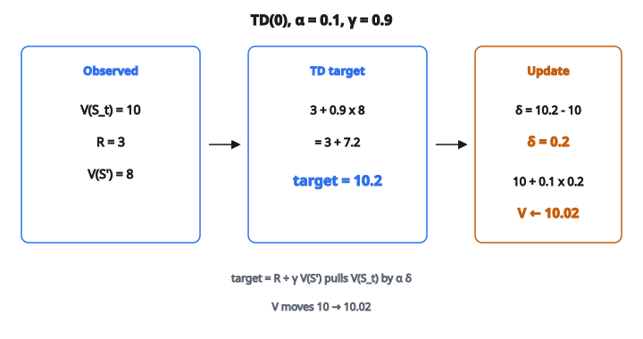

# One-Step TD Value Update

## Temporal Difference learning là gì?

Temporal Difference (TD) learning là phương pháp nền của reinforcement learning, kết hợp ý từ Monte Carlo và dynamic programming.

Giống Monte Carlo, TD học từ trải nghiệm mà không cần mô hình. Giống dynamic programming, TD cập nhật ước lượng dựa trên ước lượng khác (bootstrapping).

TD là nền cho nhiều thuật toán RL, gồm Q-learning và SARSA.

## Ý chính

Thay vì đợi hết episode mới cập nhật ước lượng giá trị, TD cập nhật **sau mỗi bước**, dùng phần thưởng quan sát được và giá trị ước lượng của trạng thái kế.

$$
V(S_t) \leftarrow V(S_t) + \alpha \left[ R_{t+1} + \gamma V(S_{t+1}) - V(S_t) \right]
$$

Đây gọi là **TD(0)** hay one-step TD.

## Hiểu bước cập nhật

Bước TD kéo ước lượng hiện tại về phía một ước lượng tốt hơn:

$$
V_{\mathrm{new}}(s) = V_{\mathrm{old}}(s) + \alpha \cdot \delta_t
$$

với **TD error** là:

$$
\delta_t = R_{t+1} + \gamma V(S_{t+1}) - V(S_t)
$$

**Các thành phần:**

* $R_{t+1}$: phần thưởng tức thời vừa nhận
* $\gamma V(S_{t+1})$: giá trị chiết khấu của trạng thái kế
* $V(S_t)$: ước lượng hiện tại đang được cập nhật
* $R_{t+1} + \gamma V(S_{t+1})$: TD target (ước lượng tốt hơn)

## TD target

TD target là:

$$
\mathrm{target} = R_{t+1} + \gamma V(S_{t+1})
$$

Đây là **one-step return**: phần thưởng thật cộng giá trị tương lai ước lượng.

So với Monte Carlo target: $G_t = R_{t+1} + \gamma R_{t+2} + \gamma^2 R_{t+3} + \cdots$

TD dùng một ước lượng ($V(S_{t+1})$) thay vì đợi return đầy đủ.

## Bootstrapping

**Bootstrapping** nghĩa là cập nhật ước lượng dựa trên ước lượng khác.

TD bootstrap vì target chứa $V(S_{t+1})$, bản thân nó đã là một ước lượng.

**Ưu điểm:**

* Học được trước khi episode kết thúc
* Phương sai thấp hơn Monte Carlo
* Làm việc với tác vụ tiếp diễn (không theo episode)

**Nhược điểm:**

* Đưa bias vào (ước lượng có thể sai)
* Có thể lan truyền lỗi

## Thuật toán TD(0) cho policy evaluation

**Đầu vào:** policy $\pi$ cần đánh giá

**Khởi tạo:** $V(s)$ tùy ý với mọi $s$

**Lặp cho mỗi episode:**

1. Khởi tạo trạng thái $S$
2. **Lặp cho mỗi bước:**

   * $A \leftarrow$ action do $\pi$ chỉ định tại $S$
   * Lấy action $A$, quan sát $R$, $S'$
   * $V(S) \leftarrow V(S) + \alpha[R + \gamma V(S') - V(S)]$
   * $S \leftarrow S'$
3. Cho đến khi $S$ là terminal

## Ví dụ số

**Thiết lập:**

* Trạng thái hiện tại: $S_t$
* Ước lượng giá trị hiện tại: $V(S_t) = 10$
* Action dẫn tới phần thưởng $R_{t+1} = 3$
* Trạng thái kế: $S_{t+1}$
* Giá trị trạng thái kế: $V(S_{t+1}) = 8$
* Learning rate: $\alpha = 0.1$
* Hệ số chiết khấu: $\gamma = 0.9$

**Bước 1: Tính TD target**

$$
\begin{aligned}
\mathrm{target}
&= R_{t+1} + \gamma V(S_{t+1}) \\
&= 3 + 0.9 \times 8 \\
&= 3 + 7.2 \\
&= 10.2
\end{aligned}
$$

**Bước 2: Tính TD error**

$$
\delta_t = 10.2 - 10 = 0.2
$$

**Bước 3: Cập nhật giá trị**

$$
\begin{aligned}
V(S_t)
&\leftarrow 10 + 0.1 \times 0.2 \\
&= 10 + 0.02 \\
&= 10.02
\end{aligned}
$$

::: {#fig-90-td-update fig-cap="TD(0): target = 3 + 0.9 × 8 = 10.2, δ = 0.2, rồi V(S_t) ← 10 + 0.1 × 0.2 = 10.02." fig-alt="Chuỗi TD(0): V(St)=10, R=3, V(S"}
{fig-align="center"}
:::

## Xử lý trạng thái terminal

Khi $S_{t+1}$ là terminal, không còn giá trị tương lai:

$$
V(S_t) \leftarrow V(S_t) + \alpha[R_{t+1} - V(S_t)]
$$

Target chỉ còn $R_{t+1}$, với $V(\mathrm{terminal}) = 0$.

**Ví dụ:** agent tới đích với $R = 100$, $V(s)$ hiện tại $= 80$:

$$
V(s) \leftarrow 80 + 0.1 \times (100 - 80) = 82
$$

## TD nhiều bước: n-step return

TD(0) dùng 1-step return. Có thể mở rộng sang n-step return:

**1-step (TD(0)):**

$$
G_t^{(1)} = R_{t+1} + \gamma V(S_{t+1})
$$

**2-step:**

$$
G_t^{(2)} = R_{t+1} + \gamma R_{t+2} + \gamma^2 V(S_{t+2})
$$

**n-step:**

$$
G_t^{(n)} = R_{t+1} + \gamma R_{t+2} + \cdots + \gamma^{n-1} R_{t+n} + \gamma^n V(S_{t+n})
$$

**$\infty$-step (Monte Carlo):**

$$
G_t^{(\infty)} = R_{t+1} + \gamma R_{t+2} + \gamma^2 R_{t+3} + \cdots
$$

## TD($\lambda$): eligibility trace

TD($\lambda$) kết hợp nhiều n-step return bằng trung bình có trọng số:

$$
G_t^{\lambda} = (1 - \lambda) \sum_{n=1}^{\infty} \lambda^{n-1} G_t^{(n)}
$$

**$\lambda = 0$:** thuần TD(0), cập nhật một bước

**$\lambda = 1$:** thuần Monte Carlo, return đầy đủ

**$\lambda \in (0, 1)$:** hòa trộn ước lượng ngắn hạn và dài hạn

## Đánh đổi bias–variance

**Monte Carlo (không bootstrap):**

* Unbiased: dùng return thật
* Phương sai cao: return biến thiên mạnh

**TD (bootstrapping):**

* Biased: dùng ước lượng có thể sai
* Phương sai thấp hơn: ít bị sự kiện ngẫu nhiên về sau ảnh hưởng

**n-step TD:**

* $n$ lớn: phương sai cao hơn, bias thấp hơn
* $n$ nhỏ: phương sai thấp hơn, bias cao hơn

Lựa chọn tối ưu phụ thuộc bài toán.

## Vì sao TD thường hiệu quả hơn

Dù biased, TD thường vượt Monte Carlo vì:

**1. Phương sai thấp hơn dẫn tới hội tụ nhanh hơn khi dữ liệu hạn chế**

**2. Cập nhật diễn ra thường xuyên hơn (mỗi bước so với mỗi episode)**

**3. Làm việc với tác vụ tiếp diễn, không có episode tự nhiên**

**4. Học được trong lúc episode đang chạy, không chỉ sau khi kết thúc**

## Hội tụ

TD(0) hội tụ tới $V^{\pi}$ dưới các điều kiện chuẩn:

**1. Learning rate thỏa:**

$$
\sum_t \alpha_t = \infty, \quad \sum_t \alpha_t^2 < \infty
$$

**2. Mọi trạng thái được thăm vô hạn lần**

**3. MDP hữu hạn**

Trong thực hành, learning rate nhỏ không đổi thường đủ tốt.

## Ví dụ random walk

**Thiết lập:** 5 trạng thái A–B–C–D–E với trạng thái terminal ở hai đầu. Bắt đầu tại C.

**Giá trị đúng (dưới policy ngẫu nhiên):**
$V(A) = 1/6$, $V(B) = 2/6$, $V(C) = 3/6$, $V(D) = 4/6$, $V(E) = 5/6$

**TD learning:**

* Sau mỗi bước, cập nhật dựa trên ước lượng của trạng thái kế
* Dần lan truyền giá trị đúng từ các trạng thái terminal

**Monte Carlo:**

* Phải đợi episode kết thúc
* Cập nhật dựa trên kết cục thật ($0$ hoặc $1$)

TD hội tụ nhanh hơn trong ví dụ này.

## TD error như sai số dự đoán

TD error $\delta_t = R_{t+1} + \gamma V(S_{t+1}) - V(S_t)$ biểu diễn:

**Sai số dự đoán:** hiệu giữa giá trị dự đoán và kết quả quan sát (phần thưởng tức thời cộng phần tiếp nối ước lượng)

**Tín hiệu học:** dùng để chỉnh dự đoán

**Liên hệ thần kinh học:** TD error giống tín hiệu dopamine trong não, mã hóa sai số dự đoán phần thưởng.

## TD online và batch

**Online TD:**

* Cập nhật sau mỗi chuyển tiếp
* Cách làm chuẩn

**Batch TD:**

* Gom nhiều chuyển tiếp
* Cập nhật lặp đến hội tụ
* Có thể ổn định hơn

**Experience replay (như trong DQN):**

* Lưu chuyển tiếp trong buffer
* Lấy mẫu batch để cập nhật
* Kết hợp lợi ích của cả hai

## TD cho control

Các phương pháp TD mở rộng sang hàm action-value để control:

**SARSA (on-policy):**

$$
Q(S_t, A_t) \leftarrow Q(S_t, A_t) + \alpha[R_{t+1} + \gamma Q(S_{t+1}, A_{t+1}) - Q(S_t, A_t)]
$$

**Q-learning (off-policy):**

$$
Q(S_t, A_t) \leftarrow Q(S_t, A_t) + \alpha[R_{t+1} + \gamma \max_a Q(S_{t+1}, a) - Q(S_t, A_t)]
$$

## Ưu điểm của TD learning

**1. Học online:** cập nhật sau mỗi bước

**2. Model-free:** không cần mô hình môi trường

**3. Làm việc với tác vụ tiếp diễn:** không đòi hỏi episode

**4. Phương sai thấp hơn:** ổn định hơn Monte Carlo

**5. Nền cho nhiều thuật toán:** Q-learning, SARSA, actor-critic

## Nhược điểm của TD learning

**1. Biased:** ước lượng ban đầu có thể sai có hệ thống

**2. Nhạy với giá trị khởi tạo:** khởi tạo kém làm chậm học

**3. Nhạy với learning rate:** quá cao gây bất ổn

**4. Lan truyền giá trị có thể chậm:** thông tin đi từng bước một

## Tóm tắt: TD, MC và DP

**Dynamic programming:**

* Cần mô hình đầy đủ
* Tính giá trị đúng
* Không dựa trên mẫu

**Monte Carlo:**

* Model-free, dựa trên mẫu
* Unbiased nhưng phương sai cao
* Cập nhật theo episode

**Temporal Difference:**

* Model-free, dựa trên mẫu
* Biased nhưng phương sai thấp hơn
* Cập nhật theo bước, có bootstrapping

## Code
```python
import numpy as np

def td_value_update(V, s, r, s_next, alpha, gamma):
    """
    Returns: updated value function V_new
    """
    V = list(V)
    td_target = r + gamma * V[s_next]
    V[s] = V[s] + alpha * (td_target - V[s])
    return [round(float(v), 4) for v in V]

```

<!-- auto-self-check -->

::: {.callout-note}
## Kiểm tra nhanh
<details>
<summary>Ý chính của bài «One-Step TD Value Update» là gì?</summary>
Temporal Difference (TD) learning là phương pháp nền của reinforcement learning, kết hợp ý từ Monte Carlo và dynamic programming.
</details>
<details>
<summary>Công thức / quan hệ cốt lõi trong bài là gì?</summary>
$$V(S_t) \leftarrow V(S_t) + \alpha \left[ R_{t+1} + \gamma V(S_{t+1}) - V(S_t) \right]$$
</details>
:::
