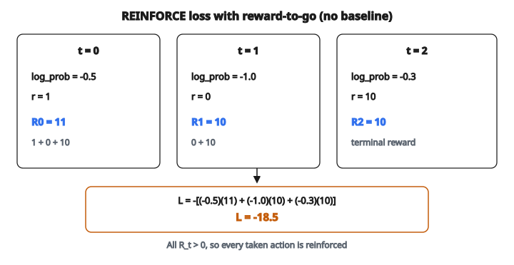

# Policy Gradient Loss

## Thiết lập reinforcement learning

Trong reinforcement learning:

* **Agent**: người học / người ra quyết định
* **Environment**: thế giới agent tương tác
* **State**: tình huống hiện tại
* **Action**: việc agent có thể làm
* **Reward**: phản hồi từ môi trường

Mục tiêu: học policy $\pi(a|s)$ cực đại hóa phần thưởng tích lũy.

## Policy là gì

Policy ánh xạ state sang action. Hai loại:

**Policy xác định (deterministic):**

$$
a = \pi(s)
$$

Cho state $s$, luôn chọn action $a$.

**Policy ngẫu nhiên (stochastic):**

$$
\pi(a|s) = P(a|s)
$$

Cho state $s$, lấy mẫu action $a$ từ một phân phối xác suất.

Các phương pháp policy gradient dùng policy ngẫu nhiên, tham số hóa bằng mạng nơ-ron.

## Hàm mục tiêu

Ta muốn cực đại kỳ vọng phần thưởng tích lũy:

$$
J(\theta) = \mathbb{E}_{\tau \sim \pi_\theta}[R(\tau)]
$$

với:

* $\theta$ là tham số mạng policy
* $\tau$ là trajectory (chuỗi state, action, reward)
* $R(\tau)$ là tổng phần thưởng của trajectory

Khó khăn: làm sao lấy gradient xuyên qua việc lấy mẫu action?

## Định lý Policy Gradient

Gradient của mục tiêu là:

$$
\nabla_\theta J(\theta) = \mathbb{E}_{\tau \sim \pi_\theta}\left[\sum_{t=0}^{T} \nabla_\theta \log \pi_\theta(a_t|s_t) \cdot R(\tau)\right]
$$

Đáng chú ý: ta ước lượng gradient bằng cách:

1. Lấy mẫu trajectory theo policy hiện tại
2. Tính log xác suất của các action đã chọn
3. Nhân trọng số bằng tổng phần thưởng

Không cần vi phân xuyên qua môi trường!

## Thuật toán REINFORCE

Phương pháp policy gradient đơn giản nhất (Williams, 1992):

**Mỗi episode:**

1. Chạy policy, thu trajectory: $s_0, a_0, r_0, s_1, a_1, r_1, \ldots$
2. Tính return: $R = \sum_t r_t$
3. Tính loss: $L = -\sum_t \log \pi_\theta(a_t|s_t) \cdot R$
4. Cập nhật: $\theta \leftarrow \theta - \alpha \nabla_\theta L$

Loss là âm của mục tiêu policy gradient (ta cực tiểu loss, tức cực đại reward).

## Hiểu hàm loss

$$
L = -\sum_t \log \pi_\theta(a_t|s_t) \cdot R
$$

Tách ra:

**$\log \pi_\theta(a_t|s_t)$:** Action này có khả năng cao đến mức nào dưới policy?

**$R$:** Kết cục tốt đến mức nào?

**Tích:** Nếu $R > 0$ (kết cục tốt), tăng xác suất các action đã chọn. Nếu $R < 0$ (kết cục xấu), giảm xác suất các action đã chọn.

**Dấu âm:** Vì ta cực tiểu loss nhưng muốn cực đại reward.

## Bài toán gán công (credit assignment)

REINFORCE cơ bản dùng tổng reward cả episode cho mọi action:

$$
L = -\sum_t \log \pi_\theta(a_t|s_t) \cdot R_{\mathrm{total}}
$$

Vấn đề: action sớm nhận công/tội cho reward muộn, dù có thể không liên quan.

**Cách xử lý: reward-to-go**

Chỉ dùng phần thưởng tương lai cho từng action:

$$
L = -\sum_t \log \pi_\theta(a_t|s_t) \cdot R_t
$$

với $R_t = \sum_{t'=t}^{T} r_{t'}$ là tổng reward từ thời $t$ trở đi.

Hợp lý: action tại $t$ chỉ ảnh hưởng reward tương lai, không ảnh hưởng quá khứ.

## Giảm phương sai: baseline

Policy gradient có phương sai cao. Cách phổ biến là trừ một baseline:

$$
L = -\sum_t \log \pi_\theta(a_t|s_t) \cdot (R_t - b(s_t))
$$

với $b(s_t)$ là baseline (hàm bất kỳ của state, không phụ thuộc action).

**Vì sao đúng:**

* Trừ một hằng không đổi kỳ vọng gradient
* Nhưng có thể giảm mạnh phương sai
* Action tốt hơn trung bình nhận trọng dương, kém hơn nhận trọng âm

**Baseline thường dùng:**

* Reward trung bình trên batch
* Hàm value $V(s_t)$ (ước lượng bởi mạng khác)

## Hàm advantage

Advantage đo action tốt hơn trung bình bao nhiêu:

$$
A(s, a) = Q(s, a) - V(s)
$$

với:

* $Q(s, a)$ là return kỳ vọng khi bắt đầu từ state $s$, chọn action $a$
* $V(s)$ là return kỳ vọng khi bắt đầu từ state $s$

Dùng advantage làm trọng số:

$$
L = -\sum_t \log \pi_\theta(a_t|s_t) \cdot A(s_t, a_t)
$$

Đây là nền của các phương pháp Actor-Critic và PPO.

## Ví dụ số

Episode 3 timestep:

**Timestep 0:** state = s0, action = a0, log_prob = $-0.5$, reward = 1

**Timestep 1:** state = s1, action = a1, log_prob = $-1.0$, reward = 0

**Timestep 2:** state = s2, action = a2, log_prob = $-0.3$, reward = 10

Reward-to-go:

* $R_0 = 1 + 0 + 10 = 11$
* $R_1 = 0 + 10 = 10$
* $R_2 = 10$

Loss (không baseline):

$$
\begin{aligned}
L &= -[(-0.5)(11) + (-1.0)(10) + (-0.3)(10)] \\
  &= -[5.5 + 10 + 3] \\
  &= -18.5
\end{aligned}
$$

Mọi return đều dương, nên mọi action đều được củng cố.

::: {#fig-140-policy-gradient fig-cap="Reward-to-go R = (11, 10, 10) và log_prob (−0.5, −1.0, −0.3) cho L = −18.5; mọi R_t &gt; 0 nên mọi action đều được củng cố." fig-alt="Ba timestep: log_prob -0.5, -1.0, -0.3; reward 1, 0, 10; reward-to-go 11, 10, 10; loss L = -18.5."}
{fig-align="center"}
:::

## Gradient

$$
\nabla_\theta L = -\sum_t \nabla_\theta \log \pi_\theta(a_t|s_t) \cdot R_t
$$

Với policy mạng nơ-ron có đầu ra softmax:

* $\nabla_\theta \log \pi = \nabla_\theta z_a - \sum_a \pi(a|s) \nabla_\theta z_a$
* Giống gradient cross-entropy, nhưng nhân trọng theo return

Gradient:

* Tăng xác suất action có advantage dương
* Giảm xác suất action có advantage âm
* Độ lớn phụ thuộc action tốt/xấu mức nào

## Entropy regularization

Thêm bonus entropy để khuyến khích exploration:

$$
L = -\sum_t \bigl[\log \pi_\theta(a_t|s_t) \cdot A_t + \beta H(\pi(\cdot|s_t))\bigr]
$$

với $H$ là entropy và $\beta$ là hệ số nhỏ (ví dụ 0.01).

**Vì sao entropy giúp:**

* Tránh hội tụ sớm về policy xác định
* Khuyến khích thử action khác nhau
* Huấn luyện ổn định hơn

## Vấn đề thường gặp và cách xử lý

**Phương sai cao:**

* Dùng baseline (hàm value)
* Dùng batch lớn hơn
* Dùng ước lượng advantage (GAE)

**Kém hiệu quả mẫu:**

* Policy gradient dùng mỗi mẫu một lần
* Phương pháp off-policy (PPO, SAC) tái sử dụng mẫu
* Hiệu chỉnh importance sampling

**Cập nhật bất ổn:**

* Bước cập nhật policy lớn có thể tai hại
* PPO cắt (clip) tỉ lệ policy
* TRPO ràng buộc bằng KL divergence

## Policy gradient được dùng ở đâu

* **Chơi game**: Atari, cờ, game video
* **Robotics**: học điều khiển động cơ
* **Hệ gợi ý**: ra quyết định tuần tự
* **Mô hình ngôn ngữ**: RLHF (Reinforcement Learning from Human Feedback)
* **Mọi bài quyết định tuần tự** với reward trễ

Các phương pháp hiện đại như PPO, SAC và TD3 đều xây trên nền policy gradient, với cải tiến về ổn định và hiệu quả mẫu.

## Code
```python
def policy_gradient_loss(log_probs, rewards, gamma):
    """
    Compute REINFORCE policy gradient loss with mean-return baseline.
    """
    T = len(rewards)
    G = [0.0] * T
    G[T - 1] = float(rewards[T - 1])
    for t in range(T - 2, -1, -1):
        G[t] = rewards[t] + gamma * G[t + 1]
    mean_G = sum(G) / T
    advantages = [g - mean_G for g in G]
    return -sum(lp * adv for lp, adv in zip(log_probs, advantages)) / T

```

<!-- auto-self-check -->

::: {.callout-note}
## Kiểm tra nhanh
<details>
<summary>Ý chính của bài «Policy Gradient Loss» là gì?</summary>
Policy ánh xạ state sang action.
</details>
<details>
<summary>Công thức / quan hệ cốt lõi trong bài là gì?</summary>
$$a = \pi(s)$$
</details>
:::
