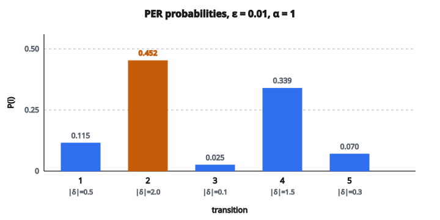

# Prioritized Experience Replay

## Prioritized Experience Replay là gì

**Prioritized Experience Replay (PER)** là cải tiến của experience replay chuẩn: lấy mẫu transition theo **tầm quan trọng**, không đều ngẫu nhiên.

Ý then chốt: không phải mọi trải nghiệm đều hữu ích như nhau. Transition có TD error cao báo hiệu kết cục bất ngờ, mô hình học được nhiều hơn.

Đưa ra bởi Schaul et al. (2016) và dùng trong nhiều thuật toán deep RL hiện đại.

## Động cơ

**Replay đều chuẩn:**

Mọi transition lấy với xác suất bằng nhau $P(i) = 1/N$.

**Vấn đề:**
Nhiều transition đã được dự đoán tốt, tín hiệu học yếu. Transition hiếm, bất ngờ có thể bị lấy quá ít.

**Cách làm:** Lấy thường xuyên hơn các transition có tiềm năng học cao.

## Đo priority: TD error

Độ đo priority phổ biến nhất là độ lớn TD error:

$$
\delta_i = \bigl|r_i + \gamma \max_{a'} Q(s_i', a') - Q(s_i, a_i)\bigr|
$$

**$|\delta_i|$ cao:** Sai số dự đoán lớn. Mô hình đoán sai transition này. Tiềm năng học cao.

**$|\delta_i|$ thấp:** Sai số nhỏ. Mô hình đã đoán tốt. Ít còn để học.

## Tính priority

Priority của transition $i$ là:

$$
p_i = |\delta_i| + \epsilon
$$

với $\epsilon > 0$ là hằng nhỏ (ví dụ $10^{-6}$) bảo đảm xác suất khác không cho mọi transition.

**Biến thể:** Dùng TD error mũ hóa:

$$
p_i = (|\delta_i| + \epsilon)^\alpha
$$

với $\alpha$ điều khiển mức ưu tiên ảnh hưởng lấy mẫu.

## Xác suất lấy mẫu

Xác suất lấy transition $i$:

$$
P(i) = \frac{p_i^\alpha}{\sum_k p_k^\alpha}
$$

**$\alpha = 0$:** Lấy mẫu đều (không ưu tiên)

**$\alpha = 1$:** Ưu tiên đầy đủ (tỉ lệ với priority)

**$\alpha \in (0, 1)$:** Nội suy giữa đều và ưu tiên đầy đủ

**Giá trị điển hình:** $\alpha = 0.6$

## Ví dụ số

**Buffer 5 transition:**

* Transition 1: $|\delta_1| = 0.5$
* Transition 2: $|\delta_2| = 2.0$
* Transition 3: $|\delta_3| = 0.1$
* Transition 4: $|\delta_4| = 1.5$
* Transition 5: $|\delta_5| = 0.3$

**Tham số:** $\epsilon = 0.01$, $\alpha = 1.0$

**Priority:**

* $p_1 = 0.5 + 0.01 = 0.51$
* $p_2 = 2.0 + 0.01 = 2.01$
* $p_3 = 0.1 + 0.01 = 0.11$
* $p_4 = 1.5 + 0.01 = 1.51$
* $p_5 = 0.3 + 0.01 = 0.31$

**Tổng:** $\sum p_i = 4.45$

**Xác suất lấy mẫu:**

* $P(1) = 0.51/4.45 = 0.115$ (11.5%)
* $P(2) = 2.01/4.45 = 0.452$ (45.2%)
* $P(3) = 0.11/4.45 = 0.025$ (2.5%)
* $P(4) = 1.51/4.45 = 0.339$ (33.9%)
* $P(5) = 0.31/4.45 = 0.070$ (7.0%)

Transition 2 (TD error lớn nhất) được lấy thường xuyên nhất.

::: {#fig-142-per-priority fig-cap="P(i) ∝ |δ_i| + ε với ε = 0.01, α = 1: P ≈ (0.115, 0.452, 0.025, 0.339, 0.070); transition 2 ( |δ| = 2.0 ) được lấy nhiều nhất." fig-alt="Năm cột xác suất P(i) ≈ 0.115, 0.452, 0.025, 0.339, 0.070; cột transition 2 cao nhất, tô đậm."}
{fig-align="center"}
:::

## Vấn đề bias

Lấy mẫu có ưu tiên gây **bias** vì transition được lấy nhiều đóng góp nhiều hơn vào gradient.

Kỳ vọng gradient không còn là ước lượng không chệch của gradient thật:

$$
E_{\mathrm{PER}}[\nabla L] \neq E_{\mathrm{uniform}}[\nabla L]
$$

Điều này có thể làm Q-function học được bị lệch.

## Hiệu chỉnh importance sampling

Để hiệu chỉnh bias lấy mẫu, ta nhân trọng đóng góp của mỗi transition:

$$
w_i = \left(\frac{1}{N \cdot P(i)}\right)^\beta
$$

với $N$ là kích thước buffer và $\beta \in [0, 1]$ điều khiển mức hiệu chỉnh.

**Trọng số chuẩn hóa:**

$$
w_i^{\mathrm{norm}} = \frac{w_i}{\max_j w_j}
$$

Chuẩn hóa bảo trọng số nằm trong $[0, 1]$, tránh bước gradient quá lớn.

## Tham số $\beta$

**$\beta = 0$:** Không hiệu chỉnh. Bias đầy đủ từ ưu tiên.

**$\beta = 1$:** Hiệu chỉnh đầy đủ. Ước lượng không chệch.

**Anneal $\beta$:** Bắt đầu $\beta_0 < 1$ và tăng tới $\beta = 1$ trong lúc huấn luyện.

**Lịch điển hình:** Anneal tuyến tính từ $\beta_0 = 0.4$ tới $\beta = 1.0$.

**Lý do:** Đầu huấn luyện, một ít bias chấp nhận được và tăng tốc học. Gần hội tụ, ta muốn cập nhật không chệch.

## Hàm loss có trọng số

TD loss với trọng số importance sampling:

$$
L = \frac{1}{B} \sum_{i=1}^{B} w_i \cdot (y_i - Q(s_i, a_i))^2
$$

với:

* $B$ là batch size
* $y_i = r_i + \gamma \max_{a'} Q(s_i', a')$ là TD target
* $w_i$ là trọng số importance sampling

## Cập nhật priority

Sau khi lấy mẫu và tính TD error, cập nhật priority:

**Với mỗi transition $i$ đã lấy:**

1. Tính TD error mới: $\delta_i = |y_i - Q(s_i, a_i)|$
2. Cập nhật priority: $p_i = |\delta_i| + \epsilon$

Như vậy priority phản ánh dự đoán hiện tại của mô hình.

## Cài đặt hiệu quả: Sum Tree

Tính $\sum_k p_k$ mỗi lần lấy mẫu tốn $O(N)$.

**Sum Tree:** Cấu trúc cây nhị phân cho phép:

* Cập nhật priority $O(\log N)$
* Lấy mẫu tỉ lệ $O(\log N)$
* Tổng priority $O(1)$

**Cấu trúc:**

* Lá lưu priority của transition
* Nút trong lưu tổng các con
* Gốc lưu tổng priority

## Lấy mẫu trên Sum Tree

Để lấy mẫu tỉ lệ với priority:

1. Sinh số ngẫu nhiên $s \in [0, \sum_i p_i]$
2. Duyệt cây từ gốc:
   * Nếu $s <$ tổng con trái, đi trái
   * Nếu không, trừ tổng trái khỏi $s$, đi phải
3. Trả về chỉ số lá

Cách này tìm hiệu quả transition mà priority tích lũy vượt $s$.

## Ưu tiên theo hạng (rank-based)

Biến thể thay cho ưu tiên tỉ lệ:

**Xếp hạng theo độ lớn TD error**

Priority dựa trên hạng chứ không phải giá trị tuyệt đối:

$$
p_i = \frac{1}{\mathrm{rank}(i)}
$$

**Ưu điểm:**

* Bền hơn với outlier
* Phân phối đuôi nặng

**Nhược điểm:**

* Cần sắp xếp hoặc duy trì cấu trúc đã sắp
* Cài đặt phức tạp hơn

## So sánh các schema ưu tiên

**Tỉ lệ ($p_i \propto |\delta_i|$):**

* Dễ cài
* Nhạy với outlier
* Dùng trong bài PER gốc

**Theo hạng ($p_i \propto 1/\mathrm{rank}$):**

* Bền với outlier
* Đuôi nặng hơn (explore nhiều hơn)
* Thực nghiệm hơi tốt hơn

## Khi priority trở nên cũ

Khi Q-network cập nhật, TD error đổi. Priority đã lưu trở nên lỗi thời.

**Cách xử lý:**

**1. Cập nhật khi lấy mẫu:**
Tính lại TD error khi transition được lấy.

**2. Làm mới định kỳ:**
Định kỳ tính lại priority cho mọi transition.

**3. Cập nhật lười:**
Chấp nhận một phần lỗi thời; priority gần đúng.

Thực tế, cập nhật các transition đã lấy là đủ.

## Priority ban đầu cho transition mới

Khi thêm transition mới, TD error chưa biết.

**Cách 1: Priority cực đại**

$$
p_{\mathrm{new}} = \max_i p_i
$$

Bảo transition mới được lấy ít nhất một lần.

**Cách 2: Priority cao cố định**

Dùng một hằng lớn.

**Cách 3: Tính ngay**

Tính TD error trước khi lưu (tốn hơn).

Priority cực đại là cách chuẩn.

## Tóm tắt hyperparameter

**$\alpha$ (số mũ ưu tiên):**

* Điều khiển mức ưu tiên ảnh hưởng lấy mẫu
* Điển hình: 0.6
* Khoảng: [0, 1]

**$\beta$ (số mũ importance sampling):**

* Điều khiển hiệu chỉnh bias
* Bắt đầu: 0.4, anneal tới 1.0
* Khoảng: [0, 1]

**$\epsilon$ (offset priority):**

* Bảo xác suất lấy mẫu khác không
* Điển hình: $10^{-6}$ đến $10^{-5}$

## Tóm tắt thuật toán PER

**Lưu:**

1. Tính TD error cho transition mới
2. Đặt priority $p = |\delta| + \epsilon$
3. Thêm vào buffer kèm priority

**Lấy mẫu:**

1. Lấy batch tỉ lệ với priority
2. Tính trọng số importance $w_i$
3. Chuẩn hóa trọng số

**Học:**

1. Tính TD target và error
2. Nhân loss với trọng số importance
3. Cập nhật mạng
4. Cập nhật priority cho các transition đã lấy

## Ưu điểm của PER

**1. Hiệu quả mẫu:**
Học nhiều hơn từ mỗi tương tác bằng cách tập trung vào transition giàu thông tin.

**2. Học nhanh hơn:**
Transition khó được thăm lại thường xuyên hơn.

**3. Hiệu năng cuối tốt hơn:**
Khám phá kỹ hơn các vùng khó.

## Nhược điểm của PER

**1. Phức tạp cài đặt:**
Sum tree và importance sampling thêm chi phí.

**2. Chi phí tính toán:**
Cập nhật priority và thao tác trên cây.

**3. Nhạy hyperparameter:**
$\alpha$ và $\beta$ cần tinh chỉnh.

**4. Nguy cơ overfitting:**
Có thể khớp quá vào transition ưu tiên cao.

## PER trong thuật toán hiện đại

**Rainbow DQN:**
Ghép PER với các cải tiến khác (double DQN, dueling, v.v.)

**Distributed RL (Ape-X):**
PER với nhiều actor phân tán và một learner.

**Soft Actor-Critic:**
Có thể dùng PER cho học off-policy.

PER là thành phần chuẩn trong các hệ deep RL tiên tiến.

## Code
```python
def priority_replay_sample(priorities, alpha, beta):
    """
    Compute sampling probabilities and importance sampling weights for PER.
    """
    n = len(priorities)
    powered = [p ** alpha for p in priorities]
    total = sum(powered)
    probs = [p / total for p in powered]
    raw_weights = [(n * pr) ** (-beta) for pr in probs]
    max_w = max(raw_weights)
    weights = [w / max_w for w in raw_weights]
    return [probs, weights]

```

<!-- auto-self-check -->

::: {.callout-note}
## Kiểm tra nhanh
<details>
<summary>Ý chính của bài «Prioritized Experience Replay» là gì?</summary>
**Prioritized Experience Replay (PER)** là cải tiến của experience replay chuẩn: lấy mẫu transition theo **tầm quan trọng**, không đều ngẫu nhiên.
</details>
<details>
<summary>Công thức / quan hệ cốt lõi trong bài là gì?</summary>
$$\delta_i = \bigl|r_i + \gamma \max_{a'} Q(s_i', a') - Q(s_i, a_i)\bigr|$$
</details>
:::
