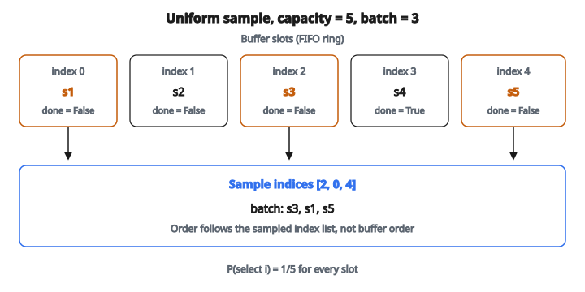

# Replay Buffer Sample

## Replay buffer là gì

**Replay buffer** (còn gọi là experience replay memory) là cấu trúc dữ liệu lưu trải nghiệm cũ và cho phép **lấy mẫu ngẫu nhiên** để huấn luyện.

Thay vì học theo đúng thứ tự trải nghiệm xảy ra, agent lấy minibatch ngẫu nhiên từ buffer. Kỹ thuật này cải thiện mạnh ổn định và hiệu quả học.

Được đưa vào ngữ cảnh Deep Q-Networks (DQN) bởi Mnih et al. (2013).

## Vì sao experience replay

Huấn luyện mạng nơ-ron với reinforcement learning gặp vài khó khăn:

**1. Dữ liệu tương quan:**

Các trải nghiệm liên tiếp tương quan mạnh (cùng vùng không gian state). Mạng nơ-ron học kém từ dữ liệu tương quan.

**2. Phân phối không dừng:**

Khi policy cải thiện, phân phối dữ liệu đổi. Có thể gây catastrophic forgetting.

**3. Lãng phí mẫu:**

Mỗi trải nghiệm chỉ dùng một lần rồi bị bỏ.

Experience replay xử lý cả ba vấn đề.

## Cách hoạt động

**1. Store:** Sau mỗi transition $(s, a, r, s', \mathrm{done})$, thêm vào buffer.

**2. Sample:** Khi huấn luyện, lấy ngẫu nhiên một minibatch transition từ buffer.

**3. Learn:** Cập nhật mạng nơ-ron trên minibatch đã lấy.

**4. Manage:** Khi buffer đầy, bỏ trải nghiệm cũ (thường FIFO).

## Tuple transition

Mỗi trải nghiệm lưu trong buffer là một tuple:

$$
(s_t, a_t, r_{t+1}, s_{t+1}, \mathrm{done})
$$

**Thành phần:**

* $s_t$: State hiện tại
* $a_t$: Action đã chọn
* $r_{t+1}$: Reward nhận được
* $s_{t+1}$: State kế
* done: Boolean cho biết episode đã kết thúc

Đó là toàn bộ thông tin cần cho một cập nhật TD.

## Các thao tác trên buffer

**Khởi tạo:**

* Tạo buffer dung lượng tối đa $N$
* Buffer ban đầu rỗng

**Push (lưu):**

* Thêm transition mới vào buffer
* Nếu đầy, bỏ transition cũ nhất

**Sample:**

* Chọn ngẫu nhiên $B$ transition (batch size)
* Trả về dạng mảng/tensor để huấn luyện

**Size:**

* Trả về số transition đang lưu

## Lấy mẫu đều ngẫu nhiên

Cách đơn giản nhất: mỗi transition có xác suất bằng nhau:

$$
P(\text{chọn transition } i) = \frac{1}{|\mathrm{buffer}|}
$$

**Quy trình:**

1. Sinh $B$ chỉ số ngẫu nhiên trong $[0, |\mathrm{buffer}| - 1]$
2. Lấy transition tại các chỉ số đó
3. Trả về minibatch

**Tính chất:**

* Dễ cài đặt
* Mọi trải nghiệm ngang xác suất
* Có thể lấy quá nhiều hoặc quá ít một số transition

## Ví dụ số: lấy mẫu

**Nội dung buffer (capacity 5):**

Position 0: $(s_1, a_1, r_1, s_2, \mathrm{False})$

Position 1: $(s_2, a_2, r_2, s_3, \mathrm{False})$

Position 2: $(s_3, a_3, r_3, s_4, \mathrm{False})$

Position 3: $(s_4, a_4, r_4, s_5, \mathrm{True})$

Position 4: $(s_5, a_5, r_5, s_6, \mathrm{False})$

**Lấy batch kích thước 3:**

Chỉ số ngẫu nhiên: [2, 0, 4]

**Batch trả về:**

* $(s_3, a_3, r_3, s_4, \mathrm{False})$
* $(s_1, a_1, r_1, s_2, \mathrm{False})$
* $(s_5, a_5, r_5, s_6, \mathrm{False})$

::: {#fig-139-replay-sample fig-cap="Buffer capacity 5, sample indices [2, 0, 4] cho batch s3, s1, s5 — thứ tự theo danh sách chỉ số, không theo vị trí FIFO." fig-alt="Năm ô buffer capacity 5; ô 0 (s1), 2 (s3), 4 (s5) được tô; batch theo chỉ số [2, 0, 4] là s3, s1, s5."}
{fig-align="center"}
:::

## Cân nhắc kích thước buffer

**Buffer nhỏ (ví dụ 10,000):**

* Trải nghiệm gần đây chiếm ưu thế
* Thích nghi nhanh khi policy đổi
* Có thể quên trải nghiệm cũ hữu ích
* Tốn ít bộ nhớ hơn

**Buffer lớn (ví dụ 1,000,000):**

* Trải nghiệm đa dạng hơn
* Huấn luyện ổn định hơn
* Có thể chứa trải nghiệm lỗi thời
* Tốn nhiều bộ nhớ hơn

**Giá trị điển hình:** 100,000 đến 1,000,000 transition

DQN dùng 1 triệu transition.

## Cài đặt circular buffer

Cài đặt phổ biến nhất dùng circular (ring) buffer:

**Biến:**

* Mảng kích thước $N$ lưu transition
* Write pointer chỉ vị trí ghi tiếp theo
* Size hiện tại (cho đến khi buffer đầy)

**Thao tác push:**

1. Lưu transition tại vị trí write pointer
2. Tăng pointer: $\mathrm{ptr} = (\mathrm{ptr} + 1) \bmod N$
3. Cập nhật size: $\mathrm{size} = \min(\mathrm{size} + 1, N)$

**Tính chất:**

* Push $O(1)$
* Sample $O(B)$ với batch size $B$
* Bộ nhớ cố định

## Phá tương quan

Không có replay, các mẫu liên tiếp tương quan:

$$
(s_1, a_1, r_1, s_2),\ (s_2, a_2, r_2, s_3),\ (s_3, a_3, r_3, s_4),\ \ldots
$$

State $s_2$ vừa là “next state” vừa là “current state” ở hai mẫu kề nhau.

**Có replay:** Lấy mẫu ngẫu nhiên làm mất tương quan:

$$
(s_{47}, a_{47}, r_{47}, s_{48}),\ (s_{12}, a_{12}, r_{12}, s_{13}),\ (s_{89}, a_{89}, r_{89}, s_{90}),\ \ldots
$$

Gần với giả định lấy mẫu i.i.d. trong học có giám sát.

## Hiệu quả dữ liệu

Không replay, mỗi trải nghiệm dùng một lần:

**Số lần cập nhật mỗi trải nghiệm:** 1

Có replay, mỗi trải nghiệm có thể được lấy nhiều lần:

**Số lần cập nhật mỗi trải nghiệm:** Nhiều (cho đến khi bị xóa khỏi buffer)

Điều này cải thiện mạnh sample efficiency, đặc biệt khi tương tác môi trường đắt.

## Prioritized Experience Replay

Không phải mọi trải nghiệm đều hữu ích như nhau. Prioritized replay lấy các transition quan trọng thường xuyên hơn.

**Priority:** Thường dựa trên độ lớn TD error:

$$
p_i = |\delta_i| + \epsilon
$$

với $\delta_i$ là TD error của transition $i$.

**Xác suất lấy mẫu:**

$$
P(i) = \frac{p_i^\alpha}{\sum_k p_k^\alpha}
$$

$\alpha$ điều khiển mức ưu tiên ảnh hưởng lấy mẫu (0 = đều, 1 = ưu tiên đầy đủ).

## Hiệu chỉnh importance sampling

Lấy mẫu có ưu tiên gây bias. Để hiệu chỉnh:

$$
w_i = \left(\frac{1}{N \cdot P(i)}\right)^\beta
$$

với $\beta$ được anneal từ 0 tới 1 trong lúc huấn luyện.

Loss được nhân trọng số:

$$
L = \frac{1}{B}\sum_{i=1}^{B} w_i \cdot (y_i - Q(s_i, a_i))^2
$$

## Khi nào bắt đầu học

Buffer cần đủ trải nghiệm đa dạng trước khi huấn luyện:

**Giai đoạn warm-up:**

* Đổ buffer $N_{\min}$ transition trước lần cập nhật đầu
* Dùng policy ngẫu nhiên trong warm-up

**Giá trị điển hình:** 10,000 đến 50,000 transition ban đầu

Như vậy minibatch đầu tiên đủ đa dạng.

## Tần suất cập nhật

**Mỗi bước:** Cập nhật mạng sau mỗi transition mới

* Phản ứng nhanh nhất
* Tốn tính toán hơn

**Mỗi N bước:** Cập nhật sau N transition

* Hiệu quả hơn
* Có thể chậm hơn so với trải nghiệm mới

**Cách DQN:**

* Lưu mọi transition
* Cập nhật mỗi 4 transition
* Lấy batch 32

## Replay buffer cho các thuật toán khác nhau

**DQN:**

* Lưu $(s, a, r, s', \mathrm{done})$
* Lấy mẫu cho cập nhật Q-learning

**DDPG (action liên tục):**

* Cùng cấu trúc
* Dùng cho cập nhật actor-critic

**SAC:**

* Cùng cấu trúc
* Lấy mẫu cho cập nhật soft actor-critic

**PPO (on-policy):**

* Dùng dữ liệu rollout gần đây, không phải buffer lớn
* Bỏ dữ liệu sau mỗi lần cập nhật

## Cân nhắc bộ nhớ

**Biểu diễn state quyết định nhiều:**

Nếu state là ảnh (84×84×4 = 28,224 float):

* 1M transition $\times$ 28,224 $\times$ 4 byte $\approx$ 113 GB

**Tối ưu:**

* Lưu state kiểu uint8 (1 byte) thay vì float32
* Chỉ lưu state hiện tại, suy ra state kế
* Nén state
* Lazy frames (lưu frame một lần, tham chiếu nhiều lần)

## Xử lý biên episode

Khi lấy transition cắt qua biên episode:

**Transition terminal:** $(s, a, r, s', \mathrm{done}=\mathrm{True})$

State kế $s'$ không còn nghĩa (episode đã kết thúc). Khi huấn luyện:

$$
\mathrm{target} = r \qquad \text{(không phải } r + \gamma \max_a Q(s', a)\text{)}
$$

Cờ done bảo ta không bootstrap từ state kế.

## Ưu điểm của experience replay

**1. Hiệu quả dữ liệu:** Tái sử dụng trải nghiệm nhiều lần

**2. Khử tương quan:** Lấy mẫu ngẫu nhiên phá tương quan thời gian

**3. Ổn định:** Minibatch đa dạng ổn định việc huấn luyện mạng

**4. Học off-policy:** Học được từ trải nghiệm của policy cũ

## Nhược điểm và giới hạn

**1. Tốn bộ nhớ:** Buffer lớn cần nhiều RAM

**2. Dữ liệu cũ:** Trải nghiệm cũ có thể đến từ policy rất khác

**3. Không tương thích on-policy thuần:** Không dùng được với phương pháp hoàn toàn on-policy

**4. Học trễ:** Không học ngay từ trải nghiệm mới

## Biến thể và mở rộng

**Hindsight Experience Replay (HER):**

* Cho setting reward thưa
* Gán lại trải nghiệm thất bại thành thành công với goal khác

**Combined Experience Replay (CER):**

* Luôn đưa transition mới nhất vào batch
* Ghép tính mới với tính đa dạng

**Distributed Replay:**

* Nhiều actor đổ vào buffer dùng chung
* Learner lấy mẫu từ buffer gộp

## Code
```python
import numpy as np

def replay_buffer_sample(buffer, batch_size, seed):
    """
    Sample a batch of transitions from the replay buffer.
    """
    rng = np.random.RandomState(seed)
    indices = rng.choice(len(buffer), size=batch_size, replace=False)
    return [buffer[i] for i in sorted(indices)]

```

<!-- auto-self-check -->

::: {.callout-note}
## Kiểm tra nhanh
<details>
<summary>Ý chính của bài «Replay Buffer Sample» là gì?</summary>
**Replay buffer** (còn gọi là experience replay memory) là cấu trúc dữ liệu lưu trải nghiệm cũ và cho phép **lấy mẫu ngẫu nhiên** để huấn luyện.
</details>
<details>
<summary>Công thức / quan hệ cốt lõi trong bài là gì?</summary>
$$(s_t, a_t, r_{t+1}, s_{t+1}, \mathrm{done})$$
</details>
:::
