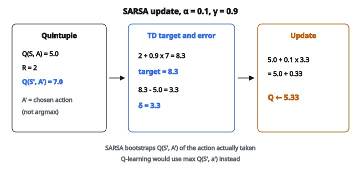

# SARSA Update

## SARSA là gì

SARSA là thuật toán **on-policy** temporal difference (TD) control, học hàm action-value $Q(s, a)$. Tên lấy từ bộ năm dùng trong mỗi lần cập nhật: $(S_t, A_t, R_{t+1}, S_{t+1}, A_{t+1})$.

Khác Q-learning, SARSA học giá trị của policy đang được theo, kể cả exploration.

## On-policy và off-policy

**On-policy (SARSA):**

* Học giá trị của policy đang dùng để thu thập dữ liệu
* Behavior policy = target policy
* Cập nhật dùng action thực sự được chọn tiếp theo

**Off-policy (Q-learning):**

* Học giá trị của policy tối ưu, bất kể cách hành xử
* Behavior policy $\neq$ target policy
* Cập nhật dùng action greedy (max Q)

## Quy tắc cập nhật SARSA

Cho bộ năm $(S_t, A_t, R_{t+1}, S_{t+1}, A_{t+1})$:

$$
Q(S_t, A_t) \leftarrow Q(S_t, A_t) + \alpha \left[ R_{t+1} + \gamma Q(S_{t+1}, A_{t+1}) - Q(S_t, A_t) \right]
$$

**Khác biệt then chốt so với Q-learning:** Dùng $Q(S_{t+1}, A_{t+1})$ thay vì $\max_{a'} Q(S_{t+1}, a')$.

## Hiểu bước cập nhật

**TD target:**

$$
\mathrm{target} = R_{t+1} + \gamma Q(S_{t+1}, A_{t+1})
$$

Đây là ước lượng return dùng:

* Reward thật $R_{t+1}$
* Q-value đã chiết khấu của cặp state–action **thực sự** kế tiếp

**TD error:**

$$
\delta_t = R_{t+1} + \gamma Q(S_{t+1}, A_{t+1}) - Q(S_t, A_t)
$$

Cập nhật đẩy $Q(S_t, A_t)$ về phía target.

## Thuật toán SARSA

**Khởi tạo:** $Q(s, a)$ tùy ý cho mọi $s, a$

**Lặp mỗi episode:**

1. Khởi tạo state $S$
2. Chọn action $A$ từ $S$ theo policy suy ra từ $Q$ (ví dụ $\epsilon$-greedy)
3. **Lặp mỗi bước:**

   * Thực hiện action $A$, quan sát reward $R$ và state kế $S'$
   * Chọn action $A'$ từ $S'$ theo policy suy ra từ $Q$ (ví dụ $\epsilon$-greedy)
   * Cập nhật: $Q(S, A) \leftarrow Q(S, A) + \alpha[R + \gamma Q(S', A') - Q(S, A)]$
   * $S \leftarrow S'$, $A \leftarrow A'$
4. Cho đến khi $S$ là terminal

## Ví dụ số

**Thiết lập:**

* State hiện tại $S_t$, action $A_t$
* $Q(S_t, A_t) = 5.0$
* Reward: $R_{t+1} = 2$
* State kế $S_{t+1}$
* Action kế do $\epsilon$-greedy chọn: $A_{t+1}$
* $Q(S_{t+1}, A_{t+1}) = 7.0$
* Learning rate: $\alpha = 0.1$
* Discount factor: $\gamma = 0.9$

**Bước 1: Tính TD target**

$$
\mathrm{target} = R_{t+1} + \gamma Q(S_{t+1}, A_{t+1}) = 2 + 0.9 \times 7 = 2 + 6.3 = 8.3
$$

**Bước 2: Tính TD error**

$$
\delta = 8.3 - 5.0 = 3.3
$$

**Bước 3: Cập nhật Q-value**

$$
Q(S_t, A_t) \leftarrow 5.0 + 0.1 \times 3.3 = 5.0 + 0.33 = 5.33
$$

::: {#fig-138-sarsa fig-cap="SARSA: target = 2 + 0.9 × 7 = 8.3, δ = 3.3, Q ← 5.33. Bootstrap từ Q(S', A') của action đã chọn, không phải max Q." fig-alt="Ba khối SARSA: Q=5.0, R=2, Q(S"}
{fig-align="center"}
:::

## SARSA với epsilon-greedy

SARSA thường đi với policy $\epsilon$-greedy:

**Chọn action:**

$$
A = \begin{cases}
\arg\max_a Q(S, a) & \text{với xác suất } 1 - \epsilon \\
\text{action ngẫu nhiên} & \text{với xác suất } \epsilon
\end{cases}
$$

**Quan trọng:** Cả $A_t$ và $A_{t+1}$ đều chọn bằng cùng policy $\epsilon$-greedy. Cập nhật phản ánh giá trị của policy đang explore này.

## SARSA học gì

SARSA học $Q^\pi$ với $\pi$ là policy $\epsilon$-greedy.

**Đây không phải $Q^*$!**

Các Q-value đã học tính đến việc agent đôi khi explore (chọn action ngẫu nhiên). Điều đó ảnh hưởng ước lượng giá trị.

**Hệ quả:** SARSA có thể học policy “an toàn” hơn, vì đã tính tới sai lầm exploration.

## Ví dụ Cliff Walking

Ví dụ cổ điển làm rõ khác biệt SARSA và Q-learning:

**Môi trường:**

* Lưới có vách đá dọc cạnh dưới
* Agent bắt đầu góc dưới-trái, đích góc dưới-phải
* Rơi khỏi vách cho reward âm lớn và reset về điểm bắt đầu

**Q-learning:** Học đường tối ưu (sát mép vách) vì đánh giá policy greedy. Khi huấn luyện với $\epsilon$-greedy, thỉnh thoảng vẫn rơi.

**SARSA:** Học đường an toàn hơn (tránh xa vách) vì đánh giá policy $\epsilon$-greedy, tính tới action ngẫu nhiên gần vách.

## Cập nhật SARSA và Q-learning

**SARSA:**

$$
Q(S_t, A_t) \leftarrow Q(S_t, A_t) + \alpha[R_{t+1} + \gamma Q(S_{t+1}, A_{t+1}) - Q(S_t, A_t)]
$$

**Q-learning:**

$$
Q(S_t, A_t) \leftarrow Q(S_t, A_t) + \alpha[R_{t+1} + \gamma \max_{a'} Q(S_{t+1}, a') - Q(S_t, A_t)]
$$

Khác biệt duy nhất nằm ở hạng bootstrap:

* SARSA: Dùng $Q(S_{t+1}, A_{t+1})$ (action thực sự đã chọn)
* Q-learning: Dùng $\max_{a'} Q(S_{t+1}, a')$ (action tốt nhất)

## Trạng thái terminal

Khi $S_{t+1}$ là terminal:

$$
Q(S_t, A_t) \leftarrow Q(S_t, A_t) + \alpha[R_{t+1} - Q(S_t, A_t)]
$$

Không có action kế, nên không có hạng bootstrap. Target chỉ là reward cuối.

## Expected SARSA

Biến thể dùng kỳ vọng Q-value dưới policy:

$$
Q(S_t, A_t) \leftarrow Q(S_t, A_t) + \alpha\left[R_{t+1} + \gamma \sum_{a'} \pi(a'|S_{t+1}) Q(S_{t+1}, a') - Q(S_t, A_t)\right]
$$

**Ưu điểm:**

* Phương sai thấp hơn SARSA (không còn ngẫu nhiên ở action kế)
* Vẫn on-policy (dùng $\pi$)
* Với $\pi$ greedy, thu về Q-learning

**Với $\epsilon$-greedy:**

$$
\sum_{a'} \pi(a'|S_{t+1}) Q(S_{t+1}, a') = (1-\epsilon) \max_{a'} Q(S_{t+1}, a') + \frac{\epsilon}{|A|} \sum_{a'} Q(S_{t+1}, a')
$$

## Hội tụ

SARSA hội tụ tới $Q^\pi$ dưới các điều kiện chuẩn:

**1. Mọi cặp state–action được thăm vô hạn lần**

**2. Lịch learning rate:**

$$
\sum_t \alpha_t = \infty, \quad \sum_t \alpha_t^2 < \infty
$$

**3. GLIE (Greedy in the Limit with Infinite Exploration):**

Policy phải hội tụ về greedy khi exploration giảm.

Với các điều kiện này, SARSA hội tụ tới $Q^*$.

## Learning rate và ổn định

**$\alpha$ cao (ví dụ 0.5):**

* Thích nghi nhanh
* Có thể bất ổn
* Phù hợp bài không dừng (non-stationary)

**$\alpha$ thấp (ví dụ 0.01):**

* Học chậm
* Ổn định hơn
* Độ chính xác tiệm cận tốt hơn

**Thường gặp:** $\alpha \in [0.1, 0.5]$ cho tabular SARSA

## Ưu điểm của SARSA

**1. An toàn on-policy:**
Học giá trị đã tính exploration, dẫn tới hành vi an toàn hơn.

**2. Đánh giá thực tế hơn:**
Giá trị phản ánh return kỳ vọng thật dưới behavior policy.

**3. Phù hợp khi:**

* Ứng dụng nhạy cảm rủi ro
* Exploration có thể nguy hiểm
* Học online

## Nhược điểm của SARSA

**1. Có thể không học policy tối ưu:**
Giá trị là của policy $\epsilon$-greedy, không phải policy tối ưu.

**2. Exploration ảnh hưởng giá trị:**
Q-value đổi khi $\epsilon$ giảm.

**3. Kém hiệu quả mẫu hơn:**
Phải theo policy hiện tại; tái sử dụng dữ liệu cũ kém hơn.

## n-step SARSA

Mở rộng SARSA sang n-step return:

$$
G_t^{(n)} = R_{t+1} + \gamma R_{t+2} + \cdots + \gamma^{n-1} R_{t+n} + \gamma^n Q(S_{t+n}, A_{t+n})
$$

$$
Q(S_t, A_t) \leftarrow Q(S_t, A_t) + \alpha[G_t^{(n)} - Q(S_t, A_t)]
$$

Cân bias (từ bootstrap) và phương sai (từ return).

## SARSA($\lambda$)

Ghép mọi n-step return bằng eligibility trace:

$$
G_t^\lambda = (1-\lambda) \sum_{n=1}^{\infty} \lambda^{n-1} G_t^{(n)}
$$

**Cài đặt với eligibility trace:**

1. Khởi tạo trace $e(s, a) = 0$ cho mọi $s, a$
2. Mỗi bước:
   * $\delta = R + \gamma Q(S', A') - Q(S, A)$
   * $e(S, A) = e(S, A) + 1$ (hoặc replace/accumulate)
   * Với mọi $s, a$: $Q(s, a) \leftarrow Q(s, a) + \alpha \delta e(s, a)$
   * Với mọi $s, a$: $e(s, a) \leftarrow \gamma \lambda e(s, a)$

## Khi nào dùng SARSA hay Q-learning

**Dùng SARSA khi:**

* An toàn trong lúc học là quan trọng
* Action có hậu quả thật
* Muốn học giá trị của hành vi đang explore

**Dùng Q-learning khi:**

* Muốn học trực tiếp policy tối ưu
* Hiệu quả mẫu quan trọng
* Có thể tách behavior policy và target policy

## SARSA trong deep RL

Tabular SARSA ít gặp hơn trong deep RL, nhưng ý on-policy vẫn lan sang:

**Phương pháp Actor-Critic:**

* Đánh giá on-policy của policy hiện tại
* Cùng tinh thần với SARSA

**PPO, A2C:**

* Thuật toán on-policy
* Học value của policy hiện tại

Ý chính của SARSA (học đúng policy mình đang theo) vẫn còn trong RL hiện đại.

## Code
```python
def sarsa_update(q_table, state, action, reward, next_state, next_action, alpha, gamma):
    """
    Perform one SARSA update and return the updated Q-table.
    """
    Q = [list(row) for row in q_table]
    Q[state][action] += alpha * (reward + gamma * Q[next_state][next_action] - Q[state][action])
    Q = [[round(float(v), 4) for v in row] for row in Q]
    return Q

```
