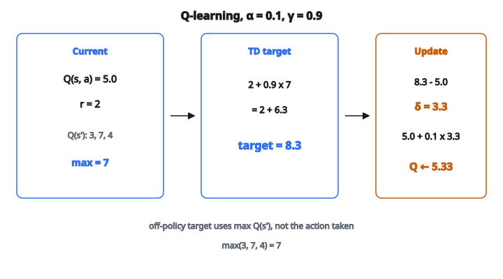

# Tabular Q-Learning (Single Update)

## Q-learning là gì?

Q-learning là thuật toán reinforcement learning **model-free, off-policy**, học trực tiếp hàm action-value tối ưu $Q^*(s, a)$ từ trải nghiệm.

Nó học action nào nên lấy ở mỗi trạng thái để cực đại hóa phần thưởng tích lũy, mà không cần mô hình môi trường.

Christopher Watkins giới thiệu năm 1989; Q-learning là một trong những thuật toán quan trọng nhất trong RL.

## Hàm Q

Hàm action-value (hàm Q) là kỳ vọng return khi lấy action $a$ tại trạng thái $s$ rồi theo policy $\pi$:

$$
Q^{\pi}(s, a) = \mathbb{E}_{\pi}\left[\sum_{k=0}^{\infty} \gamma^k R_{t+k+1} \;\middle|\; S_t = s, A_t = a\right]
$$

Hàm Q **tối ưu** $Q^*(s, a)$ cho kỳ vọng return lớn nhất:

$$
Q^*(s, a) = \max_{\pi} Q^{\pi}(s, a)
$$

## Phương trình Bellman tối ưu

Hàm Q tối ưu thỏa phương trình Bellman tối ưu:

$$
Q^*(s, a) = \mathbb{E}\left[R_{t+1} + \gamma \max_{a'} Q^*(S_{t+1}, a') \;\middle|\; S_t = s, A_t = a\right]
$$

Nghĩa là: giá trị của việc lấy action $a$ tại $s$ bằng phần thưởng tức thời cộng giá trị chiết khấu của action tốt nhất ở trạng thái kế.

Q-learning xấp xỉ phương trình này một cách lặp.

## Quy tắc cập nhật Q-learning

Sau khi quan sát chuyển tiếp $(s, a, r, s')$:

$$
Q(s, a) \leftarrow Q(s, a) + \alpha \left[ r + \gamma \max_{a'} Q(s', a') - Q(s, a) \right]
$$

**Các thành phần:**

* $Q(s, a)$: ước lượng Q-value hiện tại
* $\alpha$: learning rate
* $r$: phần thưởng quan sát được
* $\gamma$: hệ số chiết khấu
* $\max_{a'} Q(s', a')$: giá trị ước lượng của action tốt nhất ở trạng thái kế
* $r + \gamma \max_{a'} Q(s', a')$: TD target
* $r + \gamma \max_{a'} Q(s', a') - Q(s, a)$: TD error

## Hiểu bước cập nhật

Bước cập nhật kéo $Q(s, a)$ về phía một ước lượng tốt hơn:

$$
Q_{\mathrm{new}} = Q_{\mathrm{old}} + \alpha \cdot (\mathrm{target} - Q_{\mathrm{old}})
$$

**Nếu target $> Q_{\mathrm{old}}$:** action tốt hơn kỳ vọng, tăng Q-value

**Nếu target $< Q_{\mathrm{old}}$:** action kém hơn kỳ vọng, giảm Q-value

**Nếu target $= Q_{\mathrm{old}}$:** Q-value đã khớp, không đổi

## TD error

Temporal difference (TD) error là:

$$
\delta_t = R_{t+1} + \gamma \max_{a'} Q(S_{t+1}, a') - Q(S_t, A_t)
$$

Nó đo hiệu giữa:

* Ước lượng mới: $R_{t+1} + \gamma \max_{a'} Q(S_{t+1}, a')$
* Ước lượng cũ: $Q(S_t, A_t)$

TD error dẫn dắt việc học. Sai số lớn nghĩa là ước lượng đang sai.

## Ví dụ số

**Thiết lập:**

* Trạng thái hiện tại: $s$, action đã lấy: $a$
* Q-value hiện tại: $Q(s, a) = 5.0$
* Phần thưởng quan sát: $r = 2$
* Trạng thái kế: $s'$
* Q-value tại $s'$: $Q(s', a_1) = 3$, $Q(s', a_2) = 7$, $Q(s', a_3) = 4$
* Learning rate: $\alpha = 0.1$
* Hệ số chiết khấu: $\gamma = 0.9$

**Bước 1: Tìm max Q-value tại trạng thái kế**

$$
\max_{a'} Q(s', a') = \max(3, 7, 4) = 7
$$

**Bước 2: Tính TD target**

$$
\begin{aligned}
\mathrm{target}
&= r + \gamma \max_{a'} Q(s', a') \\
&= 2 + 0.9 \times 7 \\
&= 2 + 6.3 \\
&= 8.3
\end{aligned}
$$

**Bước 3: Tính TD error**

$$
\delta = 8.3 - 5.0 = 3.3
$$

**Bước 4: Cập nhật Q-value**

$$
\begin{aligned}
Q(s, a)
&\leftarrow 5.0 + 0.1 \times 3.3 \\
&= 5.0 + 0.33 \\
&= 5.33
\end{aligned}
$$

::: {#fig-91-q-learning fig-cap="Q-learning off-policy: max Q(s') = 7, target = 2 + 0.9 × 7 = 8.3, δ = 3.3, Q(s,a) ← 5.33." fig-alt="Q-learning một bước: Q(s,a)=5.0, r=2, max Q(s"}
{fig-align="center"}
:::

## Trạng thái terminal

Khi $s'$ là trạng thái terminal, không còn phần thưởng tương lai:

$$
Q(s, a) \leftarrow Q(s, a) + \alpha \left[ r - Q(s, a) \right]
$$

Target chỉ là phần thưởng tức thời $r$, không có hạng bootstrap.

**Ví dụ:** tới đích cho $r = 10$ và $Q(s, a) = 8$:

$$
Q(s, a) \leftarrow 8 + 0.1 \times (10 - 8) = 8.2
$$

## Học off-policy

Q-learning là **off-policy**: nó học policy tối ưu $\pi^*$ bất kể policy dùng để thu thập dữ liệu.

**Behavior policy:** policy dùng để chọn action (thường epsilon-greedy để exploration)

**Target policy:** policy đang được học (greedy theo Q)

Bước cập nhật dùng $\max_{a'} Q(s', a')$, tương ứng policy greedy, không phải action thực sự đã lấy.

## Thuật toán Q-learning

**Khởi tạo:** $Q(s, a)$ tùy ý với mọi $s, a$

**Lặp cho mỗi episode:**

1. Khởi tạo trạng thái $s$
2. **Lặp cho mỗi bước:**

   * Chọn action $a$ từ $s$ theo policy suy từ $Q$ (ví dụ epsilon-greedy)
   * Lấy action $a$, quan sát phần thưởng $r$ và trạng thái kế $s'$
   * Cập nhật: $Q(s, a) \leftarrow Q(s, a) + \alpha[r + \gamma \max_{a'} Q(s', a') - Q(s, a)]$
   * $s \leftarrow s'$
3. Cho đến khi $s$ là terminal

## Điều kiện hội tụ

Q-learning hội tụ tới $Q^*$ dưới các điều kiện sau:

**1. Mọi cặp state–action được thăm vô hạn lần**

Exploration phải phủ toàn bộ không gian.

**2. Learning rate thỏa:**

$$
\sum_t \alpha_t = \infty \quad \text{và} \quad \sum_t \alpha_t^2 < \infty
$$

Ví dụ: $\alpha_t = 1/t$ thỏa điều kiện này.

**3. Phần thưởng bị chặn**

Phần thưởng hữu hạn đảm bảo Q-value hữu hạn.

Trong thực hành, learning rate nhỏ không đổi thường đủ tốt.

## Learning rate

**$\alpha$ cao (ví dụ $0.5$):**

* Học ban đầu nhanh
* Có thể dao động, không hội tụ
* Hợp môi trường không dừng

**$\alpha$ thấp (ví dụ $0.01$):**

* Học chậm, ổn định
* Đảm bảo hội tụ tốt hơn
* Có thể quá chậm trong thực tế

**Giá trị điển hình:** $\alpha \in [0.01, 0.5]$

Lựa chọn phổ biến là $\alpha = 0.1$.

## Hệ số chiết khấu

**$\gamma = 0$:**

* Chỉ phần thưởng tức thời quan trọng
* Hành vi cận thị

**$\gamma$ gần $1$ (ví dụ $0.99$):**

* Phần thưởng tương lai gần như quan trọng bằng phần thưởng tức thời
* Tầm lập kế hoạch dài hơn
* Có thể bất ổn

**$\gamma = 1$:**

* Không chiết khấu, chỉ cho tác vụ theo episode
* Tổng phần thưởng được định giá đều ở mọi thời điểm

**Giá trị điển hình:** $\gamma \in [0.9, 0.99]$

## Q-learning và SARSA

**Q-learning (off-policy):**

$$
Q(s, a) \leftarrow Q(s, a) + \alpha[r + \gamma \max_{a'} Q(s', a') - Q(s, a)]
$$

Dùng max trên action kế (target greedy).

**SARSA (on-policy):**

$$
Q(s, a) \leftarrow Q(s, a) + \alpha[r + \gamma Q(s', a') - Q(s, a)]
$$

Dùng action kế $a'$ thực sự đã lấy.

Q-learning học policy tối ưu; SARSA học policy đang được theo.

## Ví dụ cliff walking

Trong bài toán cliff walking:

**Q-learning:** học đường tối ưu (bám mép vực) vì nó đánh giá policy greedy. Rủi ro trong lúc exploration.

**SARSA:** học đường an toàn hơn (xa vực) vì nó tính exploration vào ước lượng giá trị.

Đây minh họa khác biệt thực tế giữa học on-policy và off-policy.

## Vấn đề maximization bias

Q-learning có thể đánh giá quá cao Q-value vì toán tử max:

$$
\mathbb{E}[\max_a Q(s, a)] \geq \max_a \mathbb{E}[Q(s, a)]
$$

Khi Q-value nhiễu, lấy max có xu hướng chọn các giá trị bị đánh giá quá cao.

**Cách xử lý: Double Q-learning**

Dùng hai hàm Q, một để chọn action, một để đánh giá:

$$
Q_1(s, a) \leftarrow Q_1(s, a) + \alpha[r + \gamma Q_2(s', \arg\max_{a'} Q_1(s', a')) - Q_1(s, a)]
$$

## Tabular và xấp xỉ hàm

**Tabular Q-learning:**

* Lưu Q-value trong bảng
* Phù hợp không gian trạng thái rời rạc, nhỏ
* Biểu diễn đúng

**Q-learning với xấp xỉ hàm:**

* Dùng mạng nơ-ron: $Q(s, a; \theta)$
* Xử lý không gian trạng thái lớn/liên tục
* Ví dụ: DQN, Double DQN

Bước cập nhật trở thành hạ gradient trên TD error.

## Chiến lược exploration

Q-learning cần exploration để thăm mọi cặp state–action:

**Epsilon-greedy:** action ngẫu nhiên với xác suất $\epsilon$

**Optimistic initialization:** khởi tạo Q-value cao để khuyến khích exploration

**UCB:** cộng bonus exploration dựa trên số lần thăm

**Boltzmann exploration:** xác suất action tỉ lệ với Q-value

## Các lỗi thường gặp

**1. Exploration không đủ:**

* Không thăm hết cặp state–action
* Policy có thể không tối ưu

**2. Learning rate quá cao:**

* Q-value dao động
* Không hội tụ

**3. Quên xử lý trạng thái terminal:**

* Không có hạng max cho trạng thái terminal

**4. Dùng Q-learning khi on-policy hợp hơn:**

* Đôi khi SARSA phù hợp hơn (policy an toàn hơn)

## Code
```python
import numpy as np

def q_learning_update(Q, s, a, r, s_next, alpha, gamma):
    """
    Returns: updated Q-table Q_new
    """
    Q = [list(row) for row in Q]
    best_next = max(Q[s_next])
    Q[s][a] = Q[s][a] + alpha * (r + gamma * best_next - Q[s][a])
    return [[round(float(v), 4) for v in row] for row in Q]

```
