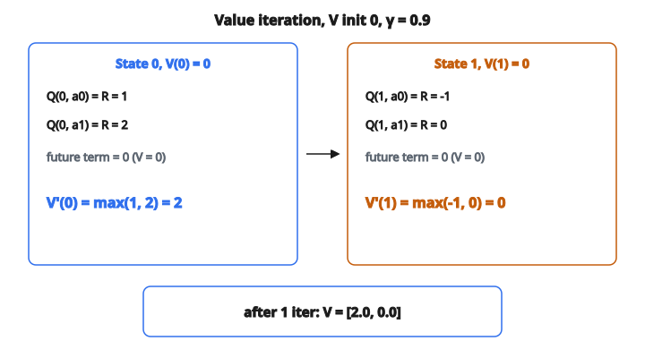

# Value Iteration Step

## Các quá trình quyết định Markov (MDP)

Trước khi hiểu value iteration, cần hiểu bài toán nó giải: tìm chiến lược tốt nhất trong một **Markov Decision Process**.

MDP là khung toán học mô hình hóa việc ra quyết định khi kết quả vừa ngẫu nhiên vừa chịu kiểm soát của người quyết định. Nó gồm năm thành phần:

* **States** $S$: tập hữu hạn các tình huống agent có thể ở. Ví dụ vị trí trên lưới, cấp trong game, hoặc cấu hình của robot.
* **Actions** $A$: tập hữu hạn các lựa chọn của agent. Ví dụ đi trái, đi phải, đứng yên.
* **Transition function** $T(s, a, s')$: xác suất kết thúc ở trạng thái $s'$ nếu lấy action $a$ tại trạng thái $s$. Đây là độ bất định của môi trường. Với mọi cặp state–action, xác suất trên mọi trạng thái kế tiếp cộng bằng 1:

$$
\sum_{s'} T(s, a, s') = 1 \quad \text{với mọi } s, a
$$

* **Reward function** $R(s, a)$: phần thưởng tức thời khi lấy action $a$ tại trạng thái $s$. Đây là tín hiệu cho agent biết action nào tốt hay xấu trong ngắn hạn.
* **Discount factor** $\gamma \in [0, 1]$: số điều khiển mức agent quan tâm phần thưởng tương lai so với phần thưởng tức thời.

**Markov property** là giả thiết then chốt: trạng thái kế tiếp chỉ phụ thuộc trạng thái hiện tại và action, không phụ thuộc lịch sử đi tới đó. Nhờ vậy toán học trở nên khả thi.

## Hàm giá trị là gì?

Một **hàm giá trị** $V(s)$ gán cho mỗi trạng thái một số, cho biết việc ở trạng thái đó tốt đến mức nào. Cụ thể, đó là tổng phần thưởng chiết khấu kỳ vọng mà agent sẽ tích lũy khi bắt đầu từ $s$ và hành động tối ưu kể từ đó.

Ý niệm “phần thưởng chiết khấu” là trung tâm. Nếu agent nhận $r_0, r_1, r_2, \ldots$ ở các bước thời gian liên tiếp, return chiết khấu là:

$$
G = r_0 + \gamma \, r_1 + \gamma^2 \, r_2 + \gamma^3 \, r_3 + \cdots = \sum_{t=0}^{\infty} \gamma^t \, r_t
$$

Hệ số chiết khấu $\gamma$ làm phần thưởng tương lai kém giá hơn phần thưởng tức thời. Phần thưởng $1$ nhận sau 10 bước chỉ còn đáng $\gamma^{10}$ hôm nay.

* Khi $\gamma = 0$, agent hoàn toàn cận thị và chỉ quan tâm phần thưởng tức thời.
* Khi $\gamma$ gần $1$, agent nhìn xa và định giá phần thưởng tương lai gần như phần thưởng hiện tại.
* Khi $\gamma = 1$, không chiết khấu gì cả, nhưng hội tụ không còn được đảm bảo nói chung.

**Hàm giá trị tối ưu** $V^*(s)$ là kỳ vọng return lớn nhất có thể khi bắt đầu từ mỗi trạng thái. Một khi biết $V^*$, về thực chất ta biết kết quả tốt nhất từ mọi tình huống.

## Phương trình Bellman

Phương trình Bellman là quan hệ đệ quy mà hàm giá trị tối ưu phải thỏa. Nó diễn một ý đơn giản nhưng mạnh: giá trị của một trạng thái bằng phần thưởng tức thời tốt nhất có thể lấy, cộng giá trị chiết khấu của nơi ta kết thúc.

Hình thức:

$$
V^*(s) = \max_a \left[ R(s, a) + \gamma \sum_{s'} T(s, a, s') \cdot V^*(s') \right]
$$

Tách từng mảnh:

1. Tổng trong $\sum_{s'} T(s, a, s') \cdot V^*(s')$ tính **giá trị tương lai kỳ vọng** nếu lấy action $a$ từ trạng thái $s$. Ta xét mọi trạng thái kế $s'$, nhân với xác suất tới đó ($T(s, a, s')$), rồi nhân với giá trị của nó ($V^*(s')$). Đây chính là trung bình có trọng số.
2. $R(s, a) + \gamma \cdot (\text{giá trị tương lai kỳ vọng})$ cho tổng giá trị của việc lấy action $a$. Phần thưởng tức thời $R(s, a)$ là thứ nhận ngay, còn giá trị tương lai kỳ vọng đã chiết khấu là thứ kỳ vọng tích lũy sau đó. Đại lượng này gọi là **Q-value** hay **action-value**:

$$
Q(s, a) = R(s, a) + \gamma \sum_{s'} T(s, a, s') \cdot V^*(s')
$$

3. $\max_a$ lấy action tốt nhất. Vì ta muốn giá trị *tối ưu*, ta chọn action cho tổng cao nhất.

Phương trình Bellman không giải một phát. Đó là hệ phương trình (một phương trình mỗi trạng thái) trong đó ẩn ($V^*$) xuất hiện ở cả hai vế. Value iteration vào đúng chỗ này.

## Value iteration

Value iteration là thuật toán lặp tìm $V^*$ bằng cách áp phương trình Bellman như một **quy tắc cập nhật**.

Bắt đầu với một đoán ban đầu cho hàm giá trị, thường toàn không: $V_0(s) = 0$ với mọi trạng thái. Rồi ở mỗi vòng $k$, tính ước lượng mới bằng Bellman backup trên mọi trạng thái:

$$
V_{k+1}(s) = \max_a \left[ R(s, a) + \gamma \sum_{s'} T(s, a, s') \cdot V_k(s') \right]
$$

Khác biệt duy nhất so với phương trình Bellman là vế phải dùng $V_k$ (ước lượng hiện tại) thay vì $V^*$ (ta chưa biết). Mỗi vòng đưa ước lượng gần giá trị tối ưu thật hơn.

**Vì sao cách này đúng?** Bellman backup là một **ánh xạ co**. Đây là kết quả từ lý thuyết điểm bất động: nếu cứ áp một hàm kéo các điểm lại gần nhau, cuối cùng sẽ hội tụ tới một điểm bất động duy nhất. Hệ số co đúng bằng $\gamma$. Sau $k$ vòng, sai số lớn nhất trên mọi trạng thái nhiều nhất là $\gamma^k$ lần sai số ban đầu. Vậy giá trị hội tụ theo hàm mũ, và $\gamma$ nhỏ hơn thì hội tụ nhanh hơn.

**Khi nào dừng:** trong thực hành, dừng khi giá trị hầu như không đổi giữa hai vòng. Tiêu chí chuẩn là:

$$
\max_s |V_{k+1}(s) - V_k(s)| < \epsilon
$$

với ngưỡng nhỏ $\epsilon$. Phần code dưới đây thực hiện đúng một bước của vòng lặp này.

## Q-value: nhìn gần hơn

Q-value $Q(s, a)$ đáng hiểu độc lập. Trong khi $V(s)$ trả lời “trạng thái này tốt đến đâu?”, $Q(s, a)$ trả lời “lấy đúng action này tại trạng thái này tốt đến đâu?”

$$
Q(s, a) = R(s, a) + \gamma \sum_{s'} T(s, a, s') \cdot V(s')
$$

Quan hệ giữa $V$ và $Q$ thẳng:

$$
V^*(s) = \max_a Q^*(s, a)
$$

Giá trị tối ưu của một trạng thái chính là Q-value của action tốt nhất. Tính Q-value là công việc cốt lõi của mỗi bước value iteration. Ta đánh giá Q-value cho mọi cặp state–action, rồi lấy max theo action cho từng trạng thái.

## Chuyển tiếp ngẫu nhiên và tất định

Hàm chuyển tiếp $T(s, a, s')$ nắm độ ngẫu nhiên của môi trường.

Trong môi trường **tất định** (deterministic), lấy action $a$ tại $s$ luôn dẫn tới cùng một trạng thái kế $s'$. Khi đó mọi xác suất chuyển tiếp là $0$ hoặc $1$. Giá trị tương lai kỳ vọng rút thành đúng $V(s')$ của trạng thái kế được đảm bảo. Bellman backup thành:

$$
V'(s) = \max_a \left[ R(s, a) + \gamma \cdot V(\mathrm{next}(s, a)) \right]
$$

Trong môi trường **ngẫu nhiên** (stochastic), cùng một action có thể dẫn tới các trạng thái khác nhau với xác suất khác nhau. Ví dụ robot cố đi thẳng có thể thành công với xác suất $0.8$, trượt trái $0.1$, hoặc trượt phải $0.1$. Giá trị tương lai kỳ vọng khi đó là tổng có trọng số trên mọi kết cục.

Sự khác biệt này quan trọng vì chuyển tiếp ngẫu nhiên buộc agent nghĩ về rủi ro. Một action thường cho kết quả tuyệt vời nhưng đôi khi dẫn tới thảm họa có thể có Q-value thấp hơn một action an toàn, phần thưởng kém hơn.

## Trích xuất policy tối ưu

Value iteration tính *giá trị* tối ưu, nhưng thứ ta thực sự muốn là một *policy*: quy tắc bảo agent lấy action nào ở mỗi trạng thái.

Khi đã biết $V^*$, policy tối ưu $\pi^*$ là:

$$
\pi^*(s) = \arg\max_a \left[ R(s, a) + \gamma \sum_{s'} T(s, a, s') \cdot V^*(s') \right]
$$

Nói cách khác, ở mỗi trạng thái, chọn action đạt cực đại trong phương trình Bellman. Giá trị đã mã hóa action nào tốt nhất; chỉ cần đọc ra.

## Ví dụ số

Xét 2 trạng thái và 2 action, mọi giá trị khởi tạo bằng $0$. $T[s][a]$ là hàng xác suất tới các $s'$:

$$
T[0] = \begin{bmatrix} 0.8 & 0.2 \\ 0.3 & 0.7 \end{bmatrix},
\quad
T[1] = \begin{bmatrix} 0.5 & 0.5 \\ 0.1 & 0.9 \end{bmatrix},
\quad
R = \begin{bmatrix} 1 & 2 \\ -1 & 0 \end{bmatrix},
\quad
\gamma = 0.9
$$

**Trạng thái 0:**

$$
\begin{aligned}
Q(0, a_0)
&= R(0, 0) + \gamma \cdot [T(0,0,0) \cdot V(0) + T(0,0,1) \cdot V(1)] \\
&= 1 + 0.9 \cdot [0.8 \cdot 0 + 0.2 \cdot 0] \\
&= 1
\end{aligned}
$$

$$
\begin{aligned}
Q(0, a_1)
&= R(0, 1) + \gamma \cdot [T(0,1,0) \cdot V(0) + T(0,1,1) \cdot V(1)] \\
&= 2 + 0.9 \cdot [0.3 \cdot 0 + 0.7 \cdot 0] \\
&= 2
\end{aligned}
$$

$$
V'(0) = \max(1, 2) = 2
$$

**Trạng thái 1:**

$$
\begin{aligned}
Q(1, a_0)
&= -1 + 0.9 \cdot [0.5 \cdot 0 + 0.5 \cdot 0] \\
&= -1
\end{aligned}
$$

$$
\begin{aligned}
Q(1, a_1)
&= 0 + 0.9 \cdot [0.1 \cdot 0 + 0.9 \cdot 0] \\
&= 0
\end{aligned}
$$

$$
V'(1) = \max(-1, 0) = 0
$$

::: {#fig-12-value-iteration fig-cap="Một bước value iteration với V khởi tạo 0 và γ = 0.9: Q-value rút thành R nên V' = [2.0, 0.0] = max theo action." fig-alt="Hai trạng thái, V khởi tạo 0. Trái: Q(0,a0)=1, Q(0,a1)=2, V"}
{fig-align="center"}
:::

Sau một vòng: $V = [2.0, 0.0]$.

Nếu chạy vòng thứ hai với các giá trị mới này, các hạng tương lai không còn bằng không, và ước lượng trở nên tinh hơn. Lặp đến hội tụ cho $V^*$.

## Value iteration xuất hiện ở đâu

**Reinforcement learning:** value iteration là thuật toán nền. Các phương pháp deep RL hiện đại như DQN (Deep Q-Networks) về bản chất là xấp xỉ mạng nơ-ron của cùng ý Bellman backup, mở rộng tới môi trường có không gian trạng thái rất lớn hoặc liên tục.

**Planning và điều khiển:** hệ tự hành (xe tự lái, robot kho) dùng planner dựa trên MDP để quyết định action dưới bất định. Value iteration hoặc biến thể của nó tính quyết định tối ưu tại mỗi trạng thái.

**Vận trù học:** quản lý tồn kho, phân bổ tài nguyên, và lập lịch bảo trì đều được mô hình hóa như MDP. Value iteration tìm chiến lược cực tiểu hóa chi phí hoặc cực đại hóa lợi nhuận.

**Game AI:** game bàn và bot game dùng suy luận kiểu value iteration để đánh giá thế cờ và chọn nước đi.

## Code
```python
def value_iteration_step(values, transitions, rewards, gamma):
    """
    Perform one step of value iteration and return updated values.
    """
    num_states = len(values)
    new_values = []
    for s in range(num_states):
        best = float('-inf')
        for a in range(len(transitions[s])):
            q = rewards[s][a]
            for s_next in range(num_states):
                q += gamma * transitions[s][a][s_next] * values[s_next]
            if q > best:
                best = q
        new_values.append(best)
    return new_values

```

<!-- auto-self-check -->

::: {.callout-note}
## Kiểm tra nhanh
<details>
<summary>Ý chính của bài «Value Iteration Step» là gì?</summary>
Một **hàm giá trị** $V(s)$ gán cho mỗi trạng thái một số, cho biết việc ở trạng thái đó tốt đến mức nào.
</details>
<details>
<summary>Công thức / quan hệ cốt lõi trong bài là gì?</summary>
$$\sum_{s'} T(s, a, s') = 1 \quad \text{với mọi } s, a$$
</details>
:::
