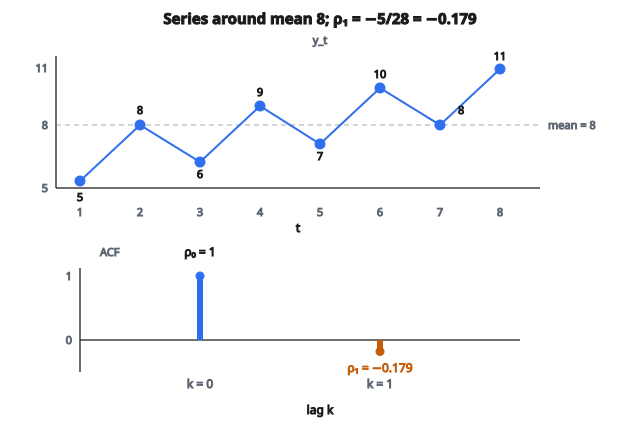

# Autocorrelation

## Autocorrelation là gì?

**Autocorrelation** đo quan hệ tuyến tính giữa một chuỗi thời gian và phiên bản trễ (lagged) của chính nó. Nó định lượng mức độ giá trị quá khứ ảnh hưởng giá trị hiện tại.

$$
\rho_k = \frac{\sum_{t=k+1}^{T} (y_t - \bar{y})(y_{t-k} - \bar{y})}{\sum_{t=1}^{T} (y_t - \bar{y})^2}
$$

với $k$ là lag và $\bar{y}$ là mean của chuỗi.

## Công thức chính

Với chuỗi thời gian $y_1, y_2, \ldots, y_T$, autocorrelation tại lag $k$ là:

$$
\rho_k = \frac{\operatorname{Cov}(y_t, y_{t-k})}{\operatorname{Var}(y_t)}
$$

**Khoảng:** $-1 \leq \rho_k \leq 1$

* $\rho_k = 1$: Tương quan dương hoàn hảo
* $\rho_k = 0$: Không tương quan tuyến tính
* $\rho_k = -1$: Tương quan âm hoàn hảo

## Ví dụ số

**Chuỗi thời gian:** $[5, 8, 6, 9, 7, 10, 8, 11]$

**Mean:** $\bar{y} = \frac{5+8+6+9+7+10+8+11}{8} = \frac{64}{8} = 8$

**Autocorrelation lag 1:**

Các cặp: $(8,5)$, $(6,8)$, $(9,6)$, $(7,9)$, $(10,7)$, $(8,10)$, $(11,8)$

$$
\begin{aligned}
\text{Numerator}
&= (8-8)(5-8) + (6-8)(8-8) + (9-8)(6-8) + (7-8)(9-8) \\
&\quad + (10-8)(7-8) + (8-8)(10-8) + (11-8)(8-8) \\
&= 0(-3) + (-2)(0) + 1(-2) + (-1)(1) + 2(-1) + 0(2) + 3(0) \\
&= 0 + 0 - 2 - 1 - 2 + 0 + 0 = -5
\end{aligned}
$$

$$
\begin{aligned}
\text{Denominator}
&= (5-8)^2 + (8-8)^2 + (6-8)^2 + (9-8)^2 + (7-8)^2 \\
&\quad + (10-8)^2 + (8-8)^2 + (11-8)^2 \\
&= 9 + 0 + 4 + 1 + 1 + 4 + 0 + 9 = 28
\end{aligned}
$$

$$
\rho_1 = \frac{-5}{28} = -0.179
$$

Tương quan âm yếu tại lag 1.

::: {#fig-164-acf fig-cap="ρ_1 = −5/28 = −0.179 trên chuỗi mean ȳ = 8. Tương quan âm yếu tại lag 1 khớp ví dụ số." fig-alt="Chuỗi [5, 8, 6, 9, 7, 10, 8, 11] quanh mean 8, và ACF stem rho_0 = 1, rho_1 = -5/28 = -0.179."}
{fig-align="center"}
:::

## Hàm Autocorrelation Function

ACF là tập autocorrelation cho mọi lag:

$$
\text{ACF} = \{\rho_0, \rho_1, \rho_2, \ldots, \rho_m\}
$$

với $m$ là lag tối đa (thường $m \approx T/4$).

**Lưu ý:** $\rho_0 = 1$ luôn (chuỗi tương quan hoàn hảo với chính nó tại lag 0).

**Đồ thị ACF:** Đồ thị $\rho_k$ theo $k$. Công cụ trực quan để nhận dạng mẫu.

## Đọc các mẫu ACF

**White noise ngẫu nhiên:**

Mọi $\rho_k \approx 0$ với $k > 0$. Không autocorrelation.

**Trend mạnh:**

ACF suy giảm chậm. Autocorrelation dương cao ở nhiều lag.

**Seasonality (chu kỳ $s$):**

Đỉnh tại các lag $s, 2s, 3s, \ldots$

**Ví dụ:** Dữ liệu tháng có mùa theo năm cho đỉnh tại lag 12, 24, 36.

**Quá trình moving average:**

ACF cắt cụt đột ngột sau lag $q$.

**Quá trình autoregressive:**

ACF suy giảm theo hàm mũ hoặc dạng sin tắt dần.

## Ý nghĩa thống kê

Dưới giả thuyết không là không có autocorrelation (white noise):

$$
\rho_k \sim N\left(0, \frac{1}{T}\right)
$$

**Khoảng tin cậy 95%:**

$$
\left[-\frac{1.96}{\sqrt{T}}, \frac{1.96}{\sqrt{T}}\right]
$$

**Ví dụ:** Với $T=100$, biên là $\pm 0.196$.

Giá trị nằm ngoài các biên này có ý nghĩa thống kê.

## Partial Autocorrelation

PACF đo tương quan tại lag $k$ sau khi đã loại ảnh hưởng của các lag trung gian.

$$
\phi_{kk} = \operatorname{Corr}(y_t, y_{t-k} \mid y_{t-1}, \ldots, y_{t-k+1})
$$

**Diễn giải:**

* ACF: Tương quan tổng (trực tiếp + gián tiếp)
* PACF: Chỉ tương quan trực tiếp

**Quá trình AR($p$):**

PACF cắt cụt sau lag $p$, ACF suy giảm.

**Quá trình MA($q$):**

ACF cắt cụt sau lag $q$, PACF suy giảm.

## Autocorrelation trong nhận dạng mô hình

**Chọn mô hình ARIMA:**

1. Vẽ ACF và PACF
2. Nhận dạng mẫu
3. Xác định bậc mô hình

**Ví dụ:**

* ACF đuôi dài, PACF cắt cụt tại lag $p$: dùng AR($p$)
* ACF cắt cụt tại lag $q$, PACF đuôi dài: dùng MA($q$)
* Cả hai đuôi dài: dùng ARMA($p$, $q$)

**Differencing:**

Nếu ACF suy giảm rất chậm, lấy sai phân đến khi nó suy giảm nhanh.

## Ljung-Box test

Kiểm định formal sự hiện diện của autocorrelation ở nhiều lag:

$$
Q = T(T+2) \sum_{k=1}^{m} \frac{\rho_k^2}{T-k}
$$

**Giả thuyết không:** $\rho_1 = \rho_2 = \ldots = \rho_m = 0$

**Phân phối:** $Q \sim \chi^2_m$ dưới giả thuyết không.

**Quyết định:** Nếu $Q$ vượt giá trị tới hạn, bác bỏ giả thuyết không (có autocorrelation).

**Trường hợp dùng:** Kiểm định residual sau khi khớp mô hình. Muốn *không* bác bỏ (không autocorrelation trong residual).

## Autocorrelation trong dữ liệu tài chính

**Returns:**

Daily stock returns thường có $\rho_k \approx 0$ (efficient market hypothesis).

**Volatility:**

Bình phương returns cho autocorrelation dương mạnh (volatility clustering).

**Chiến lược giao dịch:**

Autocorrelation âm gợi ý cơ hội mean reversion. Autocorrelation dương gợi ý chiến lược momentum.

## Autocorrelation mùa

Với dữ liệu seasonal chu kỳ $s$:

$$
\rho_s, \rho_{2s}, \rho_{3s}, \ldots
$$

lớn và dương.

**Ví dụ:** Dữ liệu doanh số tháng với mẫu theo năm.

$s = 12$, nên $\rho_{12}, \rho_{24}, \rho_{36}$ có ý nghĩa.

**Seasonal differencing:**

Lấy sai phân tại lag $s$: $y_t - y_{t-s}$

Cách này loại autocorrelation mùa.

## Sample vs population autocorrelation

**Quần thể:** $\rho_k$ (tham số thật)

**Mẫu:** $\hat{\rho}_k$ (ước lượng từ dữ liệu)

Sample autocorrelation bị chệch ở mẫu nhỏ, đặc biệt ở lag lớn.

**Bias:** $\mathbb{E}[\hat{\rho}_k] \neq \rho_k$ khi $T$ nhỏ.

**Phương sai tăng theo lag:** Độ bất định của $\hat{\rho}_k$ cao hơn khi $k$ lớn.

**Quy tắc thực tế:** Chỉ diễn giải lag tới $T/4$ hoặc $T/3$.

## Cross-correlation

Đo tương quan giữa hai chuỗi thời gian khác nhau tại các lag:

$$
\rho_{xy}(k) = \frac{\sum_{t=k+1}^{T} (x_t - \bar{x})(y_{t-k} - \bar{y})}{\sqrt{\sum_{t=1}^{T} (x_t - \bar{x})^2 \sum_{t=1}^{T} (y_t - \bar{y})^2}}
$$

**Diễn giải:**

$k$ dương: $x$ dẫn $y$ $k$ kỳ.

$k$ âm: $y$ dẫn $x$ $|k|$ kỳ.

**Trường hợp dùng:** Tìm quan hệ lead-lag giữa các chỉ báo kinh tế.

## Autocorrelation và tính dừng

**Quá trình dừng:**

ACF suy giảm về 0 khi lag tăng.

**Quá trình không dừng:**

ACF suy giảm rất chậm hoặc không suy giảm.

**Unit root:**

$\rho_1 \approx 1$ và ACF đứng gần 1 ở nhiều lag.

**Giải pháp:** Lấy sai phân chuỗi đến khi ACF suy giảm đúng cách.

## Lưu ý tính toán

**Tính trực tiếp:** $O(T^2)$ cho mọi lag tới $T-1$.

**Dựa trên FFT:** $O(T \log T)$ nhờ tính chất Fourier:

$$
\text{ACF} = \mathcal{F}^{-1}\left[|\mathcal{F}[y]|^2\right]
$$

**Thực tế:** Dùng hàm có sẵn trong thư viện thống kê.

## Autocorrelation trong dự báo

**Autocorrelation dương cao:**

Giá trị quá khứ dự đoán mạnh giá trị tương lai. Mô hình chuỗi thời gian sẽ chạy tốt.

**Autocorrelation bằng 0:**

Chuỗi không dự đoán được từ lịch sử của chính nó. Cần predictor bên ngoài.

**Kiểm định mô hình:**

Kiểm tra forecast error (residual) không còn autocorrelation. Nếu còn, mô hình đang thiếu cấu trúc.

## Autocorrelation giả (spurious)

**Gây bởi trend:**

Hai chuỗi độc lập nhưng cùng trend trông như tương quan.

**Giải pháp:** Khử trend hoặc lấy sai phân trước khi tính autocorrelation.

**Gây bởi seasonality:**

Mẫu mùa tạo autocorrelation giả.

**Giải pháp:** Seasonal adjustment trước.

## Durbin-Watson test

Kiểm định autocorrelation bậc một trong residual hồi quy:

$$
DW = \frac{\sum_{t=2}^{T} (e_t - e_{t-1})^2}{\sum_{t=1}^{T} e_t^2}
$$

**Khoảng:** $0 \leq DW \leq 4$

* $DW = 2$: Không autocorrelation
* $DW < 2$: Autocorrelation dương
* $DW > 2$: Autocorrelation âm

**Quy tắc ngón tay cái:** $DW \approx 2(1 - \rho_1)$

## Autocorrelation trong phân tích residual

Sau khi khớp bất kỳ mô hình chuỗi thời gian nào:

1. Tính residual $e_t = y_t - \hat{y}_t$
2. Tính ACF của residual
3. Kiểm tra mọi $\rho_k \approx 0$

**Mô hình tốt:** Residual không còn autocorrelation (white noise).

**Mô hình kém:** Residual có autocorrelation có ý nghĩa (mô hình bỏ sót mẫu).

**Hành động:** Nếu residual còn autocorrelation, thêm hạng mô hình hoặc đổi cấu trúc mô hình.

## Autocorrelation và ước lượng phương sai

Khi có autocorrelation dương:

$$
\operatorname{Var}(\bar{y}) = \frac{\sigma^2}{T} \left[1 + 2\sum_{k=1}^{T-1} \left(1 - \frac{k}{T}\right) \rho_k\right]
$$

Standard error của mean lớn hơn $\sigma/\sqrt{T}$.

**Hệ quả:** Dữ liệu có autocorrelation cung cấp ít thông tin hơn dữ liệu độc lập.

**Cỡ mẫu hiệu dụng:**

$$
T_{\text{eff}} = \frac{T}{1 + 2\sum_{k=1}^{T-1} \rho_k}
$$

## Liên hệ mật độ phổ

Autocorrelation và spectral density là cặp Fourier transform:

$$
f(\omega) = \frac{1}{2\pi} \sum_{k=-\infty}^{\infty} \rho_k e^{-i\omega k}
$$

**Diễn giải:**

* ACF: Biểu diễn miền thời gian
* Spectral density: Biểu diễn miền tần số

Cả hai chứa cùng thông tin về quá trình.

## Code
```python
def autocorrelation(series, max_lag):
    """
    Compute the autocorrelation of a time series for lags 0 to max_lag.
    """
    n = len(series)
    mean = sum(series) / n
    variance = sum((x - mean) ** 2 for x in series)
    if variance == 0:
        return [1.0] + [0.0] * max_lag
    result = []
    for lag in range(max_lag + 1):
        cov = sum((series[t] - mean) * (series[t + lag] - mean) for t in range(n - lag))
        result.append(cov / variance)
    return result

```

<!-- auto-self-check -->

::: {.callout-note}
## Kiểm tra nhanh
<details>
<summary>Ý chính của bài «Autocorrelation» là gì?</summary>
**Autocorrelation** đo quan hệ tuyến tính giữa một chuỗi thời gian và phiên bản trễ (lagged) của chính nó.
</details>
<details>
<summary>Công thức / quan hệ cốt lõi trong bài là gì?</summary>
$$\rho_k = \frac{\sum_{t=k+1}^{T} (y_t - \bar{y})(y_{t-k} - \bar{y})}{\sum_{t=1}^{T} (y_t - \bar{y})^2}$$
</details>
:::
