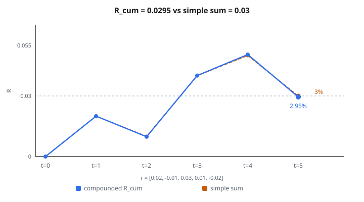

# Cumulative Returns

## Cumulative returns là gì

**Cumulative return** là tổng return của một khoản đầu tư trên một khoảng thời gian, đã kể compounding. Nó cho biết khoản vốn ban đầu đã tăng hay giảm bao nhiêu theo thời gian.

$$
R_{\text{cum}}(t) = \prod_{i=1}^{t} (1 + r_i) - 1
$$

với $r_i$ là return tại kỳ $i$.

## Công thức chính

Với chuỗi return từng kỳ $r_1, r_2, \ldots, r_T$:

$$
R_{\text{cum}} = (1 + r_1)(1 + r_2)\cdots(1 + r_T) - 1
$$

**Dạng tương đương (log return):**

Nếu dùng log return $\ell_i = \ln(1 + r_i)$:

$$
R_{\text{cum}} = e^{\sum_{i=1}^{T} \ell_i} - 1
$$

Log return cộng lại cho cumulative return.

## Ví dụ số

**Daily return:** $[0.02, -0.01, 0.03, 0.01, -0.02]$

**Tính từng bước:**

Kỳ 1: $R_1 = 1.02 - 1 = 0.02$ ($2\%$)

Kỳ 2: $R_2 = 1.02 \times 0.99 - 1 = 1.0098 - 1 = 0.0098$ ($0.98\%$)

Kỳ 3: $R_3 = 1.0098 \times 1.03 - 1 = 1.040094 - 1 = 0.040094$ ($4.01\%$)

Kỳ 4: $R_4 = 1.040094 \times 1.01 - 1 = 1.0505 - 1 = 0.0505$ ($5.05\%$)

Kỳ 5: $R_5 = 1.0505 \times 0.98 - 1 = 1.0295 - 1 = 0.0295$ ($2.95\%$)

**Cumulative return cuối:** $2.95\%$

**Kiểm tra:**

$$
R_{\text{cum}} = 1.02 \times 0.99 \times 1.03 \times 1.01 \times 0.98 - 1 = 1.0295 - 1 = 0.0295
$$

::: {#fig-190-cumulative-returns fig-cap="Compounding cho R_cum = 0.0295 (2.95%). Tổng đơn 0.02 − 0.01 + 0.03 + 0.01 − 0.02 = 3% không khớp vì bỏ qua compounding." fig-alt="Đường R_cum kết thúc 2.95% so với tổng đơn 3% trên daily return 0.02, -0.01, 0.03, 0.01, -0.02."}
{fig-align="center"}
:::

## Return đơn so với compounded

**Tổng đơn (sai):**

$$
0.02 + (-0.01) + 0.03 + 0.01 + (-0.02) = 0.03 = 3\%
$$

**Compounded (đúng):**

$$
2.95\%
$$

**Khác biệt:** Compounding kể return sinh thêm return.

**Return nhỏ:** Chênh lệch rất nhỏ.

**Return lớn:** Chênh lệch đáng kể.

## Chuẩn hóa giá trị đầu

Nếu bắt đầu với gốc $P_0$:

$$
V_t = P_0 \prod_{i=1}^{t} (1 + r_i)
$$

**Chuẩn hóa về 1:**

$$
V_t = \prod_{i=1}^{t} (1 + r_i)
$$

Đây là hệ số tăng trưởng. Trừ 1 để được cumulative return.

**Diễn giải:** $V_t = 1.0295$ nghĩa là $1$ tăng thành $1.0295$.

## Chuỗi cumulative return

Tính cumulative return tại mỗi thời điểm:

$$
R_{\text{cum}}(t) = \prod_{i=1}^{t} (1 + r_i) - 1
$$

**Chuỗi ví dụ:**

* $t=1$: $R_1 = 0.02$
* $t=2$: $R_2 = 0.0098$
* $t=3$: $R_3 = 0.040094$
* $t=4$: $R_4 = 0.0505$
* $t=5$: $R_5 = 0.0295$

**Hình:** Đường vẽ quỹ đạo tăng trưởng khoản đầu tư theo thời gian.

## Liên hệ maximum drawdown

Maximum drawdown đo mức giảm từ đỉnh xuống đáy:

$$
\text{MDD} = \max_{t} \left[\max_{s \leq t} R_{\text{cum}}(s) - R_{\text{cum}}(t)\right]
$$

Cần cumulative return để xác định đỉnh và đáy sau đó.

**Use case:** Đánh giá rủi ro. Cho thấy tổn thất tệ nhất từ đỉnh.

## Return annualized

Đổi cumulative return thành tốc độ năm:

$$
r_{\text{annual}} = \left(1 + R_{\text{cum}}\right)^{\frac{1}{T}} - 1
$$

với $T$ là số năm.

**Ví dụ:** Cumulative return 10% trên 2 năm:

$$
r_{\text{annual}} = (1.10)^{0.5} - 1 = 1.0488 - 1 = 0.0488 = 4.88\%
$$

**Diễn giải:** Tốc độ năm trung bình tạo ra cumulative return đó.

## Return log so với số học

**Return số học:**

$$
r_t = \frac{P_t - P_{t-1}}{P_{t-1}}
$$

**Return log:**

$$
\ell_t = \ln\left(\frac{P_t}{P_{t-1}}\right) = \ln(1 + r_t)
$$

**Đổi sang tích lũy:**

Số học: $(1 + r_1)(1 + r_2)\cdots(1 + r_T) - 1$

Log: $e^{\ell_1 + \ell_2 + \cdots + \ell_T} - 1$

**Ưu điểm log return:** Tính chất cộng làm gọn phép tính.

## Cumulative return danh mục

Với danh mục trọng số $w_i$ và return tài sản $r_{i,t}$:

$$
r_{p,t} = \sum_{i=1}^{N} w_i r_{i,t}
$$

**Cumulative return danh mục:**

$$
R_{p,\text{cum}} = \prod_{t=1}^{T} (1 + r_{p,t}) - 1
$$

**Lưu ý:** Cumulative return danh mục **không** phải trung bình có trọng số của các cumulative return riêng.

Phải compound return từng kỳ của danh mục.

## Time-weighted so với money-weighted return

**Time-weighted (hình học):**

$$
R_{\text{TW}} = \prod_{t=1}^{T} (1 + r_t) - 1
$$

Đo hiệu quả đầu tư độc lập với dòng tiền.

**Money-weighted (IRR):**

Giải:

$$
0 = \sum_{t=0}^{T} \frac{CF_t}{(1 + R_{\text{MW}})^t}
$$

với $CF_t$ gồm góp vốn và rút vốn.

**Use case:** Time-weighted để so sánh fund manager. Money-weighted là return thực của nhà đầu tư.

## Volatility và cumulative return

Cho volatility return từng kỳ $\sigma$:

**Kỳ vọng cumulative return (xấp xỉ):**

$$
\mathbb{E}[R_{\text{cum}}] \approx T \mu - \frac{T \sigma^2}{2}
$$

với $\mu$ là kỳ vọng return từng kỳ.

**Volatility drag:** Volatility cao hơn làm giảm cumulative return vì compounding của tổn thất.

**Ví dụ:** Return trung bình 10% với volatility 20% cho ra dưới 10% annualized trên kỳ dài.

## So với benchmark

**Cumulative return tương đối:**

$$
R_{\text{rel}} = \frac{1 + R_{\text{asset}}}{1 + R_{\text{benchmark}}} - 1
$$

**Diễn giải:**

* $R_{\text{rel}} > 0$: Vượt benchmark
* $R_{\text{rel}} < 0$: Thua benchmark

**Ví dụ:** Tài sản return 15%, benchmark return 10%:

$$
R_{\text{rel}} = \frac{1.15}{1.10} - 1 = 0.0455 = 4.55\%
$$

## Giả định tái đầu tư

Cumulative return giả định mọi lãi được tái đầu tư:

**Cổ tức:** Tái đầu tư tự động tại giá prevailing.

**Lãi:** Được compound thay vì rút.

**Không rút vốn:** Toàn bộ vốn vẫn đầu tư.

**Thực tế:** Return thực của nhà đầu tư có thể khác vì tiêu dùng, thuế, phí.

## Phân rã nhiều kỳ

Tách cumulative return thành thành phần:

$$
1 + R_{\text{cum}} = (1 + r_1)(1 + r_2)\cdots(1 + r_T)
$$

**Phân tích attribution:** Kỳ nào đóng góp nhiều nhất vào tổng return?

**Ví dụ:** Xác định 80% lãi nằm trong 3 tháng cụ thể.

**Ứng dụng:** Attribution hiệu suất, hiểu driver của return.

## Sharpe ratio với cumulative return

Sharpe ratio dùng return từng kỳ:

$$
S = \frac{\mu - r_f}{\sigma}
$$

**Không tính trực tiếp chỉ từ cumulative return.**

Cần cả chuỗi return để tính kỳ vọng và độ lệch chuẩn.

**Lỗi thường gặp:** Chỉ dùng giá trị đầu và cuối thì mất thông tin về đường volatility.

## Cumulative return trong backtesting

**Đánh giá chiến lược:**

1. Sinh tín hiệu giao dịch
2. Tính return kỳ theo vị thế
3. Tính cumulative return
4. So với buy-and-hold

**Equity curve:** Đường cumulative return theo thời gian.

**Metric suy ra:**

* Tổng return
* Maximum drawdown
* Sharpe ratio
* Calmar ratio (return / max drawdown)

## Tác động chi phí giao dịch

Mỗi lệnh chịu phí $c$:

$$
r_{t,\text{net}} = r_{t,\text{gross}} - c
$$

**Tác động tích lũy:**

$$
R_{\text{cum,net}} = \prod_{t=1}^{T} (1 + r_t - c_t) - 1
$$

**Giao dịch tần suất cao:** Phí nhỏ mỗi lệnh compound thành drag đáng kể.

**Ví dụ:** Phí $0.1\%$ mỗi lệnh, 100 lệnh:

$$
(1 - 0.001)^{100} = 0.9048
$$

Mất 9.5% chỉ vì phí.

## Survivorship bias

Cumulative return lịch sử thường dính survivorship bias:

**Bias:** Chỉ tài sản tồn tại mới còn trong dataset.

**Hệ quả:** Return lịch sử bị thổi.

**Ví dụ:** Cơ sở quỹ chỉ gồm quỹ còn sống. Quỹ thất bại bị loại.

**Hiệu chỉnh:** Gồm cả tài sản hủy niêm yết và thất bại.

## Tính chất phân phối

Với log return $\ell_t \sim N(\mu, \sigma^2)$:

$$
\sum_{t=1}^{T} \ell_t \sim N(T\mu, T\sigma^2)
$$

**Phân phối cumulative return:**

$$
R_{\text{cum}} = e^{\sum \ell_t} - 1
$$

theo phân phối log-normal (đã dịch và scale).

**Hệ quả:** Skew dương, đuôi phải dày, bị chặn dưới tại $-1$.

## Return thực và danh nghĩa

**Return danh nghĩa:** Return thô, chưa trừ lạm phát.

**Return thực:** Return đã hiệu chỉnh lạm phát.

$$
r_{\text{real}} = \frac{1 + r_{\text{nominal}}}{1 + i} - 1
$$

với $i$ là tỷ lệ lạm phát.

**Cumulative return thực:**

$$
R_{\text{real,cum}} = \frac{1 + R_{\text{nominal,cum}}}{\prod_{t=1}^{T} (1 + i_t)} - 1
$$

**Diễn giải:** Thay đổi sức mua thực.

## Return trung bình hình học

Return hình học trung bình mỗi kỳ:

$$
\bar{r}_g = \left(\prod_{t=1}^{T} (1 + r_t)\right)^{\frac{1}{T}} - 1
$$

**Liên hệ với cumulative return:**

$$
1 + R_{\text{cum}} = (1 + \bar{r}_g)^T
$$

**Diễn giải:** Return không đổi mỗi kỳ tạo cùng cumulative return.

**Tính chất:** $\bar{r}_g \leq \bar{r}_a$ (trung bình hình học $\leq$ trung bình số học).

## Excess return

Return trên lãi suất phi rủi ro:

$$
r_{t,\text{excess}} = r_t - r_{f,t}
$$

**Cumulative excess return:**

$$
R_{\text{excess,cum}} = \frac{1 + R_{\text{cum}}}{\prod_{t=1}^{T} (1 + r_{f,t})} - 1
$$

**Use case:** Đánh giá quản lý chủ động. Manager có thắng lựa chọn phi rủi ro không?

## Rolling cumulative return

Tính cumulative return trên cửa sổ trượt:

$$
R_{\text{cum}}(t, w) = \prod_{i=t-w+1}^{t} (1 + r_i) - 1
$$

**Ví dụ:** Rolling cumulative return 12 tháng.

**Ứng dụng:** Nhìn hiệu suất trên nhiều horizon. Phân biệt vượt trội bền với vượt trội lẻ tẻ.

## Code
```python
def cumulative_returns(returns):
    """
    Compute the cumulative return at each time step.
    """
    result = []
    cum = 1.0
    for r in returns:
        cum *= (1 + r)
        result.append(cum - 1)
    return result

```

<!-- auto-self-check -->

::: {.callout-note}
## Kiểm tra nhanh
<details>
<summary>Ý chính của bài «Cumulative Returns» là gì?</summary>
**Cumulative return** là tổng return của một khoản đầu tư trên một khoảng thời gian, đã kể compounding.
</details>
<details>
<summary>Công thức / quan hệ cốt lõi trong bài là gì?</summary>
$$R_{\text{cum}}(t) = \prod_{i=1}^{t} (1 + r_i) - 1$$
</details>
:::
