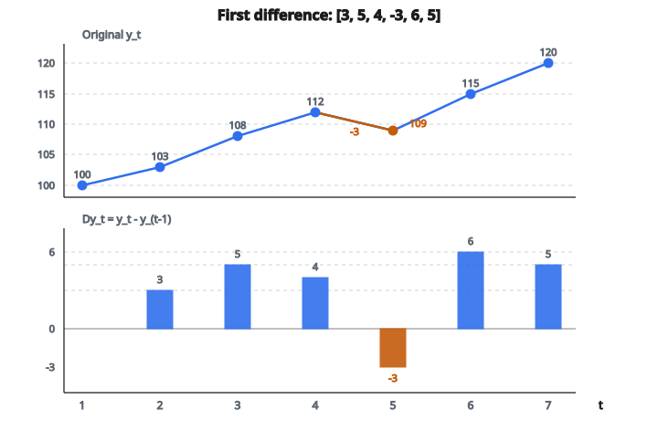

# Differencing

## Differencing là gì

**Differencing** biến đổi một time series bằng cách tính thay đổi giữa các quan sát liên tiếp. Nó loại trend và làm dữ liệu không dừng (non-stationary) trở nên dừng (stationary).

$$
\nabla y_t = y_t - y_{t-1}
$$

Sai phân bậc nhất tại thời điểm $t$ là giá trị hiện tại trừ giá trị trước đó.

## Công thức chính

Với time series $y_1, y_2, \ldots, y_T$:

$$
\nabla y_t = y_t - y_{t-1}
$$

**Kết quả:** Chuỗi mới có $T-1$ giá trị.

**Differencing lệch $d$ (lag-$d$):**

$$
\nabla_d y_t = y_t - y_{t-d}
$$

**Phổ biến:** $d=1$ cho dữ liệu không mùa vụ, $d=12$ cho dữ liệu tháng có mùa vụ theo năm.

## Ví dụ số

**Chuỗi gốc:** [100, 103, 108, 112, 109, 115, 120]

**Sai phân bậc nhất:**

* $\nabla y_2 = 103 - 100 = 3$
* $\nabla y_3 = 108 - 103 = 5$
* $\nabla y_4 = 112 - 108 = 4$
* $\nabla y_5 = 109 - 112 = -3$
* $\nabla y_6 = 115 - 109 = 6$
* $\nabla y_7 = 120 - 115 = 5$

**Kết quả:** [3, 5, 4, -3, 6, 5]

**Cách đọc:** Thay đổi từ kỳ này sang kỳ kia. Giá trị dương là tăng, giá trị âm là giảm.

::: {#fig-174-differencing fig-cap="Sai phân bậc nhất: [100, 103, 108, 112, 109, 115, 120] thành [3, 5, 4, -3, 6, 5], với $\nabla y_5 = 109-112 = -3$." fig-alt="Chuoi goc [100, 103, 108, 112, 109, 115, 120] va sai phan bac nhat [3, 5, 4, -3, 6, 5]; diem am duy nhat la 109 - 112 = -3."}
{fig-align="center"}
:::

## Vì sao cần differencing

**Yêu cầu stationarity:**

Hầu hết mô hình time series (ARIMA, VAR) đòi hỏi dữ liệu dừng.

**Dấu hiệu không dừng:**

* Trend mạnh
* Trung bình đổi theo thời gian
* Autocorrelation giảm chậm

**Cách xử lý bằng differencing:**

Loại trend tất định và random walk. Đổi chuỗi không dừng thành chuỗi dừng.

## Bậc differencing

**Differencing bậc một ($d=1$):**

$$
\nabla y_t = y_t - y_{t-1}
$$

Loại trend tuyến tính.

**Differencing bậc hai ($d=2$):**

$$
\begin{aligned}
\nabla^2 y_t &= \nabla(\nabla y_t) \\
&= (y_t - y_{t-1}) - (y_{t-1} - y_{t-2}) \\
&= y_t - 2y_{t-1} + y_{t-2}
\end{aligned}
$$

Loại trend bậc hai.

**Bậc cao hơn hiếm:** Hầu hết dữ liệu thực tế cần tối đa differencing bậc hai.

**Over-differencing:** Có thể tạo autocorrelation giả. Dùng bậc nhỏ nhất cần thiết.

## Ví dụ sai phân bậc hai

**Gốc:** [10, 12, 16, 22, 30, 40]

**Sai phân bậc nhất:** [2, 4, 6, 8, 10]

Vẫn còn trend tăng (gia tốc).

**Sai phân bậc hai:**

* $(4-2) = 2$
* $(6-4) = 2$
* $(8-6) = 2$
* $(10-8) = 2$

**Kết quả:** [2, 2, 2, 2]

Lúc này dừng (hằng số).

**Chuỗi gốc có trend bậc hai:** $y_t \approx t^2$

## Differencing mùa vụ

Với chu kỳ mùa vụ $s$:

$$
\nabla_s y_t = y_t - y_{t-s}
$$

**Dữ liệu tháng ($s=12$):**

So từng tháng với cùng tháng năm trước.

**Ví dụ:** Tháng 1 năm 2024 trừ tháng 1 năm 2023.

**Kết quả:** Loại pattern mùa vụ theo năm.

## Differencing kết hợp

Với dữ liệu vừa có trend vừa có mùa vụ:

**Bước 1:** Differencing mùa vụ:

$$
z_t = y_t - y_{t-s}
$$

**Bước 2:** Differencing bậc một:

$$
w_t = z_t - z_{t-1}
$$

**Dạng kết hợp:**

$$
w_t = (y_t - y_{t-s}) - (y_{t-1} - y_{t-s-1})
$$

**Ký hiệu ARIMA:** $(p, d, q)(P, D, Q)_s$

$d$: số lần differencing không mùa vụ

$D$: số lần differencing mùa vụ

## Unit root và tích phân

**Quá trình unit root:**

$$
y_t = y_{t-1} + \epsilon_t
$$

Random walk. Không dừng.

**Sai phân bậc nhất:**

$$
\nabla y_t = y_t - y_{t-1} = \epsilon_t
$$

White noise. Dừng.

**Bậc tích phân:** Nếu cần $d$ lần differencing để dừng, chuỗi là $I(d)$ (integrated of order $d$).

**Ví dụ:** $I(1)$ nghĩa là sai phân bậc nhất dừng.

## Kiểm định stationarity

**Kiểm định Augmented Dickey-Fuller (ADF):**

Kiểm định giả thuyết không là unit root (không dừng).

**Quy trình:**

1. Chạy ADF trên chuỗi gốc
2. Nếu không dừng (không bác bỏ giả thuyết không), áp differencing
3. Kiểm định chuỗi đã khác
4. Lặp đến khi dừng

**Kiểm định KPSS:**

Giả thuyết không là stationarity (ngược với ADF).

**Dùng cả hai:** Xác nhận stationarity từ nhiều góc.

## Mất thông tin

**Differencing loại thông tin mức (level):**

Không khôi phục được giá trị gốc nếu thiếu điều kiện ban đầu.

**Ví dụ:** Cho sai phân [2, 3, -1, 4] và $y_1 = 10$:

* $y_2 = 10 + 2 = 12$
* $y_3 = 12 + 3 = 15$
* $y_4 = 15 - 1 = 14$
* $y_5 = 14 + 4 = 18$

Thiếu $y_1$ thì không dựng lại được chuỗi.

**Forecasting:** Khi dự báo chuỗi đã khác, tích phân ngược để được forecast theo mức.

## Differencing phân số

Với quá trình nhớ dài (long-memory):

$$
\nabla^d y_t = \sum_{k=0}^{\infty} \binom{d}{k} (-1)^k y_{t-k}
$$

với $d$ có thể không nguyên (ví dụ $d=0.5$).

**Ứng dụng:** Loại không dừng nhưng vẫn giữ phụ thuộc khoảng dài.

**Lĩnh vực:** Dữ liệu tài chính có long memory.

## Differencing so với detrending

**Differencing:**

$$
\nabla y_t = y_t - y_{t-1}
$$

Phi tham số. Loại trend ngẫu nhiên (stochastic).

**Detrending tuyến tính:**

$$
\tilde{y}_t = y_t - (\hat{\beta}_0 + \hat{\beta}_1 t)
$$

Có tham số. Loại trend tất định.

**Khi nào dùng cái nào:**

* Random walk: Dùng differencing
* Trend tất định: Dùng detrending
* Không chắc: Differencing an toàn hơn (tổng quát hơn)

## Invertibility

**Phép thuận (differencing):**

$$
\nabla y_t = y_t - y_{t-1}
$$

**Phép ngược (tích phân / tổng tích lũy):**

$$
y_t = y_1 + \sum_{i=2}^{t} \nabla y_i
$$

**Quan trọng cho forecasting:** Mô hình hóa chuỗi đã khác, rồi tích phân forecast về thang gốc.

## Ảnh hưởng tới autocorrelation

**Trước differencing:**

Chuỗi không dừng: ACF giảm chậm.

**Sau differencing:**

Chuỗi dừng: ACF giảm nhanh hoặc bằng không.

**Ví dụ:** Random walk có $\rho_k \approx 1$ với mọi $k$. Sau differencing, $\rho_k \approx 0$ với mọi $k > 0$.

**Over-differencing:** Tạo autocorrelation âm tại lag 1.

## Differencing trong mô hình ARIMA

**ARIMA($p$, $d$, $q$):**

* $p$: bậc AR
* $d$: bậc differencing
* $q$: bậc MA

**Quy trình mô hình:**

1. Differencing $d$ lần để đạt stationarity
2. Khớp ARMA($p$, $q$) trên chuỗi đã khác
3. Tích phân forecast về thang gốc

**Mô hình thường gặp:**

* ARIMA(0,1,0): Random walk
* ARIMA(0,1,1): Exponential smoothing
* ARIMA(1,1,0): AR(1) đã khác

## Differencing logarit

**Biến đổi log rồi differencing:**

$$
\begin{aligned}
\nabla \ln y_t &= \ln y_t - \ln y_{t-1} \\
&= \ln\left(\frac{y_t}{y_{t-1}}\right)
\end{aligned}
$$

**Cách đọc:** Xấp xỉ phần trăm thay đổi.

**Ưu điểm:** Ổn định phương sai cho chuỗi tăng theo hàm mũ.

**Ví dụ:** Giá cổ phiếu. Sai phân log là lợi suất (return).

## Differencing đa biến

Với time series vector $\mathbf{y}_t = [y_{1,t}, y_{2,t}, \ldots, y_{n,t}]^T$:

$$
\nabla \mathbf{y}_t = \mathbf{y}_t - \mathbf{y}_{t-1}
$$

**Mỗi chuỗi được khác theo từng phần tử.**

**Cointegration:** Nếu các chuỗi đồng liên kết, differencing phá quan hệ dài hạn. Dùng mô hình hiệu chỉnh sai số (error correction) thay thế.

## Các bước differencing thực tế

**Bước 1:** Vẽ chuỗi và ACF.

**Bước 2:** Nếu không dừng, áp sai phân bậc nhất.

**Bước 3:** Vẽ chuỗi đã khác và ACF.

**Bước 4:** Kiểm tra stationarity:

* ACF giảm nhanh
* Trung bình không đổi
* Phương sai không đổi

**Bước 5:** Nếu vẫn không dừng, áp sai phân bậc hai.

**Bước 6:** Trong thực tế không vượt quá sai phân bậc hai.

## Tích phân forecast

**Forecast của mô hình trên chuỗi đã khác:**

$$
\hat{\nabla y}_{T+h}
$$

**Đổi sang forecast theo mức:**

$$
\hat{y}_{T+h} = \hat{y}_{T+h-1} + \hat{\nabla y}_{T+h}
$$

**Khởi từ giá trị quan sát cuối:**

$$
\begin{aligned}
\hat{y}_{T+1} &= y_T + \hat{\nabla y}_{T+1} \\
\hat{y}_{T+2} &= \hat{y}_{T+1} + \hat{\nabla y}_{T+2}
\end{aligned}
$$

## Differencing và phương sai

**Phương sai chuỗi gốc:** $\operatorname{Var}(y_t) = \sigma_y^2$

**Phương sai sai phân bậc nhất:**

$$
\operatorname{Var}(\nabla y_t) = \operatorname{Var}(y_t - y_{t-1}) = 2\sigma_y^2(1 - \rho_1)
$$

**Với random walk ($\rho_1 = 1$):**

$$
\operatorname{Var}(\nabla y_t) = 0
$$

Chuỗi trở thành hằng (dự đoán hoàn hảo).

**Với white noise ($\rho_1 = 0$):**

$$
\operatorname{Var}(\nabla y_t) = 2\sigma_y^2
$$

Phương sai tăng.

## Loại chu kỳ kinh doanh

**Bộ lọc Hodrick-Prescott:**

Lựa chọn khác differencing để loại trend nhưng vẫn giữ chu kỳ.

$$
\min_{\tau} \sum_{t=1}^{T} (y_t - \tau_t)^2 + \lambda \sum_{t=2}^{T-1} [(\tau_{t+1} - \tau_t) - (\tau_t - \tau_{t-1})]^2
$$

**Differencing đơn giản hơn nhưng kém linh hoạt.**

**Bộ lọc HP cho phép chỉnh độ mượt qua $\lambda$.**

## Mean reversion sau differencing

**Chuỗi không dừng:** Có thể không hồi về trung bình.

**Chuỗi đã khác:** Nên dao động quanh không.

**Kiểm tra:** Trung bình của chuỗi đã khác nên gần không (hoặc một hằng nhỏ).

**Hạng drift:** Nếu chuỗi đã khác có trung bình khác không, chuỗi gốc có trend tuyến tính:

$$
y_t = \beta_0 + \beta_1 t + \epsilon_t
$$

$$
E[\nabla y_t] = \beta_1
$$

## Hồi quy giả (spurious regression)

**Vấn đề:** Hồi quy một chuỗi không dừng lên một chuỗi không dừng khác cho kết quả có ý nghĩa dù chúng không liên quan.

**Cách xử lý:** Differencing cả hai chuỗi trước khi hồi quy.

**Ngoại lệ:** Cointegration. Nếu các chuỗi chia sẻ trend chung, hồi quy trên mức vẫn hợp lệ.

**Kiểm định:** Xem residual có dừng không. Nếu dừng thì có cointegration.

## Code
```python
def differencing(series, order):
    """
    Apply d-th order differencing to the time series.
    """
    result = list(series)
    for _ in range(order):
        result = [result[i] - result[i - 1] for i in range(1, len(result))]
    return result

```

<!-- auto-self-check -->

::: {.callout-note}
## Kiểm tra nhanh
<details>
<summary>Ý chính của bài «Differencing» là gì?</summary>
**Differencing** biến đổi một time series bằng cách tính thay đổi giữa các quan sát liên tiếp.
</details>
<details>
<summary>Công thức / quan hệ cốt lõi trong bài là gì?</summary>
$$\nabla y_t = y_t - y_{t-1}$$
</details>
:::
