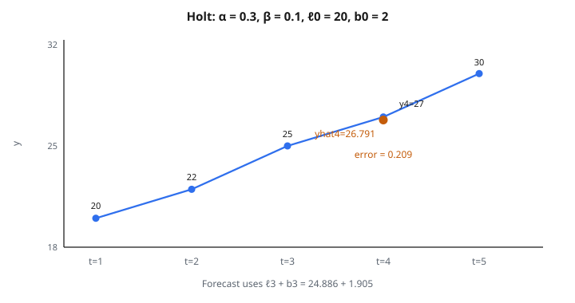

# Double Exponential Smoothing

## Double exponential smoothing là gì

**Double exponential smoothing** (phương pháp tuyến tính của Holt) mở rộng simple exponential smoothing để xử lý dữ liệu có trend. Nó giữ hai thành phần: level và trend.

$$
\ell_t = \alpha y_t + (1-\alpha)(\ell_{t-1} + b_{t-1})
$$

$$
b_t = \beta(\ell_t - \ell_{t-1}) + (1-\beta)b_{t-1}
$$

với $\ell_t$ là level, $b_t$ là trend, $\alpha$ là tham số làm mượt level, và $\beta$ là tham số làm mượt trend.

## Công thức chính

**Phương trình level:**

$$
\ell_t = \alpha y_t + (1-\alpha)(\ell_{t-1} + b_{t-1})
$$

Cập nhật level ước lượng, kết hợp giá trị quan sát với level dự báo từ kỳ trước.

**Phương trình trend:**

$$
b_t = \beta(\ell_t - \ell_{t-1}) + (1-\beta)b_{t-1}
$$

Cập nhật trend ước lượng, kết hợp độ dốc hiện tại với ước lượng trend kỳ trước.

**Dự báo:**

$$
\hat{y}_{t+h} = \ell_t + h \cdot b_t
$$

Level cộng trend ngoại suy $h$ bước.

## Tham số

**Làm mượt level ($\alpha$):**

Khoảng: $0 < \alpha < 1$

* $\alpha$ cao: Nhạy với quan sát gần đây
* $\alpha$ thấp: Mượt hơn, bị lịch sử kéo mạnh hơn

**Làm mượt trend ($\beta$):**

Khoảng: $0 < \beta < 1$

* $\beta$ cao: Trend thích nghi nhanh
* $\beta$ thấp: Trend đổi chậm

**Giá trị điển hình:** $\alpha \in [0.1, 0.3]$, $\beta \in [0.05, 0.2]$

**Tối ưu:** Chọn $\alpha$ và $\beta$ để cực tiểu sai số dự báo (MSE, MAE).

## Khởi tạo

**Level ($\ell_0$):**

Phổ biến: $\ell_0 = y_1$

Tốt hơn: Trung bình vài quan sát đầu.

**Trend ($b_0$):**

Đơn giản: $b_0 = y_2 - y_1$

Tốt hơn: Độ dốc linear regression trên vài quan sát đầu.

**Ví dụ:** Với 4 giá trị đầu $[10, 12, 15, 17]$:

$$
\ell_0 = 10
$$

$$
b_0 = \frac{17-10}{3} = 2.33
$$

## Ví dụ số

**Dữ liệu:** $[20, 22, 25, 27, 30]$

**Tham số:** $\alpha = 0.3$, $\beta = 0.1$

**Khởi tạo:** $\ell_0 = 20$, $b_0 = 2$

**Kỳ 1 ($t=1$, $y_1=20$):**

$$
\ell_1 = 0.3(20) + 0.7(20 + 2) = 6 + 15.4 = 21.4
$$

$$
b_1 = 0.1(21.4 - 20) + 0.9(2) = 0.14 + 1.8 = 1.94
$$

**Kỳ 2 ($t=2$, $y_2=22$):**

$$
\ell_2 = 0.3(22) + 0.7(21.4 + 1.94) = 6.6 + 16.338 = 22.938
$$

$$
b_2 = 0.1(22.938 - 21.4) + 0.9(1.94) = 0.1538 + 1.746 = 1.900
$$

**Kỳ 3 ($t=3$, $y_3=25$):**

$$
\ell_3 = 0.3(25) + 0.7(22.938 + 1.900) = 7.5 + 17.386 = 24.886
$$

$$
b_3 = 0.1(24.886 - 22.938) + 0.9(1.900) = 0.1948 + 1.71 = 1.905
$$

**Dự báo cho $t=4$:**

$$
\hat{y}_4 = \ell_3 + 1 \cdot b_3 = 24.886 + 1.905 = 26.791
$$

**Thực tế $y_4 = 27$, sai số $= 0.209$**

::: {#fig-189-holt fig-cap="Holt với α = 0.3, β = 0.1, ℓ0 = 20, b0 = 2 cho ŷ4 = ℓ3 + b3 = 26.791. Thực tế y4 = 27, sai số 0.209." fig-alt="Chuỗi 20, 22, 25, 27, 30 và dự báo Holt ŷ4 = 26.791 sát y4 = 27; sai số 0.209."}
{fig-align="center"}
:::

## Diễn giải các thành phần

**Level ($\ell_t$):**

Giá trị nền hiện tại của chuỗi.

**Trend ($b_t$):**

Tốc độ đổi mỗi kỳ. Dương khi tăng, âm khi giảm.

**Dự báo kết hợp:**

$$
\hat{y}_{t+h} = \ell_t + h \cdot b_t
$$

Ngoại suy tuyến tính từ level hiện tại với trend hiện tại.

## Dự báo nhiều bước

**Một bước:**

$$
\hat{y}_{t+1} = \ell_t + b_t
$$

**Hai bước:**

$$
\hat{y}_{t+2} = \ell_t + 2b_t
$$

**$h$ bước:**

$$
\hat{y}_{t+h} = \ell_t + hb_t
$$

**Hàm dự báo tuyến tính:** Đường thẳng độ dốc $b_t$.

**Hạn chế:** Giả định trend không đổi. Có thể ước cao ở horizon xa.

## Damped trend

**Vấn đề:** Dự báo trend tuyến tính thường vượt quá.

**Cách xử lý:** Thêm tham số damping $\phi$:

$$
\hat{y}_{t+h} = \ell_t + (\phi + \phi^2 + \dots + \phi^h)b_t
$$

với $0 < \phi < 1$.

**Dạng gọn:**

$$
\hat{y}_{t+h} = \ell_t + \frac{\phi(1-\phi^h)}{1-\phi}b_t
$$

**Hiệu ứng:** Trend làm phẳng khi horizon tăng. Dự báo thận trọng hơn.

**Khi $\phi=1$:** Thu về double exponential smoothing chuẩn.

## So với simple exponential smoothing

**Simple (SES):**

$$
\ell_t = \alpha y_t + (1-\alpha)\ell_{t-1}
$$

Dự báo phẳng: $\hat{y}_{t+h} = \ell_t$

**Double (DES):**

Thêm thành phần trend. Dự báo có độ dốc.

**Dùng simple khi:** Không có trend.

**Dùng double khi:** Có trend tăng hoặc giảm rõ.

**Kiểm tra:** Nếu trend có ý nghĩa, DES sẽ hơn SES.

## Liên hệ với ARIMA

Double exponential smoothing tương đương ARIMA(0,2,2):

**Hàm dự báo DES:**

$$
\hat{y}_{t+h} = y_t + h \cdot \hat{b}_t
$$

**Hàm dự báo ARIMA(0,2,2):**

Cùng dạng sau khi tham số hóa phù hợp.

**Ưu điểm ARIMA:** Khung thống kê (khoảng tin cậy, chẩn đoán).

**Ưu điểm DES:** Diễn giải và triển khai đơn giản hơn.

## Adaptive smoothing

**Vấn đề:** $\alpha$ và $\beta$ cố định có thể không thích nghi khi động lực đổi.

**Phương pháp adaptive:**

Chỉnh tham số theo sai số dự báo gần đây.

**Ví dụ:** Tăng $\alpha$ khi sai số lớn, giảm khi sai số nhỏ.

**Phương pháp Trigg–Leach:**

$$
\alpha_t = \left\lvert \frac{\text{sai số làm mượt}}{\text{MAD}} \right\rvert
$$

**Đánh đổi:** Phức tạp hơn đổi lấy khả năng thích nghi tốt hơn.

## Metric sai số dự báo

**Mean Absolute Error (MAE):**

$$
\text{MAE} = \frac{1}{T} \sum_{t=1}^{T} \lvert y_t - \hat{y}_t\rvert
$$

**Mean Squared Error (MSE):**

$$
\text{MSE} = \frac{1}{T} \sum_{t=1}^{T} (y_t - \hat{y}_t)^2
$$

**Root Mean Squared Error (RMSE):**

$$
\text{RMSE} = \sqrt{\text{MSE}}
$$

**Tối ưu:** Chọn $\alpha$ và $\beta$ để cực tiểu metric đã chọn.

## Tối ưu tham số

**Grid search:**

Thử mọi cặp $\alpha$ và $\beta$ theo bước (ví dụ 0.05).

Đánh giá sai số dự báo cho mỗi cặp.

Chọn tham số có sai số thấp nhất.

**Tối ưu số:**

Dùng phương pháp dựa trên gradient (Nelder–Mead, L-BFGS).

Cực tiểu trực tiếp hàm sai số.

**Cross-validation:**

Chia dữ liệu thành tập huấn luyện và validation.

Tối ưu trên tập huấn luyện, đánh giá trên validation.

Tránh overfitting mẫu cụ thể.

## Xử lý dịch level

**Vấn đề:** Đổi level đột ngột và bền.

**Ví dụ:** Giá tăng sau thay đổi chính sách.

**Phản ứng của DES:**

Level $\ell_t$ thích nghi dần.

Trend $b_t$ tăng đột rồi trở về baseline.

**Cách tốt hơn:** Phân tích can thiệp hoặc mô hình đứt cấu trúc.

**DES robust:** Dùng ước lượng robust (median thay mean) để giảm ảnh hưởng outlier.

## Mở rộng seasonal

**Triple exponential smoothing (Holt–Winters):**

Thêm thành phần seasonal vào level và trend.

**Seasonal cộng:**

$$
\hat{y}_{t+h} = \ell_t + hb_t + s_{t+h-m}
$$

**Seasonal nhân:**

$$
\hat{y}_{t+h} = (\ell_t + hb_t)s_{t+h-m}
$$

với $s_t$ là thành phần seasonal và $m$ là chu kỳ seasonal.

## Khoảng tin cậy

**Khoảng dự báo cho DES:**

$$
\hat{y}_{t+h} \pm z_{\alpha/2} \sigma \sqrt{h}
$$

với $\sigma$ là độ lệch chuẩn ước lượng của sai số một bước.

**Hạn chế:** Giả định phương sai không đổi và sai số phân phối chuẩn.

**Cách tốt hơn:** Dùng dạng state space để có khoảng dự báo đúng.

## Biểu diễn state space

**Phương trình state:**

$$
\begin{aligned}
\begin{bmatrix} \ell_t \\ b_t \end{bmatrix}
&= \begin{bmatrix} 1 & 1 \\ 0 & 1 \end{bmatrix}
\begin{bmatrix} \ell_{t-1} \\ b_{t-1} \end{bmatrix} + \begin{bmatrix} \alpha \\ \beta \end{bmatrix} e_t
\end{aligned}
$$

**Phương trình quan sát:**

$$
y_t = \begin{bmatrix} 1 & 0 \end{bmatrix} \begin{bmatrix} \ell_t \\ b_t \end{bmatrix} + e_t
$$

**Ưu điểm:** Có thể dùng Kalman filter. Ước lượng hợp lý cực đại. Khoảng dự báo chặt.

## Xử lý dự báo âm

**Vấn đề:** DES có thể cho dự báo âm nếu trend âm mạnh.

**Hệ quả:** Không chấp nhận được với biến luôn dương (giá, sản lượng).

**Cách xử lý:**

1. Biến đổi log: Mô hình $\ln(y_t)$, mũ hóa dự báo
2. Cắt dự báo: $\hat{y}_{t+h} = \max(\hat{y}_{t+h}, 0)$
3. Dùng phương pháp nhân thay vì cộng

## Hiệu quả tính toán

**Chi phí mỗi quan sát:** $O(1)$

Cập nhật level và trend bằng phép tính số học đơn giản.

**Chi phí tổng:** $O(T)$ với chuỗi độ dài $T$.

**So sánh:**

* ARIMA: $O(T^3)$ khi ước lượng
* Regression: $O(T^2)$
* Neural network: $O(T \cdot p)$ mỗi epoch

**Ưu điểm:** DES rất nhanh. Phù hợp ứng dụng thời gian thực và dự báo quy mô lớn.

## Bias và tính nhất quán

**Bias:** Dự báo DES có thể lệch nếu mô hình thật khác dạng giả định.

**Tính nhất quán:** Khi $T \to \infty$, ước lượng hội tụ về giá trị tối ưu nếu đặc tả đúng.

**Thực tế:** Thường dùng làm baseline nhanh. Mô hình phức tạp hơn được so với mốc DES.

## Phát hiện đảo trend

**Theo dõi $b_t$:**

Bám dấu và độ lớn của thành phần trend.

**Đổi dấu:** $b_t$ chuyển từ dương sang âm báo đảo chiều tiềm năng.

**Độ lớn giảm:** $\lvert b_t\rvert$ co lại cho thấy trend yếu đi.

**Ứng dụng:** Cảnh báo sớm khi trend đổi trên metric kinh doanh.

## Cửa sổ rolling so với expanding

**Cửa sổ expanding:**

Dùng toàn bộ dữ liệu sẵn có cho mỗi lần dự báo.

Cập nhật nhập cả lịch sử.

**Cửa sổ rolling:**

Chỉ dùng $w$ quan sát gần nhất.

$$
\ell_t = \alpha y_t + (1-\alpha)(\ell_{t-1} + b_{t-1})
$$

chỉ tính trên $w$ điểm cuối.

**Đánh đổi:** Rolling thích nghi đổi regime; expanding dùng nhiều thông tin hơn.

## Phân tích residual

**Sai số một bước:**

$$
e_t = y_t - \hat{y}_t = y_t - (\ell_{t-1} + b_{t-1})
$$

**Chẩn đoán:**

1. Vẽ residual theo thời gian (nên ngẫu nhiên)
2. ACF của residual (không nên có autocorrelation)
3. Histogram residual (nên gần chuẩn)
4. Kiểm định heteroscedasticity (phương sai nên không đổi)

**Khớp tốt:** Residual là white noise.

**Khớp kém:** Mẫu trên residual báo mô hình chưa đủ.

## Xử lý outlier

**Tác động:** Outlier kéo mạnh ước lượng level và trend.

**Phát hiện:** Tìm $\lvert e_t\rvert > k \sigma$ với $k=3$ (quy tắc 3-sigma).

**Xử lý:**

1. Thay outlier bằng dự báo: $y_t^{\ast} = \hat{y}_t$
2. Làm mượt robust: Thay mean bằng median trong phương trình
3. Winsorize: Cắt giá trị cực đoan

**Đánh đổi:** Sửa quá tay mất tín hiệu thật. Sửa thiếu thì nhiễm nhiễu.

## So với linear regression

**Linear regression theo thời gian:**

$$
\hat{y}_t = \hat{\beta}_0 + \hat{\beta}_1 t
$$

Độ dốc cố định suốt chuỗi.

**Double exponential smoothing:**

Độ dốc $b_t$ tiến hóa theo thời gian.

**Ưu điểm DES:** Thích nghi khi trend đổi. Bắt động lực tiến hóa.

**Ưu điểm regression:** Đơn giản, dễ diễn giải, cho khoảng tin cậy trực tiếp.

## Ứng dụng thực tế

**Dự báo doanh số:**

Bám level bán hàng nền và tốc độ tăng.

**Quản lý tồn kho:**

Dự đoán cầu để tối ưu mức tồn.

**Metric tài chính:**

Trend doanh thu, chi phí, thu hút khách.

**Web analytics:**

Tăng trưởng traffic, trend conversion rate.

**Nhu cầu năng lượng:**

Dự báo tải với thành phần trend.

## Code
```python
def double_exponential_smoothing(series, alpha, beta):
    """
    Apply Holt's linear trend method and return the level values.
    """
    level = series[0]
    trend = series[1] - series[0]
    result = [level]
    for t in range(1, len(series)):
        new_level = alpha * series[t] + (1 - alpha) * (level + trend)
        new_trend = beta * (new_level - level) + (1 - beta) * trend
        level = new_level
        trend = new_trend
        result.append(level)
    return result

```
