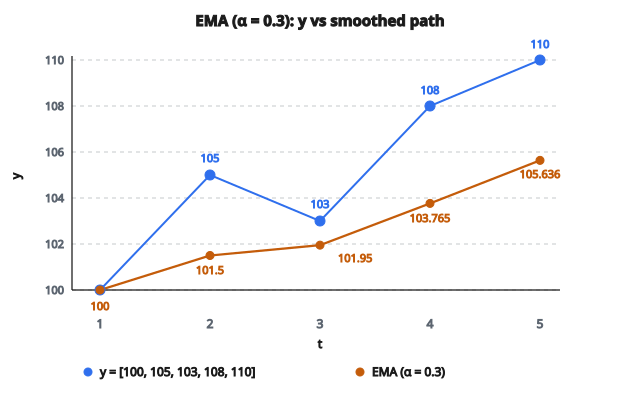

# Exponential Moving Average

## EMA là gì?

**Exponential moving average (EMA)** là trung bình có trọng số, gán trọng số lớn hơn cho các quan sát gần đây. Trọng số giảm theo hàm mũ khi quan sát càng cũ.

$$
\text{EMA}_t = \alpha y_t + (1-\alpha) \text{EMA}_{t-1}
$$

với $0 < \alpha < 1$ là smoothing parameter.

## Công thức chính

Với chuỗi thời gian $y_1, y_2, \ldots, y_T$:

$$
\text{EMA}_t = \alpha y_t + (1-\alpha) \text{EMA}_{t-1}
$$

**Dạng đệ quy:** EMA hiện tại kết hợp quan sát hiện tại với EMA trước đó.

**Dạng khai triển:**

$$
\text{EMA}_t = \alpha \sum_{i=0}^{t-1} (1-\alpha)^i y_{t-i}
$$

**Trọng số trên quan sát cách đây $i$ kỳ:** $\alpha(1-\alpha)^i$

Trọng số suy giảm theo hàm mũ theo tuổi của quan sát.

## Tham số smoothing

**Alpha ($\alpha$):**

Điều khiển mức đáp ứng với dữ liệu mới.

**$\alpha$ cao (gần $1$):**

* Trọng số lớn hơn trên quan sát gần đây
* Thích nghi nhanh với thay đổi
* Ít làm mượt hơn, nhiều nhiễu hơn

**$\alpha$ thấp (gần $0$):**

* Trọng số lớn hơn trên quan sát lịch sử
* Thích nghi chậm, đường cong mượt hơn
* Làm mượt nhiều hơn, ít nhiễu hơn

**Khoảng điển hình:** $0.1 \leq \alpha \leq 0.3$

## Tương đương alpha và window size

EMA với tham số $\alpha$ xấp xỉ SMA với cửa sổ:

$$
w \approx \frac{2}{\alpha} - 1
$$

**Ví dụ:**

* $\alpha = 0.1$: $w \approx 19$
* $\alpha = 0.2$: $w \approx 9$
* $\alpha = 0.5$: $w \approx 3$

**Diễn giải:** $\alpha = 0.2$ cho mức smoothing tương tự SMA 9 kỳ.

## Khởi tạo

**Giá trị đầu ($\text{EMA}_1$):**

Phổ biến: $\text{EMA}_1 = y_1$

Phương án khác: $\text{EMA}_1 = \text{trung bình vài quan sát đầu}$

**Tác động:** Lựa chọn ban đầu quan trọng ở vài kỳ đầu, sau đó ảnh hưởng tắt dần theo hàm mũ.

**Sau $n$ kỳ:** Trọng số trên giá trị khởi tạo là $(1-\alpha)^n$

**Ví dụ:** Với $\alpha=0.2$, sau 20 kỳ trọng số là $(0.8)^{20} = 0.0115$ (1.15%).

## Ví dụ số

**Dữ liệu:** $[100, 105, 103, 108, 110]$

**Tham số:** $\alpha = 0.3$

**Khởi tạo:** $\text{EMA}_1 = 100$

**Kỳ 2:**

$$
\text{EMA}_2 = 0.3(105) + 0.7(100) = 31.5 + 70 = 101.5
$$

**Kỳ 3:**

$$
\text{EMA}_3 = 0.3(103) + 0.7(101.5) = 30.9 + 71.05 = 101.95
$$

**Kỳ 4:**

$$
\text{EMA}_4 = 0.3(108) + 0.7(101.95) = 32.4 + 71.365 = 103.765
$$

**Kỳ 5:**

$$
\text{EMA}_5 = 0.3(110) + 0.7(103.765) = 33 + 72.636 = 105.636
$$

**Kết quả:** $[100, 101.5, 101.95, 103.765, 105.636]$

::: {#fig-163-ema fig-cap="EMA_t = 0.3 y_t + 0.7 EMA_{t-1}, khởi tạo EMA_1 = 100. Các giá trị [100, 101.5, 101.95, 103.765, 105.636] khớp ví dụ số." fig-alt="Chuỗi y = [100, 105, 103, 108, 110] và EMA với alpha = 0.3: [100, 101.5, 101.95, 103.765, 105.636] trên cùng trục thời gian t = 1..5."}
{fig-align="center"}
:::

## Phân bố trọng số

**Trọng số trên quan sát hiện tại:** $\alpha$

**Trọng số trên quan sát 1 kỳ trước:** $\alpha(1-\alpha)$

**Trọng số trên quan sát 2 kỳ trước:** $\alpha(1-\alpha)^2$

**Trọng số trên quan sát $k$ kỳ trước:** $\alpha(1-\alpha)^k$

**Tổng mọi trọng số:**

$$
\alpha \sum_{k=0}^{\infty} (1-\alpha)^k = \alpha \cdot \frac{1}{1-(1-\alpha)} = 1
$$

Trọng số cộng thành 1 (trung bình đúng nghĩa).

## So sánh với Simple Moving Average

**Trọng số SMA:** $\frac{1}{w}$ cho $w$ quan sát gần nhất, 0 cho các quan sát cũ hơn.

**Trọng số EMA:** Suy giảm theo hàm mũ, không bao giờ đúng bằng không.

**SMA:** Hàm bước trên trọng số.

**EMA:** Suy giảm mượt trên trọng số.

**Ưu điểm SMA:** Diễn giải rõ (trung bình $w$ giá trị gần nhất).

**Ưu điểm EMA:** Toàn bộ lịch sử được xét đến, trọng số liên tục, tính nhanh hơn.

## Hiệu quả tính toán

**SMA:** Cần lưu $w$ giá trị gần nhất. $O(w)$ mỗi lần cập nhật.

**EMA:** Chỉ cần EMA trước đó. $O(1)$ mỗi lần cập nhật.

**Bộ nhớ:** EMA dùng bộ nhớ hằng số (chỉ giá trị trước), SMA cần $O(w)$ bộ nhớ.

**Hệ thống thời gian thực:** EMA phù hợp hơn vì footprint bộ nhớ thấp và cập nhật nhanh.

## Nhiều đường EMA

**EMA nhanh và chậm:**

* Nhanh: Cửa sổ nhỏ ($\alpha$ cao), ví dụ $\alpha = 0.2$ (tương đương 10 kỳ)
* Chậm: Cửa sổ lớn ($\alpha$ thấp), ví dụ $\alpha = 0.05$ (tương đương 40 kỳ)

**Golden cross:** EMA nhanh cắt lên trên EMA chậm (tín hiệu bullish).

**Death cross:** EMA nhanh cắt xuống dưới EMA chậm (tín hiệu bearish).

**Ứng dụng:** Chiến lược giao dịch, xác nhận trend.

## Chỉ báo MACD

**Moving Average Convergence Divergence:**

$$
\text{MACD} = \text{EMA}_{12} - \text{EMA}_{26}
$$

**Đường signal:**

$$
\text{Signal} = \text{EMA}_9(\text{MACD})
$$

**Histogram:**

$$
\text{Histogram} = \text{MACD} - \text{Signal}
$$

**Diễn giải:**

* MACD cắt lên trên signal: tín hiệu mua
* MACD cắt xuống dưới signal: tín hiệu bán
* Histogram thể hiện độ mạnh của momentum

## Tính chất lag

**Lag của EMA:**

$$
\text{Lag} \approx \frac{1-\alpha}{\alpha}
$$

**Ví dụ:** $\alpha = 0.2$ cho lag $\frac{0.8}{0.2} = 4$ kỳ.

**So với lag SMA:** $\frac{w-1}{2}$

Với SMA $w=9$: lag = 4 kỳ (giống EMA $\alpha=0.2$).

**Hệ quả:** EMA và SMA tương đương có đặc trưng lag tương tự.

## Dự báo bằng EMA

**Dự báo một bước:**

$$
\hat{y}_{t+1} = \text{EMA}_t
$$

**Dự báo nhiều bước:**

$$
\hat{y}_{t+h} = \text{EMA}_t \quad \text{với mọi } h > 0
$$

**Dự báo phẳng:** EMA giả định không có trend, dự đoán tương lai không đổi.

**Trường hợp dùng:** Phù hợp chuỗi dừng, không trend.

**Hạn chế:** Kém với dữ liệu có trend. Dùng double exponential smoothing thay thế.

## Liên hệ với Simple Exponential Smoothing

EMA tương đương simple exponential smoothing (SES):

**Dự báo SES:**

$$
\hat{y}_{t+1} = \alpha y_t + (1-\alpha)\hat{y}_t
$$

**Thay $\hat{y}_t = \text{EMA}_{t-1}$:**

$$
\hat{y}_{t+1} = \alpha y_t + (1-\alpha)\text{EMA}_{t-1} = \text{EMA}_t
$$

**Diễn giải:** EMA vừa là kỹ thuật smoothing vừa là phương pháp dự báo.

## Chọn alpha tối ưu

**Minimize forecast error:**

$$
\alpha^{\ast} = \arg\min_{\alpha} \sum_{t=1}^{T} (y_t - \text{EMA}_{t-1})^2
$$

**Grid search:** Thử $\alpha \in \{0.01, 0.02, \ldots, 0.99\}$, chọn giá trị tốt nhất.

**Dạng đóng:** Không có nghiệm giải tích. Cần tối ưu số.

**Cross-validation:** Tách dữ liệu, tối ưu trên tập huấn luyện, kiểm tra trên tập test.

**Kết quả điển hình:** $\alpha \in [0.1, 0.3]$ cho hầu hết ứng dụng.

## Adaptive exponential smoothing

**Vấn đề:** $\alpha$ cố định có thể không phù hợp mọi giai đoạn.

**Giải pháp:** Cho $\alpha$ biến thiên theo thời gian.

**Ví dụ quy tắc adaptive:**

$$
\alpha_t = \left|\frac{e_t}{y_t}\right|
$$

với $e_t = y_t - \text{EMA}_{t-1}$

**Diễn giải:** Tăng $\alpha$ khi forecast error lớn (thích nghi nhanh).

**Ràng buộc:** Chặn $\alpha_t$ trong $[\alpha_{\min}, \alpha_{\max}]$ để tránh mất ổn định.

## EMA centered vs trailing

**Trailing EMA (chuẩn):**

$$
\text{EMA}_t = \alpha y_t + (1-\alpha)\text{EMA}_{t-1}
$$

Chỉ dùng giá trị quá khứ (nhân quả / causal).

**Centered EMA:**

Áp EMA thuận và ngược, rồi lấy trung bình.

$$
\text{EMA}_{\text{centered},t} = \frac{\text{EMA}_{\text{forward},t} + \text{EMA}_{\text{backward},t}}{2}
$$

**Ưu điểm:** Không lag, smoothing tốt hơn.

**Nhược điểm:** Cần giá trị tương lai (non-causal). Không dự báo được.

**Dùng:** Phân tích lịch sử, không phải dự báo thời gian thực.

## Phương sai của EMA

Với đầu vào white noise phương sai $\sigma^2$:

$$
\operatorname{Var}(\text{EMA}_t) = \frac{\alpha}{2-\alpha} \sigma^2
$$

**$\alpha$ cao hơn:** Phương sai cao hơn (ít smoothing hơn).

**$\alpha$ thấp hơn:** Phương sai thấp hơn (smoothing nhiều hơn).

**Hệ số giảm phương sai:**

$$
\frac{\operatorname{Var}(\text{EMA}_t)}{\operatorname{Var}(y_t)} = \frac{\alpha}{2-\alpha}
$$

**Ví dụ:** $\alpha = 0.2$ giảm phương sai còn $\frac{0.2}{1.8} = 0.111$ (11.1% so với gốc).

## Tỷ số signal-to-noise

**Mục tiêu:** Giữ tín hiệu tối đa trong khi giảm nhiễu.

**Trade-off:** $\alpha$ thấp loại nhiều nhiễu hơn nhưng cũng loại tín hiệu.

**Lựa chọn tối ưu phụ thuộc vào:**

* Tần số tín hiệu
* Đặc trưng nhiễu
* Yêu cầu ứng dụng

**Dữ liệu SNR cao:** Dùng $\alpha$ cao hơn (cần smoothing ít hơn).

**Dữ liệu SNR thấp:** Dùng $\alpha$ thấp hơn (cần smoothing nhiều hơn).

## EMA để phát hiện trend

**Độ dốc EMA:**

$$
\text{Slope}_t = \text{EMA}_t - \text{EMA}_{t-1} = \alpha(y_t - \text{EMA}_{t-1})
$$

**Slope dương:** Trend tăng.

**Slope âm:** Trend giảm.

**Gia tốc:**

$$
\text{Acceleration}_t = \text{Slope}_t - \text{Slope}_{t-1}
$$

**Giám sát:** Theo dõi thay đổi slope để phát hiện đảo chiều trend sớm.

## Bollinger Bands với EMA

**Dải giữa:** EMA của giá.

**Dải trên:** $\text{EMA}_t + k \cdot \sigma_t$

**Dải dưới:** $\text{EMA}_t - k \cdot \sigma_t$

với $\sigma_t$ là rolling standard deviation và $k=2$ thường dùng.

**Diễn giải:**

* Giá gần dải trên: overbought
* Giá gần dải dưới: oversold
* Squeeze (dải hẹp): volatility thấp, có thể breakout

## Exponential weighting ở ngữ cảnh khác

**Phương sai trọng số mũ:**

$$
\sigma_t^2 = \lambda \sigma_{t-1}^2 + (1-\lambda) r_t^2
$$

Dùng trong mô hình GARCH cho volatility.

**Hiệp phương sai trọng số mũ:**

$$
\operatorname{Cov}_t(x, y) = \lambda \operatorname{Cov}_{t-1}(x, y) + (1-\lambda) x_t y_t
$$

**RiskMetrics:** $\lambda = 0.94$ cho dữ liệu ngày.

**Nguyên lý:** Dữ liệu gần đây liên quan hơn tới rủi ro hiện tại.

## Mở rộng Double Exponential Smoothing

**Vấn đề:** EMA giả định không có trend.

**Giải pháp:** Thêm thành phần trend (Holt's method).

$$
\ell_t = \alpha y_t + (1-\alpha)(\ell_{t-1} + b_{t-1})
$$

$$
b_t = \beta(\ell_t - \ell_{t-1}) + (1-\beta)b_{t-1}
$$

**Dự báo:**

$$
\hat{y}_{t+h} = \ell_t + h \cdot b_t
$$

Trend tuyến tính thay vì phẳng.

## Triple Exponential Smoothing

**Holt-Winters method:**

Thêm thành phần seasonal vào level và trend.

**Ba phương trình:**

1. Level: $\ell_t = \alpha(y_t - s_{t-m}) + (1-\alpha)(\ell_{t-1} + b_{t-1})$
2. Trend: $b_t = \beta(\ell_t - \ell_{t-1}) + (1-\beta)b_{t-1}$
3. Seasonal: $s_t = \gamma(y_t - \ell_t) + (1-\gamma)s_{t-m}$

**Dự báo:**

$$
\hat{y}_{t+h} = \ell_t + hb_t + s_{t+h-m}
$$

Xử lý được trend và seasonality.

## Phân tích residual

**Sai số dự báo một bước:**

$$
e_t = y_t - \text{EMA}_{t-1}
$$

**Fit tốt:** Residual nên là white noise.

**Đồ thị chẩn đoán:**

1. Time plot của residual (không còn mẫu)
2. ACF của residual (không autocorrelation có ý nghĩa)
3. Histogram residual (xấp xỉ chuẩn)

**Ljung-Box test:** Kiểm định autocorrelation trong residual.

**Heteroscedasticity:** Kiểm tra phương sai residual có không đổi hay không.

## EMA trong mô hình volatility

**EWMA volatility:**

$$
\sigma_t^2 = \lambda \sigma_{t-1}^2 + (1-\lambda) r_t^2
$$

với $r_t$ là return tại thời điểm $t$.

**Cách tiếp cận RiskMetrics:** $\lambda = 0.94$ cho daily returns.

**Diễn giải:** Dự báo phương sai thích nghi theo bình phương return gần đây.

**Ứng dụng:** Tính Value at Risk (VaR), quản trị rủi ro danh mục.

## Diễn giải bộ lọc

EMA là bộ lọc IIR (infinite impulse response) bậc một thời gian rời rạc:

**Hàm truyền:**

$$
H(z) = \frac{\alpha}{1 - (1-\alpha)z^{-1}}
$$

**Đáp ứng tần số:**

Bộ lọc low-pass. Làm suy giảm thành phần tần số cao (nhiễu).

**Tần số cắt:** Phụ thuộc $\alpha$. $\alpha$ cao hơn thì cutoff cao hơn (lọc ít hơn).

## Độ bền với outlier

**Vấn đề:** Một outlier ảnh hưởng EMA quá mức.

**Ví dụ:** Outlier $y_t = 1000$ khi giá trị điển hình là 100.

$$
\text{EMA}_t = 0.2(1000) + 0.8(100) = 280
$$

Bước nhảy lớn. Tồn tại vài kỳ.

**Phương án robust:**

1. Smoothing dựa trên median
2. Trimmed mean exponential smoothing
3. Winsorization trước khi áp EMA

**Trade-off:** Độ bền vs độ nhạy với thay đổi thật.

## EMA cho phân rã chuỗi thời gian

**Tách trend:**

$$
\text{Trend}_t = \text{EMA}_t
$$

**Chuỗi đã khử trend:**

$$
\text{Detrended}_t = y_t - \text{EMA}_t
$$

**Thành phần seasonal:** Áp EMA lên chuỗi đã khử trend tại lag mùa.

**Residual:**

$$
\text{Residual}_t = y_t - \text{Trend}_t - \text{Seasonal}_t
$$

**Ứng dụng:** Tách thành các thành phần để phân tích riêng.

## Lưu ý thực tế

**Chọn $\alpha$:**

* Giao dịch tài chính: $\alpha \in [0.1, 0.2]$ (làm mượt trend)
* Web analytics: $\alpha \in [0.2, 0.4]$ (đáp ứng thay đổi)
* Dữ liệu cảm biến: $\alpha \in [0.05, 0.15]$ (smoothing mạnh)

**Khởi tạo:** Dùng quan sát đầu hoặc trung bình 5–10 quan sát đầu.

**Outlier:** Cân nhắc tiền xử lý robust trước khi áp EMA.

**Trend:** Nếu dữ liệu có trend mạnh, dùng double exponential smoothing.

**Seasonality:** Nếu có mẫu mùa, dùng Holt-Winters.

## Code
```python
def exponential_moving_average(values, alpha):
    """
    Compute the exponential moving average of the given values.
    """
    ema = [values[0]]
    for i in range(1, len(values)):
        ema.append(alpha * values[i] + (1 - alpha) * ema[-1])
    return ema

```
