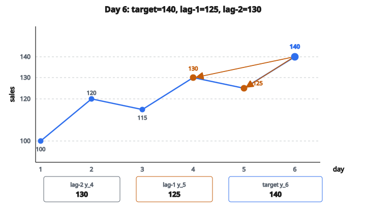

# Lag Features

## Lag features là gì

**Lag features** là các giá trị từ các bước thời gian trước đó, dùng làm feature để dự đoán bước hiện tại hoặc bước tương lai. Chúng bắt phụ thuộc thời gian bằng cách đưa thông tin lịch sử vào mô hình.

Cho time series $y_t$, một lag-$k$ feature chính là $y_{t-k}$, giá trị cách đây $k$ bước thời gian.

## Vì sao dùng lag features

**1. Bắt phụ thuộc thời gian:**

Nhiều quá trình thực tế phụ thuộc vào lịch sử gần. Giá cổ phiếu hôm nay phụ thuộc giá hôm qua.

**2. Cho phép dùng mô hình ML chuẩn:**

Lag features biến bài toán time series thành bài toán học có giám sát mà mọi thuật toán ML đều xử lý được.

**3. Bắt autocorrelation:**

Nếu time series tương quan với chính các giá trị quá khứ của nó, lag features đưa thông tin đó cho mô hình.

**4. Đơn giản và diễn giải được:**

Dễ hiểu và dễ giải thích mô hình đang dùng thông tin gì.

## Định nghĩa lag feature cơ bản

Với time series có giá trị tại các thời điểm $t = 1, 2, 3, \ldots, T$:

**Lag-1 feature:** $x_t^{(1)} = y_{t-1}$

**Lag-2 feature:** $x_t^{(2)} = y_{t-2}$

**Lag-$k$ feature:** $x_t^{(k)} = y_{t-k}$

Target thường là $y_t$ (giá trị hiện tại) hoặc $y_{t+h}$ (giá trị tương lai, $h$ bước phía trước).

## Ví dụ số

**Time series gốc:** Doanh số ngày

* Ngày 1: 100
* Ngày 2: 120
* Ngày 3: 115
* Ngày 4: 130
* Ngày 5: 125
* Ngày 6: 140

**Tạo lag-1 và lag-2:**

Ngày 3:

* Target (sales): 115
* Lag-1 (hôm qua): 120
* Lag-2 (2 ngày trước): 100

Ngày 4:

* Target (sales): 130
* Lag-1 (hôm qua): 115
* Lag-2 (2 ngày trước): 120

Ngày 5:

* Target (sales): 125
* Lag-1 (hôm qua): 130
* Lag-2 (2 ngày trước): 115

Ngày 6:

* Target (sales): 140
* Lag-1 (hôm qua): 125
* Lag-2 (2 ngày trước): 130

::: {#fig-175-lag-features fig-cap="Ngày 6: target $y_6=140$, lag-1 $y_5=125$, lag-2 $y_4=130$." fig-alt="Doanh so 6 ngay: 100, 120, 115, 130, 125, 140. Ngay 6: target = 140, lag-1 = 125, lag-2 = 130."}
{fig-align="center"}
:::

## Xử lý giá trị thiếu ở đầu chuỗi

Lag features tạo giá trị thiếu cho các quan sát đầu:

**Vấn đề:** Với lag-2, hai quan sát đầu không có lag hợp lệ.

**Cách xử lý:**

1. **Xóa hàng:** Bỏ $k$ quan sát đầu (mất dữ liệu)
2. **Điền 0:** $x_t^{(k)} = 0$ nếu $t - k < 1$
3. **Điền trung bình:** $x_t^{(k)} = \bar{y}$ nếu $t - k < 1$
4. **Forward fill:** Dùng giá trị sẵn có đầu tiên
5. **Đánh dấu missing:** Để mô hình xử lý NaN

## Chọn số lag

**Quá ít lag:**

* Bỏ lỡ pattern thời gian quan trọng
* Mô hình không bắt được phụ thuộc dài hơn

**Quá nhiều lag:**

* Curse of dimensionality
* Nhiều lag có thể không chứa thông tin
* Tăng rủi ro overfitting

**Gợi ý:**

1. Dùng autocorrelation function (ACF) để tìm lag có ý nghĩa
2. Bắt đầu với các lag khớp chu kỳ đã biết (lag-7 cho pattern tuần)
3. Dùng cross-validation để chọn số lag tối ưu

## Chọn lag bằng autocorrelation

Hàm autocorrelation (ACF) đo tương quan giữa $y_t$ và $y_{t-k}$:

$$
\rho_k = \frac{\operatorname{Cov}(y_t, y_{t-k})}{\operatorname{Var}(y_t)}
$$

**Cách đọc:**

* $|\rho_k|$ lớn gợi ý lag-$k$ có thông tin
* Giữ các lag mà ACF khác không một cách có ý nghĩa
* Pattern mùa vụ hiện spike tại các lag mùa vụ

## Lag features mùa vụ

Với dữ liệu có mùa vụ đã biết, thêm lag tại đúng chu kỳ:

**Dữ liệu ngày với pattern tuần:**

* Lag-7: Cùng thứ trong tuần trước

**Dữ liệu tháng với pattern năm:**

* Lag-12: Cùng tháng năm trước

**Dữ liệu giờ với pattern ngày:**

* Lag-24: Cùng giờ hôm qua

**Ví dụ:** Để dự đoán doanh số thứ Hai, lag-7 (thứ Hai tuần trước) có thể có ích hơn lag-1 (Chủ Nhật).

## Ví dụ nhiều lag features

**Dự đoán traffic website theo ngày:**

**Feature cho ngày $t$:**

* $y_{t-1}$: Traffic hôm qua
* $y_{t-2}$: Traffic 2 ngày trước
* $y_{t-7}$: Traffic cùng thứ tuần trước
* $y_{t-14}$: Traffic cùng thứ 2 tuần trước
* $y_{t-365}$: Traffic cùng ngày năm trước

Cách này bắt momentum ngắn hạn, pattern tuần, và mùa vụ theo năm.

## Difference features (khái niệm liên quan)

Thay vì giá trị lag thô, dùng sai phân:

**Sai phân bậc nhất:**

$$
\Delta y_t = y_t - y_{t-1}
$$

**Sai phân mùa vụ:**

$$
\Delta_s y_t = y_t - y_{t-s}
$$

**Lợi ích:**

* Loại trend
* Làm dữ liệu không dừng trở nên dừng
* Bắt thay đổi thay vì mức

## Thống kê rolling như lựa chọn thay thế

Thay vì một giá trị lag đơn, dùng thống kê trên một cửa sổ:

**Rolling mean (cửa sổ = 3):**

$$
\bar{y}_t = \frac{y_{t-1} + y_{t-2} + y_{t-3}}{3}
$$

**Rolling standard deviation:**

$$
\sigma_t = \sqrt{\frac{1}{w}\sum_{i=1}^{w}(y_{t-i} - \bar{y}_t)^2}
$$

Các đại lượng này làm mượt nhiễu nhưng vẫn bắt trend.

## Lag features cho nhiều biến

Trong time series đa biến, tạo lag cho từng biến:

**Biến:** Sales ($s_t$), Price ($p_t$), Advertising ($a_t$)

**Feature để dự đoán $s_t$:**

* Lag của sales: $s_{t-1}$, $s_{t-2}$, $\ldots$
* Lag của price: $p_{t-1}$, $p_{t-2}$, $\ldots$
* Lag của advertising: $a_{t-1}$, $a_{t-2}$, $\ldots$

Cách này cho phép mô hình hóa phụ thuộc chéo giữa các biến.

## Lead features (ngược với lag)

Lead features dùng giá trị tương lai:

$$
x_t^{(+k)} = y_{t+k}
$$

**Khi dùng:** Khi dự đoán thứ gì đó phụ thuộc vào sự kiện tương lai đã biết.

**Ví dụ:** Dự đoán nhu cầu tồn kho khi đã biết đơn hàng tương lai.

**Cảnh báo:** Chỉ dùng lead cho feature đã biết trước, không bao giờ cho biến target.

## Lag features cho phân loại

Lag features cũng dùng được với target categorical:

**Ví dụ:** Dự đoán khách hàng rời đi (churn)

**Feature:**

* Mua hàng tháng trước (lag-1)
* Mua hàng 2 tháng trước (lag-2)
* Active tuần trước (lag-1)
* Active 2 tuần trước (lag-2)

Pattern hoạt động giảm có thể dự báo churn.

## Lag theo từng entity

Với panel data (nhiều thực thể theo thời gian), tạo lag trong từng entity:

**Ví dụ:** Nhiều cửa hàng với doanh số ngày

**Sai:** Dùng lag từ cửa hàng khác

**Đúng:** Dùng lag từ cùng cửa hàng

Cửa hàng A, Ngày 5:

* Target: Doanh số cửa hàng A ngày 5
* Lag-1: Doanh số cửa hàng A ngày 4 (không phải cửa hàng B!)

Luôn tôn trọng ranh giới entity.

## Lag theo thời gian so với theo chỉ số

**Lag theo chỉ số (index-based):** Hàng trước trong dữ liệu

**Lag theo thời gian (time-based):** Kỳ thời gian trước

**Khác biệt quan trọng khi dữ liệu có lỗ:**

**Dữ liệu thiếu ngày:**

* Thứ Hai: 100
* Thứ Ba: 120
* Thứ Năm: 130 (thiếu thứ Tư)

Lag-1 theo chỉ số của Thứ Năm = 120 (giá trị Thứ Ba)

Lag-1 theo thời gian của Thứ Năm = NaN (thiếu thứ Tư)

Chọn theo điều hợp lý với bài toán.

## Lag features cho forecasting

**Dự báo một bước:** Dự đoán $y_{t+1}$ dùng $y_t, y_{t-1}, \ldots$

**Dự báo nhiều bước:** Hai cách:

**1. Recursive forecasting:**

* Dự đoán $y_{t+1}$ từ các lag
* Dùng $\hat{y}_{t+1}$ đã dự đoán làm lag cho $y_{t+2}$
* Sai số cộng dồn

**2. Direct forecasting:**

* Huấn luyện mô hình riêng cho mỗi horizon
* Nhiều mô hình hơn nhưng không cộng dồn sai số

## Tránh rò rỉ dữ liệu

**Quy tắc then chốt:** Lag features chỉ được dùng thông tin quá khứ.

**Sai thường gặp:** Dùng dữ liệu hiện tại hoặc tương lai trong feature.

**Đúng:**

Tại thời điểm $t$, chỉ dùng $y_{t-1}, y_{t-2}, \ldots$ (nghiêm ngặt quá khứ)

**Sai:**

Đưa $y_t$ hoặc bất kỳ tổng hợp nào chứa $y_t$ hoặc sau đó.

## Hiệu quả tính toán

Với dữ liệu lớn, tính lag hiệu quả là quan trọng:

**Phép shift vector hóa:**

Hầu hết thư viện dữ liệu có hàm shift tối ưu, nhanh hơn vòng lặp rất nhiều.

**Bộ nhớ:**

$k$ lag features nhân kích thước dữ liệu lên $k$ lần. Với $k$ lớn, cân nhắc:

* Tạo lag ngay lúc huấn luyện
* Dùng biểu diễn thưa
* Giới hạn lag ở những cái quan trọng nhất

## Lag features theo miền ứng dụng

**Tài chính:**

* Lợi suất cổ phiếu: Lag giá, khối lượng, biến động
* Chỉ báo momentum dựa trên lag giá

**Bán lẻ:**

* Dự báo doanh số: Lag sales, khuyến mãi, tồn kho
* Lag mùa vụ then chốt cho ngày lễ

**Năng lượng:**

* Dự báo phụ tải: Lag nhu cầu, nhiệt độ, khung giờ dùng điện
* Pattern ngày và tuần mạnh

**Web analytics:**

* Dự đoán traffic: Lag lượt thăm, page view, số user
* Mùa vụ theo giờ và theo ngày

## Feature engineering với lag

**Tỉ lệ lag:**

$$
\text{ratio}_t = \frac{y_t}{y_{t-1}}
$$

**Sai phân lag:**

$$
\text{diff}_t = y_t - y_{t-1}
$$

**Phần trăm thay đổi:**

$$
\text{pct}_t = \frac{y_t - y_{t-1}}{y_{t-1}} \times 100
$$

**Tổng tích lũy:**

$$
\text{cumsum}_t = \sum_{i=1}^{t} y_i
$$

## Kiểm định mô hình dùng lag features

**Time series cross-validation:**

1. Huấn luyện ngày 1–100, kiểm tra ngày 101–110
2. Huấn luyện ngày 1–110, kiểm tra ngày 111–120
3. Tiếp tục mở rộng cửa sổ huấn luyện

**Không dùng k-fold chuẩn:** Nó sẽ rò rỉ thông tin tương lai vào tập huấn luyện.

**Walk-forward validation:** Thực tế nhất cho production.

## Các lỗi thường gặp

**1. Rò rỉ thông tin tương lai:**

Dùng $y_t$ để dự đoán $y_t$ hoặc đưa giá trị tương lai vào feature.

**2. Bỏ qua ranh giới entity:**

Trộn lag giữa các thực thể khác nhau trong panel data.

**3. Xử lý missing sai:**

Điền bằng giá trị làm rò rỉ thông tin.

**4. Quá nhiều lag:**

Tạo hàng trăm lag feature mà không chọn lọc.

**5. Quên mùa vụ:**

Bỏ các lag mùa vụ quan trọng (lag-7, lag-365).

## Thực hành tốt

**1. Bắt đầu đơn giản:**

Bắt đầu với lag-1 rồi tăng độ phức tạp khi cần.

**2. Thêm lag mùa vụ:**

Nếu có pattern tuần, thêm lag-7.

**3. Dùng tri thức miền:**

Hiểu chu kỳ tự nhiên của dữ liệu.

**4. Kiểm định đúng cách:**

Dùng cross-validation có ý thức thời gian.

**5. Theo dõi hiệu năng:**

Đo lag features cải thiện dự đoán như thế nào.

## Code
```python
def lag_features(series, lags):
    """
    Create a lag feature matrix from the time series.
    """
    max_lag = max(lags)
    result = []
    for t in range(max_lag, len(series)):
        row = [series[t - lag] for lag in lags]
        result.append(row)
    return result

```
