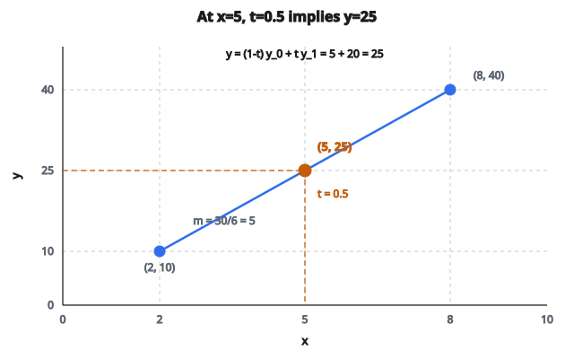

# Linear Interpolation

## Interpolation tuyến tính là gì

**Linear interpolation** là phương pháp ước lượng các giá trị chưa biết nằm giữa hai điểm dữ liệu đã biết. Nó giả định giá trị đổi tuyến tính (theo đường thẳng) giữa các điểm đã biết. Cho hai điểm $(x_0, y_0)$ và $(x_1, y_1)$, interpolation tuyến tính tìm giá trị $y$ tại mọi $x$ nằm giữa $x_0$ và $x_1$.

## Vì sao interpolation tuyến tính quan trọng

**Điền dữ liệu thiếu:** Time series có lỗ hổng có thể được điền bằng cách nội suy giữa các quan sát kề nhau.

**Resampling:** Đổi dữ liệu từ một tần số lấy mẫu sang tần số khác (ví dụ từ theo giờ sang mỗi 15 phút).

**Xấp xỉ hàm:** Khi hàm thật không biết, interpolation tuyến tính cho một ước lượng đơn giản.

**Đồ họa máy tính:** Chuyển màu, vị trí, hoặc thuộc tính khác giữa các keyframe một cách mượt.

**Phương pháp số:** Khối xây dựng cho các lược đồ interpolation phức tạp hơn.

## Công thức interpolation tuyến tính

Cho hai điểm đã biết $(x_0, y_0)$ và $(x_1, y_1)$, giá trị nội suy tại vị trí $x$ là:

$$
y = y_0 + (y_1 - y_0) \cdot \frac{x - x_0}{x_1 - x_0}
$$

Công thức này có thể viết lại thành vài dạng tương đương:

**Dạng slope-intercept:**

$$
y = y_0 + m \cdot (x - x_0) \quad \text{với } m = \frac{y_1 - y_0}{x_1 - x_0}
$$

**Dạng trung bình có trọng số:**

$$
y = (1 - t) \cdot y_0 + t \cdot y_1 \quad \text{với } t = \frac{x - x_0}{x_1 - x_0}
$$

Tham số $t$ cho biết ta đang ở đâu trên khoảng:

* $t = 0$ cho $y = y_0$ (điểm đầu)
* $t = 1$ cho $y = y_1$ (điểm cuối)
* $t = 0.5$ cho trung điểm

## Diễn giải hình học

Interpolation tuyến tính nối hai điểm đã biết bằng một đoạn thẳng. Giá trị nội suy chính là hoành độ $y$ trên đoạn thẳng đó tại vị trí $x$ mong muốn.

Độ dốc của đoạn thẳng là:

$$
m = \frac{\Delta y}{\Delta x} = \frac{y_1 - y_0}{x_1 - x_0}
$$

Đây là tốc độ thay đổi giữa hai điểm.

## Ví dụ số

**Điểm đã biết:** $(2, 10)$ và $(8, 40)$

**Tìm:** Giá trị nội suy tại $x = 5$

**Bước 1 — Tính tham số interpolation:**

$$
t = \frac{x - x_0}{x_1 - x_0} = \frac{5 - 2}{8 - 2} = \frac{3}{6} = 0.5
$$

**Bước 2 — Áp dụng công thức:**

$$
\begin{aligned}
y &= (1 - 0.5) \cdot 10 + 0.5 \cdot 40 \\
&= 5 + 20 \\
&= 25
\end{aligned}
$$

**Kiểm tra:** Tại $x = 5$ (giữa 2 và 8), giá trị là 25 (giữa 10 và 40). Điều này khớp quan hệ tuyến tính.

::: {#fig-165-interpolation fig-cap="Hai điểm $(2,10)$ và $(8,40)$: tại $x=5$, $t=0.5$ nên $y=(1-0.5)\cdot 10 + 0.5\cdot 40 = 25$." fig-alt="Doan thang qua (2, 10) va (8, 40); tai x = 5, t = 0.5, y = 25."}
{fig-align="center"}
:::

## Interpolation so với extrapolation

**Interpolation:** Ước lượng giá trị nằm trong phạm vi dữ liệu đã biết (giữa $x_0$ và $x_1$). Thường đáng tin vì có dữ liệu ở cả hai phía.

**Extrapolation:** Ước lượng giá trị nằm ngoài phạm vi dữ liệu đã biết ($x < x_0$ hoặc $x > x_1$). Rủi ro vì ta đang chiếu trend ra ngoài dữ liệu quan sát.

Cùng một công thức dùng được cho extrapolation, nhưng kết quả ngày càng kém tin cậy khi ra xa các điểm đã biết.

## Interpolation tuyến tính từng khúc

Khi có nhiều điểm đã biết $(x_0, y_0), (x_1, y_1), \ldots, (x_n, y_n)$:

**Bước 1:** Tìm khoảng nào chứa điểm truy vấn $x$

**Bước 2:** Áp interpolation tuyến tính chỉ với hai mút của khoảng đó

Cách này tạo ra một hàm liên tục đi qua mọi điểm dữ liệu, với “góc” tại mỗi điểm đã biết nơi độ dốc đổi.

**Ví dụ:** Các điểm tại $x = [0, 2, 5, 10]$ với $y = [0, 3, 2, 8]$

Nội suy tại $x = 4$:

* Tìm khoảng: 4 nằm giữa 2 và 5
* Dùng các điểm $(2, 3)$ và $(5, 2)$
* Tính:

$$
\begin{aligned}
y &= 3 + (2-3) \cdot \frac{4-2}{5-2} \\
&= 3 - \frac{2}{3} \\
&= 2.33
\end{aligned}
$$

## Tính chất của interpolation tuyến tính

**Khớp đúng tại điểm dữ liệu:** Hàm nội suy đi đúng qua mọi điểm đã biết.

**Liên tục:** Hàm thu được liên tục (không nhảy) nhưng không mượt (có góc tại các điểm dữ liệu).

**Địa phương:** Đổi một điểm dữ liệu chỉ ảnh hưởng interpolant trên các khoảng kề.

**Sai số bậc nhất:** Sai số tỉ lệ với bình phương độ rộng khoảng và đạo hàm cấp hai của hàm thật.

$$
\text{Error} \approx \frac{(x_1 - x_0)^2}{8} \cdot |f'(\xi)|
$$

với $\xi$ là một điểm nào đó trong khoảng.

## Xử lý các trường hợp biên

**Truy vấn ngoài phạm vi dữ liệu:** Các lựa chọn gồm:

* Trả về giá trị mút gần nhất (extrapolation hằng)
* Áp công thức (extrapolation tuyến tính)
* Trả về NaN hoặc báo lỗi

**Một điểm dữ liệu:** Interpolation không xác định khi chỉ có một điểm. Trả về giá trị đó như hằng số, hoặc báo lỗi.

**Trùng $x$:** Nếu hai điểm cùng $x$ nhưng khác $y$, hàm không xác định tốt. Xử lý bằng cách lấy trung bình, lấy giá trị đầu/cuối, hoặc báo lỗi.

## So sánh với các phương pháp interpolation khác

**Nearest neighbor:** Trả về giá trị của điểm đã biết gần nhất. Không liên tục nhưng đơn giản.

**Polynomial interpolation:** Khớp một đa thức duy nhất qua mọi điểm. Mượt nhưng có thể dao động mạnh (hiện tượng Runge).

**Spline interpolation:** Khớp đa thức từng khúc với nối mượt. Tốt hơn tuyến tính cho dữ liệu mượt nhưng phức tạp hơn.

**Cubic interpolation:** Dùng đa thức bậc ba cho đường cong mượt hơn. Tốn tính toán hơn nhưng tránh được các góc của interpolation tuyến tính.

## Interpolation tuyến tính xuất hiện ở đâu

* **Phân tích time series:** Điền timestamp thiếu trong dữ liệu cảm biến, giá cổ phiếu, hoặc đo thời tiết
* **Xử lý ảnh:** Đổi kích thước ảnh, texture mapping; bilinear interpolation là interpolation tuyến tính 2D
* **Xử lý âm thanh:** Resampling tín hiệu audio sang sample rate khác
* **Animation:** Nội suy giữa keyframe cho vị trí, góc quay, màu
* **Tính toán khoa học:** Bảng tra cứu với interpolation tuyến tính để đánh giá hàm nhanh
* **Hệ thống thông tin địa lý:** Ước lượng độ cao hoặc giá trị giữa các điểm lưới
* **Machine learning:** Interpolation tuyến tính trên không gian ẩn cho mô hình sinh
* **Tài chính:** Nội suy đường cong lợi suất, ước lượng lãi suất tại kỳ hạn không chuẩn
* **Hệ thống điều khiển:** Tái tạo tín hiệu từ dữ liệu đã lấy mẫu
* **Phát triển game:** Chuyển động mượt, chuyển camera, gradient màu

## Code
```python
def linear_interpolation(values):
    """
    Fill missing (None) values using linear interpolation.
    """
    result = values[:]
    n = len(result)
    i = 0
    while i < n:
        if result[i] is None:
            left = i - 1
            right = i + 1
            while right < n and result[right] is None:
                right += 1
            left_val = result[left]
            right_val = result[right]
            span = right - left
            for j in range(left + 1, right):
                t = (j - left) / span
                result[j] = left_val + t * (right_val - left_val)
            i = right
        else:
            i += 1
    return result

```
