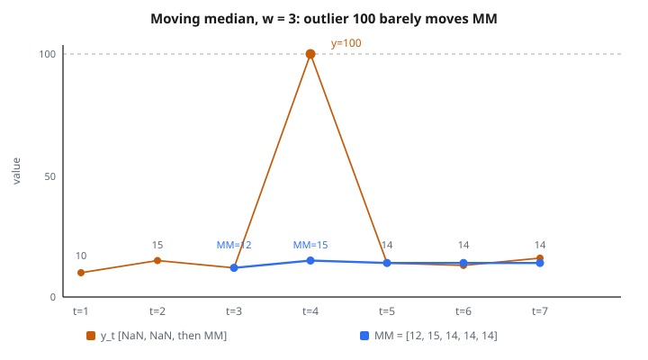

# Moving Median

## Moving median là gì

**Moving median** là median của $w$ quan sát gần nhất trong một time series. Đây là kỹ thuật làm mượt robust, chịu outlier tốt hơn moving average.

$$
\text{MM}_t(w) = \mathrm{median}(y_{t-w+1}, y_{t-w+2}, \ldots, y_t)
$$

với $w$ là kích thước cửa sổ.

## Công thức chính

Với time series $y_1, y_2, \ldots, y_T$, moving median tại thời điểm $t$ với cửa sổ $w$ là:

$$
\text{MM}_t = \mathrm{median}\{y_{t-w+1}, y_{t-w+2}, \ldots, y_t\}
$$

**Cửa sổ lẻ:** Median là giá trị giữa.

**Cửa sổ chẵn:** Median là trung bình hai giá trị giữa.

## Ví dụ số

**Time series:** $[10, 15, 12, 100, 14, 13, 16]$

**Kích thước cửa sổ:** $w = 3$

**Tính:**

**$t=3$:** Median của $\{10, 15, 12\}$

Sorted: $[10, 12, 15]$ → Median $= 12$

**$t=4$:** Median của $\{15, 12, 100\}$

Sorted: $[12, 15, 100]$ → Median $= 15$

**$t=5$:** Median của $\{12, 100, 14\}$

Sorted: $[12, 14, 100]$ → Median $= 14$

**$t=6$:** Median của $\{100, 14, 13\}$

Sorted: $[13, 14, 100]$ → Median $= 14$

**$t=7$:** Median của $\{14, 13, 16\}$

Sorted: $[13, 14, 16]$ → Median $= 14$

**Kết quả:** $[\mathrm{NaN}, \mathrm{NaN}, 12, 15, 14, 14, 14]$

**Lưu ý:** Outlier 100 hầu như không kéo các giá trị median.

::: {#fig-188-moving-median fig-cap="Với w = 3, MM_t = [NaN, NaN, 12, 15, 14, 14, 14]. Outlier 100 đổi median tại t = 4 từ 12 lên 15, không kéo lên vùng 40 như mean." fig-alt="Chuỗi 10, 15, 12, 100, 14, 13, 16 với spike 100; moving median w=3 nằm ở 12, 15, 14, 14, 14."}
{fig-align="center"}
:::

## So với moving average

**Cùng dữ liệu với moving average ($w=3$):**

**$t=3$:** $(10+15+12)/3 = 12.33$

**$t=4$:** $(15+12+100)/3 = 42.33$ (bị outlier kéo mạnh)

**$t=5$:** $(12+100+14)/3 = 42.00$

**$t=6$:** $(100+14+13)/3 = 42.33$

**$t=7$:** $(14+13+16)/3 = 14.33$

**Quan sát:** Moving average bị outlier méo nhiều kỳ. Moving median vẫn ổn định.

## Robust với outlier

**Breakdown point:** Tỉ lệ outlier có thể chịu được.

**Moving median:** Breakdown point khoảng 50%.

Tới một nửa giá trị trong cửa sổ có thể là outlier mà kết quả vẫn không bị méo nặng.

**Moving average:** Breakdown point 0%.

Một outlier cực đoan có thể kéo mean tùy ý.

**Ứng dụng:** Dùng moving median khi dữ liệu có outlier, spike, hoặc lỗi đo.

## Độ phức tạp tính toán

**Cách naive:**

Mỗi vị trí: lấy cửa sổ, sort, tìm median.

Thời gian: $O(w \log w)$ mỗi vị trí, $O(Tw \log w)$ tổng.

**Cách hiệu quả:**

Giữ cấu trúc đã sort (cây cân bằng hoặc median heap chuyên biệt).

Thời gian: $O(\log w)$ mỗi cập nhật, $O(T \log w)$ tổng.

**So với moving average:** $O(T)$ cho moving average so với $O(T \log w)$ cho moving median.

**Đánh đổi:** Chậm hơn nhưng robust hơn.

## Chọn kích thước cửa sổ

**Cửa sổ nhỏ (ví dụ $w=3$):**

* Nhạy với thay đổi
* Bám dữ liệu sát
* Ít làm mượt

**Cửa sổ lớn (ví dụ $w=25$):**

* Làm mượt mạnh hơn
* Chịu outlier tốt hơn
* Kém nhạy hơn (có lag)

**Hướng dẫn chung:**

* Lọc outlier: $w \geq 5$
* Tách trend: $w \geq 10$
* Ưu tiên $w$ lẻ (median duy nhất, không cần lấy trung bình)

## Xử lý mép

**Ở đầu ($t < w$):**

Không tính được moving median đủ cửa sổ.

**Lựa chọn:**

1. Để NaN (phổ biến nhất)
2. Cửa sổ expanding: Median mọi giá trị từ 1 đến $t$
3. Pad bằng giá trị đầu hoặc median của dữ liệu sẵn có

**Hầu hết triển khai:** Trả NaN cho $w-1$ giá trị đầu.

## Median filter trong xử lý tín hiệu

**Median filter:** Moving median dùng để khử nhiễu.

**Ưu thế so với bộ lọc tuyến tính:**

Giữ cạnh và chuyển tiếp đột ngột.

**Ứng dụng:**

* Xử lý ảnh: khử nhiễu muối tiêu
* Xử lý âm thanh: khử click và pop
* Dữ liệu cảm biến: khử spike đo

**Ví dụ:** Pixel chết trên cảm biến camera. Median filter thay bằng median lân cận.

## Tính chất của median

**Thước vị trí:** Ước lượng xu hướng trung tâm.

**Robust:** Không bị giá trị cực đoan kéo.

**Percentile 50:** Một nửa giá trị dưới, một nửa trên.

**Phân phối đối xứng:** Median trùng mean.

**Phân phối lệch:** Median khác mean.

## Độ mượt và gián đoạn

**Moving average:** Cho đường cong mượt.

**Moving median:** Có thể tạo các đoạn hằng từng khúc.

**Ví dụ:** $[1, 2, 3, 4, 5, 6, 7]$ với $w=3$

Median: $[2, 3, 4, 5, 6]$

Tăng đều.

**Ví dụ có giá trị lặp:** $[1, 2, 2, 2, 2, 3, 4]$ với $w=3$

Median: $[2, 2, 2, 2, 3]$

Đoạn phẳng khi giá trị giữa tồn tại lâu.

## Làm mượt thời gian để tách trend

**Mục tiêu:** Tách trend khỏi nhiễu.

**Cách làm:**

1. Áp moving median để khử outlier
2. Áp moving average để làm mượt thêm

**Hai tầng:**

$$
\text{Trend}_t = \text{MA}(\text{MM}(y_t, w_1), w_2)
$$

**Ưu điểm:** Robust với outlier (nhờ median) và mượt (nhờ average).

## Bộ lọc lai median-mean

**Trimmed mean:** Bỏ giá trị cực đoan rồi lấy trung bình.

**Winsorized mean:** Thay giá trị cực đoan bằng giá trị ít cực hơn rồi lấy trung bình.

**Bộ lọc alpha-trimmed mean:**

1. Sort giá trị trong cửa sổ
2. Bỏ tỉ lệ $\alpha$ ở mỗi đuôi
3. Trung bình phần còn lại

**Ví dụ:** Trimmed mean 10% với $w=10$: bỏ nhỏ nhất và lớn nhất, trung bình 8 giá trị giữa.

**Thỏa hiệp:** Robust hơn mean, mượt hơn median.

## Running median cho dữ liệu streaming

**Ngữ cảnh streaming:** Dữ liệu đến tuần tự, không lưu toàn bộ lịch sử.

**Cửa sổ trượt:** Chỉ giữ $w$ giá trị cuối.

**Cấu trúc dữ liệu:** Hai heap (max-heap nửa dưới, min-heap nửa trên).

**Hiệu quả:** $O(\log w)$ mỗi cập nhật.

**Ứng dụng:** Phát hiện anomaly thời gian thực, xử lý tín hiệu online.

## Median Absolute Deviation

**MAD:** Thước biến thiên robust.

$$
\text{MAD} = \mathrm{median}(\lvert y_i - \mathrm{median}(y)\rvert)
$$

**Moving MAD:**

$$
\text{MAD}_t = \mathrm{median}(\lvert y_{t-w+1} - \text{MM}_t\rvert, \ldots, \lvert y_t - \text{MM}_t\rvert)
$$

**Use case:** Dải tin cậy robust quanh moving median.

**Phát hiện outlier:**

$$
\lvert y_t - \text{MM}_t\rvert > k \cdot \text{MAD}_t
$$

Điển hình: $k \approx 3$ để gắn cờ anomaly.

## Seasonality và moving median

**Seasonal adjustment:**

Dùng cửa sổ bằng chu kỳ seasonal.

**Dữ liệu tháng với seasonality năm:** $w = 12$

**Moving median căn giữa:**

$$
\text{CMM}_t = \mathrm{median}(y_{t-6}, \ldots, y_t, \ldots, y_{t+6})
$$

**Hiệu ứng:** Gỡ mẫu seasonal, giữ trend.

**Lưu ý:** Cần giá trị tương lai (không nhân quả), chỉ phù hợp phân tích lịch sử.

## Mở rộng quantile

**Moving percentile:**

Tổng quát hóa moving median sang percentile khác.

**Percentile 25 (Q1):**

$$
Q1_t = \text{P}_{25}(y_{t-w+1}, \ldots, y_t)
$$

**Percentile 75 (Q3):**

$$
Q3_t = \text{P}_{75}(y_{t-w+1}, \ldots, y_t)
$$

**Khoảng tứ phân vị:**

$$
\text{IQR}_t = Q3_t - Q1_t
$$

**Ứng dụng:** Dải tin cậy robust, ước lượng volatility.

## Mode so với median

**Mode:** Giá trị xuất hiện nhiều nhất trong cửa sổ.

**Median:** Giá trị giữa của cửa sổ đã sort.

**Dữ liệu liên tục:** Mode thường không xác định (không có giá trị lặp).

**Dữ liệu rời rạc:** Mode có thể hữu ích.

**Ví dụ:** $[1, 2, 2, 3, 2, 5]$ → Mode $= 2$, Median $= 2$

**Moving mode:** Ít dùng hơn moving median, nhưng hữu ích với time series categorical.

## Weighted median

**Median chuẩn:** Mọi quan sát cùng trọng số.

**Weighted median:** Gán trọng số, tìm giá trị mà trọng số tích lũy $= 50\%$.

$$
\text{WM}_t = \arg\min_m \sum_{i=t-w+1}^{t} w_i \lvert y_i - m\rvert
$$

**Ứng dụng:** Đặt trọng lớn hơn cho quan sát gần đây.

**Ví dụ trọng số:** Trọng số giảm theo hàm mũ $w_i = \alpha^{t-i}$.

## Phân tích residual

**Chuỗi đã gỡ trend:**

$$
r_t = y_t - \text{MM}_t
$$

**Phân tích:**

* Vẽ residual để kiểm tra mẫu
* Residual nên gần đối xứng quanh 0
* Residual lớn báo outlier hoặc đứt cấu trúc

**Use case:** Tìm anomaly sau khi đã gỡ trend nền.

## So với percentile filter

**Minimum filter:** Percentile 0 (moving minimum).

**Maximum filter:** Percentile 100 (moving maximum).

**Median filter:** Percentile 50 (moving median).

**Range filter:** Hiệu max trừ min.

**Ứng dụng:**

* Minimum: envelope dưới
* Maximum: envelope trên
* Range: thước volatility địa phương

## Trọng số không đều

**Time-weighted median:**

Quan sát gần đây nặng hơn.

**Cách làm:**

Nhân bản giá trị gần đây trong cửa sổ rồi mới tính median.

**Ví dụ:** Mẫu trọng số $[1, 2, 3]$ với $w=6$

Nhân bản: $[\mathrm{value}1, \mathrm{value}2, \mathrm{value}2, \mathrm{value}3, \mathrm{value}3, \mathrm{value}3]$

Tính median trên cửa sổ đã nhân bản.

**Hiệu ứng:** Kéo median về phía giá trị gần đây.

## Giữ cạnh

**Ưu thế then chốt:** Giữ chuyển tiếp đột ngột.

**Ví dụ:** Hàm bước

$$
y_t = \begin{cases}
0 & \text{nếu } t < 50 \\
10 & \text{nếu } t \geq 50
\end{cases}
$$

**Moving average:** Chuyển tiếp từ từ (dốc) quanh $t=50$.

**Moving median:** Giữ bước nhảy (bước vẫn là bước).

**Ứng dụng:** Dữ liệu tài chính (nhảy giá), quy trình công nghiệp (đổi regime).

## Median filter lặp

**Một lần:** Áp moving median một lượt.

**Nhiều lần:** Áp moving median lặp lại.

$$
y^{(k+1)}_t = \mathrm{median}(y^{(k)}_{t-w+1}, \ldots, y^{(k)}_t)
$$

**Hiệu ứng:** Làm phẳng dần dữ liệu, gỡ cấu trúc mịn hơn.

**Hội tụ:** Cuối cùng hội tụ về root signal (thay đổi tối thiểu).

**Ứng dụng:** Khử nhiễu nặng, tách mẫu trội.

## Median trên dữ liệu categorical

**Hạng thứ tự (ordinal):** Có thứ tự tự nhiên.

**Ví dụ:** Rating (1 sao, 2 sao, …, 5 sao).

**Moving median rating:** Median của $w$ rating gần nhất.

**Ưu điểm:** Robust với review cực dương hoặc cực âm.

**Hạng định danh (nominal):** Không có thứ tự tự nhiên.

**Dùng mode:** Category xuất hiện nhiều nhất trong cửa sổ.

## Tối ưu tính toán

**Buffer đã sort:**

Giữ list đã sort của giá trị cửa sổ.

**Insert/remove:** $O(w)$ để tìm vị trí, $O(w)$ để dịch phần tử.

**Tra median:** $O(1)$ từ giữa list đã sort.

**Cách heap:**

Hai heap (max-heap nửa dưới, min-heap nửa trên).

**Insert/remove:** $O(\log w)$

**Tra median:** $O(1)$ từ đỉnh heap.

**Order statistic tree:**

BST cân bằng gắn thêm kích thước subtree.

**Insert/remove:** $O(\log w)$

**Tra median:** $O(\log w)$

**Đánh đổi phụ thuộc chi tiết triển khai và cửa sổ điển hình.**

## Cửa sổ bất đối xứng

**Chuẩn:** Cửa sổ đối xứng quanh $t$.

**Nhân quả (trailing):** Chỉ giá trị quá khứ.

$$
\text{MM}_t = \mathrm{median}(y_{t-w+1}, \ldots, y_t)
$$

**Không nhân quả (căn giữa):**

$$
\text{CMM}_t = \mathrm{median}(y_{t-k}, \ldots, y_t, \ldots, y_{t+k})
$$

với $w = 2k+1$.

**Ưu điểm căn giữa:** Không lag, tốt cho làm mượt lịch sử.

**Ưu điểm nhân quả:** Phù hợp thời gian thực và dự báo.

## Phương sai và sai số chuẩn

**Phương sai mẫu của median:** Khó tính giải tích.

**Cách bootstrap:**

1. Lấy mẫu lại cửa sổ có hoàn lại
2. Tính median mỗi mẫu bootstrap
3. Ước phương sai từ phân phối bootstrap

**Phương sai tiệm cận:**

Với $n$ lớn, xấp xỉ:

$$
\operatorname{Var}(\mathrm{Median}) \approx \frac{1}{4n f(m)^2}
$$

với $f(m)$ là mật độ xác suất tại median $m$.

**Thực tế:** Phương sai cao hơn mean trên dữ liệu chuẩn, thấp hơn trên dữ liệu đuôi nặng.

## Median crossover

**Tương tự moving average crossover:**

**Golden cross:** Median nhanh ($w$ nhỏ) cắt lên trên median chậm ($w$ lớn).

**Death cross:** Median nhanh cắt xuống dưới median chậm.

**Diễn giải:** Tín hiệu đổi trend.

**Ưu thế so với MA crossover:** Ít nhạy outlier hơn.

**Ví dụ chiến lược:** Long khi median nhanh lớn hơn median chậm, short khi median nhanh nhỏ hơn median chậm.

## Phân rã seasonal

**Tách trend bằng moving median:**

$$
\text{Trend}_t = \text{MM}_t(w = s)
$$

với $s$ là chu kỳ seasonal.

**Đã gỡ trend:**

$$
D_t = y_t - \text{Trend}_t
$$

**Thành phần seasonal:** Trung bình $D_t$ theo từng mùa.

**Phần dư:** $y_t - \text{Trend}_t - \text{Seasonal}_t$

**Phân rã STL robust:** Dùng moving median thay moving average để tăng robust.

## Phân tích đa thang

**Cách pyramid:**

Áp moving median ở nhiều kích thước cửa sổ.

**Cửa sổ nhỏ:** Bắt biến thiên tần số cao.

**Cửa sổ vừa:** Bắt trend tần số trung.

**Cửa sổ lớn:** Bắt baseline tần số thấp.

**Diễn giải:** Tách tín hiệu thành thành phần ở các thang khác nhau.

**Ứng dụng:** Phân tích đa độ phân giải, phân rã kiểu wavelet bằng median.

## Lưu ý thực tế

**Kiểu dữ liệu:** Làm việc với mọi dữ liệu có thứ tự (số, categorical ordinal).

**Kích thước cửa sổ:** Ưu tiên lẻ để median duy nhất; chẵn cần lấy trung bình.

**Chi phí tính toán:** Chậm hơn moving average nhưng nhanh hơn nhiều lựa chọn robust khác.

**Định nghĩa outlier:** Phụ thuộc ngữ cảnh. Median chỉ ra giá trị khác hàng xóm địa phương.

**Triển khai:** Hầu hết thư viện có hàm sẵn (pandas, scipy, R).

## Code
```python
def moving_median(values, window_size):
    """
    Compute the rolling median for each window position.
    """
    result = []
    for i in range(len(values) - window_size + 1):
        window = sorted(values[i:i + window_size])
        n = window_size
        if n % 2 == 1:
            result.append(float(window[n // 2]))
        else:
            result.append((window[n // 2 - 1] + window[n // 2]) / 2.0)
    return result

```
