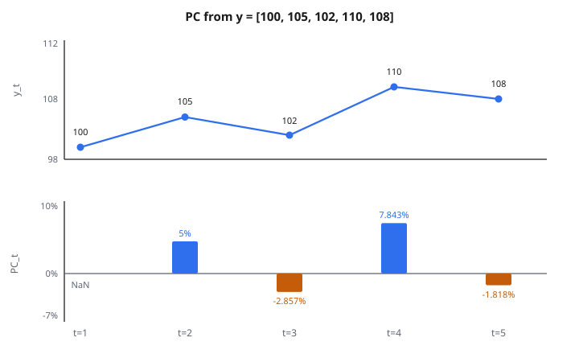

# Percent Change

## Percent change là gì

**Percent change** đo biến thiên tương đối giữa các quan sát liên tiếp trong một time series, biểu diễn dưới dạng phần trăm. Nó cho biết giá trị tăng hay giảm bao nhiêu so với giá trị ngay trước đó.

$$
\text{PC}_t = \frac{y_t - y_{t-1}}{y_{t-1}} \times 100\%
$$

với $y_t$ là giá trị hiện tại và $y_{t-1}$ là giá trị kỳ trước.

## Công thức chính

Với time series $y_1, y_2, \ldots, y_T$:

$$
\text{PC}_t = \frac{y_t - y_{t-1}}{y_{t-1}} \times 100\%
$$

**Không nhân 100:** Bỏ hệ số 100 để được dạng thập phân.

$$
r_t = \frac{y_t - y_{t-1}}{y_{t-1}}
$$

**Dạng tương đương:**

$$
\text{PC}_t = \left(\frac{y_t}{y_{t-1}} - 1\right) \times 100\%
$$

## Ví dụ số

**Time series:** $[100, 105, 102, 110, 108]$

**Kỳ 2:**

$$
\text{PC}_2 = \frac{105 - 100}{100} \times 100\% = \frac{5}{100} \times 100\% = 5\%
$$

**Kỳ 3:**

$$
\text{PC}_3 = \frac{102 - 105}{105} \times 100\% = \frac{-3}{105} \times 100\% = -2.857\%
$$

**Kỳ 4:**

$$
\text{PC}_4 = \frac{110 - 102}{102} \times 100\% = \frac{8}{102} \times 100\% = 7.843\%
$$

**Kỳ 5:**

$$
\text{PC}_5 = \frac{108 - 110}{110} \times 100\% = \frac{-2}{110} \times 100\% = -1.818\%
$$

**Kết quả:** $[\mathrm{NaN}, 5\%, -2.857\%, 7.843\%, -1.818\%]$

::: {#fig-187-percent-change fig-cap="PC_t từ [100, 105, 102, 110, 108] bằng [NaN, 5%, −2.857%, 7.843%, −1.818%]. Kỳ đầu không có y_{t−1} nên là NaN." fig-alt="Hai bảng: mức y_t = 100, 105, 102, 110, 108 và thanh percent change NaN, 5%, -2.857%, 7.843%, -1.818%."}
{fig-align="center"}
:::

## Diễn giải

**Percent change dương:** Giá trị tăng.

**Ví dụ:** $+5\%$ nghĩa là giá trị lớn hơn kỳ trước 5%.

**Percent change âm:** Giá trị giảm.

**Ví dụ:** $-3\%$ nghĩa là giá trị nhỏ hơn kỳ trước 3%.

**Percent change bằng không:** Không đổi.

**Độ lớn:** Trị tuyệt đối càng lớn thì biến thiên tương đối càng mạnh.

## So với biến thiên tuyệt đối

**Biến thiên tuyệt đối:**

$$
\Delta y_t = y_t - y_{t-1}
$$

**Percent change:**

$$
\text{PC}_t = \frac{\Delta y_t}{y_{t-1}} \times 100\%
$$

**Ví dụ:** Giá cổ phiếu tăng từ $10$ lên $11$ so với từ $100$ lên $101$.

Biến thiên tuyệt đối: cả hai đều $+1$.

Percent change: $+10\%$ so với $+1\%$.

**Percent change cho phép so sánh độc lập thang đo.**

## Percent change lag-k

**Lag một kỳ (chuẩn):**

$$
\text{PC}_t = \frac{y_t - y_{t-1}}{y_{t-1}} \times 100\%
$$

**Lag $k$ kỳ:**

$$
\text{PC}_t(k) = \frac{y_t - y_{t-k}}{y_{t-k}} \times 100\%
$$

**Ví dụ ứng dụng:**

* $k=1$: biến thiên ngày
* $k=5$: biến thiên tuần (dữ liệu ngày)
* $k=12$: biến thiên year-over-year (dữ liệu tháng)

## Ví dụ year-over-year

**Doanh số tháng:** $[100, 105, 110, 95, 102, 108, 115, 120, 112, 118, 125, 130]$

**Percent change year-over-year ($k=12$):**

Chưa xác định cho đến tháng 13.

**Tháng 13 (năm 2, tháng 1):** doanh số $= 110$

$$
\text{YoY} = \frac{110 - 100}{100} \times 100\% = 10\%
$$

**Diễn giải:** Doanh số tháng 13 cao hơn cùng tháng năm trước 10%.

## Hiệu ứng compounding

**Percent change không cộng được:**

Nếu giá trị tăng 10% rồi giảm 10%, giá trị cuối **không** bằng giá trị ban đầu.

**Ví dụ:**

Bắt đầu: $100$

Sau $+10\%$: $100 \times 1.10 = 110$

Sau $-10\%$: $110 \times 0.90 = 99$

**Mất 1% tổng thể, không phải 0%.**

**Công thức compounding:**

$$
y_t = y_0 \prod_{i=1}^{t} (1 + r_i)
$$

## Log return thay thế

**Vấn đề:** Percent change bất đối xứng.

$+50\%$ rồi $-50\%$ không đưa về giá trị ban đầu.

**Log return:**

$$
\ell_t = \ln\left(\frac{y_t}{y_{t-1}}\right) = \ln(1 + r_t)
$$

**Ưu điểm:** Log return cộng được.

$$
\sum_{i=1}^{t} \ell_i = \ln\left(\frac{y_t}{y_0}\right)
$$

**Xấp xỉ:** Khi $r_t$ nhỏ, $\ell_t \approx r_t$.

**Tài chính:** Log return được ưa dùng khi mô hình hóa và gộp kỳ.

## Stationarity

**Chuỗi không stationary:** Kỳ vọng và phương sai đổi theo thời gian (ví dụ giá cổ phiếu).

**Chuỗi percent change:** Thường stationary.

**Biến đổi:** Đổi từ mức sang percent change có thể tạo stationarity.

**Ứng dụng:** Nhiều mô hình time series (ARIMA) đòi hỏi dữ liệu stationary. Percent change thường thỏa điều kiện này.

**Ví dụ:** Giá cổ phiếu có unit root (không stationary). Return thì stationary.

## Percent change và volatility

**Volatility:** Đo bằng độ lệch chuẩn của percent change.

$$
\sigma = \sqrt{\frac{1}{T-1} \sum_{t=2}^{T} (r_t - \bar{r})^2}
$$

**Volatility cao:** Percent change dao động lớn.

**Volatility thấp:** Percent change nhỏ, ổn định.

**Ứng dụng:** Đánh giá rủi ro tài chính. Volatility cao hơn nghĩa là rủi ro cao hơn.

## Xử lý giá trị không và âm

**Chia cho không:**

Nếu $y_{t-1} = 0$, percent change không xác định.

**Giá trị âm:**

Percent change vẫn tính được nhưng diễn giải phức tạp.

**Ví dụ:** Đổi từ $-10$ sang $-5$.

$$
\text{PC} = \frac{-5 - (-10)}{-10} \times 100\% = \frac{5}{-10} \times 100\% = -50\%
$$

**Gây nhầm:** Giá trị tốt hơn (bớt âm) nhưng percent change lại âm.

**Cách xử lý:** Dùng biến thiên tuyệt đối cho chuỗi có không hoặc âm.

## Phát hiện seasonality

**Mẫu seasonal hiện trên percent change:**

So sánh percent change cùng vị trí trong chu kỳ.

**Ví dụ:** Doanh số bán lẻ theo tháng.

Tháng 12 thường có percent change dương lớn (mua sắm lễ).

Tháng 1 thường có percent change âm lớn (sau lễ).

**Phân tích:** Mẫu lặp lại trên percent change cho thấy seasonality.

## Moving average của percent change

**Làm mượt chuỗi percent change:**

$$
\text{MA}(\text{PC}_t) = \frac{1}{w} \sum_{i=0}^{w-1} \text{PC}_{t-i}
$$

**Diễn giải:** Tốc độ biến thiên trung bình trên vài kỳ gần đây.

**Ứng dụng:** Phân biệt trend bền với spike tạm thời.

**Ví dụ:** Trung bình percent change 12 tháng gần nhất cho biết tốc độ tăng trưởng tổng thể.

## Percent change tích lũy

**Hiệu ứng tích lũy của percent change:**

$$
y_t = y_0 \prod_{i=1}^{t} (1 + r_i)
$$

**Percent change tích lũy:**

$$
R_{\text{cum}} = \frac{y_t - y_0}{y_0} \times 100\% = \left(\prod_{i=1}^{t} (1 + r_i) - 1\right) \times 100\%
$$

**Ví dụ:** Daily return $+2\%$, $-1\%$, $+3\%$

$$
R_{\text{cum}} = (1.02 \times 0.99 \times 1.03 - 1) \times 100\% = (1.04 - 1) \times 100\% = 4\%
$$

## Diễn giải như growth rate

**Percent change như growth rate:**

$$
g_t = \frac{y_t - y_{t-1}}{y_{t-1}}
$$

**Xấp xỉ compounding liên tục:**

$$
y_t \approx y_{t-1} e^{g_t}
$$

**Tăng trưởng dài hạn:**

Nếu growth rate không đổi $g$:

$$
y_t = y_0 (1 + g)^t
$$

**Thời gian nhân đôi:**

$$
t_{\text{double}} \approx \frac{\ln(2)}{\ln(1+g)} \approx \frac{0.693}{g}
$$

**Ví dụ:** Tăng trưởng năm 7% nhân đôi sau khoảng 10 năm.

## Phát hiện outlier

**Percent change làm nổi anomaly:**

Percent change đột biến lớn báo sự kiện bất thường.

**Phương pháp ngưỡng:**

Đánh dấu $|\text{PC}_t| > k \sigma$ với $\sigma$ là độ lệch chuẩn của percent change và $k=3$ là giá trị điển hình.

**Ví dụ:** Giá cổ phiếu nhảy 20% trong một ngày (bất ngờ earnings, thông báo sáp nhập).

**Ứng dụng:** Phát hiện anomaly, phân tích event study.

## Dự báo bằng percent change

**Dự báo naive:**

$$
\hat{\text{PC}}_{t+1} = \bar{\text{PC}}
$$

Dùng percent change trung bình lịch sử.

**Dự báo mức:**

$$
\hat{y}_{t+1} = y_t (1 + \hat{\text{PC}}_{t+1})
$$

**Nhiều bước:**

$$
\hat{y}_{t+h} = y_t (1 + \hat{\text{PC}})^h
$$

Giả định growth rate không đổi.

**Mô hình tốt hơn:** ARIMA trên percent change, exponential smoothing trên mức.

## Percent change đối xứng

**Bất đối xứng của percent change chuẩn:**

Đổi từ 100 lên 150: $+50\%$

Đổi từ 150 xuống 100: $-33.3\%$

**Cùng biến thiên tuyệt đối nhưng độ lớn phần trăm khác nhau.**

**Percent change đối xứng:**

$$
\text{SPC}_t = \frac{y_t - y_{t-1}}{(y_t + y_{t-1})/2} \times 100\%
$$

**Mẫu số:** Trung bình của giá trị hiện tại và kỳ trước.

**Ví dụ:**

100 lên 150: $\frac{50}{125} \times 100\% = 40\%$

150 xuống 100: $\frac{-50}{125} \times 100\% = -40\%$

**Bây giờ độ lớn đối xứng.**

## Percent change annualized

**Quy về tốc độ năm:**

$$
r_{\text{annual}} = \left(1 + r_{\text{period}}\right)^{n} - 1
$$

với $n$ là số kỳ trong một năm.

**Ví dụ:** Return tháng 1%

$$
r_{\text{annual}} = (1.01)^{12} - 1 = 1.1268 - 1 = 0.1268 = 12.68\%
$$

**Diễn giải:** Nếu tăng 1% mỗi tháng được duy trì, tăng trưởng năm là 12.68%.

## Percent change trên index

**Xây index:**

Đặt kỳ gốc bằng 100.

$$
I_t = \frac{y_t}{y_0} \times 100
$$

**Percent change của index:**

$$
\text{PC}_t = \frac{I_t - I_{t-1}}{I_{t-1}} \times 100\%
$$

**Trùng percent change trên chuỗi gốc.**

**Ưu điểm của index:** So sánh dễ giữa nhiều chuỗi khác đơn vị.

## Percent change và tương quan

**Tương quan mức so với return:**

Mức có thể tương quan giả do cùng trend.

**Return thường có cấu trúc tương quan khác.**

**Ví dụ:** Hai giá cổ phiếu cùng trend tăng (tương quan mức cao).

Daily return có thể không tương quan (biến động giá độc lập).

**Phân tích:** Tính tương quan của percent change để đánh giá quan hệ thực.

## Differencing so với percent change

**Sai phân bậc một:**

$$
\Delta y_t = y_t - y_{t-1}
$$

**Percent change:**

$$
r_t = \frac{\Delta y_t}{y_{t-1}}
$$

**Differencing:** Mô hình cộng (biến thiên tuyệt đối).

**Percent change:** Mô hình nhân (biến thiên tương đối).

**Dùng differencing khi:** Phương sai ổn định trên mức.

**Dùng percent change khi:** Phương sai tỉ lệ với mức (heteroscedasticity).

## Percentage point so với percent change

**Percentage point:** Hiệu tuyệt đối giữa hai phần trăm.

**Ví dụ:** Lãi suất đổi từ 5% lên 7%.

Biến thiên là 2 percentage point.

**Percent change:** Biến thiên tương đối.

$$
\frac{7 - 5}{5} \times 100\% = 40\% \text{ tăng}
$$

**Phân biệt then chốt:** Thường bị nhầm trên truyền thông và báo cáo.

## Quay về giá trị gốc

**Phục hồi bất đối xứng:**

Giảm 50% cần tăng 100% để về giá trị ban đầu.

**Ví dụ:**

Bắt đầu: 100

Sau $-50\%$: 50

Để về 100: $\frac{100-50}{50} \times 100\% = 100\%$ tăng.

**Hệ quả:** Tổn thất khó gỡ hơn nếu tính theo phần trăm.

## Volatility clustering

**Return tài chính:** Percent change lớn có xu hướng tụ cụm.

**Kỳ volatility cao:** Nhiều percent change lớn liên tiếp.

**Kỳ volatility thấp:** Nhiều percent change nhỏ liên tiếp.

**Mô hình ARCH/GARCH:** Bắt volatility clustering.

$$
\sigma_t^2 = \alpha_0 + \alpha_1 r_{t-1}^2 + \beta \sigma_{t-1}^2
$$

**Ứng dụng:** Quản trị rủi ro, định giá option.

## Percent change thực và danh nghĩa

**Percent change danh nghĩa:**

$$
r_{\text{nominal}} = \frac{P_t - P_{t-1}}{P_{t-1}}
$$

**Hiệu chỉnh lạm phát:**

$$
r_{\text{real}} = \frac{1 + r_{\text{nominal}}}{1 + \pi} - 1
$$

với $\pi$ là tỷ lệ lạm phát.

**Xấp xỉ:**

$$
r_{\text{real}} \approx r_{\text{nominal}} - \pi
$$

**Ví dụ:** Return danh nghĩa 10%, lạm phát 3%.

Return thực $\approx 7\%$.

**Diễn giải:** Mức tăng sức mua.

## Trung bình hình học và số học

**Trung bình số học của percent change:**

$$
\bar{r}_a = \frac{1}{T} \sum_{t=1}^{T} r_t
$$

**Trung bình hình học:**

$$
\bar{r}_g = \left(\prod_{t=1}^{T} (1 + r_t)\right)^{1/T} - 1
$$

**Quan hệ:** $\bar{r}_g < \bar{r}_a$ trừ khi mọi $r_t$ bằng nhau.

**Dùng hình học khi:** Compounding return theo thời gian.

**Dùng số học khi:** Return trung bình một kỳ.

## Phân phối percent change

**Quan sát thực nghiệm:**

Return tài chính (percent change) gần phân phối chuẩn với đuôi dày.

**Stylized facts:**

* Kỳ vọng gần 0
* Skewness dương hoặc âm đều có thể
* Kurtosis dư (leptokurtic)

**Hệ quả:**

Giả định chuẩn thường đánh giá thấp sự kiện cực đoan.

Dùng Student-t hoặc phân phối đuôi nặng khác để khớp tốt hơn.

## Gộp theo thời gian

**Percent change ngày sang tháng:**

Không được lấy trung bình đơn thuần các percent change ngày.

**Cách đúng:**

$$
r_{\text{monthly}} = \prod_{d=1}^{D} (1 + r_d) - 1
$$

với $D$ là số ngày trong tháng.

**Ví dụ:** Daily return 1%, 2%, $-1\%$.

$$
r = 1.01 \times 1.02 \times 0.99 - 1 = 1.0198 - 1 = 1.98\%
$$

**Không phải** $(1 + 2 - 1)/3 = 0.67\%$.

## Khoảng tin cậy

**Với return chuẩn:**

$$
\text{CI} = \bar{r} \pm z_{\alpha/2} \frac{\sigma}{\sqrt{T}}
$$

**Ví dụ:** Return ngày trung bình $0.05\%$, độ lệch chuẩn $1.5\%$, 100 quan sát.

CI 95%: $0.05\% \pm 1.96 \times \frac{1.5\%}{10} = 0.05\% \pm 0.294\%$

**Diễn giải:** Khoảng hợp lý cho kỳ vọng return thật.

## Tín hiệu so với nhiễu trong percent change

**Giả thuyết thị trường hiệu quả:**

Return tài sản không dự báo được (nhiễu cao, tín hiệu thấp).

**Kiểm định autocorrelation:**

Nếu $\mathrm{Corr}(r_t, r_{t-1}) \approx 0$, return không dự báo được.

**Momentum so với mean reversion:**

Autocorrelation dương: momentum (trend kéo dài)

Autocorrelation âm: mean reversion (đảo chiều)

**Thực nghiệm:** Return cổ phiếu có autocorrelation yếu; volatility có autocorrelation mạnh.

## Code
```python
def percent_change(series):
    """
    Compute the fractional change between consecutive values.
    """
    result = []
    for i in range(1, len(series)):
        if series[i - 1] == 0:
            result.append(0.0)
        else:
            result.append((series[i] - series[i - 1]) / series[i - 1])
    return result

```
