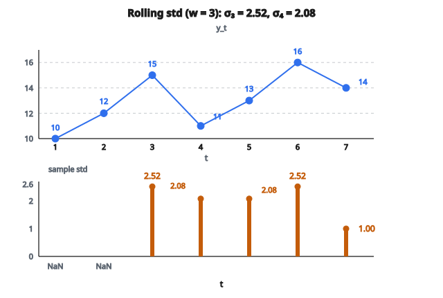

# Rolling Standard Deviation

## Rolling standard deviation là gì?

**Rolling standard deviation** đo độ biến thiên của $w$ quan sát gần nhất trong một chuỗi thời gian. Nó định lượng mức các giá trị phân tán quanh mean cục bộ bên trong một cửa sổ trượt.

$$
\sigma_t(w) = \sqrt{\frac{1}{w-1} \sum_{i=0}^{w-1} (y_{t-i} - \bar{y}_t)^2}
$$

với $\bar{y}_t = \frac{1}{w} \sum_{i=0}^{w-1} y_{t-i}$ là rolling mean.

## Công thức chính

Với chuỗi thời gian $y_1, y_2, \ldots, y_T$, rolling standard deviation tại thời điểm $t$ với cửa sổ $w$ là:

$$
\sigma_t = \sqrt{\frac{1}{w-1} \sum_{i=t-w+1}^{t} (y_i - \bar{y}_t)^2}
$$

**Dạng tính thay thế:**

$$
\sigma_t = \sqrt{\frac{1}{w-1} \left(\sum_{i=t-w+1}^{t} y_i^2 - \frac{1}{w}\left(\sum_{i=t-w+1}^{t} y_i\right)^2\right)}
$$

**Sample vs population:** Mẫu số $w-1$ cho sample standard deviation (Bessel's correction). Dùng $w$ cho population standard deviation.

## Ví dụ số

**Chuỗi thời gian:** $[10, 12, 15, 11, 13, 16, 14]$

**Window size:** $w = 3$

**Kỳ 3:**

Giá trị: $\{10, 12, 15\}$

Mean: $\bar{y}_3 = \frac{10+12+15}{3} = 12.33$

$$
\begin{aligned}
\sigma_3
&= \sqrt{\frac{(10-12.33)^2 + (12-12.33)^2 + (15-12.33)^2}{2}} \\
&= \sqrt{\frac{5.44 + 0.11 + 7.11}{2}} = \sqrt{\frac{12.66}{2}} = \sqrt{6.33} = 2.52
\end{aligned}
$$

**Kỳ 4:**

Giá trị: $\{12, 15, 11\}$

Mean: $\bar{y}_4 = \frac{12+15+11}{3} = 12.67$

$$
\begin{aligned}
\sigma_4
&= \sqrt{\frac{(12-12.67)^2 + (15-12.67)^2 + (11-12.67)^2}{2}} \\
&= \sqrt{\frac{0.45 + 5.43 + 2.79}{2}} = \sqrt{\frac{8.67}{2}} = \sqrt{4.34} = 2.08
\end{aligned}
$$

**Kết quả:** $[\text{NaN}, \text{NaN}, 2.52, 2.08, 2.08, 2.52, 1.00]$

::: {#fig-177-rolling-std fig-cap="σ_3 = 2.52 trên cửa sổ {10, 12, 15}; σ_4 = 2.08 trên {12, 15, 11}. Kết quả [NaN, NaN, 2.52, 2.08, 2.08, 2.52, 1.00] khớp ví dụ số." fig-alt="Chuỗi [10, 12, 15, 11, 13, 16, 14] và rolling std cửa sổ 3: NaN, NaN, 2.52, 2.08, 2.08, 2.52, 1.00; cửa sổ t=3 và t=4 gắn sigma 2.52 và 2.08."}
{fig-align="center"}
:::

## Diễn giải

**Rolling std dev cao:** Các điểm dữ liệu phân tán rộng, biến thiên cao.

**Rolling std dev thấp:** Các điểm dữ liệu tụ gần nhau, biến thiên thấp.

**Trend tăng của std dev:** Volatility đang tăng (heteroscedasticity).

**Trend giảm:** Volatility đang giảm.

**Std dev không đổi:** Homoscedastic (phương sai không đổi).

## Rolling volatility trong tài chính

**Historical volatility:**

$$
\sigma_t = \sqrt{\frac{252}{w-1} \sum_{i=t-w+1}^{t} r_i^2}
$$

với $r_i$ là daily returns và 252 là hệ số annualization (số ngày giao dịch mỗi năm).

**Ứng dụng:**

* Quản trị rủi ro
* Định giá quyền chọn (Black-Scholes dùng volatility)
* Tối ưu danh mục
* Tính VaR

**Ví dụ:** Rolling volatility 20 ngày thường dùng để đánh giá rủi ro ngắn hạn.

## Chọn window size

**Cửa sổ nhỏ (ví dụ $w=5$):**

* Đáp ứng thay đổi gần đây
* Bắt spike volatility ngắn hạn
* Ước lượng nhiễu hơn

**Cửa sổ lớn (ví dụ $w=100$):**

* Ước lượng mượt hơn
* Bắt trend volatility dài hạn
* Đáp ứng chậm với thay đổi gần đây

**Trade-off:** Độ đáp ứng vs độ ổn định.

**Lựa chọn phổ biến:**

* Trong ngày: $w=20$ đến $w=50$ quan sát
* Tài chính ngày: $w=20$ (1 tháng), $w=60$ (3 tháng), $w=252$ (1 năm)
* Tổng quát: Chọn $w$ khớp thang thời gian liên quan

## Hiệu quả tính toán

**Cách ngây thơ:**

Tính lại mean và variance cho mỗi cửa sổ.

Thời gian: $O(w)$ mỗi vị trí, $O(Tw)$ tổng.

**Cách hiệu quả (Welford's algorithm):**

Cập nhật mean và variance tăng dần.

$$
M_t = M_{t-1} + \frac{y_t - y_{t-w}}{w}
$$

$$
S_t = S_{t-1} + (y_t - M_{t-1})(y_t - M_t) - (y_{t-w} - M_{t-1})(y_{t-w} - M_t)
$$

$$
\sigma_t = \sqrt{\frac{S_t}{w-1}}
$$

Thời gian: $O(1)$ mỗi lần cập nhật, $O(T)$ tổng.

**Ưu điểm:** Cập nhật thời gian hằng số, ổn định số.

## Bollinger Bands

**Định nghĩa:**

Dải trên: $\mu_t + k\sigma_t$

Dải giữa: $\mu_t$ (rolling mean)

Dải dưới: $\mu_t - k\sigma_t$

với $k=2$ thường dùng.

**Diễn giải:**

* Giá gần dải trên: có thể overbought
* Giá gần dải dưới: có thể oversold
* Độ rộng dải: thước đo volatility

**Squeeze:** Dải hẹp (volatility thấp), thường đi trước mở rộng volatility.

**Expansion:** Dải rộng (volatility cao), thị trường đang hoạt động mạnh.

## Chuẩn hóa z-score

**Chuẩn hóa giá trị bằng rolling statistics:**

$$
z_t = \frac{y_t - \mu_t}{\sigma_t}
$$

**Diễn giải:**

* $z_t = 0$: Giá trị tại rolling mean
* $z_t = 2$: Giá trị cao hơn rolling mean 2 độ lệch chuẩn
* $z_t = -2$: Giá trị thấp hơn rolling mean 2 độ lệch chuẩn

**Ứng dụng:** Phát hiện outlier, tín hiệu giao dịch mean reversion.

**Ví dụ:** Mua khi $z_t < -2$ (oversold), bán khi $z_t > 2$ (overbought).

## Coefficient of Variation

**Biến thiên tương đối:**

$$
\text{CV}_t = \frac{\sigma_t}{|\mu_t|}
$$

**Diễn giải:** Standard deviation như phần trăm của mean.

**Ưu điểm:** So sánh độc lập thang đo giữa các chuỗi.

**Ví dụ:**

Chuỗi A: $\mu=100$, $\sigma=10$, $\text{CV}=0.1$

Chuỗi B: $\mu=10$, $\sigma=2$, $\text{CV}=0.2$

Chuỗi B có biến thiên tương đối cao hơn dù std dev tuyệt đối nhỏ hơn.

## Sample vs population standard deviation

**Mẫu (ước lượng không chệch):**

$$
s_t = \sqrt{\frac{1}{w-1} \sum_{i=t-w+1}^{t} (y_i - \bar{y}_t)^2}
$$

**Quần thể:**

$$
\sigma_t = \sqrt{\frac{1}{w} \sum_{i=t-w+1}^{t} (y_i - \bar{y}_t)^2}
$$

**Bessel's correction:** $w-1$ hiệu chỉnh bias ở mẫu nhỏ.

**Thực tế:** Dùng sample std dev cho hầu hết ứng dụng. Population std dev hơi ước lượng thấp.

## Rolling variance

**Variance:** Bình phương của standard deviation.

$$
\operatorname{Var}_t = \sigma_t^2 = \frac{1}{w-1} \sum_{i=t-w+1}^{t} (y_i - \bar{y}_t)^2
$$

**Diễn giải:** Độ lệch bình phương trung bình khỏi mean.

**Trường hợp dùng:** Variance cộng được (phương sai danh mục), std dev dễ diễn giải hơn (cùng đơn vị với dữ liệu).

**Quan hệ:** $\sigma = \sqrt{\operatorname{Var}}$

## GARCH vs rolling standard deviation

**Rolling std dev:** Non-parametric, trọng số đều cho quan sát trong cửa sổ.

**GARCH (Generalized Autoregressive Conditional Heteroscedasticity):**

$$
\sigma_t^2 = \omega + \alpha r_{t-1}^2 + \beta \sigma_{t-1}^2
$$

**Trọng số mũ:** Quan sát gần đây được trọng số cao hơn.

**Ưu điểm rolling:** Đơn giản, không cần ước lượng tham số.

**Ưu điểm GARCH:** Bắt volatility clustering, persistence, mean reversion.

**Thực hành tài chính:** GARCH thường được ưa hơn để dự báo volatility.

## Ảnh hưởng outlier

**Std dev nhạy với outlier:**

Một giá trị cực trị làm tăng std dev đáng kể.

**Ví dụ:** $[10, 12, 11, 13, 100]$

Std dev bị 100 kéo mạnh.

**Phương án robust:**

**Median Absolute Deviation (MAD):**

$$
\text{MAD}_t = \mathrm{median}(|y_i - \mathrm{median}(\{y_{t-w+1}, \ldots, y_t\})|)
$$

**Interquartile range (IQR):**

$$
\text{IQR}_t = Q3_t - Q1_t
$$

**Dùng thước đo robust khi outlier là mối lo.**

## Volatility annualized

**Đổi sang volatility năm:**

$$
\sigma_{\text{annual}} = \sigma_{\text{period}} \times \sqrt{n}
$$

với $n$ là số kỳ mỗi năm.

**Ví dụ:**

* Ngày sang năm: $\sigma_{\text{annual}} = \sigma_{\text{daily}} \times \sqrt{252}$
* Tháng sang năm: $\sigma_{\text{annual}} = \sigma_{\text{monthly}} \times \sqrt{12}$

**Giả định độc lập:** Volatility tỉ lệ căn bậc hai của thời gian.

**Ví dụ:** Daily std dev 1.5%.

Năm: $1.5\% \times \sqrt{252} = 1.5\% \times 15.87 = 23.8\%$

## Control charts

**Statistical process control:**

Giám sát ổn định quy trình bằng rolling std dev.

**Upper control limit (UCL):**

$$
\text{UCL} = \mu + 3\sigma
$$

**Lower control limit (LCL):**

$$
\text{LCL} = \mu - 3\sigma
$$

**Tín hiệu mất kiểm soát:** Quan sát vượt control limits.

**Ứng dụng:** Kiểm soát chất lượng sản xuất, giám sát metric dịch vụ.

## Phát hiện heteroscedasticity

**Vẽ rolling std dev theo thời gian:**

**Trend tăng:** Phương sai đang lớn dần (heteroscedasticity).

**Mức không đổi:** Homoscedasticity (phương sai không đổi).

**White test:** Kiểm định formal cho heteroscedasticity.

**Khắc phục:** Biến đổi dữ liệu (log, căn bậc hai) để ổn định phương sai.

**Ví dụ:** Stock returns thể hiện volatility clustering (các giai đoạn volatility cao/thấp).

## Expanding vs rolling window

**Rolling window:** Kích thước cố định $w$, trượt trên dữ liệu.

$$
\sigma_t = f(y_{t-w+1}, \ldots, y_t)
$$

**Expanding window:** Gồm mọi dữ liệu từ đầu đến thời điểm $t$.

$$
\sigma_t = f(y_1, \ldots, y_t)
$$

**Ưu điểm rolling:** Thích nghi volatility đổi, ước lượng cục bộ.

**Ưu điểm expanding:** Dùng mọi thông tin có, ổn định với quá trình dừng.

**Chọn dựa trên:** Volatility có đổi theo thời gian không? (Dùng rolling) Hay không đổi? (Dùng expanding)

## Realized volatility

**Dữ liệu tần số cao:**

Tính return trong ngày, cộng bình phương return.

$$
\text{RV}_t = \sum_{i=1}^{M} r_{t,i}^2
$$

với $M$ là số quan sát trong ngày.

**Căn bậc hai:**

$$
\sigma_t = \sqrt{\text{RV}_t}
$$

**Ưu điểm:** Ước lượng volatility chính xác hơn nhờ thông tin trong ngày.

**Ứng dụng:** Dự báo volatility hiện đại, định giá quyền chọn.

## Khoảng tin cậy

**Với dữ liệu phân phối chuẩn:**

$$
\sigma_{\text{true}}^2 \in \left[\frac{(w-1)s^2}{\chi^2_{\alpha/2, w-1}}, \frac{(w-1)s^2}{\chi^2_{1-\alpha/2, w-1}}\right]
$$

**Khoảng rộng khi $w$ nhỏ:** Bất định cao với ít quan sát.

**Khoảng hẹp khi $w$ lớn:** Ước lượng chính xác hơn.

**Thực tế:** Rolling std dev là ước lượng điểm. Khoảng tin cậy đo độ bất định.

## Phương án Mean Absolute Deviation

**MAD:**

$$
\text{MAD}_t = \frac{1}{w} \sum_{i=t-w+1}^{t} |y_i - \bar{y}_t|
$$

**So với std dev:**

* MAD: Ít nhạy với outlier hơn
* Std dev: Phạt độ lệch lớn mạnh hơn (hạng bình phương)

**Quan hệ:** Với phân phối chuẩn, $\text{MAD} \approx 0.8 \sigma$

**Dùng MAD khi:** Outlier là mối lo và cần độ bền.

## Downside deviation

**Semivariance:** Chỉ xét độ lệch âm.

$$
\sigma_{\text{down},t} = \sqrt{\frac{1}{w} \sum_{i=t-w+1}^{t} \min(y_i - \bar{y}_t, 0)^2}
$$

**Sortino ratio:**

$$
\text{Sortino} = \frac{\bar{r} - r_f}{\sigma_{\text{down}}}
$$

**Diễn giải:** Lợi nhuận điều chỉnh rủi ro, chỉ tập trung downside risk.

**Ưu điểm:** Liên quan hơn với nhà đầu tư (volatility phía trên là điều muốn, phía dưới mới là rủi ro).

## Rolling covariance và correlation

**Rolling covariance giữa hai chuỗi:**

$$
\operatorname{Cov}_t(x, y) = \frac{1}{w-1} \sum_{i=t-w+1}^{t} (x_i - \bar{x}_t)(y_i - \bar{y}_t)
$$

**Rolling correlation:**

$$
\rho_t = \frac{\operatorname{Cov}_t(x, y)}{\sigma_{x,t} \sigma_{y,t}}
$$

**Ứng dụng:** Đa dạng hóa danh mục (tương quan đổi theo thời gian), pairs trading.

## Value at Risk

**VaR:** Tổn thất tối đa tại mức tin cậy cho trước.

**Parametric VaR dùng rolling std dev:**

$$
\text{VaR}_{\alpha} = \mu_t - z_{\alpha} \sigma_t
$$

**Ví dụ:** 95% VaR với $\mu_t=0.1\%$, $\sigma_t=1.5\%$

$$
\text{VaR}_{0.05} = 0.1\% - 1.645 \times 1.5\% = -2.37\%
$$

**Diễn giải:** 5% khả năng lỗ hơn 2.37% ở kỳ tiếp theo.

## Rolling skewness và kurtosis

**Skewness:** Đo độ lệch đối xứng.

$$
\text{Skew}_t = \frac{1}{w} \sum_{i=t-w+1}^{t} \left(\frac{y_i - \bar{y}_t}{\sigma_t}\right)^3
$$

**Kurtosis:** Đo độ nặng đuôi.

$$
\text{Kurt}_t = \frac{1}{w} \sum_{i=t-w+1}^{t} \left(\frac{y_i - \bar{y}_t}{\sigma_t}\right)^4
$$

**Ứng dụng:** Nhận dạng đặc trưng phân phối đổi theo thời gian.

## Phát hiện regime

**Volatility regimes:**

Volatility thấp: $\sigma_t < \text{threshold}_1$

Volatility trung bình: $\text{threshold}_1 \leq \sigma_t < \text{threshold}_2$

Volatility cao: $\sigma_t \geq \text{threshold}_2$

**Ứng dụng:**

* Điều chỉnh chiến lược giao dịch theo regime
* Quản trị rủi ro (giảm exposure khi volatility cao)
* Chiến lược quyền chọn (bán volatility khi cao, mua khi thấp)

## Exponentially Weighted Moving Std Dev

**Phương sai EWMA:**

$$
\sigma_t^2 = \lambda \sigma_{t-1}^2 + (1-\lambda) r_t^2
$$

**Cách tiếp cận RiskMetrics:** $\lambda = 0.94$ cho dữ liệu ngày.

**Ưu điểm:**

* Xét toàn bộ lịch sử (không chỉ cửa sổ)
* Dữ liệu gần đây được trọng số cao hơn
* Tiến hóa mượt

**So với rolling:** EWMA thích nghi nhanh hơn khi regime đổi.

## Đánh giá dự báo

**Rolling std dev cho khoảng dự báo:**

$$
\text{Forecast interval} = \hat{y}_{t+h} \pm z_{\alpha/2} \sigma_t
$$

**Giả định:** Phương sai sai số dự báo bằng phương sai gần đây.

**Ví dụ:** Point forecast 105, rolling std dev 3.

Khoảng 95%: $105 \pm 1.96 \times 3 = [99.12, 110.88]$

**Hạn chế:** Giả định phân phối sai số khớp hành vi gần đây.

## Phân tích đa thang

**Tính rolling std dev trên nhiều cửa sổ:**

* Ngắn hạn: $w=10$ (volatility gần đây)
* Trung hạn: $w=50$ (volatility trung gian)
* Dài hạn: $w=200$ (volatility nền)

**So sánh:** Volatility ngắn hạn có cao hơn dài hạn không? (Rủi ro tăng)

**Ứng dụng:** Quản trị rủi ro thích nghi, nhận spike volatility so với nền.

## Lưu ý thực tế

**Window size tối thiểu:** Ít nhất 20–30 quan sát để ước lượng std dev đáng tin.

**Ổn định số:** Dùng two-pass hoặc Welford's algorithm để tránh catastrophic cancellation.

**Dữ liệu thiếu:** Xử lý NaN (bỏ qua hoặc nội suy trước khi tính std dev).

**Tần số:** Khớp window size với thang thời gian bài toán (giờ, ngày, tháng).

**Kiểm định:** Backtest xem rolling std dev có phản ánh đúng realized volatility không.

## Code
```python
import math

def rolling_std(values, window_size):
    """
    Compute the rolling population standard deviation.
    """
    result = []
    for i in range(len(values) - window_size + 1):
        window = values[i:i + window_size]
        mean = sum(window) / window_size
        var = sum((x - mean) ** 2 for x in window) / window_size
        result.append(math.sqrt(var))
    return result

```
