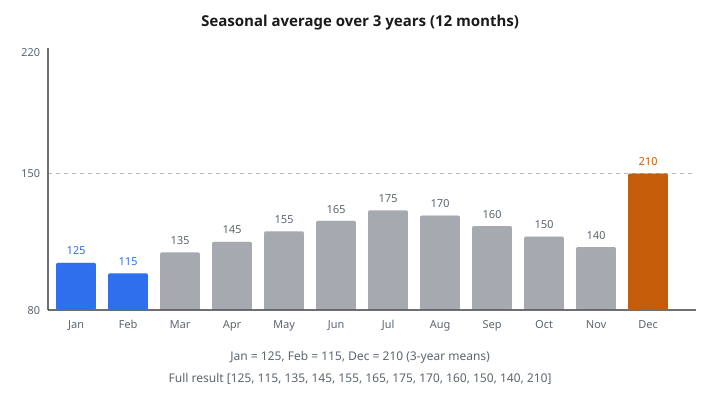

# Seasonal Average

## Seasonal average là gì

**Seasonal average** là giá trị trung bình của mỗi mùa (vị trí trong một chu kỳ) qua nhiều chu kỳ. Nó bắt các mẫu lặp lại theo khoảng đều.

$$
\bar{y}_s = \frac{1}{n} \sum_{i=1}^{n} y_{s + (i-1) \cdot m}
$$

với $s$ là chỉ số mùa (từ 1 đến $m$), $m$ là số mùa mỗi chu kỳ, và $n$ là số chu kỳ.

## Công thức chính

Với time series chu kỳ seasonal $m$, seasonal average của mùa $s$ là:

$$
\bar{y}_s = \frac{1}{n} \sum_{j=1}^{n} y_{s,j}
$$

với $y_{s,j}$ là giá trị mùa $s$ trong chu kỳ $j$, và $n$ là tổng số chu kỳ.

**Ví dụ:** Dữ liệu tháng (12 mùa).

Trung bình tháng 1: Mean mọi giá trị tháng 1 qua các năm.

$$
\bar{y}_{\text{Jan}} = \frac{y_{\text{Jan},2020} + y_{\text{Jan},2021} + y_{\text{Jan},2022}}{3}
$$

## Ví dụ số

**Doanh số tháng trên 3 năm:**

Năm 1: $[120, 110, 130, 140, 150, 160, 170, 165, 155, 145, 135, 200]$

Năm 2: $[125, 115, 135, 145, 155, 165, 175, 170, 160, 150, 140, 210]$

Năm 3: $[130, 120, 140, 150, 160, 170, 180, 175, 165, 155, 145, 220]$

**Seasonal average:**

Tháng 1 (January): $\frac{120 + 125 + 130}{3} = 125$

Tháng 2 (February): $\frac{110 + 115 + 120}{3} = 115$

Tháng 3 (March): $\frac{130 + 135 + 140}{3} = 135$

…

Tháng 12 (December): $\frac{200 + 210 + 220}{3} = 210$

**Kết quả:** $[125, 115, 135, 145, 155, 165, 175, 170, 160, 150, 140, 210]$

::: {#fig-191-seasonal-avg fig-cap="Seasonal average 12 tháng = [125, 115, 135, 145, 155, 165, 175, 170, 160, 150, 140, 210]. Jan = 125, Feb = 115, Dec = 210 lấy trung bình 3 năm trong bài." fig-alt="Mười hai seasonal average tháng; Jan=125, Feb=115, Dec=210 được đánh dấu."}
{fig-align="center"}
:::

## Diễn giải

**Seasonal average cao:** Mùa đó thường có giá trị cao.

**Seasonal average thấp:** Mùa đó thường có giá trị thấp.

**Mẫu:** Chỉ ra mùa mạnh so với mùa yếu.

**Ví dụ:** Bán lẻ cao vào tháng 12 (mua sắm lễ), thấp vào tháng 1 (sau lễ).

**Use case:** Lập ngân sách, hoạch định tồn kho, nhân sự.

## Seasonal index

**Chuẩn hóa seasonal average theo mean tổng thể:**

$$
\text{SI}_s = \frac{\bar{y}_s}{\bar{y}_{\text{overall}}}
$$

**Diễn giải:**

* $\text{SI}_s = 1.2$: Mùa cao hơn trung bình 20%
* $\text{SI}_s = 0.8$: Mùa thấp hơn trung bình 20%
* $\text{SI}_s = 1.0$: Mùa đúng trung bình

**Ví dụ:**

Mean tổng thể: 150

Trung bình tháng 12: 210

Index tháng 12: $\frac{210}{150} = 1.4$ (cao hơn trung bình 40%)

## Seasonality cộng so với nhân

**Mô hình cộng:**

$$
y_t = \text{Trend}_t + \text{Seasonal}_s + \text{Error}_t
$$

Thành phần seasonal: $\text{Seasonal}_s = \bar{y}_s - \bar{y}_{\text{overall}}$

**Mô hình nhân:**

$$
y_t = \text{Trend}_t \times \text{Seasonal}_s \times \text{Error}_t
$$

Thành phần seasonal: $\text{Seasonal}_s = \frac{\bar{y}_s}{\bar{y}_{\text{overall}}}$

**Chọn cộng khi:** Biến thiên seasonal ổn định về độ lớn.

**Chọn nhân khi:** Biến thiên seasonal tỉ lệ với mức (phổ biến trong dữ liệu kinh doanh).

## Phân rã seasonal

**Phân rã cổ điển:**

1. Tính trend (moving average chu kỳ $m$)
2. Gỡ trend: $y_t - \text{Trend}_t$ (cộng) hoặc $y_t / \text{Trend}_t$ (nhân)
3. Tính seasonal average từ dữ liệu đã gỡ trend
4. Căn giữa thành phần seasonal (tổng 0 hoặc tích bằng $m$)
5. Phần dư: $\text{Remainder}_t = y_t - \text{Trend}_t - \text{Seasonal}_s$

**Kết quả:** Tách trend, seasonality, và nhiễu.

## Ví dụ phân rã số

**Dữ liệu:** $[10, 15, 12, 16, 20, 18, 22, 30, 25, 28, 35, 32]$ (quý trên 3 năm)

**Bước 1: Tính trend** (moving average 4 quý)

MA căn giữa: $[\mathrm{NaN}, \mathrm{NaN}, 13.25, 15.75, 17.00, 19.00, 22.50, 23.75, 26.25, 28.75, 30.00, \mathrm{NaN}]$

**Bước 2: Gỡ trend** (nhân)

Tỉ số: $[\mathrm{NaN}, \mathrm{NaN}, 0.906, 1.016, 1.176, 0.947, 0.978, 1.263, 0.952, 0.974, 1.167, \mathrm{NaN}]$

**Bước 3: Seasonal average**

Q1: $0.906$, $0.978$ → Trung bình $0.942$

Q2: $1.016$, $1.263$ → Trung bình $1.140$

Q3: $1.176$, $0.952$ → Trung bình $1.064$

Q4: $0.947$, $0.974$, $1.167$ → Trung bình $1.029$

**Bước 4: Chuẩn hóa** (để tích bằng 4)

Tích $= 1.173$, chỉnh bằng cách chia mỗi số cho $(1.173/4)^{1/4} = 1.040$

**Seasonal index cuối:** $[0.906, 1.096, 1.023, 0.989]$

## Dự báo bằng seasonal average

**Dự báo seasonal naive:**

$$
\hat{y}_{t+h} = \bar{y}_s
$$

với $s = ((t+h-1) \bmod m) + 1$

**Ví dụ:** Dự báo tháng 1 tới bằng trung bình các tháng 1 trước.

**Dự báo cải tiến (trend + seasonal):**

$$
\hat{y}_{t+h} = \text{Trend}_{t+h} + \bar{y}_s
$$

hoặc

$$
\hat{y}_{t+h} = \text{Trend}_{t+h} \times \text{SI}_s
$$

**Ngoại suy trend:** Tuyến tính, mũ, hoặc dựa trên mô hình.

## Seasonal adjustment

**Gỡ seasonality để lộ trend nền:**

**Cộng:**

$$
y_{t,\text{adj}} = y_t - \text{Seasonal}_s
$$

**Nhân:**

$$
y_{t,\text{adj}} = \frac{y_t}{\text{SI}_s}
$$

**Use case:** So sánh giá trị giữa các mùa cho công bằng, phân tích trend không nhiễu seasonal.

**Ví dụ:** Tỷ lệ thất nghiệp seasonally adjusted để gỡ biến thiên dự đoán được.

## X-12-ARIMA và X-13-ARIMA-SEATS

**Phương pháp chính thức của cơ quan nhà nước:**

Thủ tục seasonal adjustment nâng cao.

**Tính năng:**

* Xử lý hiệu ứng ngày giao dịch
* Hiệu chỉnh ngày lễ
* Phát hiện outlier
* Mô hình ARIMA cho thành phần bất quy tắc

**Phần mềm:** U.S. Census Bureau cung cấp triển khai.

**Ứng dụng:** Thống kê kinh tế chính thức (GDP, CPI, thất nghiệp).

## Moving average căn giữa để gỡ trend

**Moving average đối xứng:**

$$
\text{CMA}_t = \frac{1}{m} \sum_{i=-k}^{k} y_{t+i}
$$

với $m = 2k+1$ khi $m$ lẻ.

**Khi $m$ chẵn (ví dụ $m=12$):**

$$
\text{CMA}_t = \frac{1}{2m} \left(y_{t-m/2} + 2\sum_{i=-m/2+1}^{m/2-1} y_{t+i} + y_{t+m/2}\right)
$$

**Mục đích:** Gỡ seasonality trong khi giữ trend.

**Lưu ý:** Cần dữ liệu hai phía (không nhân quả).

## Kiểm định seasonality

**Nhìn bằng mắt:**

Vẽ dữ liệu và tìm mẫu lặp.

**Hàm autocorrelation (ACF):**

Đỉnh có ý nghĩa tại lag $m, 2m, 3m, \ldots$ báo seasonality.

**Seasonal subseries plot:**

Vẽ mọi giá trị của từng mùa. Nếu mean khác nhau rõ, có seasonality.

**Kiểm định hình thức:**

* QS test (Maravall)
* OCSB test (Osborn–Chui–Smith–Birchenhall)
* Kruskal–Wallis test

## Seasonality đổi theo thời gian

**Vấn đề:** Mẫu seasonal tiến hóa.

**Ví dụ:** Seasonality bán máy lạnh đổi theo xu hướng khí hậu.

**Cách xử lý:**

**1. Moving seasonal average:**

Tính seasonal average chỉ trên chu kỳ gần đây.

$$
\bar{y}_{s,t} = \frac{1}{k} \sum_{j=t-km+1}^{t} y_{s,j}
$$

Dùng $k$ chu kỳ cuối thay vì cả lịch sử.

**2. Phân rã STL:**

Seasonal-Trend decomposition using Loess.

Cho phép thành phần seasonal đổi dần.

**3. Mô hình state space:**

Tham số seasonal biến thiên theo thời gian.

## Dummy seasonal trong regression

**Biến chỉ báo cho mỗi mùa:**

$$
y_t = \beta_0 + \sum_{s=1}^{m-1} \beta_s D_{s,t} + \epsilon_t
$$

với $D_{s,t} = 1$ nếu quan sát $t$ thuộc mùa $s$, ngược lại 0.

**Diễn giải:** $\beta_s$ là chênh lệch giữa mùa $s$ và mùa tham chiếu.

**Ưu điểm:** Nhúng seasonality vào khung regression.

**Ví dụ:** Dữ liệu quý với Q4 làm tham chiếu.

Dummy Q1, Q2, Q3 bắt hiệu ứng seasonal.

## Seasonality Fourier

**Biểu diễn seasonality bằng số hạng sine và cosine:**

$$
y_t = \beta_0 + \sum_{k=1}^{K} \left[\alpha_k \sin\left(\frac{2\pi k t}{m}\right) + \gamma_k \cos\left(\frac{2\pi k t}{m}\right)\right] + \epsilon_t
$$

**Ưu điểm:** Mẫu seasonal mượt, tiết kiệm tham số (ít hơn dummy).

**Nhược điểm:** Giả định mẫu tuần hoàn mượt.

**Dùng khi:** Chu kỳ seasonal dài (ví dụ $m=52$ với dữ liệu tuần).

## Hiệu chỉnh lịch

**Hiệu ứng ngày giao dịch:**

Số ngày weekday trong tháng thay đổi.

**Cách xử lý:** Hiệu chỉnh theo ngày giao dịch.

$$
y_{t,\text{adj}} = y_t \times \frac{\text{số ngày TB}}{\text{số ngày thực}}
$$

**Hiệu ứng lễ:**

Easter, Thanksgiving, Tết nguyên đán đổi ngày.

**Cách làm:** Thêm dummy lễ hoặc dùng phương pháp chuyên biệt (X-13).

**Hiệu chỉnh độ dài tháng:**

Tháng 2 ít ngày hơn.

**Tốc độ mỗi ngày:** $\frac{y_t}{\text{số ngày trong tháng}_t}$

## Seasonal subseries plot

**Cách làm:**

Vẽ mọi quan sát của mỗi mùa trên panel riêng.

**Ví dụ:** Dữ liệu tháng.

12 panel, mỗi panel mọi giá trị tháng 1, mọi giá trị tháng 2, v.v.

**Đường ngang:** Seasonal average của mùa đó.

**Diễn giải:**

* Biến thiên trong mùa cho thấy volatility
* Trend trong mùa cho thấy tiến hóa
* Khác biệt giữa panel cho thấy mẫu seasonal

## Holt–Winters seasonal smoothing

**Triple exponential smoothing:**

**Level:** $\ell_t = \alpha(y_t - s_{t-m}) + (1-\alpha)(\ell_{t-1} + b_{t-1})$

**Trend:** $b_t = \beta(\ell_t - \ell_{t-1}) + (1-\beta)b_{t-1}$

**Seasonal:** $s_t = \gamma(y_t - \ell_t) + (1-\gamma)s_{t-m}$

**Dự báo:**

$$
\hat{y}_{t+h} = \ell_t + hb_t + s_{t+h-m\lfloor (h-1)/m \rfloor}
$$

**Ưu điểm:** Thích nghi khi mẫu đổi; mọi thành phần được cập nhật mỗi kỳ.

## Mô hình Seasonal ARIMA

**SARIMA$(p,d,q)(P,D,Q)_{m}$:**

Ghép thành phần không seasonal và seasonal.

**Không seasonal:** AR($p$), sai phân($d$), MA($q$)

**Seasonal:** AR($P$) tại lag $m$, sai phân($D$) tại lag $m$, MA($Q$) tại lag $m$

**Ví dụ:** SARIMA$(1,1,1)(1,1,1)_{12}$ cho dữ liệu tháng.

**Sai phân seasonal:**

$$
\nabla_m y_t = y_t - y_{t-m}
$$

Gỡ mẫu seasonal.

## Periodogram và phân tích phổ

**Periodogram:**

$$
I(\omega) = \frac{1}{T} \left\lvert\sum_{t=1}^{T} y_t e^{-i\omega t}\right\rvert^2
$$

**Đỉnh tại tần số:** Báo tính tuần hoàn.

**Tần số seasonal:** $\omega = \frac{2\pi}{m}$

**Ví dụ:** Dữ liệu tháng ($m=12$).

Đỉnh tại $\omega = \frac{\pi}{6}$ báo seasonality năm.

**Dùng:** Phát hiện nhiều mẫu seasonal (tuần và năm).

## Nhiều seasonality

**Mẫu phức:** Nhiều chu kỳ seasonal.

**Ví dụ:** Nhu cầu điện theo giờ.

* Mẫu ngày (24 giờ)
* Mẫu tuần (7 ngày)
* Mẫu năm (365 ngày)

**Mô hình TBATS:**

Trigonometric, Box-Cox, ARMA, Trend, Seasonal.

Xử lý nhiều seasonality với chu kỳ khác nhau.

**STR (Seasonal-Trend decomposition with Regression):**

Phân rã chuỗi có nhiều mẫu seasonal.

## Đứt seasonal

**Đổi cấu trúc trong mẫu seasonal:**

Mẫu dịch tại một thời điểm cụ thể.

**Ví dụ:** Seasonality bán lẻ đổi sau thay đổi chính sách lớn.

**Phát hiện:** Kiểm định CUSUM, kiểm định Chow trên dummy seasonal.

**Mô hình hóa:** Cho phép tham số seasonal khác trước/sau điểm gãy.

**Biến dummy:**

$$
D_{s,t} \times \mathbb{1}_{t > \tau}
$$

với $\tau$ là điểm gãy.

## Nội suy giá trị seasonal thiếu

**Quan sát thiếu ở mùa cụ thể:**

**Cách 1:** Dùng seasonal average.

$$
\hat{y}_t = \bar{y}_s
$$

**Cách 2:** Nội suy theo mẫu seasonal.

$$
\hat{y}_t = \text{Trend}_t + \bar{y}_s
$$

**Cách 3:** Kalman filter với mô hình state space seasonal.

**Chọn theo:** Lượng dữ liệu thiếu, độ phức tạp của mẫu.

## Metric chất lượng seasonal adjustment

**F-test:** So sánh phương sai giải thích bởi thành phần seasonal với phương sai residual.

**M-statistic:** Bộ chẩn đoán chất lượng seasonal adjustment.

**Chẩn đoán phổ:** Kiểm tra tần số seasonal đã bị gỡ khỏi chuỗi đã hiệu chỉnh.

**Lịch sử revision:** Đánh giá độ ổn định của hiệu chỉnh theo thời gian.

**Kiểm định residual seasonality:** Xác nhận không còn mẫu seasonal sau hiệu chỉnh.

## Ứng dụng kinh doanh

**Bán lẻ:** Lập tồn kho theo mẫu cầu seasonal.

**Du lịch:** Bố trí nhân sự khách sạn và điểm đến theo đỉnh seasonal.

**Nông nghiệp:** Dự báo năng suất có kể mùa trồng.

**Năng lượng:** Dự báo cầu điện/gas với hiệu ứng nhiệt độ seasonal.

**Tài chính:** Hiệu chỉnh earnings theo mẫu seasonal (Q4 thường mạnh nhất).

**HR:** Dẫn trước nhu cầu tuyển seasonal (mùa lễ bán lẻ).

## Seasonal average để phát hiện outlier

**So với chuẩn seasonal:**

$$
\text{Deviation}_t = y_t - \bar{y}_s
$$

**Gắn cờ outlier:** $|\text{Deviation}_t| > k \sigma_s$

với $\sigma_s$ là độ lệch chuẩn của mùa $s$.

**Ví dụ:** Doanh số tháng 2 bất thường cao (thường là mùa thấp) có thể báo sự kiện đặc biệt.

**Ứng dụng:** Kiểm soát chất lượng, phát hiện anomaly.

## Kỹ thuật trực quan

**Seasonal plot:**

Chồng nhiều năm, mỗi mùa trên trục $x$.

**Đồ thị cực (tròn):**

Góc là mùa, bán kính là giá trị.

**Heatmap:**

Hàng = năm, cột = mùa, màu = giá trị.

**Box plot theo mùa:**

Phân phối giá trị mỗi mùa.

**Tất cả giúp:** Nhận mẫu seasonal bằng mắt.

## Khó khăn với time series ngắn

**Ít chu kỳ:** Seasonal average không tin cậy.

**Quy tắc ngón tay cái:** Cần ít nhất 2–3 chu kỳ đủ để ước lượng seasonal ổn định.

**Cách xử lý:**

1. Dùng seasonal index ngoài (mốc ngành)
2. Gộp dữ liệu giữa các thực thể tương tự
3. Dùng tri thức miền để đặt mẫu seasonal
4. Dùng Bayesian với prior có thông tin

**Ví dụ:** Sản phẩm mới chỉ có 1 năm dữ liệu. Dùng mẫu seasonal cấp category.

## So với moving average

**Seasonal average:** Trung bình qua các chu kỳ tại cùng mùa.

**Moving average:** Trung bình các quan sát liên tiếp.

**Mục đích:**

* Seasonal average: Tách mẫu seasonal
* Moving average: Làm mượt nhiễu, tách trend

**Bổ sung:** Thường dùng cùng nhau trong phân rã.

**Ví dụ:** Gỡ trend bằng MA, tính seasonal average trên chuỗi đã gỡ trend.

## Đồng biến seasonal

**Seasonality chéo mặt cắt:**

Nhiều chuỗi chia sẻ một mẫu seasonal.

**Ví dụ:** Mọi hạng mục bán lẻ đỉnh vào tháng 12.

**Mô hình nhân tố:** Tách nhân tố seasonal chung.

**Ứng dụng:** Dự báo chuỗi liên quan, đa dạng hóa danh mục.

**Tương quan theo mùa:** Tương quan có thể đổi giữa các mùa.

## Code
```python
def seasonal_average(series, period):
    """
    Compute the average value for each position in the seasonal cycle.
    """
    result = []
    for p in range(period):
        values = [series[i] for i in range(p, len(series), period)]
        result.append(sum(values) / len(values))
    return result

```
