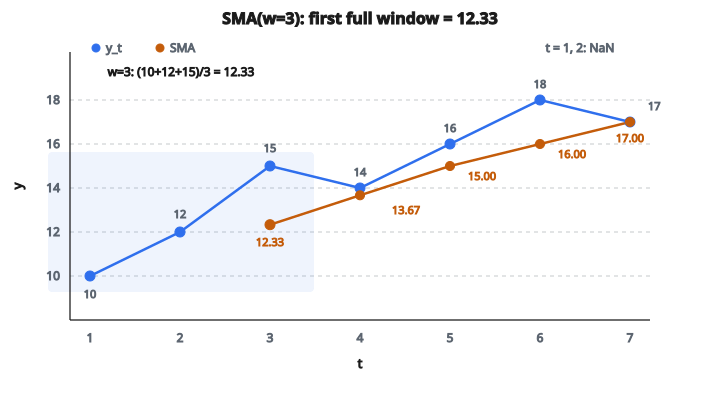

# Simple Moving Average

## SMA là gì

**Simple moving average (SMA)** là trung bình của $w$ quan sát gần nhất trong một time series. SMA tạo ra phiên bản đã làm mượt của dữ liệu bằng cách lấy trung bình các dao động ngắn hạn.

$$
\text{SMA}_t(w) = \frac{1}{w} \sum_{i=0}^{w-1} y_{t-i}
$$

với $w$ là kích thước cửa sổ (window size).

## Công thức chính

Với time series $y_1, y_2, \ldots, y_T$, SMA tại thời điểm $t$ với cửa sổ $w$ là:

$$
\text{SMA}_t = \frac{y_t + y_{t-1} + \ldots + y_{t-w+1}}{w}
$$

**Ví dụ với $w = 3$:**

$$
\text{SMA}_t = \frac{y_t + y_{t-1} + y_{t-2}}{3}
$$

## Ví dụ số

**Time series:** [10, 12, 15, 14, 16, 18, 17]

**Kích thước cửa sổ:** $w = 3$

**Tính toán:**

* $t=3$: $\text{SMA}_3 = \frac{10 + 12 + 15}{3} = \frac{37}{3} = 12.33$
* $t=4$: $\text{SMA}_4 = \frac{12 + 15 + 14}{3} = \frac{41}{3} = 13.67$
* $t=5$: $\text{SMA}_5 = \frac{15 + 14 + 16}{3} = \frac{45}{3} = 15.00$
* $t=6$: $\text{SMA}_6 = \frac{14 + 16 + 18}{3} = \frac{48}{3} = 16.00$
* $t=7$: $\text{SMA}_7 = \frac{16 + 18 + 17}{3} = \frac{51}{3} = 17.00$

**Kết quả:** [NaN, NaN, 12.33, 13.67, 15.00, 16.00, 17.00]

$w-1$ giá trị đầu không xác định.

::: {#fig-162-sma fig-cap="SMA với $w=3$: hai điểm đầu là NaN; từ $t=3$, SMA$_3$ = (10+12+15)/3 = 12.33 rồi 13.67, 15.00, 16.00, 17.00." fig-alt="Time series y_t = [10, 12, 15, 14, 16, 18, 17] va SMA voi w = 3 bat dau tu t = 3: [12.33, 13.67, 15.00, 16.00, 17.00]. Cua so dau (10+12+15)/3 = 12.33."}
{fig-align="center"}
:::

## Mục đích và ứng dụng

**Làm mượt:**

Loại nhiễu ngẫu nhiên và lộ xu hướng nền.

**Nhận diện trend:**

Độ dốc lên cho thấy xu hướng tăng; độ dốc xuống cho thấy xu hướng giảm.

**Hỗ trợ và kháng cự (support/resistance):**

Trong giao dịch, SMA đóng vai trò mức support/resistance động.

**Baseline dự báo:**

Dự đoán đơn giản: giá trị tiếp theo = SMA hiện tại.

## Chọn kích thước cửa sổ

**Cửa sổ nhỏ (ví dụ $w=3$):**

* Nhạy hơn với thay đổi gần đây
* Bám sát dữ liệu
* Còn lại nhiều nhiễu hơn

**Cửa sổ lớn (ví dụ $w=50$):**

* Đường cong mượt hơn
* Kém nhạy hơn (chỉ báo trễ)
* Loại được nhiều nhiễu hơn

**Đánh đổi:** Độ nhạy so với độ mượt.

## Hiệu ứng trễ (lag)

SMA là chỉ báo trễ (lagging indicator): nó phản ứng với thay đổi sau khi thay đổi đã xảy ra.

**Độ trễ:** Khoảng $\frac{w-1}{2}$ bước thời gian.

**Ví dụ:** Với $w=10$, SMA trễ khoảng 4.5 bước.

**Hệ quả:** Không phù hợp để phát hiện thay đổi theo thời gian thực. Trend đã đổi khi SMA mới thể hiện điều đó.

## Xử lý mép chuỗi

**Ở đầu chuỗi ($t < w$):**

Không tính được SMA đủ cửa sổ.

**Các lựa chọn:**

1. Để NaN / không xác định
2. Dùng expanding window: $\text{SMA}_t = \frac{1}{t} \sum_{i=1}^{t} y_i$
3. Pad bằng giá trị ban đầu hoặc trung bình toàn cục

Phổ biến nhất: để các giá trị đầu là NaN.

## SMA cho dự báo

**Dự báo ngây thơ (naive forecast):**

$$
\hat{y}_{t+1} = \text{SMA}_t
$$

Dự đoán giá trị tiếp theo bằng trung bình của các giá trị gần đây.

**Nhiều bước:**

$$
\hat{y}_{t+h} = \text{SMA}_t \quad \text{với mọi } h > 0
$$

Forecast phẳng (hằng số).

## Moving average căn giữa

Thay vì chỉ dùng giá trị quá khứ, đặt cửa sổ căn giữa:

$$
\text{CMA}_t = \frac{1}{w} \sum_{i=-(w-1)/2}^{(w-1)/2} y_{t+i}
$$

**Với $w=5$ lẻ:**

$$
\text{CMA}_t = \frac{y_{t-2} + y_{t-1} + y_t + y_{t+1} + y_{t+2}}{5}
$$

**Ưu điểm:** Không trễ, làm mượt tốt hơn.

**Nhược điểm:** Cần giá trị tương lai (không nhân quả).

Dùng cho phân tích hồi cứu, không dùng cho forecasting.

## SMA trong giao dịch cổ phiếu

**Golden Cross:** SMA nhanh (50 ngày) cắt lên trên SMA chậm (200 ngày). Tín hiệu tăng (bullish).

**Death Cross:** SMA nhanh cắt xuống dưới SMA chậm. Tín hiệu giảm (bearish).

**Giá so với SMA:**

* Giá > SMA: Uptrend, bullish
* Giá < SMA: Downtrend, bearish

## Nhiều SMA

Dùng đồng thời vài cửa sổ:

* Ngắn hạn: $w=10$
* Trung hạn: $w=50$
* Dài hạn: $w=200$

**Cách đọc:**

* Mọi SMA đều tăng: Uptrend mạnh
* Ngắn > Trung > Dài: Dóng hàng bullish
* Cắt nhau: Thay đổi trend

## SMA so với Exponential Moving Average

**SMA:** Trọng số đều cho cả $w$ quan sát.

**EMA:** Trọng số giảm theo hàm mũ, nặng hơn cho giá trị gần đây.

$$
\text{EMA}_t = \alpha y_t + (1-\alpha) \text{EMA}_{t-1}
$$

**Ưu điểm SMA:**

* Tính và hiểu đơn giản
* Không có tham số ngoài kích thước cửa sổ

**Ưu điểm EMA:**

* Nhạy hơn với thay đổi gần đây
* Trọng số liên tục, mượt

## Hiệu quả tính toán

**Cách ngây thơ:** Tính lại tổng mỗi lần.

Độ phức tạp thời gian: $O(w)$ mỗi giá trị, $O(Tw)$ tổng cộng.

**Cách hiệu quả:** Running sum.

$$
\text{SMA}_t = \text{SMA}_{t-1} + \frac{y_t - y_{t-w}}{w}
$$

Độ phức tạp thời gian: $O(1)$ mỗi giá trị, $O(T)$ tổng cộng.

Trừ giá trị cũ nhất, cộng giá trị mới nhất, chia cho $w$.

## SMA cho điều chỉnh mùa vụ

Dùng SMA với cửa sổ = chu kỳ mùa vụ để loại mùa vụ:

**Dữ liệu tháng với mùa vụ theo năm:**

$w = 12$ lấy trung bình và triệt tiêu pattern mùa vụ.

**Kết quả:** Thành phần trend-cycle, không còn dao động mùa vụ.

**Lưu ý:** Cũng loại luôn mọi tín hiệu ở tần số đó.

## Tách tín hiệu

SMA phân rã chuỗi:

$$
y_t = \text{Trend}_t + \text{Noise}_t
$$

với $\text{Trend}_t \approx \text{SMA}_t$ và $\text{Noise}_t = y_t - \text{SMA}_t$.

**Phân tích residual:** Xem $y_t - \text{SMA}_t$ để tìm pattern.

## Diễn giải miền tần số

SMA hoạt động như bộ lọc thông thấp (low-pass filter):

* Làm suy giảm thành phần tần số cao (nhiễu, thay đổi nhanh)
* Giữ thành phần tần số thấp (trend)

**Hàm truyền:** Hàm sinc trên miền tần số.

**Tần số cắt:** Phụ thuộc $w$; $w$ lớn thì tần số cắt thấp hơn.

## Có trọng số và không trọng số

SMA gán trọng số đều $\frac{1}{w}$ cho mỗi quan sát.

**Hiệu ứng cắt cụt:** Quan sát $t-w$ có trọng số $\frac{1}{w}$, quan sát $t-w-1$ có trọng số $0$.

Trọng số không liên tục gây hiệu ứng mép.

**Lựa chọn khác:** MA có trọng số mượt (tam giác, Gaussian).

## SMA cho phát hiện bất thường

**Phương pháp:**

1. Tính SMA
2. Tính độ lệch chuẩn của residual
3. Đánh dấu các điểm thỏa $|y_t - \text{SMA}_t| > k \sigma$

**Thường dùng:** $k=3$ theo quy tắc 3-sigma.

**Ứng dụng:** Phát hiện spike hoặc sụt bất thường trong metric.

## Double moving average

Áp SMA hai lần:

$$
\text{SMA2}_t = \text{SMA}(\text{SMA}_t)
$$

**Hiệu ứng:** Mượt hơn nữa, nhưng trễ nhiều hơn nữa.

Dùng trong ngữ cảnh double exponential smoothing để bắt trend.

## Code
```python
def simple_moving_average(values, window_size):
    """
    Compute the simple moving average of the given values.
    """
    result = []
    for i in range(len(values) - window_size + 1):
        window = values[i:i + window_size]
        result.append(sum(window) / window_size)
    return result

```
