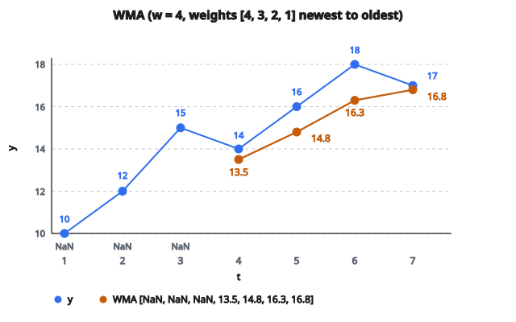

# Weighted Moving Average

## Weighted Moving Average là gì?

**Weighted moving average (WMA)** là trung bình $w$ quan sát gần nhất, trong đó mỗi quan sát nhân với một trọng số. Quan sát gần đây thường nhận trọng số cao hơn.

$$
\text{WMA}_t = \frac{\sum_{i=0}^{w-1} w_i \cdot y_{t-i}}{\sum_{i=0}^{w-1} w_i}
$$

với $w_i$ là các trọng số.

## Công thức chính

Với chuỗi thời gian $y_1, y_2, \ldots, y_T$ và window size $w$:

$$
\text{WMA}_t = \frac{w_0 y_t + w_1 y_{t-1} + \ldots + w_{w-1} y_{t-w+1}}{w_0 + w_1 + \ldots + w_{w-1}}
$$

**Chuẩn hóa:** Chia cho tổng trọng số để đảm bảo trung bình đúng nghĩa.

**Sơ đồ trọng số phổ biến (giảm tuyến tính):**

$$
w_i = w - i
$$

Quan sát mới nhất có trọng số cao nhất ($w$), quan sát cũ nhất có trọng số thấp nhất ($1$).

## Ví dụ số

**Chuỗi thời gian:** $[10, 12, 15, 14, 16, 18, 17]$

**Window size:** $w = 4$

**Trọng số tuyến tính:** $[4, 3, 2, 1]$

**Kỳ 4:**

$$
\begin{aligned}
\text{WMA}_4
&= \frac{4(14) + 3(15) + 2(12) + 1(10)}{4+3+2+1} \\
&= \frac{56 + 45 + 24 + 10}{10} = \frac{135}{10} = 13.5
\end{aligned}
$$

**Kỳ 5:**

$$
\begin{aligned}
\text{WMA}_5
&= \frac{4(16) + 3(14) + 2(15) + 1(12)}{10} \\
&= \frac{64 + 42 + 30 + 12}{10} = \frac{148}{10} = 14.8
\end{aligned}
$$

**Kỳ 6:**

$$
\begin{aligned}
\text{WMA}_6
&= \frac{4(18) + 3(16) + 2(14) + 1(15)}{10} \\
&= \frac{72 + 48 + 28 + 15}{10} = \frac{163}{10} = 16.3
\end{aligned}
$$

**Kỳ 7:**

$$
\begin{aligned}
\text{WMA}_7
&= \frac{4(17) + 3(18) + 2(16) + 1(14)}{10} \\
&= \frac{68 + 54 + 32 + 14}{10} = \frac{168}{10} = 16.8
\end{aligned}
$$

**Kết quả:** $[\text{NaN}, \text{NaN}, \text{NaN}, 13.5, 14.8, 16.3, 16.8]$

::: {#fig-176-wma fig-cap="WMA_4 = 13.5 với trọng số [4, 3, 2, 1] trên [14, 15, 12, 10]. Kết quả [NaN, NaN, NaN, 13.5, 14.8, 16.3, 16.8] khớp ví dụ số." fig-alt="Chuỗi [10, 12, 15, 14, 16, 18, 17] và WMA cửa sổ 4, trọng số [4, 3, 2, 1]: NaN cho 3 kỳ đầu, rồi 13.5, 14.8, 16.3, 16.8."}
{fig-align="center"}
:::

## Sơ đồ trọng số

**Trọng số tuyến tính (arithmetic):**

$$
w_i = w - i
$$

Ví dụ ($w=5$): $[5, 4, 3, 2, 1]$

**Trọng số mũ:**

$$
w_i = \alpha^i
$$

Ví dụ ($\alpha=0.8$, $w=5$): $[1, 0.8, 0.64, 0.512, 0.410]$

**Trọng số tam giác:**

$$
w_i = \max(0, w - i)
$$

Đối xứng quanh tâm.

**Trọng số tùy chỉnh:**

Gán trọng số theo yêu cầu ứng dụng cụ thể.

## So sánh với Simple Moving Average

**SMA:** Trọng số đều $w_i = 1$ với mọi $i$.

$$
\text{SMA}_t = \frac{1}{w} \sum_{i=0}^{w-1} y_{t-i}
$$

**WMA:** Trọng số biến thiên, thường giảm dần.

**Ưu điểm WMA:**

Đáp ứng thay đổi gần đây mạnh hơn, vẫn dùng thông tin lịch sử.

**Nhược điểm:**

Phải chọn sơ đồ trọng số (thêm một quyết định).

## Trọng số tuyến tính vs mũ

**Trọng số tuyến tính ($w=5$):** $[5, 4, 3, 2, 1]$

Tổng trọng số: 15

Quan sát mới nhất: $\frac{5}{15} = 33.3\%$

**Trọng số mũ ($\alpha=0.5$, $w=5$):** $[1, 0.5, 0.25, 0.125, 0.0625]$

Tổng trọng số: 1.9375

Quan sát mới nhất: $\frac{1}{1.9375} = 51.6\%$

**Trọng số mũ nhấn mạnh quan sát gần đây hơn.**

**Trọng số tuyến tính suy giảm từ từ hơn.**

## Liên hệ với Exponential Moving Average

**EMA với tham số $\alpha$:**

$$
\text{EMA}_t = \alpha y_t + (1-\alpha)\text{EMA}_{t-1}
$$

**Dạng khai triển:**

$$
\text{EMA}_t = \alpha \sum_{i=0}^{\infty} (1-\alpha)^i y_{t-i}
$$

**Trọng số:** $w_i = \alpha(1-\alpha)^i$

Suy giảm theo hàm mũ, lịch sử vô hạn.

**WMA với trọng số mũ hữu hạn:**

Phiên bản cắt cụt của EMA, chỉ dùng $w$ quan sát gần nhất.

**Khác biệt:** WMA có bộ nhớ hữu hạn, EMA có bộ nhớ vô hạn (có suy giảm).

## Tính chất lag

**Lag của WMA:**

$$
\text{Lag} = \frac{\sum_{i=0}^{w-1} i \cdot w_i}{\sum_{i=0}^{w-1} w_i}
$$

**Trọng số tuyến tính ($w=5$: $[5,4,3,2,1]$):**

$$
\text{Lag} = \frac{0(5) + 1(4) + 2(3) + 3(2) + 4(1)}{15} = \frac{20}{15} = 1.33
$$

**SMA ($w=5$):**

$$
\text{Lag} = \frac{w-1}{2} = 2
$$

**WMA với trọng số giảm dần có lag nhỏ hơn SMA cùng window size.**

## Hiệu quả tính toán

**WMA ngây thơ:**

Tính tổng có trọng số mỗi kỳ.

Thời gian: $O(w)$ mỗi quan sát, $O(Tw)$ tổng.

**Không có cập nhật tăng dần đơn giản như SMA:**

Không dùng được mẹo running sum (trọng số đổi vị trí tương đối).

**Tối ưu:**

Giữ buffer cửa sổ trượt, tính tổng có trọng số khi cần.

**Trade-off:** WMA chậm hơn SMA nhưng nhanh hơn các bộ lọc phức tạp.

## Chọn trọng số tối ưu

**Minimize forecast error:**

$$
\{w_0^{\ast}, \ldots, w_{w-1}^{\ast}\} = \arg\min_{w_i} \sum_{t=w}^{T} (y_t - \text{WMA}_{t-1})^2
$$

**Ràng buộc:** $\sum w_i = 1$ (đã chuẩn hóa)

**Phương pháp:**

1. Grid search trên các sơ đồ trọng số định trước
2. Hồi quy: Hồi quy $y_t$ lên các giá trị trễ, dùng hệ số làm trọng số
3. Cross-validation: Đánh giá các sơ đồ trên tập validation

**Thực tế:** Trọng số tuyến tính chạy tốt cho nhiều ứng dụng.

## Centered Weighted Moving Average

**Centered (non-causal):**

$$
\text{CWMA}_t = \frac{\sum_{i=-k}^{k} w_i y_{t+i}}{\sum_{i=-k}^{k} w_i}
$$

Dùng quan sát cả hai phía của thời điểm $t$.

**Trọng số đối xứng:**

$w_{-i} = w_i$

**Ưu điểm:** Không lag, smoothing tốt hơn.

**Nhược điểm:** Cần giá trị tương lai (không dự báo được).

**Dùng:** Phân tích lịch sử, không phải dự đoán thời gian thực.

## Dự báo bằng WMA

**Dự báo một bước:**

$$
\hat{y}_{t+1} = \text{WMA}_t
$$

**Dự báo nhiều bước:**

$$
\hat{y}_{t+h} = \text{WMA}_t \quad \text{với mọi } h > 0
$$

Dự báo phẳng (không trend).

**Giả định:** Giá trị tương lai bằng trung bình có trọng số của quá khứ gần.

**Hạn chế:** Giống SMA, giả định tính dừng. Kém với dữ liệu có trend.

**Tốt hơn khi có trend:** Dùng weighted regression hoặc double exponential smoothing.

## Volume-Weighted Average Price

**Ứng dụng tài chính:**

$$
\text{VWAP}_t = \frac{\sum_{i=t-w+1}^{t} P_i \cdot V_i}{\sum_{i=t-w+1}^{t} V_i}
$$

với $P_i$ là giá và $V_i$ là khối lượng.

**Diễn giải:** Giá trung bình trọng số theo volume giao dịch.

Các giao dịch volume cao ảnh hưởng mạnh hơn.

**Trường hợp dùng:** Chuẩn phỏng chất lượng khớp lệnh. Trader nhằm đánh bại VWAP.

## Time-weighted averages

**Khoảng thời gian không đều:**

Gán trọng số theo độ dài thời gian.

$$
\text{TWA}_t = \frac{\sum_{i=1}^{n} y_i \cdot \Delta t_i}{\sum_{i=1}^{n} \Delta t_i}
$$

với $\Delta t_i$ là khoảng thời gian của quan sát $i$.

**Ví dụ:** Cảm biến báo cáo không đều.

Quan sát kéo dài 10 giây được trọng số gấp đôi quan sát kéo dài 5 giây.

**Ứng dụng:** Giám sát quy trình, dữ liệu môi trường.

## Triangular Moving Average

**Smoothing hai tầng:**

1. Áp SMA cửa sổ $w_1$
2. Áp SMA lên kết quả với cửa sổ $w_2$

**Kết quả:** Trọng số tạo hình tam giác.

**Cửa sổ hiệu dụng:** $w_1 + w_2 - 1$

**Trọng số:** Lớn nhất ở tâm, giảm tuyến tính về hai mép.

**Ưu điểm:** Mượt hơn một lần MA, không gián đoạn mép như trọng số đơn giản.

**Ví dụ:** $(w_1=3, w_2=3)$ cho trọng số tỉ lệ với $[1, 2, 3, 2, 1]$.

## Hull Moving Average

**Giảm lag nhưng vẫn giữ độ mượt:**

$$
\text{HMA}_t = \text{WMA}\left(2 \cdot \text{WMA}(w/2) - \text{WMA}(w), \sqrt{w}\right)
$$

**Các bước:**

1. Tính WMA chu kỳ $w/2$
2. Tính WMA chu kỳ $w$
3. Tính $2 \times \text{WMA}_{w/2} - \text{WMA}_w$
4. Áp WMA chu kỳ $\sqrt{w}$ lên kết quả

**Ưu điểm:** Kết hợp độ mượt với độ đáp ứng.

**Ứng dụng:** Hệ thống giao dịch cần chỉ báo nhanh và mượt.

## Gaussian-Weighted Moving Average

**Trọng số theo phân phối Gaussian:**

$$
w_i = \exp\left(-\frac{i^2}{2\sigma^2}\right)
$$

**Chuẩn hóa:**

$$
\text{GWMA}_t = \frac{\sum_{i=0}^{w-1} w_i y_{t-i}}{\sum_{i=0}^{w-1} w_i}
$$

**Tham số $\sigma$:** Điều khiển độ rộng Gaussian.

**Ưu điểm:** Trọng số liên tục mượt, có nền thống kê rõ.

**Ứng dụng:** Xử lý ảnh, lọc tín hiệu.

## Trade-off bias–variance

**Trọng số cao trên quan sát gần đây:**

* Bias thấp hơn (bám thay đổi nhanh)
* Variance cao hơn (nhiều nhiễu hơn)

**Trọng số phân tán (đều hơn):**

* Bias cao hơn (trễ sau thay đổi)
* Variance thấp hơn (smoothing nhiều hơn)

**Trọng số tối ưu phụ thuộc vào:**

* Tỷ số signal-to-noise
* Tốc độ thay đổi của quá trình ẩn
* Horizon dự báo

## Adaptive Weighted Moving Average

**Điều chỉnh trọng số động:**

Đổi trọng số dựa trên hiệu năng dự báo gần đây.

**Ví dụ quy tắc:**

Nếu sai số gần đây lớn, tăng trọng số trên quan sát mới nhất.

**Cài đặt:**

$$
w_{0,t} = \max\left(w_{\min}, \min\left(w_{\max}, f(|e_{t-1}|)\right)\right)
$$

với $f$ là hàm tăng theo độ lớn sai số.

**Trade-off:** Độ phức tạp vs khả năng thích nghi.

## Kết hợp nhiều WMA

**Chiến lược crossover:**

* WMA nhanh: Cửa sổ nhỏ, trọng số gần đây cao
* WMA chậm: Cửa sổ lớn, trọng số phân tán

**Golden cross:** WMA nhanh cắt lên trên WMA chậm (tín hiệu bullish).

**Death cross:** WMA nhanh cắt xuống dưới WMA chậm (tín hiệu bearish).

**Ví dụ:**

Nhanh: $w=5$ với trọng số tuyến tính

Chậm: $w=20$ với trọng số tuyến tính

## Liên hệ Weighted Least Squares

**Hồi quy WLS:**

$$
\min_{\beta} \sum_{i=t-w+1}^{t} w_i (y_i - \beta_0 - \beta_1 i)^2
$$

Khớp trend tuyến tính, trọng số lớn hơn trên quan sát gần đây.

**Dự báo:** Ngoại suy đường đã khớp.

**So với WMA:**

WLS giả định trend tuyến tính, WMA giả định mức (không trend).

**Dùng WLS khi:** Dữ liệu có trend.

**Dùng WMA khi:** Mean dừng hoặc biến thiên chậm.

## Seasonal Weighted Moving Average

**Trọng số theo mùa:**

Gán trọng số cao hơn cho cùng mùa ở các chu kỳ trước.

**Ví dụ:** Dữ liệu tháng, dự báo tháng 12.

$$
\text{SWMA}_{\text{Dec}} = \frac{\sum_{i=1}^{n} w_i \cdot y_{\text{Dec}, i}}{\sum_{i=1}^{n} w_i}
$$

Các tháng 12 gần đây được trọng số cao hơn các tháng 12 xa.

**Ứng dụng:** Dự báo mùa có thích nghi với mẫu mùa gần đây.

## Phương án median có trọng số

**Phương án robust:**

Thay vì mean có trọng số, dùng median có trọng số.

**Cài đặt:**

1. Nhân bản quan sát theo trọng số
2. Tính median của tập đã nhân bản

**Ví dụ:** Quan sát trọng số 3 xuất hiện 3 lần.

**Ưu điểm:** Bền với outlier, vẫn dùng được sơ đồ trọng số.

## Kernel smoothing

**Khung tổng quát:**

$$
\hat{y}_t = \frac{\sum_{i=1}^{T} K\left(\frac{t-i}{h}\right) y_i}{\sum_{i=1}^{T} K\left(\frac{t-i}{h}\right)}
$$

với $K$ là kernel function và $h$ là bandwidth.

**WMA như kernel smoother:**

Kernel $K$ tương ứng hàm trọng số đã chọn.

**Kernel phổ biến:**

* Uniform: Trọng số đều (SMA)
* Triangular: Trọng số tuyến tính (WMA)
* Gaussian: Trọng số chuẩn
* Epanechnikov: Trọng số bậc hai

## Khoảng dự báo

**Prediction interval:**

$$
\hat{y}_{t+1} \pm z_{\alpha/2} \sigma_{\text{forecast}}
$$

**Phương sai dự báo WMA:**

$$
\sigma_{\text{forecast}}^2 = \sigma^2 \left(1 + \frac{\sum w_i^2}{(\sum w_i)^2}\right)
$$

với $\sigma^2$ là phương sai của innovations.

**Diễn giải:** Tập trung trọng số cao hơn làm tăng phương sai dự báo.

## Lo ngại overfitting

**Quá nhiều tham số trọng số:**

Rủi ro khớp nhiễu thay vì tín hiệu.

**Regularization:**

Ràng trọng số theo hàm mượt (phạt độ gồ ghề).

$$
\min_{w_i} \sum (y_t - \text{WMA}_t)^2 + \lambda \sum (w_i - w_{i-1})^2
$$

**Cross-validation:** Kiểm tra out-of-sample để tránh overfitting.

## Hồi quy với Weighted Moving Average

**Ghép WMA với các predictor khác:**

$$
y_t = \beta_0 + \beta_1 \text{WMA}_t + \beta_2 x_t + \epsilon_t
$$

**Dùng WMA như đặc trưng trong mô hình hồi quy.**

**Ví dụ:** Dự đoán doanh số bằng trung bình có trọng số của doanh số quá khứ cộng chi tiêu khuyến mãi.

**Ưu điểm:** Bắt cả momentum (WMA) và yếu tố ngoài (các predictor khác).

## Diễn giải bộ lọc số

**WMA như bộ lọc FIR:**

Finite impulse response với hệ số bằng các trọng số.

**Hàm truyền:**

$$
H(z) = \frac{\sum_{i=0}^{w-1} w_i z^{-i}}{\sum_{i=0}^{w-1} w_i}
$$

**Đáp ứng tần số:** Xác định tần số nào bị suy giảm.

**Bộ lọc low-pass:** Loại nhiễu tần số cao.

**Thiết kế:** Chọn trọng số để đạt đáp ứng tần số mong muốn.

## Weighted differencing

**Sai phân bậc một có trọng số:**

$$
\Delta y_t = \sum_{i=0}^{w-1} w_i (y_{t-i} - y_{t-i-1})
$$

**Tốc độ thay đổi có trọng số.**

**Ứng dụng:** Nhấn mạnh thay đổi gần đây hơn thay đổi xa.

**Phát hiện trend:** Nhận dạng mẫu tăng/giảm tốc.

## Lưu ý cài đặt

**Chuẩn hóa:** Luôn chia cho tổng trọng số.

**Edge cases:** $w-1$ quan sát đầu thường gán NaN.

**Lưu trọng số:** Tính sẵn và lưu vector trọng số.

**Ổn định số:** Dùng phép cộng ổn định số (Kahan summation khi cần độ chính xác cao).

**Vectorization:** Tận dụng phép toán mảng cho hiệu năng trên ngôn ngữ hiện đại.

## Ứng dụng theo lĩnh vực

**Tài chính:**

* VWAP cho khớp lệnh
* Chỉ báo kỹ thuật (WMA crossover)
* Trọng số tái cân bằng danh mục

**Sản xuất:**

* Kiểm soát chất lượng nhấn mạnh gần đây
* Làm mượt sản lượng

**Bán lẻ:**

* Dự báo nhu cầu theo trend gần
* Tối ưu tồn kho

**Năng lượng:**

* Dự báo tải (mẫu thời tiết gần đây)
* Dự đoán giá

**Y tế:**

* Theo dõi bệnh nhân (trend dấu hiệu sinh tồn)
* Dịch tễ (làm mượt suất mắc)

## Tóm tắt so sánh

**Simple MA:** Trọng số đều, đơn giản, không tham số.

**Weighted MA:** Trọng số linh hoạt, đáp ứng hơn, cần sơ đồ trọng số.

**Exponential MA:** Bộ nhớ vô hạn có suy giảm, một tham số ($\alpha$).

**Ưu điểm WMA:**

* Kiểm soát nhiều hơn SMA
* Bộ nhớ hữu hạn (so với EMA)
* Trọng số trực quan

**Nhược điểm WMA:**

* Phải chọn trọng số
* Tính chậm hơn SMA
* Nhiều tham số cần tinh chỉnh

## Code
```python
def weighted_moving_average(values, weights):
    """
    Compute the weighted moving average using the given weights.
    """
    k = len(weights)
    w_sum = sum(weights)
    result = []
    for i in range(len(values) - k + 1):
        total = sum(weights[j] * values[i + j] for j in range(k))
        result.append(total / w_sum)
    return result

```
