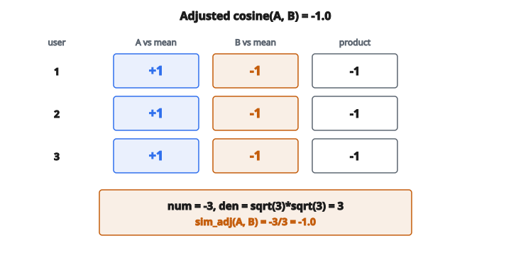

# Adjusted Cosine Similarity

## Adjusted cosine similarity là gì

**Adjusted cosine similarity** là biến thể của cosine similarity chuẩn, thiết kế riêng cho item-based collaborative filtering. Nó tính đến việc user khác nhau dùng thang rating khác nhau bằng cách trừ mean rating của mỗi user trước khi tính similarity.

Phép điều chỉnh này xử lý vấn đề một số user luôn rate cao (generous rater) trong khi người khác rate thấp (harsh rater).

## Vấn đề của cosine similarity chuẩn

Cosine similarity chuẩn giữa item $i$ và $j$:

$$
\cos(i, j) = \frac{\sum_{u \in U_{ij}} r_{ui} \cdot r_{uj}}{\sqrt{\sum_{u \in U_{ij}} r_{ui}^{2}} \cdot \sqrt{\sum_{u \in U_{ij}} r_{uj}^{2}}}
$$

**Vấn đề:** Nếu user A rate mọi thứ 4–5 sao và user B rate mọi thứ 1–2 sao, rating thô không so sánh được. “4” của user B nghĩa khác “4” của user A.

## Công thức adjusted cosine

Trừ mean rating của mỗi user trước khi tính similarity:

$$
\text{sim}_{\text{adj}}(i, j) = \frac{\sum_{u \in U_{ij}} (r_{ui} - \bar{r}_{u})(r_{uj} - \bar{r}_{u})}{\sqrt{\sum_{u \in U_{ij}} (r_{ui} - \bar{r}_{u})^{2}} \cdot \sqrt{\sum_{u \in U_{ij}} (r_{uj} - \bar{r}_{u})^{2}}}
$$

với

$$
\begin{aligned}
r_{ui} &:\ \text{rating của user } u \text{ cho item } i, \\
\bar{r}_{u} &:\ \text{mean rating của user } u \text{ trên mọi item họ đã rate}, \\
U_{ij} &:\ \text{tập user đã rate cả item } i \text{ và } j.
\end{aligned}
$$

## Hiểu phép điều chỉnh

Bằng cách trừ $\bar{r}_{u}$, ta biến rating thành độ lệch so với trung bình cá nhân của mỗi user:

**User có mean rating $4.0$:**

* Rating gốc $5$ thành: $5 - 4.0 = +1.0$ (trên trung bình)
* Rating gốc $3$ thành: $3 - 4.0 = -1.0$ (dưới trung bình)

**User có mean rating $2.5$:**

* Rating gốc $4$ thành: $4 - 2.5 = +1.5$ (trên trung bình)
* Rating gốc $2$ thành: $2 - 2.5 = -0.5$ (dưới trung bình)

Lúc này rating của cả hai user nằm trên cùng thang “lệch bao nhiêu so với trung bình cá nhân.”

## Ví dụ số

**Rating của user:**

User 1 (mean $= 4.0$):

* Item A: $5$
* Item B: $3$

User 2 (mean $= 2.0$):

* Item A: $3$
* Item B: $1$

User 3 (mean $= 3.0$):

* Item A: $4$
* Item B: $2$

**Bước 1: Tính rating đã điều chỉnh**

User 1: Item A $= 5 - 4 = 1$, Item B $= 3 - 4 = -1$

User 2: Item A $= 3 - 2 = 1$, Item B $= 1 - 2 = -1$

User 3: Item A $= 4 - 3 = 1$, Item B $= 2 - 3 = -1$

**Bước 2: Tính similarity**

Tử số: $(1)(-1) + (1)(-1) + (1)(-1) = -3$

Mẫu số cho A: $\sqrt{1^{2} + 1^{2} + 1^{2}} = \sqrt{3}$

Mẫu số cho B: $\sqrt{(-1)^{2} + (-1)^{2} + (-1)^{2}} = \sqrt{3}$

$$
\text{sim}_{\text{adj}}(A, B) = \frac{-3}{\sqrt{3} \cdot \sqrt{3}} = \frac{-3}{3} = -1.0
$$

Item A và B tương quan âm hoàn hảo sau khi điều chỉnh.

::: {#fig-193-adj-cosine fig-cap="Mọi user: $A=+1$, $B=-1$ so với mean, nên $\mathrm{sim}_{\mathrm{adj}}(A,B)=-3/(\sqrt{3}\cdot\sqrt{3})=-1.0$." fig-alt="Ba user, moi nguoi A=+1 va B=-1 so voi mean; tu so -3, mau sqrt(3)*sqrt(3)=3, sim_adj(A,B)=-1.0."}
{fig-align="center"}
:::

## Diễn giải giá trị

Adjusted cosine similarity nằm trong khoảng $-1$ đến $+1$:

**$+1$:** Item được rate giống nhau so với mean của mỗi user. Khi user rate cái này trên trung bình, họ cũng rate cái kia trên trung bình.

**$0$:** Không có quan hệ tuyến tính giữa cách user rate hai item so với mean của họ.

**$-1$:** Item được rate ngược chiều. Khi user rate cái này trên trung bình, họ rate cái kia dưới trung bình.

## So sánh với Pearson correlation

Adjusted cosine similarity tương đương toán học với Pearson correlation tính trên các user:

$$
\text{sim}_{\text{adj}}(i, j) = \text{Pearson}(\mathbf{r}_{i}, \mathbf{r}_{j})
$$

với $\mathbf{r}_{i}$ và $\mathbf{r}_{j}$ là vector rating của item $i$ và $j$.

Pearson correlation cũng căn giữa dữ liệu bằng cách trừ mean, cho cùng kết quả.

## Vì sao dùng adjusted cosine cho item

Trong item-based collaborative filtering, ta so sánh item dựa trên cách user rate chúng.

**User khác nhau có baseline khác nhau:**

* User rộng rãi: rate hầu hết mọi thứ $4$–$5$
* User khắt khe: rate hầu hết mọi thứ $2$–$3$
* User trung bình: rate hầu hết mọi thứ $3$

**Không điều chỉnh:** “4” của user rộng rãi và “4” của user khắt khe bị coi ngang nhau, dù người rộng rãi xem đó dưới trung bình còn người khắt khe xem đó là xuất sắc.

**Có điều chỉnh:** Cả hai thành độ lệch so với trung bình cá nhân, nên so sánh được.

## Tính user mean

User mean $\bar{r}_{u}$ được tính trên **mọi** item mà user $u$ đã rate:

$$
\bar{r}_{u} = \frac{1}{|I_{u}|} \sum_{i \in I_{u}} r_{ui}
$$

với $I_{u}$ là tập item mà user $u$ đã rate.

**Quan trọng:** Dùng mean trên **mọi** item user đã rate, không chỉ item $i$ và $j$.

## Các trường hợp biên

**Chỉ một user chung:**

Nếu chỉ một user rate cả hai item, mẫu số chỉ gồm một hạng. Similarity là $+1$, $-1$, hoặc không xác định (nếu rating đã điều chỉnh của user đó đều bằng không).

**Phương sai bằng không:**

Nếu mọi rating đã điều chỉnh của một user trên các item chung đều bằng không (user rate cả hai item đúng bằng mean), user đó đóng góp không vào cả tử và mẫu.

**Không có user chung:**

Nếu $U_{ij}$ rỗng, similarity không xác định. Thường gán $0$ hoặc xử lý riêng.

## Adjusted cosine so với cosine chuẩn: ví dụ

**Rating user (cả hai đều rate item X và Y):**

* User A (mean $4.5$): $X = 5$, $Y = 4$
* User B (mean $2.0$): $X = 3$, $Y = 1$

**Cosine similarity chuẩn:**

$$
\cos(X, Y) = \frac{5 \cdot 4 + 3 \cdot 1}{\sqrt{5^{2} + 3^{2}} \cdot \sqrt{4^{2} + 1^{2}}} = \frac{23}{\sqrt{34} \cdot \sqrt{17}} \approx 0.96
$$

**Adjusted cosine similarity:**

Rating đã điều chỉnh:

* User A: $X = 0.5$, $Y = -0.5$
* User B: $X = 1$, $Y = -1$

$$
\text{sim}_{\text{adj}}(X, Y) = \frac{(0.5)(-0.5) + (1)(-1)}{\sqrt{0.25 + 1} \cdot \sqrt{0.25 + 1}} = \frac{-1.25}{1.25} = -1.0
$$

Phép điều chỉnh lộ ra rằng cả hai user thực ra rate $X$ trên trung bình và $Y$ dưới trung bình, tức tương quan âm hoàn hảo.

## Dùng trong dự đoán item-based CF

Sau khi tính adjusted cosine similarity, dự đoán rating của user $u$ cho item $i$:

$$
\hat{r}_{ui} = \frac{\sum_{j \in N(i;u)} \text{sim}_{\text{adj}}(i, j) \cdot r_{uj}}{\sum_{j \in N(i;u)} |\text{sim}_{\text{adj}}(i, j)|}
$$

với $N(i;u)$ là tập item tương tự $i$ mà user $u$ đã rate.

Một số công thức cũng điều chỉnh dự đoán:

$$
\hat{r}_{ui} = \bar{r}_{u} + \frac{\sum_{j \in N(i;u)} \text{sim}_{\text{adj}}(i, j) \cdot (r_{uj} - \bar{r}_{u})}{\sum_{j \in N(i;u)} |\text{sim}_{\text{adj}}(i, j)|}
$$

## Cân nhắc tính toán

**Tính trước user mean:**

Tính $\bar{r}_{u}$ một lần cho mỗi user trước khi tính bất kỳ similarity nào.

**Dữ liệu thưa:**

Hầu hết cặp user–item không có rating. Chỉ duyệt user đã rate cả hai item.

**Đối xứng:**

$\text{sim}_{\text{adj}}(i, j) = \text{sim}_{\text{adj}}(j, i)$, nên chỉ tính mỗi cặp một lần.

**Lưu trữ:**

Với $n$ item có $\binom{n}{2}$ cặp. Khi nhiều item, chỉ lưu top-k item giống nhất cho mỗi item.

## Khi nào adjusted cosine vượt trội

**Quần thể user không đồng nhất:**

Khi user có hành vi rate rất khác nhau (mean và thang khác nhau).

**Rating tường minh:**

Hoạt động tốt nhất với rating số tường minh (1–5 sao) hơn implicit feedback.

**Đủ co-rating:**

Cần đủ user đã rate cả hai item để ước lượng similarity đáng tin.

## Quan hệ với các độ tương tự khác

**Cosine similarity:** Không tính user bias. Làm việc trên rating thô.

**Pearson correlation (user-based):** Căn giữa theo item mean, dùng trong user-based CF.

**Adjusted cosine (item-based):** Căn giữa theo user mean, dùng trong item-based CF.

Việc chọn cách căn giữa phụ thuộc bạn đang so sánh user hay item.

## Code
```python
def adjusted_cosine_similarity(ratings_matrix, item_i, item_j):
    """
    Compute adjusted cosine similarity between two items.
    """
    n_users = len(ratings_matrix)
    user_means = []
    for u in range(n_users):
        rated = [r for r in ratings_matrix[u] if r != 0]
        user_means.append(sum(rated) / len(rated) if rated else 0.0)
    num = 0.0
    den_i = 0.0
    den_j = 0.0
    for u in range(n_users):
        if ratings_matrix[u][item_i] == 0 or ratings_matrix[u][item_j] == 0:
            continue
        ri = ratings_matrix[u][item_i] - user_means[u]
        rj = ratings_matrix[u][item_j] - user_means[u]
        num += ri * rj
        den_i += ri * ri
        den_j += rj * rj
    den = (den_i ** 0.5) * (den_j ** 0.5)
    if den == 0:
        return 0.0
    return num / den

```
