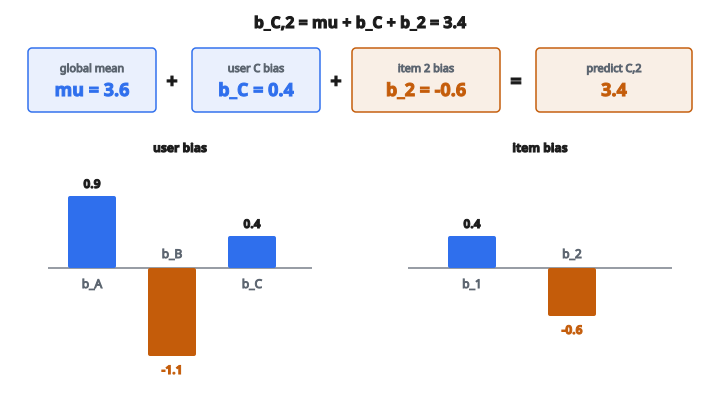

# Baseline Predictor

## Baseline predictor là gì

**Baseline predictor** trong recommender system ước lượng rating của một user cho một item chỉ từ thống kê toàn cục và bias của user/item, không dùng thông tin similarity hay latent factor.

Baseline bắt expected rating dựa trên:

* Trung bình rating toàn hệ thống
* Mức user này thường rate cao hơn hoặc thấp hơn trung bình
* Mức item này thường được rate cao hơn hoặc thấp hơn trung bình

## Công thức baseline

$$
b_{ui} = \mu + b_u + b_i
$$

với

$$
\begin{aligned}
b_{ui} &:\ \text{ước lượng baseline cho user } u \text{ rate item } i, \\
\mu &:\ \text{trung bình toàn cục trên mọi rating}, \\
b_u &:\ \text{user bias (độ lệch của user } u \text{ so với trung bình toàn cục)}, \\
b_i &:\ \text{item bias (độ lệch của item } i \text{ so với trung bình toàn cục)}.
\end{aligned}
$$

## Hiểu từng thành phần

**Trung bình toàn cục $\mu$:**

Trung bình của mọi rating trong dataset.

$$
\mu = \frac{1}{|R|} \sum_{(u,i) \in R} r_{ui}
$$

**User bias $b_u$:**

Mức user $u$ thường rate cao hơn hoặc thấp hơn trung bình toàn cục. User rate rộng rãi có $b_u$ dương; critic khắt khe có $b_u$ âm.

**Item bias $b_i$:**

Mức item $i$ thường được rate cao hơn hoặc thấp hơn trung bình. Item phổ biến, chất lượng cao có $b_i$ dương; item bị không thích có $b_i$ âm.

## Tính user bias và item bias

**Cách đơn giản (độ lệch trung bình):**

$$
b_u = \frac{1}{|I_u|} \sum_{i \in I_u} (r_{ui} - \mu)
$$

$$
b_i = \frac{1}{|U_i|} \sum_{u \in U_i} (r_{ui} - \mu)
$$

với $I_u$ là các item mà user $u$ đã rate, và $U_i$ là các user đã rate item $i$.

**Vấn đề:** Cách này đếm bias hai lần. Nếu một user rộng rãi rate một item phổ biến, cả hai đều được ghi nhận cho rating cao đó.

## Ước lượng bias lặp

Cách tốt hơn luân phiên ước lượng user bias và item bias:

**Khởi tạo:** $b_u = 0$ cho mọi user, $b_i = 0$ cho mọi item

**Lặp đến khi hội tụ:**

1. Cập nhật item bias:

$$
b_i = \frac{\sum_{u \in U_i} (r_{ui} - \mu - b_u)}{|U_i|}
$$

2. Cập nhật user bias:

$$
b_u = \frac{\sum_{i \in I_u} (r_{ui} - \mu - b_i)}{|I_u|}
$$

Cách này tách hiệu ứng độ rộng rãi của user khỏi chất lượng item.

## Ước lượng bias có regularization

Để tránh overfitting, đặc biệt với user hoặc item có ít rating, thêm regularization:

$$
b_i = \frac{\sum_{u \in U_i} (r_{ui} - \mu - b_u)}{\lambda_1 + |U_i|}
$$

$$
b_u = \frac{\sum_{i \in I_u} (r_{ui} - \mu - b_i)}{\lambda_2 + |I_u|}
$$

Các hạng regularization $\lambda_1$ và $\lambda_2$ kéo bias về không khi dữ liệu ít.

## Ví dụ số

**Rating:**

* User A rate Item 1: $5$
* User A rate Item 2: $4$
* User B rate Item 1: $3$
* User B rate Item 2: $2$
* User C rate Item 1: $4$

**Bước 1: Trung bình toàn cục**

$$
\mu = \frac{5 + 4 + 3 + 2 + 4}{5} = \frac{18}{5} = 3.6
$$

**Bước 2: Tính bias đơn giản**

User A: item đã rate $= \{1, 2\}$, rating $= \{5, 4\}$

$$
b_A = \frac{(5-3.6) + (4-3.6)}{2} = \frac{1.4 + 0.4}{2} = 0.9
$$

User B: item đã rate $= \{1, 2\}$, rating $= \{3, 2\}$

$$
b_B = \frac{(3-3.6) + (2-3.6)}{2} = \frac{-0.6 + (-1.6)}{2} = -1.1
$$

User C: item đã rate $= \{1\}$, rating $= \{4\}$

$$
b_C = \frac{4-3.6}{1} = 0.4
$$

Item 1: user $= \{A, B, C\}$, rating $= \{5, 3, 4\}$

$$
b_1 = \frac{(5-3.6) + (3-3.6) + (4-3.6)}{3} = \frac{1.4 - 0.6 + 0.4}{3} = 0.4
$$

Item 2: user $= \{A, B\}$, rating $= \{4, 2\}$

$$
b_2 = \frac{(4-3.6) + (2-3.6)}{2} = \frac{0.4 - 1.6}{2} = -0.6
$$

**Bước 3: Dự đoán baseline**

Dự đoán rating của User C cho Item 2:

$$
b_{C,2} = \mu + b_C + b_2 = 3.6 + 0.4 + (-0.6) = 3.4
$$

::: {#fig-181-baseline fig-cap="Baseline $b_{C,2}=\mu+b_C+b_2=3.6+0.4+(-0.6)=3.4$, với user bias $b_A=0.9$, $b_B=-1.1$, $b_C=0.4$ và item bias $b_1=0.4$, $b_2=-0.6$." fig-alt="Thanh phan baseline: mu=3.6, b_C=0.4, b_2=-0.6 cong lai bang 3.4. User bias A=0.9, B=-1.1, C=0.4; item bias 1=0.4, 2=-0.6."}
{fig-align="center"}
:::

## Vì sao baseline quan trọng

**Chúng giải thích nhiều phương sai:**

Trên nhiều dataset, chỉ riêng baseline giải thích 50–70% phương sai rating. User và item có bias vốn có mạnh.

**Nền tảng cho mô hình khác:**

Mô hình phức tạp hơn thường dự đoán residual $r_{ui} - b_{ui}$ thay vì rating thô. Phần tín hiệu còn lại dễ học hơn.

**Đơn giản và nhanh:**

Baseline chỉ cần đếm và lấy trung bình. Có thể tính hiệu quả ngay cả với dataset lớn.

## Baseline trong matrix factorization

Mô hình matrix factorization thường gắn baseline:

$$
\hat{r}_{ui} = \mu + b_u + b_i + \mathbf{p}_u^{T} \mathbf{q}_i
$$

Latent factor $\mathbf{p}_u$ và $\mathbf{q}_i$ mô hình residual sau khi đã trừ bias.

Trong huấn luyện SGD, bias được cập nhật cùng latent factor:

$$
b_u \leftarrow b_u + \eta (e_{ui} - \lambda b_u)
$$

$$
b_i \leftarrow b_i + \eta (e_{ui} - \lambda b_i)
$$

với $e_{ui} = r_{ui} - \hat{r}_{ui}$ là sai số dự đoán.

## Baseline trong phương pháp neighborhood

Collaborative filtering dựa trên neighborhood cũng dùng baseline:

$$
\hat{r}_{ui} = b_{ui} + \frac{\sum_{j \in N(i;u)} s_{ij} (r_{uj} - b_{uj})}{\sum_{j \in N(i;u)} |s_{ij}|}
$$

Công thức này dự đoán baseline cộng trung bình có trọng số của mức neighbor lệch khỏi baseline của họ.

## Baseline phụ thuộc thời gian

User bias và item bias có thể đổi theo thời gian:

**Trôi user bias:**

$$
b_u(t) = b_u + \alpha_u \cdot \operatorname{sign}(t - t_u) \cdot |t - t_u|^{\beta}
$$

với $t_u$ là thời điểm rating trung bình của user.

**Trôi item bias:**

Item mới có thể có rating bị thổi lúc đầu, rồi ổn định.

**Chia bin theo thời gian:**

Tính bias riêng cho từng khoảng thời gian.

## Xử lý user và item mới

**User mới (chưa có rating):**

Đặt $b_u = 0$. Dự đoán thành $\mu + b_i$.

**Item mới (chưa có rating):**

Đặt $b_i = 0$. Dự đoán thành $\mu + b_u$.

**Cold start:**

Cả hai bias đều không. Dự đoán chỉ còn $\mu$.

Với regularization, bias tự co về không khi dữ liệu thưa.

## Clip dự đoán

Dự đoán baseline có thể rơi ngoài khoảng rating hợp lệ:

Nếu rating trong $1$–$5$ và $b_{ui} = 5.3$, clip về $5$.

$$
\hat{r}_{ui} = \max(r_{\min}, \min(r_{\max}, b_{ui}))
$$

Điều này đảm bảo dự đoán luôn nằm trong khoảng hợp lệ.

## Baseline làm benchmark

Mọi recommender system nên vượt baseline predictor. Nếu mô hình phức tạp kém hơn $\mu + b_u + b_i$ thì có vấn đề.

**Cải thiện RMSE điển hình:**

* Chỉ trung bình toàn cục: RMSE baseline
* Có user/item bias: cải thiện 10–20%
* Có collaborative filtering: thêm 5–15%

## Phân rã rating

Mô hình baseline phân rã mỗi rating:

$$
r_{ui} = \mu + b_u + b_i + \text{interaction} + \text{noise}
$$

* $\mu$: Rating điển hình là bao nhiêu?
* $b_u$: User này rộng rãi hay khắt khe?
* $b_i$: Item này nhìn chung được thích hay không?
* interaction: User cụ thể này có thích item cụ thể này không?
* noise: Biến thiên ngẫu nhiên

Baseline bắt ba thành phần đầu.

## Code
```python
def baseline_predict(ratings_matrix, target_pairs):
    """
    Compute baseline predictions using global mean and user/item biases.
    """
    all_ratings = [r for row in ratings_matrix for r in row if r != 0]
    mu = sum(all_ratings) / len(all_ratings)
    n_users = len(ratings_matrix)
    n_items = len(ratings_matrix[0])
    user_biases = []
    for u in range(n_users):
        u_ratings = [r for r in ratings_matrix[u] if r != 0]
        user_biases.append((sum(u_ratings) / len(u_ratings) - mu) if u_ratings else 0.0)
    item_biases = []
    for i in range(n_items):
        i_ratings = [ratings_matrix[u][i] for u in range(n_users) if ratings_matrix[u][i] != 0]
        item_biases.append((sum(i_ratings) / len(i_ratings) - mu) if i_ratings else 0.0)
    return [mu + user_biases[u] + item_biases[i] for u, i in target_pairs]

```

<!-- auto-self-check -->

::: {.callout-note}
## Kiểm tra nhanh
<details>
<summary>Ý chính của bài «Baseline Predictor» là gì?</summary>
**Baseline predictor** trong recommender system ước lượng rating của một user cho một item chỉ từ thống kê toàn cục và bias của user/item, không dùng thông tin similarity hay latent factor.
</details>
<details>
<summary>Công thức / quan hệ cốt lõi trong bài là gì?</summary>
$$b_{ui} = \mu + b_u + b_i$$
</details>
:::
