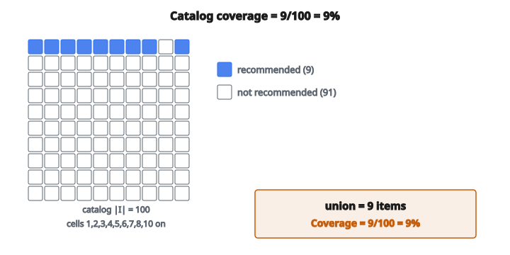

# Catalog Coverage

## Catalog coverage là gì

**Catalog coverage** là metric đo phần catalog item mà một recommender system thực sự recommend tới user. Nó định lượng diversity của recommendation trên toàn không gian item.

$$
\text{Catalog Coverage} = \frac{|\text{Recommended Items}|}{|\text{Total Items}|}
$$

Hệ thống coverage cao recommend nhiều item khác nhau; hệ thống coverage thấp tập trung recommendation vào một tập con nhỏ.

## Vì sao catalog coverage quan trọng

**Vấn đề long tail:**

Hầu hết recommender system có popularity bias, recommend item phổ biến nhiều hơn hẳn item niche. Phần “long tail” của item ít phổ biến gần như vô hình.

**Giá trị kinh doanh:**

Item không được recommend không tạo doanh số từ recommendation. Nếu 90% catalog không bao giờ được gợi ý, bạn đang bỏ lỡ cơ hội.

**Sự hài lòng của user:**

User có thể có thị hiếu đa dạng. Chỉ hiện item phổ biến sẽ bỏ qua những người thích nội dung niche.

**Nhà cung cấp nội dung:**

Trên nền tảng có creator (YouTube, Spotify), coverage thấp nghĩa là hầu hết creator không nhận được exposure từ recommendation.

## Tính catalog coverage

**Bước 1:** Sinh recommendation cho mọi user (hoặc một mẫu)

**Bước 2:** Lấy hợp (union) của mọi item được recommend

**Bước 3:** Chia cho kích thước catalog

$$
\text{Coverage} = \frac{|\bigcup_{u} R_u|}{|I|}
$$

với $R_u$ là tập item được recommend cho user $u$ và $I$ là toàn bộ catalog.

## Ví dụ số

**Catalog:** tổng 100 item

**Recommendation:**

* User 1: item $\{1, 2, 3, 5, 10\}$
* User 2: item $\{1, 2, 4, 6, 10\}$
* User 3: item $\{1, 3, 5, 7, 10\}$
* User 4: item $\{2, 3, 4, 8, 10\}$

**Hợp các item được recommend:**

$\{1, 2, 3, 4, 5, 6, 7, 8, 10\}$ $=$ 9 item phân biệt

**Catalog coverage:**

$$
\text{Coverage} = \frac{9}{100} = 0.09 = 9\%
$$

Chỉ 9% catalog từng được recommend.

::: {#fig-192-coverage fig-cap="Hợp các recommendation là 9 item trên catalog 100: $\mathrm{Coverage}=9/100=9\%$." fig-alt="Luoi catalog 10x10 (100 o); 9 o duoc recommend {1,2,3,4,5,6,7,8,10} to mau; coverage 9/100 = 9%."}
{fig-align="center"}
:::

## Coverage tại các giá trị K

Coverage phụ thuộc số item recommend cho mỗi user:

**Coverage@5:** Coverage khi recommend top-5 item cho mỗi user

**Coverage@10:** Coverage khi recommend top-10 item

**Coverage@N:** Coverage khi recommend top-N item

K lớn hơn thường tăng coverage, nhưng quan hệ không tuyến tính vì có overlap.

## Coverage theo thời gian

Trong hệ thống động, đo coverage trên một cửa sổ thời gian:

**Coverage theo ngày:** Phần bao nhiêu item được recommend hôm nay?

**Coverage theo tuần:** Trong một tuần, phần bao nhiêu item xuất hiện trong recommendation?

**Coverage tích lũy:** Phần bao nhiêu từng được recommend?

Coverage theo thời gian cho biết hệ thống có khám phá catalog theo thời gian hay mắc kẹt trên cùng các item.

## Quan hệ với tần suất recommendation

Gọi $f_i$ là số user được recommend item $i$:

$$
\text{Coverage} = \frac{|\{i : f_i > 0\}|}{|I|}
$$

Coverage chỉ quan tâm item có được recommend ít nhất một lần hay không, không quan tâm bao nhiêu lần.

**Hệ số Gini** và **entropy** bắt phân phối tần suất recommendation, bổ sung cho coverage.

## Coverage so với accuracy

Thường có đánh đổi giữa coverage và accuracy:

**Accuracy cao, coverage thấp:**

Chỉ recommend item mà hệ thống tự tin. Chúng thường là item phổ biến có nhiều rating.

**Coverage cao, accuracy thấp hơn:**

Ép hệ thống recommend item đa dạng, kể cả dự đoán kém chắc chắn hơn.

**Cân bằng:**

Mục tiêu kinh doanh quyết định đánh đổi đúng. Tối ưu accuracy thuần thường hy sinh coverage.

## Popularity bias và coverage

Recommender theo popularity vốn có coverage thấp:

**Nếu luôn recommend 100 item phổ biến nhất:**

Coverage $= 100 / |I|$

Với catalog 10,000 item, đó chỉ là 1% coverage.

**Collaborative filtering** có thể có coverage tốt hơn nhờ tìm item niche khớp preference cụ thể của user.

## Cải thiện coverage

**Bơm diversity:**

Sau khi sinh ứng viên top-N, thay một số bằng lựa chọn đa dạng hơn.

**Bonus exploration:**

Tăng score cho item ít được recommend.

**Tối ưu đa mục tiêu:**

Tối ưu đồng thời relevance và coverage.

**Recommendation đã hiệu chỉnh (calibrated):**

Khớp phân phối item được recommend với preference của user theo genre/category.

## Coverage theo category

Thay vì coverage tổng, đo coverage trong từng category:

$$
\text{Coverage}_{\text{category}} = \frac{|\text{item được recommend trong category}|}{|\text{item trong category}|}
$$

Cách này lộ category nào đang bị phục vụ kém.

**Ví dụ:**

* Phim action: 80% coverage
* Phim documentary: 5% coverage

Hệ thống nghiêng mạnh về phim action.

## Coverage so với personalization

**Coverage cao, personalization thấp:**

Mỗi user nhận item ngẫu nhiên khác nhau. Coverage cao nhưng recommendation không hữu ích.

**Coverage cao, personalization cao:**

User khác nhau nhận recommendation khớp thị hiếu, cộng lại phủ phần lớn catalog.

**Coverage thấp, personalization cao:**

Mọi user có thị hiếu gần nhau nhận cùng recommendation. Tốt cho cá nhân nhưng tập thể hẹp.

Mục tiêu là coverage cao **và** personalization tốt.

## Coverage tổng hợp và coverage cá nhân

**Coverage tổng hợp (phần trên):**

Phần bao nhiêu item xuất hiện trong recommendation của **bất kỳ** user nào?

**Coverage cá nhân:**

Với một user, phần bao nhiêu item họ có thể thích được recommend cho họ?

Cả hai đều quan trọng. Coverage tổng hợp đo diversity cấp hệ thống; coverage cá nhân đo việc user có khám phá được những thứ họ có thể thích hay không.

## Coverage theo từng domain

**E-commerce:**

Coverage thấp nghĩa là tồn kho không bán được. Recommendation nên giúp đẩy sản phẩm long-tail.

**Streaming (Netflix, Spotify):**

Coverage thấp nghĩa là creator không được exposure. Sức khỏe nền tảng cần khám phá nội dung mới.

**Tin tức:**

Coverage thấp nghĩa là chỉ hiện tin viral. Coverage đa dạng hỗ trợ công dân được thông tin.

**Gợi ý việc làm:**

Coverage thấp nghĩa là nhiều việc không bao giờ nhận ứng viên từ recommendation.

## Đo coverage trong thực tế

**Ước lượng theo mẫu:**

Với hệ thống lớn, sinh recommendation cho một mẫu ngẫu nhiên user, rồi ngoại suy.

**Log production:**

Theo dõi item nào xuất hiện trong recommendation phục vụ user thật.

**A/B testing:**

So sánh coverage giữa các thuật toán recommendation khác nhau.

## Coverage và filter bubble

Coverage thấp góp phần tạo filter bubble:

* User chỉ thấy một lát nội dung hẹp
* User tương tự thấy những lát hẹp tương tự
* Góc nhìn đa dạng và nội dung niche trở nên vô hình

Coverage cao hơn có thể giúp phá filter bubble bằng cách cho user tiếp xúc nội dung rộng hơn.

## Cận lý thuyết

**Coverage tối thiểu:**

Nếu recommend $k$ item cho $n$ user, coverage tối thiểu xảy ra khi mọi user nhận đúng cùng $k$ item.

$$
\text{Coverage}_{\min} = \frac{k}{|I|}
$$

**Coverage tối đa:**

Coverage tối đa xảy ra khi không có overlap.

$$
\text{Coverage}_{\max} = \min\left(1, \frac{n \cdot k}{|I|}\right)
$$

Coverage thực tế nằm giữa hai cận này.

## Code
```python
def catalog_coverage(recommendations, n_items):
    """
    Compute the catalog coverage of a recommender system.
    """
    items = set()
    for rec in recommendations:
        items.update(rec)
    return len(items) / n_items if n_items > 0 else 0.0

```

<!-- auto-self-check -->

::: {.callout-note}
## Kiểm tra nhanh
<details>
<summary>Ý chính của bài «Catalog Coverage» là gì?</summary>
**Catalog coverage** là metric đo phần catalog item mà một recommender system thực sự recommend tới user.
</details>
<details>
<summary>Công thức / quan hệ cốt lõi trong bài là gì?</summary>
$$\text{Catalog Coverage} = \frac{|\text{Recommended Items}|}{|\text{Total Items}|}$$
</details>
:::
