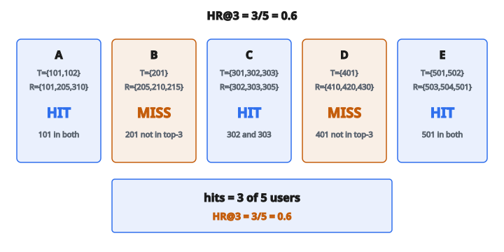

# Hit Rate at K

## Hit Rate at K là gì

**Hit Rate at K (HR@K)** là metric đo tỷ lệ user có ít nhất một item liên quan xuất hiện trong top-K recommendation. Nó trả lời câu hỏi: “Với bao nhiêu user ta đã recommend thành công thứ họ thực sự muốn?”

$$
\text{HR@K} = \frac{\text{số user có ít nhất một hit trong top-K}}{\text{tổng số user}}
$$

Một “hit” xảy ra khi item được recommend khớp một item liên quan (đã biết) của user đó.

## Công thức Hit Rate

$$
\text{HR@K} = \frac{1}{|U|} \sum_{u \in U} \mathbb{1}[|R_{u}^{K} \cap T_{u}| > 0]
$$

với

$$
\begin{aligned}
U &:\ \text{tập mọi user}, \\
R_{u}^{K} &:\ \text{tập top-K item được recommend cho user } u, \\
T_{u} &:\ \text{tập item liên quan (ground truth) của user } u, \\
\mathbb{1}[\cdot] &:\ \text{hàm chỉ báo (1 nếu đúng, 0 nếu sai)}.
\end{aligned}
$$

## Hiểu Hit Rate

Hit rate là metric nhị phân theo từng user:

* **Hit ($1$):** Ít nhất một trong $K$ recommendation là liên quan
* **Miss ($0$):** Không recommendation nào trong $K$ là liên quan

Không quan trọng là 1 hay cả $K$ recommendation đều liên quan; user hoặc có hit hoặc không.

## Ví dụ số

**5 user với item liên quan và top-3 recommendation:**

User A:

* Liên quan: $\{101, 102\}$
* Top-3: $\{101, 205, 310\}$
* Hit? Có ($101$ nằm trong cả hai)

User B:

* Liên quan: $\{201\}$
* Top-3: $\{205, 210, 215\}$
* Hit? Không ($201$ không nằm trong top-3)

User C:

* Liên quan: $\{301, 302, 303\}$
* Top-3: $\{302, 303, 305\}$
* Hit? Có ($302$ và $303$ là hit)

User D:

* Liên quan: $\{401\}$
* Top-3: $\{410, 420, 430\}$
* Hit? Không

User E:

* Liên quan: $\{501, 502\}$
* Top-3: $\{503, 504, 501\}$
* Hit? Có ($501$ nằm trong cả hai)

**Tính toán:**

$$
\text{HR@3} = \frac{3}{5} = 0.6 = 60\%
$$

60% user nhận được ít nhất một recommendation liên quan trong top-3.

::: {#fig-194-hr-at-k fig-cap="Năm user, ba hit (A, C, E) và hai miss (B, D): $\mathrm{HR@3}=3/5=0.6$." fig-alt="Nam user: A, C, E hit; B, D miss. HR@3 = 3/5 = 0.6."}
{fig-align="center"}
:::

## Hit Rate so với Precision và Recall

**Hit Rate:**

Thành công nhị phân theo user. User có nhận **bất kỳ** item liên quan nào không?

**Precision@K:**

Phần bao nhiêu trong $K$ recommendation là liên quan?

$$
\text{Precision@K} = \frac{|R_{u}^{K} \cap T_{u}|}{K}
$$

**Recall@K:**

Phần bao nhiêu item liên quan xuất hiện trong top-K?

$$
\text{Recall@K} = \frac{|R_{u}^{K} \cap T_{u}|}{|T_{u}|}
$$

Hit rate đối xử mọi user ngang nhau, bất kể họ có bao nhiêu item liên quan hay bao nhiêu hit.

## Khi nào dùng Hit Rate

**Đánh giá leave-one-out:**

Một protocol đánh giá phổ biến giữ lại đúng một item mỗi user. Hit rate khi đó đo: “Ta có recommend đúng item bị giữ lại không?”

$$
\text{HR@K}_{\text{leave-one-out}} = \frac{\text{user có item bị giữ lại nằm trong top-K}}{\text{tổng số user}}
$$

**Recommendation theo session:**

User có tìm thấy thứ họ click / mua trong recommendation không?

**Tình huống any-hit:**

Khi mục tiêu chỉ là hiện ít nhất một item tốt, không phải tối đa hóa số item tốt.

## Hit Rate tại các giá trị K

HR@K tăng theo $K$ ($K$ lớn hơn nghĩa là nhiều cơ hội hit hơn):

* HR@1: Nghiêm nhất. Recommendation đứng đầu phải liên quan.
* HR@5: Dễ hơn. Bất kỳ item nào trong top-5 phải liên quan.
* HR@10: Dễ hơn nữa.
* HR@N ($N$ = kích thước catalog): Sẽ là 100% nếu mọi user có ít nhất một item liên quan.

**Báo cáo điển hình:** HR@1, HR@5, HR@10, HR@20

## Tính HR@K theo từng bước

**Bước 1:** Với mỗi user, sinh top-K recommendation

**Bước 2:** Với mỗi user, kiểm tra có recommendation nào nằm trong tập liên quan không

**Bước 3:** Đếm user có ít nhất một hit

**Bước 4:** Chia cho tổng số user

## Quan hệ với Recall@K

Hit rate liên hệ với recall khi mỗi user có đúng một item liên quan:

Nếu $|T_{u}| = 1$ cho mọi user:

$$
\text{HR@K} = \text{Average Recall@K}
$$

Khi user có nhiều item liên quan, hit rate ít chi tiết hơn recall.

## Hit Rate trong đánh giá leave-one-out

Protocol leave-one-out:

1. Với mỗi user, ẩn một tương tác (item test)
2. Huấn luyện trên dữ liệu còn lại
3. Sinh top-K recommendation cho mỗi user
4. Kiểm tra item bị ẩn có xuất hiện trong top-K không

$$
\text{HR@K} = \frac{\text{user có item bị ẩn nằm trong top-K}}{\text{tổng số user}}
$$

Đây là cách đánh giá rất phổ biến trong bài báo nghiên cứu.

## Hit Rate đã chuẩn hóa

Để so sánh giữa dataset có kích thước catalog khác nhau, chuẩn hóa:

$$
\text{Normalized HR@K} = \frac{\text{HR@K}}{\text{HR@K}_{\text{random}}}
$$

với $\text{HR@K}_{\text{random}}$ là hit rate kỳ vọng của recommendation ngẫu nhiên.

Với leave-one-out và kích thước catalog $|I|$:

$$
\text{HR@K}_{\text{random}} = \frac{K}{|I|}
$$

## Hit Rate so với Mean Reciprocal Rank (MRR)

Cả hai dùng setting leave-one-out, nhưng:

**Hit Rate@K:**

Nhị phân. Item có xuất hiện ở bất kỳ vị trí nào trong top-K không?

**MRR:**

Vị trí quan trọng. Item xuất hiện ở đâu?

$$
\text{MRR} = \frac{1}{|U|} \sum_{u} \frac{1}{\text{rank}_{u}}
$$

MRR cho tín nhiệm nhiều hơn khi recommend item liên quan ở vị trí 1 hơn vị trí $K$.

## Biến thể và mở rộng

**Hit Rate với ngưỡng:**

Thay vì relevance nhị phân, dùng ngưỡng rating.

Item liên quan nếu $r_{ui} \geq \tau$.

**Weighted Hit Rate:**

Gán trọng số user khác nhau (ví dụ theo mức hoạt động hoặc giá trị kinh doanh).

$$
\text{Weighted HR@K} = \frac{\sum_{u} w_{u} \cdot \mathbb{1}[\text{hit}_{u}]}{\sum_{u} w_{u}}
$$

## Diễn giải giá trị Hit Rate

**HR@10 $= 0.3$:** 30% user tìm thấy ít nhất một item liên quan trong top-10.

**Diễn giải theo ngữ cảnh:**

* Duyệt khám phá: 30% có thể chấp nhận được
* Tìm kiếm có đích: 30% thường là quá thấp
* Item hiếm: 30% có thể rất tốt

So với baseline (random, popularity) và yêu cầu kinh doanh.

## Hit Rate trong A/B testing

Trong A/B test production:

**Hit rate online:**

$$
\text{HR} = \frac{\text{user đã click/mua một item được recommend}}{\text{user đã thấy recommendation}}
$$

Cách này đo engagement thật của user, không chỉ relevance offline.

## Tính khoảng tin cậy

Hit rate là một tỷ lệ, nên khoảng tin cậy theo phân phối nhị thức:

**Sai số chuẩn:**

$$
SE = \sqrt{\frac{\text{HR}(1 - \text{HR})}{n}}
$$

**Khoảng tin cậy 95%:**

$$
\text{HR} \pm 1.96 \cdot SE
$$

Điều này giúp xác định khác biệt giữa các hệ thống có ý nghĩa thống kê hay không.

## Hit Rate theo nhóm

Tính hit rate cho các segment user hoặc item khác nhau:

**Theo mức hoạt động user:**

* User chủ động (nhiều rating): HR $= 0.7$
* User casual (ít rating): HR $= 0.4$

**Theo category item:**

* Category phổ biến: HR $= 0.6$
* Category niche: HR $= 0.2$

Cách này lộ chỗ hệ thống thành công hoặc thất bại.

## Code
```python
def hit_rate_at_k(recommendations, ground_truth, k):
    """
    Compute the hit rate at K.
    """
    hits = 0
    for rec, gt in zip(recommendations, ground_truth):
        top_k = set(rec[:k])
        if top_k & set(gt):
            hits += 1
    return hits / len(recommendations) if recommendations else 0.0

```
