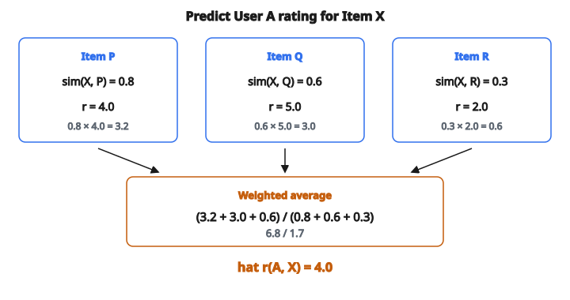

# Item-Based CF Prediction

## Item-based CF prediction là gì

**Item-based collaborative filtering** dự đoán rating của user cho một item dựa trên rating của chính user đó cho các item tương tự. Intuition: nếu user thích các item giống item X, họ cũng có thể thích X.

$$
\hat{r}_{ui} = \frac{\sum_{j \in N(i;u)} \operatorname{sim}(i, j) \cdot r_{uj}}{\sum_{j \in N(i;u)} \lvert \operatorname{sim}(i, j) \rvert}
$$

với $N(i;u)$ là tập item giống $i$ mà user $u$ đã rating.

## Ý tưởng cốt lõi

**Để dự đoán rating của user A cho Movie X:**

1. Tìm các phim giống Movie X
2. Xem user A đã rating các phim đó thế nào
3. Kết hợp các rating đó, có trọng số theo similarity

Nếu user A thích các phim giống X, họ cũng có thể thích X. Nếu họ ghét các phim tương tự, họ cũng có thể không thích X.

## Công thức dự đoán chi tiết

$$
\hat{r}_{ui} = \frac{\sum_{j \in N(i;u)} \operatorname{sim}(i, j) \cdot r_{uj}}{\sum_{j \in N(i;u)} \lvert \operatorname{sim}(i, j) \rvert}
$$

**Các thành phần:**

* $\hat{r}_{ui}$: Rating dự đoán của user $u$ cho item đích $i$
* $N(i;u)$: Neighbor items (item giống $i$ mà $u$ đã rating)
* $\operatorname{sim}(i, j)$: Similarity giữa item $i$ và $j$
* $r_{uj}$: Rating thật của user $u$ cho neighbor item $j$

Mẫu số chuẩn hóa sao cho nếu mọi neighbor có similarity 1.0 thì ta được trung bình không trọng số.

## Ví dụ số

**Mục tiêu:** Dự đoán rating của User A cho Item X

**Rating đã biết của User A:**

* Item P: 4.0
* Item Q: 5.0
* Item R: 2.0

**Similarity với Item X:**

* $\operatorname{sim}(X, P) = 0.8$
* $\operatorname{sim}(X, Q) = 0.6$
* $\operatorname{sim}(X, R) = 0.3$

**Dự đoán:**

$$
\hat{r}_{A,X} = \frac{0.8 \times 4.0 + 0.6 \times 5.0 + 0.3 \times 2.0}{0.8 + 0.6 + 0.3}
$$

$$
\begin{aligned}
\hat{r}_{A,X}
&= \frac{3.2 + 3.0 + 0.6}{1.7} \\
&= \frac{6.8}{1.7} \\
&= 4.0
\end{aligned}
$$

Rating dự đoán là 4.0 sao.

::: {#fig-179-item-cf fig-cap="Item-based CF: $(0.8\times 4 + 0.6\times 5 + 0.3\times 2)/1.7 = 6.8/1.7 = 4.0$." fig-alt="Ba neighbor P, Q, R voi (sim, rating) = (0.8, 4.0), (0.6, 5.0), (0.3, 2.0). Tu so 0.8*4+0.6*5+0.3*2 = 6.8, mau 1.7, du doan 6.8/1.7 = 4.0."}
{fig-align="center"}
:::

## Chọn neighbor

**Mọi neighbor:** Dùng mọi item user $u$ đã rating và có similarity khác 0 với $i$.

**Top-K neighbors:** Chỉ dùng $K$ item giống nhất.

**Theo ngưỡng:** Chỉ dùng item có similarity trên ngưỡng $\tau$.

Top-$K$ phổ biến nhất vì:

* Giới hạn tính toán
* Giảm nhiễu từ item giống yếu
* Thường $K = 10$ đến $50$

## Có mean-centering (dự đoán điều chỉnh)

Điều chỉnh việc các item có mean rating khác nhau:

$$
\hat{r}_{ui} = \bar{r}_i + \frac{\sum_{j \in N(i;u)} \operatorname{sim}(i, j) \cdot (r_{uj} - \bar{r}_j)}{\sum_{j \in N(i;u)} \lvert \operatorname{sim}(i, j) \rvert}
$$

với $\bar{r}_i$ và $\bar{r}_j$ là mean rating của item $i$ và $j$.

Công thức này dự đoán mean rating của item $i$ cộng hiệu chỉnh dựa trên cách user đánh giá các item tương tự so với mean của chúng.

## Ví dụ mean-centered

**Mục tiêu:** Dự đoán rating của User A cho Item X

**Trung bình từng item:**

* Item X average: 3.5
* Item P average: 4.2
* Item Q average: 3.8

**Rating của User A:**

* Item P: 4.0 (deviation: $4.0 - 4.2 = -0.2$)
* Item Q: 5.0 (deviation: $5.0 - 3.8 = +1.2$)

**Similarity:**

* $\operatorname{sim}(X, P) = 0.8$
* $\operatorname{sim}(X, Q) = 0.6$

**Dự đoán:**

$$
\hat{r}_{A,X} = 3.5 + \frac{0.8 \times (-0.2) + 0.6 \times 1.2}{0.8 + 0.6}
$$

$$
\begin{aligned}
\hat{r}_{A,X}
&= 3.5 + \frac{-0.16 + 0.72}{1.4} \\
&= 3.5 + \frac{0.56}{1.4} \\
&= 3.5 + 0.4 \\
&= 3.9
\end{aligned}
$$

## Đo similarity giữa item

Các lựa chọn phổ biến cho $\operatorname{sim}(i, j)$:

**Adjusted cosine similarity:**

$$
\operatorname{sim}(i, j) = \frac{\sum_{u \in U_{ij}} (r_{ui} - \bar{r}_u)(r_{uj} - \bar{r}_u)}{\sqrt{\sum_{u} (r_{ui} - \bar{r}_u)^2} \sqrt{\sum_{u} (r_{uj} - \bar{r}_u)^2}}
$$

**Pearson correlation:**

$$
\operatorname{sim}(i, j) = \frac{\sum_{u} (r_{ui} - \bar{r}_i)(r_{uj} - \bar{r}_j)}{\sqrt{\sum_{u} (r_{ui} - \bar{r}_i)^2} \sqrt{\sum_{u} (r_{uj} - \bar{r}_j)^2}}
$$

Adjusted cosine được ưa hơn cho item-based CF vì chuẩn hóa theo thang rating của user.

## Các bước thuật toán

**Offline (tính sẵn):**

1. Với mỗi cặp item, tính similarity
2. Với mỗi item, lưu $K$ item giống nhất

**Online (lúc dự đoán):**

1. Cho user $u$ và item đích $i$
2. Tìm item trong lịch sử của user giống $i$
3. Tính trung bình có trọng số rating của user cho các item đó
4. Trả về rating dự đoán

## Item-based so với user-based CF

**Item-based:**

* Tìm item giống item đích
* Dùng rating của user cho các item đó
* Item thường ổn định hơn user (ít item mới hơn)
* Similarity tính sẵn được

**User-based:**

* Tìm user giống user đích
* Dùng rating của các user đó cho item đích
* User đổi theo thời gian (rating mới)
* Khó tính sẵn hơn

Item-based CF thường được ưa trong thực tế vì ổn định và scale tốt.

## Xử lý cold start

**Item mới (chưa rating):**

Không tính được similarity với item khác. Fallback:

* Content-based similarity
* Popularity baseline
* Recommendation ngẫu nhiên

**User mới (chưa có lịch sử rating):**

Không tìm được neighbor item mà user đã rating. Fallback:

* Item phổ biến
* Content-based trên user profile
* Hỏi rating ban đầu

## Dữ liệu thưa

Hầu hết cặp user–item không có rating. Khi tính item similarity:

**Yêu cầu co-rating:**

Chỉ xét user đã rating cả hai item. Ít co-rating thì similarity kém tin cậy.

**Significance weighting:**

Giảm trọng số similarity khi dựa trên ít co-rating:

$$
\operatorname{sim}'(i,j) = \operatorname{sim}(i,j) \cdot \min\left(1, \frac{|U_{ij}|}{\tau}\right)
$$

với $\tau$ là ngưỡng (ví dụ 50 co-rating).

## Cắt (clip) dự đoán

Rating dự đoán có thể ra ngoài khoảng hợp lệ:

**Nếu dự đoán là:** [0.5, 5.3, 2.1, -0.2]

**Sau khi clip về $[1, 5]$:** [1.0, 5.0, 2.1, 1.0]

Luôn clip dự đoán về khoảng rating hợp lệ trước khi dùng.

## Phân tích độ phức tạp

**Tính sẵn (ma trận similarity):**

* $O(|I|^2 \cdot |U|)$ cho mọi cặp với mọi user
* Giảm được nhờ tối ưu cho ma trận thưa

**Dự đoán:**

* $O(K)$ mỗi lần nếu đã lưu top-$K$ neighbor
* Dự đoán online rất nhanh

Đây là lý do item-based CF scale tốt: phần tính tốn nằm offline.

## Đánh giá

Đánh giá dự đoán bằng:

**RMSE (Root Mean Square Error):**

$$
\text{RMSE} = \sqrt{\frac{1}{|T|} \sum_{(u,i) \in T} (r_{ui} - \hat{r}_{ui})^2}
$$

**MAE (Mean Absolute Error):**

$$
\text{MAE} = \frac{1}{|T|} \sum_{(u,i) \in T} |r_{ui} - \hat{r}_{ui}|
$$

Cả hai metric: càng thấp càng tốt.

## Code
```python
def item_cf_predict(user_ratings, item_similarities, target):
    """
    Predict the rating using item-based collaborative filtering.
    """
    num = 0.0
    den = 0.0
    for i in range(len(user_ratings)):
        if i == target or user_ratings[i] == 0:
            continue
        sim = item_similarities[i]
        if sim > 0:
            num += sim * user_ratings[i]
            den += sim
    if den == 0:
        return 0.0
    return num / den

```
