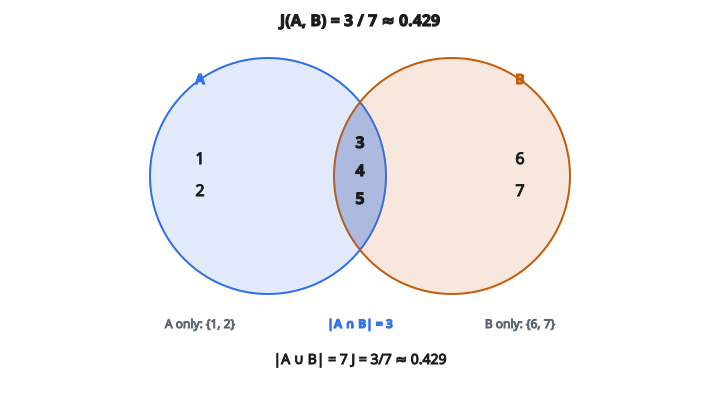

# Jaccard Similarity

## Jaccard similarity là gì

**Jaccard similarity** (còn gọi Jaccard index hoặc Intersection over Union) đo mức giống nhau giữa hai tập bằng cách so kích thước phần giao với kích thước phần hợp.

$$
J(A, B) = \frac{|A \cap B|}{|A \cup B|}
$$

Nó trả lời: “Trong mọi phần tử xuất hiện ở ít nhất một tập, bao nhiêu phần xuất hiện ở cả hai?”

## Hiểu công thức

**Tử số:** $|A \cap B|$ = số phần tử thuộc cả hai tập (intersection)

**Mẫu số:** $|A \cup B|$ = số phần tử thuộc ít nhất một tập (union)

$$
J(A, B) = \frac{\text{phần tử thuộc cả A và B}}{\text{phần tử thuộc A hoặc B hoặc cả hai}}
$$

## Miền giá trị

Jaccard similarity nằm trong $[0, 1]$:

**$J = 0$:** Hai tập không có phần tử chung ($A \cap B = \emptyset$)

**$J = 1$:** Hai tập trùng nhau ($A = B$)

**$J$ giữa $0$ và $1$:** Hai tập chồng một phần

## Ví dụ số

**Tập $A$:** $\{1, 2, 3, 4, 5\}$

**Tập $B$:** $\{3, 4, 5, 6, 7\}$

**Intersection:** $A \cap B = \{3, 4, 5\}$ → size = 3

**Union:** $A \cup B = \{1, 2, 3, 4, 5, 6, 7\}$ → size = 7

**Jaccard similarity:**

$$
J(A, B) = \frac{3}{7} \approx 0.429
$$

::: {#fig-178-jaccard fig-cap="$|A\cap B|=3$, $|A\cup B|=7$, nên $J(A,B)=3/7\approx 0.429$." fig-alt="Hai tap A={1,2,3,4,5} va B={3,4,5,6,7}. Phan giao {3,4,5} size 3, phan hop size 7, J=3/7 xap xi 0.429."}
{fig-align="center"}
:::

## Công thức tương đương

Dùng kích thước tập và phần giao:

$$
J(A, B) = \frac{|A \cap B|}{|A| + |B| - |A \cap B|}
$$

Cách này không cần tính union tường minh.

**Kiểm tra trên ví dụ:**

$$
J(A, B) = \frac{3}{5 + 5 - 3} = \frac{3}{7} \approx 0.429
$$

## Jaccard distance

Jaccard distance là phần bù của similarity:

$$
d_J(A, B) = 1 - J(A, B)
$$

**Tính chất:**

* $d_J(A, B) = 0$ khi hai tập trùng
* $d_J(A, B) = 1$ khi hai tập không chồng
* Thỏa bất đẳng thức tam giác (là metric thật)

## Jaccard trong recommender systems

**Similarity giữa user:**

So user theo tập item họ đã tương tác.

$$
J(u_1, u_2) = \frac{|I_{u_1} \cap I_{u_2}|}{|I_{u_1} \cup I_{u_2}|}
$$

User cùng rating/mua nhiều item giống nhau thì giống nhau.

**Similarity giữa item:**

So item theo tập user đã tương tác với chúng.

$$
J(i_1, i_2) = \frac{|U_{i_1} \cap U_{i_2}|}{|U_{i_1} \cup U_{i_2}|}
$$

Item được nhiều user chung tiêu thụ thì giống nhau.

## Khi nào dùng Jaccard similarity

**Binary / implicit feedback:**

* User đã xem phim chưa? (có/không)
* User đã mua item chưa? (có/không)
* User đã click link chưa? (có/không)

**Không có độ lớn rating:**

Khi chỉ biết user tương tác gì, không biết thích đến mức nào.

**Dữ liệu dạng tập:**

* Tag gắn với item
* Category user đã duyệt
* Từ trong văn bản

## Jaccard so với cosine similarity

**Jaccard:**

* Làm việc trên tập (có/không nhị phân)
* Không xét tần suất hay độ lớn
* Miền: $[0, 1]$

**Cosine:**

* Làm việc trên vector (giá trị số)
* Xét cả độ lớn và hướng
* Miền: $[-1, 1]$, hoặc $[0, 1]$ nếu vector không âm

**Khi có rating:** Dùng cosine hoặc Pearson correlation

**Khi chỉ có tương tác:** Dùng Jaccard

## Ví dụ: similarity user với Jaccard

**User A đã xem:** $\{\text{Movie1}, \text{Movie2}, \text{Movie3}, \text{Movie5}\}$

**User B đã xem:** $\{\text{Movie2}, \text{Movie3}, \text{Movie4}, \text{Movie6}\}$

**User C đã xem:** $\{\text{Movie1}, \text{Movie2}, \text{Movie3}, \text{Movie4}, \text{Movie5}\}$

**$J(A, B)$:**

* Intersection: $\{\text{Movie2}, \text{Movie3}\}$ → 2
* Union: $\{\text{Movie1}, \text{Movie2}, \text{Movie3}, \text{Movie4}, \text{Movie5}, \text{Movie6}\}$ → 6
* $J(A, B) = 2/6 = 0.333$

**$J(A, C)$:**

* Intersection: $\{\text{Movie1}, \text{Movie2}, \text{Movie3}, \text{Movie5}\}$ → 4
* Union: $\{\text{Movie1}, \text{Movie2}, \text{Movie3}, \text{Movie4}, \text{Movie5}\}$ → 5
* $J(A, C) = 4/5 = 0.8$

User C giống User A hơn.

## Ví dụ: similarity item với Jaccard

**Item X được mua bởi:** $\{\text{User1}, \text{User2}, \text{User3}\}$

**Item Y được mua bởi:** $\{\text{User2}, \text{User3}, \text{User4}, \text{User5}\}$

**Intersection:** $\{\text{User2}, \text{User3}\}$ → 2

**Union:** $\{\text{User1}, \text{User2}, \text{User3}, \text{User4}, \text{User5}\}$ → 5

**$J(X, Y) = 2/5 = 0.4$**

## Xử lý tập rỗng

Nếu một trong hai tập rỗng:

**Một tập rỗng:**

$A = \emptyset$, $B = \{1, 2, 3\}$

$A \cap B = \emptyset$, $A \cup B = \{1, 2, 3\}$

$J(A, B) = 0 / 3 = 0$

**Cả hai tập rỗng:**

$A = \emptyset$, $B = \emptyset$

$A \cup B = \emptyset$ → chia cho 0

**Quy ước:** Đặt $J(\emptyset, \emptyset) = 1$ (hai tập rỗng được xem là trùng nhau).

## Weighted Jaccard similarity

Với multiset, phần tử có count:

$$
J_w(A, B) = \frac{\sum_x \min(A_x, B_x)}{\sum_x \max(A_x, B_x)}
$$

với $A_x$ là count của phần tử $x$ trong multiset $A$.

**Ví dụ:**

$A = \{a:3, b:2\}$, $B = \{a:1, b:4, c:1\}$

Tử số: $\min(3,1) + \min(2,4) + \min(0,1) = 1 + 2 + 0 = 3$

Mẫu số: $\max(3,1) + \max(2,4) + \max(0,1) = 3 + 4 + 1 = 8$

$J_w(A, B) = 3/8 = 0.375$

## Min-Hash để tính hiệu quả

Tính đúng Jaccard cho nhiều cặp rất tốn. Min-Hash xấp xỉ hiệu quả:

**Ý tưởng:** Hash mỗi phần tử, giữ hash nhỏ nhất. Tập giống nhau có xu hướng cùng giá trị min.

**Tính chất:**

$$
P(\min(h(A)) = \min(h(B))) = J(A, B)
$$

Dùng nhiều hàm hash để ước Jaccard mà không cần tính đủ intersection/union.

## Jaccard trong so khớp văn bản

**Shingles (n-grams):**

Chuyển văn bản thành tập n-gram ký tự hoặc từ.

**Ví dụ (word 2-gram):**

“the cat sat” → {“the cat”, “cat sat”}

“the cat ran” → {“the cat”, “cat ran”}

Intersection: {“the cat”} → 1

Union: {“the cat”, “cat sat”, “cat ran”} → 3

$J = 1/3 \approx 0.333$

## Jaccard so với overlap coefficient

**Jaccard:**

$$
J(A, B) = \frac{|A \cap B|}{|A \cup B|}
$$

**Overlap coefficient:**

$$
O(A, B) = \frac{|A \cap B|}{\min(|A|, |B|)}
$$

Overlap coefficient bằng 1 nếu một tập là subset của tập kia. Jaccard chặt hơn.

## Độ đo kiểu Jaccard bất đối xứng

**Containment ($A$ trong $B$):**

$$
C(A, B) = \frac{|A \cap B|}{|A|}
$$

Bao nhiêu phần tử của $A$ nằm trong $B$?

Độ đo này bất đối xứng: $C(A, B) \neq C(B, A)$ nói chung.

Hữu ích khi một tập là “query” và tập kia là “target.”

## Tính chất của Jaccard similarity

**Đối xứng:** $J(A, B) = J(B, A)$

**Bị chặn:** $0 \leq J(A, B) \leq 1$

**Đồng nhất:** $J(A, A) = 1$

**Metric (dạng distance):** $d_J$ thỏa bất đẳng thức tam giác

Các tính chất này khiến Jaccard ổn định cho tính similarity.

## Code
```python
def jaccard_similarity(set_a, set_b):
    """
    Compute the Jaccard similarity between two item sets.
    """
    a = set(set_a)
    b = set(set_b)
    union = len(a | b)
    if union == 0:
        return 0.0
    return len(a & b) / union

```

<!-- auto-self-check -->

::: {.callout-note}
## Kiểm tra nhanh
<details>
<summary>Ý chính của bài «Jaccard Similarity» là gì?</summary>
**Jaccard similarity** (còn gọi Jaccard index hoặc Intersection over Union) đo mức giống nhau giữa hai tập bằng cách so kích thước phần giao với kích thước phần hợp.
</details>
<details>
<summary>Công thức / quan hệ cốt lõi trong bài là gì?</summary>
$$J(A, B) = \frac{|A \cap B|}{|A \cup B|}$$
</details>
:::
