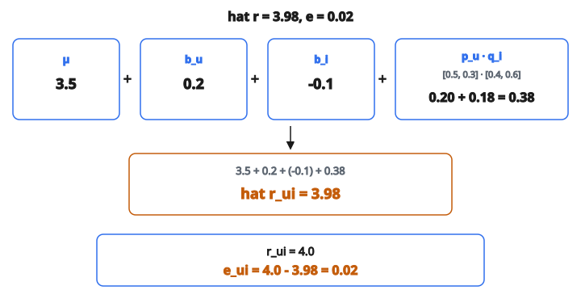

# Matrix Factorization SGD Step

## Matrix factorization SGD là gì

**Matrix factorization (MF)** phân rã ma trận rating user–item thành các ma trận latent factor chiều thấp hơn. Stochastic Gradient Descent (SGD) là thuật toán phổ biến nhất để học các factor này, bằng cách giảm dần prediction error.

Mục tiêu là tìm user factor $\mathbf{p}_u$ và item factor $\mathbf{q}_i$ sao cho:

$$
r_{ui} \approx \mathbf{p}_u^{T} \mathbf{q}_i
$$

## Mô hình

**Dự đoán rating:**

$$
\hat{r}_{ui} = \mu + b_u + b_i + \mathbf{p}_u^{T} \mathbf{q}_i
$$

với:

* $\mu$: Mean rating toàn cục
* $b_u$: User bias
* $b_i$: Item bias
* $\mathbf{p}_u \in \mathbb{R}^{k}$: Vector latent factor của user
* $\mathbf{q}_i \in \mathbb{R}^{k}$: Vector latent factor của item
* $k$: Số latent factor (thường 20–200)

## Hàm mục tiêu

Giảm squared error có regularization trên các rating đã quan sát:

$$
\mathcal{L} = \sum_{(u,i) \in R} (r_{ui} - \hat{r}_{ui})^2 + \lambda \left( \lVert \mathbf{p}_u \rVert^2 + \lVert \mathbf{q}_i \rVert^2 + b_u^2 + b_i^2 \right)
$$

với:

* $R$ là tập rating đã quan sát
* $\lambda$ là cường độ regularization

Regularization chống overfitting bằng cách phạt giá trị tham số lớn.

## Quy tắc cập nhật SGD

Với mỗi rating quan sát $(u, i, r_{ui})$:

**Bước 1: Tính prediction error**

$$
e_{ui} = r_{ui} - \hat{r}_{ui}
$$

**Bước 2: Cập nhật bias**

$$
b_u \leftarrow b_u + \eta (e_{ui} - \lambda b_u)
$$

$$
b_i \leftarrow b_i + \eta (e_{ui} - \lambda b_i)
$$

**Bước 3: Cập nhật latent factor**

$$
\mathbf{p}_u \leftarrow \mathbf{p}_u + \eta (e_{ui} \mathbf{q}_i - \lambda \mathbf{p}_u)
$$

$$
\mathbf{q}_i \leftarrow \mathbf{q}_i + \eta (e_{ui} \mathbf{p}_u - \lambda \mathbf{q}_i)
$$

với $\eta$ là learning rate.

## Hiểu bước cập nhật

Cập nhật cho $\mathbf{p}_u$ có hai phần:

**Gradient term:** $e_{ui} \mathbf{q}_i$

Đi theo hướng làm giảm error. Nếu $e_{ui} > 0$ (dự đoán thấp), dịch $\mathbf{p}_u$ về phía $\mathbf{q}_i$.

**Regularization term:** $-\lambda \mathbf{p}_u$

Co $\mathbf{p}_u$ về 0 để chống overfitting.

Learning rate $\eta$ điều khiển kích thước bước.

## Ví dụ số

**Thiết lập:**

* $\mathbf{p}_u$ hiện tại $= [0.5, 0.3]$
* $\mathbf{q}_i$ hiện tại $= [0.4, 0.6]$
* $b_u = 0.2$, $b_i = -0.1$, $\mu = 3.5$
* Rating thật $r_{ui} = 4.0$
* Learning rate $\eta = 0.01$
* Regularization $\lambda = 0.02$

**Bước 1: Tính dự đoán**

$$
\hat{r}_{ui} = 3.5 + 0.2 + (-0.1) + (0.5 \times 0.4 + 0.3 \times 0.6)
$$

$$
\begin{aligned}
\hat{r}_{ui}
&= 3.5 + 0.1 + (0.2 + 0.18) \\
&= 3.5 + 0.1 + 0.38 \\
&= 3.98
\end{aligned}
$$

**Bước 2: Tính error**

$$
e_{ui} = 4.0 - 3.98 = 0.02
$$

::: {#fig-169-mf-sgd fig-cap="SGD step: $\hat{r}_{ui}=3.5+0.2-0.1+0.38=3.98$, $e_{ui}=4.0-3.98=0.02$ với $\mathbf{p}_u=[0.5,0.3]$, $\mathbf{q}_i=[0.4,0.6]$." fig-alt="Du doan MF: mu=3.5, b_u=0.2, b_i=-0.1, p_u=[0.5, 0.3], q_i=[0.4, 0.6]; p·q=0.38; hat r=3.98; e=4.0-3.98=0.02."}
{fig-align="center"}
:::

**Bước 3: Cập nhật bias**

$$
b_u = 0.2 + 0.01 \times (0.02 - 0.02 \times 0.2) = 0.2 + 0.01 \times 0.016 = 0.20016
$$

$$
b_i = -0.1 + 0.01 \times (0.02 - 0.02 \times (-0.1)) = -0.1 + 0.01 \times 0.022 = -0.09978
$$

**Bước 4: Cập nhật user factor**

$$
\mathbf{p}_u[0] = 0.5 + 0.01 \times (0.02 \times 0.4 - 0.02 \times 0.5) = 0.5 + 0.01 \times (-0.002) = 0.49998
$$

$$
\mathbf{p}_u[1] = 0.3 + 0.01 \times (0.02 \times 0.6 - 0.02 \times 0.3) = 0.3 + 0.01 \times 0.006 = 0.30006
$$

**Bước 5: Cập nhật item factor**

$$
\mathbf{q}_i[0] = 0.4 + 0.01 \times (0.02 \times 0.5 - 0.02 \times 0.4) = 0.4 + 0.01 \times 0.002 = 0.40002
$$

$$
\mathbf{q}_i[1] = 0.6 + 0.01 \times (0.02 \times 0.3 - 0.02 \times 0.6) = 0.6 + 0.01 \times (-0.006) = 0.59994
$$

## Thuật toán huấn luyện

**Khởi tạo:**

* Đặt $\mu$ bằng mean toàn cục
* Khởi tạo $b_u = 0$, $b_i = 0$
* Khởi tạo $\mathbf{p}_u$, $\mathbf{q}_i$ bằng giá trị ngẫu nhiên nhỏ

**Mỗi epoch:**

1. Shuffle các rating đã quan sát
2. Với mỗi rating $(u, i, r_{ui})$:
   * Tính error $e_{ui}$
   * Cập nhật $b_u$, $b_i$, $\mathbf{p}_u$, $\mathbf{q}_i$
3. Tùy chọn tính tổng loss và kiểm tra hội tụ

**Điều kiện dừng:**

* Số epoch cố định
* Loss ngừng giảm
* Validation error tăng (early stopping)

## Lịch learning rate

**Learning rate cố định:**

Đơn giản nhưng có thể không hội tụ tới nghiệm tốt nhất.

**Learning rate giảm dần:**

$$
\eta_t = \frac{\eta_0}{1 + \alpha t}
$$

Bước lớn lúc đầu, bước nhỏ lúc sau để tinh chỉnh.

**Bold driver:**

Tăng $\eta$ nếu loss giảm, giảm nếu loss tăng.

## Tầm quan trọng của shuffling

Shuffle rating mỗi epoch là then chốt:

**Không shuffle:**

* Pattern thứ tự dữ liệu có thể làm lệch việc học
* Cập nhật có thể dao động

**Có shuffle:**

* Ước lượng gradient ngẫu nhiên hơn
* Hội tụ tốt hơn
* Dễ thoát local minima hơn

## Mini-batch SGD

Thay vì một rating một lần, dùng batch nhỏ:

**Trung bình gradient trên batch:**

$$
\mathbf{p}_u \leftarrow \mathbf{p}_u + \eta \left( \frac{1}{|B|} \sum_{(u,i) \in B} e_{ui} \mathbf{q}_i - \lambda \mathbf{p}_u \right)
$$

**Lợi ích:**

* Gradient ổn định hơn
* Tận dụng GPU tốt hơn
* Cho phép song song hóa

## Chiến lược khởi tạo

**Khởi tạo ngẫu nhiên:**

Rút từ $\mathcal{N}(0, 0.01)$ hoặc $\mathcal{U}(-0.01, 0.01)$

**Xavier/He initialization:**

Scale bằng $\sqrt{1/k}$ với $k$ là số factor.

**Khởi tạo SVD:**

Khởi tạo bằng truncated SVD của ma trận rating (cần imputation cho giá trị thiếu).

Khởi tạo tốt có thể tăng tốc hội tụ đáng kể.

## Cold start trong lúc huấn luyện

**User mới được thêm:**

Khởi tạo $\mathbf{p}_{\text{new}}$ bằng giá trị ngẫu nhiên nhỏ. Cập nhật xảy ra khi họ rating item.

**Item mới được thêm:**

Khởi tạo $\mathbf{q}_{\text{new}}$ bằng giá trị ngẫu nhiên nhỏ. Cập nhật xảy ra khi item nhận rating.

Mô hình học từ dữ liệu mới qua các bước SGD tiếp tục.

## Biến thể implicit feedback (ALS-WR)

Với implicit feedback (click, view), dùng weighted regularization:

$$
\mathcal{L} = \sum_{u,i} c_{ui}(p_{ui} - \mathbf{p}_u^{T} \mathbf{q}_i)^2 + \lambda \left( \lVert \mathbf{p}_u \rVert^2 + \lVert \mathbf{q}_i \rVert^2 \right)
$$

với $c_{ui}$ là confidence (cao hơn khi có tương tác quan sát) và $p_{ui}$ là preference (1 nếu quan sát, 0 nếu không).

## Tính chất hội tụ

**SGD hội tụ khi:**

* Learning rate giảm (tổng diverge, tổng bình phương converge)
* Hoặc learning rate nhỏ cố định (hội tụ vào lân cận nghiệm tối ưu)

**Hàm mục tiêu không lồi:**

Matrix factorization không lồi. SGD tìm local minima, thường đủ tốt trong thực tế.

## Song song hóa

**Hogwild SGD:**

Cập nhật tham số không khóa. Ổn vì hầu hết cập nhật đụng tham số khác nhau (tương tác thưa).

**Distributed SGD:**

Chia user hoặc item trên các máy. Đồng bộ định kỳ.

**Alternating Least Squares (ALS):**

Thay thế SGD. Cố định một ma trận, giải ma trận còn lại. Dễ song song hơn.

## Code
```python
import numpy as np

def matrix_factorization_sgd_step(U, V, r, lr, reg):
    """
    Perform one SGD step for matrix factorization.
    """
    U = np.array(U, dtype=float)
    V = np.array(V, dtype=float)
    e = r - float(U @ V)
    U_new = U + lr * (e * V - reg * U)
    V_new = V + lr * (e * U - reg * V)
    return [round(float(x), 4) for x in U_new], [round(float(x), 4) for x in V_new]

```
