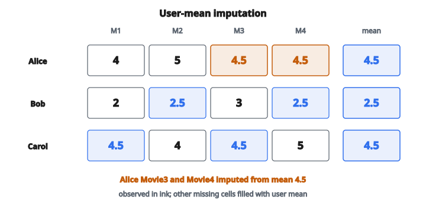

# Mean Rating Imputation

## Mean rating imputation là gì

**Mean rating imputation** là kỹ thuật dùng trong recommender system để điền các ô còn thiếu của ma trận rating user–item. Khi user chưa rate một item, ta ước lượng rating có thể dựa trên thông tin sẵn có — thường là mean rating của user đó, mean rating của item đó, hoặc một tổ hợp.

## Vấn đề sparsity trong recommender system

Ma trận rating cực kỳ thưa:

* Netflix: ~99% ô bị thiếu
* Amazon: ~99.9% ô bị thiếu

**Vì sao thưa đến vậy?**

* Hàng triệu user, hàng triệu item
* Mỗi user chỉ tương tác với một phần rất nhỏ
* Không thể rate mọi thứ

**Hệ quả:**

* Không so sánh trực tiếp được user đã rate item khác nhau
* Độ tương tự thất bại khi không có rating chồng lấp
* Một số thuật toán cần ma trận đầy đủ

## Các kiểu mean imputation

### Global mean

Thay mọi giá trị thiếu bằng trung bình của mọi rating đã biết trong ma trận:

$$
\hat{r}_{ui} = \mu = \frac{1}{|\Omega|} \sum_{(u,i) \in \Omega} r_{ui}
$$

với $\Omega$ là tập rating quan sát được.

**Ưu:** Đơn giản, chỉ một giá trị cần tính

**Nhược:** Bỏ qua hoàn toàn khác biệt giữa user và item

### User mean

Thay giá trị thiếu bằng trung bình rating mà user đó đã cho:

$$
\hat{r}_{ui} = \bar{r}_{u} = \frac{1}{|I_{u}|} \sum_{i \in I_{u}} r_{ui}
$$

với $I_{u}$ là tập item mà user $u$ đã rate.

**Trực giác:** Một số user là “critic khắt khe” (trung bình thấp), người khác là “easy grader” (trung bình cao). User mean bắt xu hướng này.

**Ưu:** Bắt thang rating riêng của user

**Nhược:** Bỏ qua chất lượng riêng của item

### Item mean

Thay giá trị thiếu bằng trung bình rating mà item đó nhận được:

$$
\hat{r}_{ui} = \bar{r}_{i} = \frac{1}{|U_{i}|} \sum_{u \in U_{i}} r_{ui}
$$

với $U_{i}$ là tập user đã rate item $i$.

**Trực giác:** Một số item được yêu thích rộng rãi (trung bình cao), item khác nhìn chung không được thích (trung bình thấp).

**Ưu:** Bắt chất lượng item

**Nhược:** Bỏ qua preference của user

### Imputation kết hợp (user mean + item mean)

Cách tinh vi hơn kết hợp hiệu ứng user và item:

$$
\hat{r}_{ui} = \mu + b_{u} + b_{i}
$$

với

$$
\begin{aligned}
\mu &:\ \text{trung bình toàn cục}, \\
b_{u} = \bar{r}_{u} - \mu &:\ \text{user bias (mức user lệch khỏi trung bình toàn cục)}, \\
b_{i} = \bar{r}_{i} - \mu &:\ \text{item bias (mức item lệch khỏi trung bình toàn cục)}.
\end{aligned}
$$

Mô hình baseline này tính cả độ rộng rãi của user lẫn chất lượng item.

## Ví dụ số: user mean imputation

**Ma trận rating** (`?` là ô thiếu):

* Alice: Movie1 $= 4$, Movie2 $= 5$, Movie3 $= \text{?}$, Movie4 $= \text{?}$
* Bob: Movie1 $= 2$, Movie2 $= \text{?}$, Movie3 $= 3$, Movie4 $= \text{?}$
* Carol: Movie1 $= \text{?}$, Movie2 $= 4$, Movie3 $= \text{?}$, Movie4 $= 5$

**Bước 1: Tính user mean**

$$
\bar{r}_{\text{Alice}} = \frac{4 + 5}{2} = 4.5
$$

$$
\bar{r}_{\text{Bob}} = \frac{2 + 3}{2} = 2.5
$$

$$
\bar{r}_{\text{Carol}} = \frac{4 + 5}{2} = 4.5
$$

**Bước 2: Impute giá trị thiếu**

* Alice: Movie3 $= 4.5$, Movie4 $= 4.5$
* Bob: Movie2 $= 2.5$, Movie4 $= 2.5$
* Carol: Movie1 $= 4.5$, Movie3 $= 4.5$

**Diễn giải:** Alice và Carol được impute giá trị cao hơn vì họ thường cho rating cao.

::: {#fig-195-imputation fig-cap="User mean: Alice và Carol $=4.5$, Bob $=2.5$. Ô thiếu của Alice (Movie3, Movie4) được impute $4.5$." fig-alt="Ma tran 3 user x 4 movie: Alice/Carol mean 4.5, Bob mean 2.5; o thieu cua Alice Movie3 va Movie4 duoc impute 4.5."}
{fig-align="center"}
:::

## Ví dụ số: item mean imputation

**Cùng ma trận rating:**

**Bước 1: Tính item mean**

$$
\bar{r}_{\text{Movie1}} = \frac{4 + 2}{2} = 3.0
$$

$$
\bar{r}_{\text{Movie2}} = \frac{5 + 4}{2} = 4.5
$$

$$
\bar{r}_{\text{Movie3}} = \frac{3}{1} = 3.0
$$

$$
\bar{r}_{\text{Movie4}} = \frac{5}{1} = 5.0
$$

**Bước 2: Impute giá trị thiếu**

* Alice: Movie3 $= 3.0$, Movie4 $= 5.0$
* Bob: Movie2 $= 4.5$, Movie4 $= 5.0$
* Carol: Movie1 $= 3.0$, Movie3 $= 3.0$

**Diễn giải:** Movie4 nhận giá trị impute cao vì Carol đã cho rating cao.

## Xử lý cold start

**User mới (chưa có rating):** Không tính được user mean

* Fallback về global mean
* Hoặc dùng ước lượng theo demographic

**Item mới (chưa có rating):** Không tính được item mean

* Fallback về global mean
* Hoặc dùng ước lượng content-based

**Cách kết hợp:** Khi thiếu user mean hoặc item mean, dùng thành phần còn lại cộng global mean.

## Hiệu chỉnh bias

Imputation thô có thể đưa vào sai số hệ thống:

**Bias của user mean:** Nếu những user đã rate một item không đại diện, user mean imputation thừa hưởng bias của họ.

**Bias của item mean:** Nếu những item mà user đã rate không đại diện, item mean imputation bỏ lỡ preference thật.

**Regularization:** Thêm hạng co (shrinkage) kéo ước lượng về global mean khi ít rating:

$$
\hat{r}_{ui} = \frac{n_{u} \cdot \bar{r}_{u} + \lambda \cdot \mu}{n_{u} + \lambda}
$$

với $n_{u}$ là số rating của user $u$ và $\lambda$ kiểm soát độ mạnh regularization.

## Imputation so với prediction

**Mục đích imputation:** Điền ma trận cho thuật toán phía sau cần dữ liệu đầy đủ (ví dụ SVD, PCA).

**Mục đích prediction:** Ước lượng rating user sẽ cho để recommend item.

Mean imputation thường là bước tiền xử lý, không phải mô hình recommendation cuối. Các phương pháp tinh vi hơn (matrix factorization, collaborative filtering) xây trên baseline đã impute.

## Cân nhắc khi đánh giá

**Không đánh giá trên giá trị đã impute:** Nếu impute bằng user mean, dự đoán user mean sẽ có error bằng không theo đúng cách xây dựng.

**Đánh giá hold-out:** Chia rating quan sát thành train/test. Chỉ impute rating huấn luyện. Đánh giá trên rating test được giữ lại.

**Imputation ảnh hưởng huấn luyện mô hình:** Chất lượng imputation tác động các thuật toán collaborative filtering dùng ma trận đã điền.

## Nơi mean rating imputation xuất hiện

* **Netflix, Amazon, Spotify:** Engine recommendation xử lý ma trận user–item thưa
* **Mô hình baseline:** User bias và item bias là nền của mô hình phức tạp hơn
* **Tiền xử lý matrix factorization:** SVD và ALS thường căn giữa ma trận bằng cách trừ mean
* **Xử lý cold start:** User/item mới nhận ước lượng mean toàn cục hoặc content-based
* **A/B testing:** Điểm engagement đã impute cho user không tương tác với một số biến thể
* **Dữ liệu khảo sát:** Câu trả lời thiếu được impute bằng mean của người trả lời hoặc của câu hỏi
* **Nền tảng giáo dục:** Ma trận thành tích học sinh với bài kiểm tra thiếu
* **Y tế:** Ma trận kết quả bệnh nhân–điều trị với quan sát thiếu

## Code
```python
def mean_rating_imputation(ratings_matrix, mode):
    """
    Fill missing ratings (zeros) with user or item means.
    """
    n_users = len(ratings_matrix)
    n_items = len(ratings_matrix[0])
    result = [row[:] for row in ratings_matrix]
    if mode == "user":
        for u in range(n_users):
            rated = [r for r in result[u] if r != 0]
            mean = sum(rated) / len(rated) if rated else 0.0
            for j in range(n_items):
                if result[u][j] == 0:
                    result[u][j] = mean
    else:
        item_means = []
        for j in range(n_items):
            rated = [result[u][j] for u in range(n_users) if result[u][j] != 0]
            item_means.append(sum(rated) / len(rated) if rated else 0.0)
        for u in range(n_users):
            for j in range(n_items):
                if result[u][j] == 0:
                    result[u][j] = item_means[j]
    return result

```
