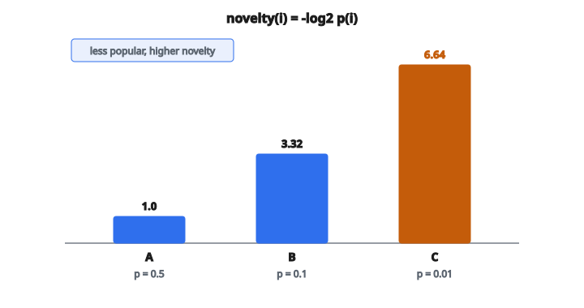

# Novelty Score

## Novelty score là gì

**Novelty score** đo mức item được recommend bất ngờ hoặc xa lạ với user. Nó định lượng mức recommendation giới thiệu item mà user khó tự khám phá.

Novelty cao nghĩa là recommend item ít phổ biến, ít được biết đến, hoặc xa lựa chọn điển hình của user.

## Vì sao novelty quan trọng

**Giá trị khám phá:**

User thường muốn khám phá thứ mới, không chỉ thấy item họ đã biết.

**Ra ngoài accuracy:**

Hệ thống chỉ recommend item phổ biến có thể chính xác nhưng không hữu ích cho khám phá.

**Exposure cho long-tail:**

Novelty khuyến khích recommend item niche, có lợi cho cả user và creator.

**Engagement của user:**

Recommendation mới lạ có thể tăng hứng thú và thời gian khám phá.

## Novelty dựa trên popularity

Định nghĩa phổ biến nhất dùng popularity của item như proxy cho mức thân thuộc:

$$
\text{novelty}(i) = -\log_{2} p(i)
$$

với $p(i)$ là xác suất một user ngẫu nhiên đã xem/rate item $i$.

$$
p(i) = \frac{|U_{i}|}{|U|}
$$

**Diễn giải:** Item ít phổ biến có novelty cao hơn (ít khả năng đã được biết).

## Suy ra công thức novelty

Công thức $-\log_{2} p(i)$ đến từ lý thuyết thông tin:

**Self-information:**

Độ “bất ngờ” của một sự kiện có xác suất $p$ là $-\log_{2} p$.

**Xác suất thấp = bất ngờ cao = novelty cao**

**Xác suất cao = bất ngờ thấp = novelty thấp**

Nếu mọi người đều biết một item ($p \approx 1$), novelty $\approx 0$.
Nếu gần như không ai biết một item ($p \approx 0$), novelty cao.

## Ví dụ số

**Hệ thống với 1000 user:**

* Item A: được 500 user rate, $p(A) = 0.5$
* Item B: được 100 user rate, $p(B) = 0.1$
* Item C: được 10 user rate, $p(C) = 0.01$

**Novelty score:**

* $\text{novelty}(A) = -\log_{2}(0.5) = 1.0$
* $\text{novelty}(B) = -\log_{2}(0.1) \approx 3.32$
* $\text{novelty}(C) = -\log_{2}(0.01) \approx 6.64$

Item C (ít phổ biến nhất) có novelty cao nhất.

::: {#fig-196-novelty fig-cap="$p=0.5, 0.1, 0.01$ cho $\mathrm{novelty}=-\log_2 p$ lần lượt $1.0$, $3.32$, $6.64$." fig-alt="Ba item: p=0.5, 0.1, 0.01 tuong ung novelty 1.0, 3.32, 6.64. Item C cao nhat."}
{fig-align="center"}
:::

## Novelty trung bình của một danh sách recommendation

Với danh sách recommendation $R_{u}$ gồm $K$ item cho user $u$:

$$
\text{Novelty}(R_{u}) = \frac{1}{K} \sum_{i \in R_{u}} -\log_{2} p(i)
$$

Đây là trung bình novelty của mọi item được recommend.

**Ví dụ:**

$R_{u} = \{A, B, C\}$ với novelty $\{1.0, 3.32, 6.64\}$

$$
\text{Novelty}(R_{u}) = \frac{1.0 + 3.32 + 6.64}{3} = 3.65
$$

## Novelty toàn hệ thống

Novelty trung bình trên mọi user:

$$
\text{Novelty}_{\text{system}} = \frac{1}{|U|} \sum_{u \in U} \text{Novelty}(R_{u})
$$

Cách này đo mức recommendation của hệ thống mới lạ nói chung.

## Định nghĩa novelty thay thế

**Novelty theo khoảng cách:**

Item được recommend cách bao xa so với item user đã xem?

$$
\text{novelty}(i; u) = \min_{j \in I_{u}} d(i, j)
$$

với $d(i, j)$ là khoảng cách giữa các item trong không gian đặc trưng.

**Novelty theo nội dung:**

Item được recommend khác profile của user đến mức nào?

**Novelty theo thời gian:**

Item được thêm vào hệ thống gần đây đến mức nào?

## Novelty so với serendipity

**Novelty:**

Item có xa lạ/bất ngờ với user không?

**Serendipity:**

Item vừa mới lạ **và** liên quan/thú vị?

Serendipity $=$ Novelty $+$ Relevance

Một recommendation hoàn toàn ngẫu nhiên có thể mới lạ nhưng không serendipitous nếu user không thích.

## Novelty so với diversity

**Novelty:**

Từng item riêng lẻ xa lạ với user đến mức nào?

**Diversity:**

Các item được recommend khác nhau đến mức nào?

Cả hai đều là metric beyond-accuracy, nhưng đo khía cạnh khác nhau. Một danh sách có thể mới lạ nhưng không đa dạng (toàn item niche cùng genre) hoặc đa dạng nhưng không mới lạ (item phổ biến khác genre).

## Đánh đổi accuracy–novelty

**Hệ thống accuracy cao thường nghiêng về novelty thấp:**

* Dự đoán chính xác ưu tiên item phổ biến, được rate tốt
* Item phổ biến có nhiều dữ liệu, dự đoán tin cậy hơn
* Recommendation an toàn, phổ biến thường chính xác

**Tăng novelty có thể giảm accuracy:**

* Recommend item ít người biết rủi ro hơn
* Ít dữ liệu nghĩa là dự đoán kém tự tin hơn

**Mục tiêu:** Tìm item mới lạ mà user thực sự thích.

## Đưa novelty vào recommendation

**Re-ranking:**

Sinh ứng viên theo relevance, rồi xếp lại để gồm nhiều item mới lạ hơn.

**Tối ưu đa mục tiêu:**

Tối ưu cả relevance lẫn novelty:

$$
\text{score}(i) = \alpha \cdot \text{relevance}(i) + (1-\alpha) \cdot \text{novelty}(i)
$$

**Thuật toán diversification:**

Cân bằng tường minh relevance và novelty trong quá trình chọn.

## Đo novelty khi đánh giá

**Đánh giá offline:**

Tính novelty của item được recommend bằng popularity lịch sử.

**Đánh giá online:**

Theo dõi user có click/tương tác với recommendation mới lạ không.

**Nghiên cứu user:**

Hỏi user recommendation có giúp họ khám phá thứ mới không.

## Popularity bias và novelty

Nhiều thuật toán recommendation có popularity bias:

* Item phổ biến xuất hiện trong nhiều mẫu huấn luyện hơn
* Thuật toán học ưu tiên chúng
* Kết quả là novelty thấp

**Xử lý popularity bias:**

* Inverse propensity scoring
* Gỡ bias popularity khi huấn luyện
* Re-ranking sau để tăng novelty

## Novelty tại các giá trị K

Novelty đổi theo độ dài danh sách:

**Danh sách ngắn ($K=5$):**

Thuật toán thường gồm chủ yếu item liên quan (thường phổ biến).

**Danh sách dài hơn ($K=50$):**

Còn chỗ cho item mới lạ sau khi đã phủ lựa chọn hiển nhiên.

**Novelty@K:**

Chỉ tính novelty cho top-K recommendation.

## Novelty theo user

Novelty có thể được cá nhân hóa:

**Dựa trên lịch sử user:**

Item $i$ mới lạ với user $u$ nếu không giống item $u$ đã xem.

$$
\text{novelty}_{u}(i) = 1 - \max_{j \in I_{u}} \text{sim}(i, j)
$$

**Dựa trên kỳ vọng của user:**

User khác nhau kỳ vọng mức novelty khác nhau.

* User mới: thích item quen thuộc
* Power user: khao khát novelty

## Báo cáo metric novelty

Khi báo cáo novelty:

**Nêu rõ công thức đã dùng:**

Theo popularity, theo khoảng cách, v.v.

**Báo cáo kèm accuracy:**

Chỉ novelty thì chưa đủ. Recommendation ngẫu nhiên có novelty cao.

**Vẽ đường đánh đổi:**

Vẽ accuracy so với novelty khi một tham số tinh chỉnh thay đổi.

## Code
```python
import math

def novelty_score(recommendations, item_counts, n_users):
    """
    Compute the average novelty of a recommendation list.
    """
    total = 0.0
    for item in recommendations:
        pop = item_counts[item] / n_users
        if pop > 0:
            total += -math.log2(pop)
    return total / len(recommendations) if recommendations else 0.0

```
