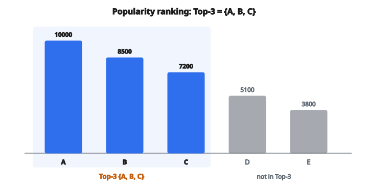

# Popularity Ranking

## Popularity ranking là gì

**Popularity ranking** là chiến lược recommendation đơn giản nhất: xếp hạng item theo mức độ phổ biến và gợi ý những item phổ biến nhất. Dù đơn giản, đây là một baseline mạnh mà các thuật toán phức tạp phải vượt qua.

$$
\text{score}(i) = \text{popularity}(i)
$$

Recommend các item có score cao nhất.

## Đo popularity

**Số tương tác:**

$$
\text{popularity}(i) = |U_i| = \text{số user đã tương tác với } i
$$

**Số rating:**

Số rating mà item nhận được.

**Số purchase/click:**

Số lần item được mua hoặc click.

**Số view:**

Số lượt xem hoặc impression.

## Vì sao popularity hiệu quả

**Social proof:**

Item phổ biến thường phổ biến vì có lý do. Nhiều user thích một thứ là tín hiệu chất lượng.

**Recommendation an toàn:**

Item phổ biến có sức hút rộng và ít khi hoàn toàn sai.

**Không cold start cho item:**

Khi item đã có bất kỳ tương tác nào, nó có thể được recommend.

**Đơn giản về tính toán:**

Chỉ cần đếm và sắp xếp. Cực nhanh.

## Ví dụ số

**Số tương tác theo item:**

* Movie A: 10,000 views
* Movie B: 8,500 views
* Movie C: 7,200 views
* Movie D: 5,100 views
* Movie E: 3,800 views

**Xếp hạng popularity:** $A > B > C > D > E$

**Top-3 recommendation cho mọi user:** $\{A, B, C\}$

::: {#fig-180-popularity fig-cap="Xếp hạng popularity theo views: $A=10000$, $B=8500$, $C=7200$, $D=5100$, $E=3800$ (thứ tự $A &gt; B &gt; C &gt; D &gt; E$). Top-3 cho mọi user là $\{A,B,C\}$." fig-alt="Nam cot views: A=10000, B=8500, C=7200, D=5100, E=3800. Top-3 {A,B,C} to mau accent; D va E mo hon."}
{fig-align="center"}
:::

## Tính không cá nhân hóa

Popularity ranking hoàn toàn không cá nhân hóa:

**Mọi user nhận cùng một danh sách recommendation.**

Đó vừa là điểm yếu (không personalization) vừa là điểm mạnh (đơn giản, scale tốt, không cần dữ liệu user).

## Popularity có trọng số thời gian

Tương tác gần đây có thể quan trọng hơn:

**Suy giảm mũ (exponential decay):**

$$
\text{popularity}(i) = \sum_{t} e^{-\lambda(t_{\text{now}} - t)} \cdot \mathbb{1}[\text{có tương tác tại } t]
$$

**Cửa sổ thời gian:**

Chỉ đếm tương tác trong tuần/tháng vừa rồi.

**Trending:**

Xếp theo tốc độ tăng popularity, không theo popularity tuyệt đối.

Cách này bắt được những gì đang nóng hiện tại, không chỉ những favorite mọi thời đại.

## Average rating so với count

**Theo count:** Nhiều tương tác nhất thắng.

**Theo average rating:** Điểm trung bình cao nhất thắng.

**Vấn đề của trung bình:**

Một item có 2 rating trung bình $5.0$ thắng một item có 1000 rating trung bình $4.8$.

**Bayesian average:**

$$
\bar{r}_{\text{bayes}} = \frac{C \cdot m + \sum r_{ui}}{C + n}
$$

với

$$
\begin{aligned}
m &:\ \text{trung bình toàn cục}, \\
C &:\ \text{trọng số prior}, \\
n &:\ \text{số rating}.
\end{aligned}
$$

Công thức này kéo trung bình mẫu nhỏ về phía trung bình toàn cục.

## Popularity kết hợp filter

Kết hợp popularity với lọc:

**Theo category:**

Phim action phổ biến nhất, album jazz phổ biến nhất.

**Theo độ mới:**

Item được thêm trong tháng này và phổ biến nhất.

**Theo địa lý:**

Phổ biến nhất tại quốc gia/vùng của user.

Cách này thêm một ít relevance theo ngữ cảnh vào popularity thuần.

## Popularity ranking làm baseline

Mọi thuật toán recommendation nên vượt popularity ranking.

**Nếu mô hình phức tạp kém hơn “recommend item phổ biến”:**

* Mô hình không học được pattern hữu ích
* Dữ liệu có thể quá thưa
* Cách đánh giá có thể sai

**Báo cáo mức cải thiện so với popularity:**

“Phương pháp của chúng tôi cải thiện HR@10 thêm 15% so với popularity baseline.”

## Vấn đề popularity bias

Recommend theo popularity tạo vòng phản hồi:

1. Item phổ biến được recommend
2. Item được recommend nhận thêm tương tác
3. Chúng trở nên phổ biến hơn
4. Lặp lại

**Rich get richer:**

Item phổ biến càng phổ biến; item niche vẫn vô hình.

**Filter bubble:**

User chỉ thấy những gì mọi người khác đang thấy.

## Phá vòng lặp popularity

**Exploration:**

Thỉnh thoảng recommend item ít phổ biến hơn để thu thập dữ liệu.

**Yêu cầu diversity:**

Đảm bảo recommendation gồm một số item không phổ biến.

**Inverse propensity scoring:**

Gán trọng số dữ liệu huấn luyện để chống popularity bias.

**Tối ưu long-tail:**

Chủ động tối ưu việc recommend item long-tail.

## Popularity theo từng domain

**E-commerce:**

Danh sách bestsellers. “Customers also bought” thường bị popularity chi phối mạnh.

**Streaming (Netflix, Spotify):**

“Trending now” và “Top 10” dựa trên popularity.

**Tin tức:**

Bài “Most read”.

**Mạng xã hội:**

Hashtag trending, nội dung viral.

## Tính popularity hiệu quả

**Đếm online:**

Tăng bộ đếm theo thời gian thực khi có tương tác.

**Tính theo batch:**

Định kỳ tính lại popularity từ log.

**Đếm xấp xỉ:**

Ở quy mô rất lớn, dùng cấu trúc dữ liệu xác suất (Count-Min Sketch, HyperLogLog).

## Popularity theo segment

Các segment user khác nhau có thể có item phổ biến khác nhau:

**Theo demographics:**

Phổ biến trong nhóm 18–24 tuổi khác nhóm 50+.

**Theo hành vi:**

Phổ biến với heavy user khác casual user.

**Theo cohort:**

Phổ biến với user tham gia trong tháng này.

Cách này thêm một ít personalization nhẹ mà vẫn giữ sự đơn giản.

## Popularity cho user cold start

User mới chưa có lịch sử để cá nhân hóa.

**Popularity là fallback tự nhiên:**

Hiện cho user mới những gì đang phổ biến cho đến khi học được preference.

**Onboarding:**

Nhờ user mới rate một số item phổ biến để khởi tạo profile.

## Hạn chế của popularity

**Không personalization:**

Không bắt được preference cá nhân.

**Đồng nhất hóa:**

Mọi người thấy cùng một thứ.

**Bỏ qua niche:**

Item long-tail không bao giờ được recommend.

**Popularity quá khứ:**

Có thể recommend item lỗi thời nếu không có trọng số thời gian.

**Nhầm lẫn chất lượng:**

Phổ biến không luôn tốt (clickbait viral).

## Cách tiếp cận hybrid

Kết hợp popularity với personalization:

**Tổ hợp có trọng số:**

$$
\text{score}(i; u) = \alpha \cdot \text{relevance}(i; u) + (1-\alpha) \cdot \text{popularity}(i)
$$

**Fallback:**

Dùng score đã cá nhân hóa khi có, popularity nếu không.

**Boosting:**

Cộng thêm bonus popularity vào score đã cá nhân hóa.

## Code
```python
def popularity_ranking(items, min_votes, global_mean):
    """
    Compute the Bayesian weighted rating for each item.
    """
    result = []
    for avg_r, num_v in items:
        wr = (num_v / (num_v + min_votes)) * avg_r + (min_votes / (num_v + min_votes)) * global_mean
        result.append(wr)
    return result

```
