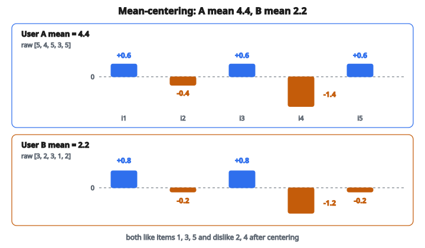

# Rating Normalization

## Rating normalization là gì

**Rating normalization** biến đổi rating thô để điều chỉnh các bias hệ thống trong cách user đánh giá item. Mỗi user có hành vi rating khác nhau: người cho điểm rộng tay (chủ yếu 4–5 sao), người khắt khe (chủ yếu 2–3 sao). Normalization làm rating so sánh được giữa các user.

Phép chuẩn hóa phổ biến nhất là mean-centering:

$$
\tilde{r}_{ui} = r_{ui} - \bar{r}_u
$$

Công thức này chuyển rating thành độ lệch so với trung bình cá nhân của từng user.

## Vì sao chuẩn hóa rating

**Thang đo khác nhau theo user:**

* User rộng tay: thích = 5 sao, không thích = 3 sao
* User khắt khe: thích = 3 sao, không thích = 1 sao

Một điểm “3” từ user rộng tay nghĩa là không thích; cùng “3” từ user khắt khe nghĩa là thích.

**Similarity tính tốt hơn:**

Không chuẩn hóa thì các user rộng tay trông giống nhau, dù preference thật sự khác.

**Dự đoán tốt hơn:**

Rating đã chuẩn hóa tập trung vào preference, không còn phụ thuộc thang điểm cá nhân.

## Mean-centering (theo user)

Trừ đi mean rating của từng user:

$$
\tilde{r}_{ui} = r_{ui} - \bar{r}_u
$$

với $\bar{r}_u = \frac{1}{|I_u|} \sum_{i \in I_u} r_{ui}$.

**Diễn giải:**

* $\tilde{r}_{ui} > 0$: User đánh giá item này trên trung bình của họ (họ thích)
* $\tilde{r}_{ui} < 0$: User đánh giá item này dưới trung bình của họ (họ không thích)
* $\tilde{r}_{ui} = 0$: User đánh giá item này đúng bằng trung bình

## Ví dụ số: mean-centering

**Rating thô:**

* User A: [5, 4, 5, 3, 5] → Mean = 4.4
* User B: [3, 2, 3, 1, 2] → Mean = 2.2

**Rating đã chuẩn hóa:**

* User A: [0.6, -0.4, 0.6, -1.4, 0.6]
* User B: [0.8, -0.2, 0.8, -1.2, -0.2]

::: {#fig-166-rating-norm fig-cap="Mean-centering: User A ($\bar{r}_A=4.4$) thành $[0.6,-0.4,0.6,-1.4,0.6]$; User B ($\bar{r}_B=2.2$) thành $[0.8,-0.2,0.8,-1.2,-0.2]$. Cả hai like item 1, 3 và dislike item 2, 4." fig-alt="Hai hang mean-centering: User A mean 4.4, rating thô [5, 4, 5, 3, 5] thanh [0.6, -0.4, 0.6, -1.4, 0.6]; User B mean 2.2, [3, 2, 3, 1, 2] thanh [0.8, -0.2, 0.8, -1.2, -0.2]. Cot duong la like, cot am la dislike."}
{fig-align="center"}
:::

**Nhận xét:**

Cả hai user có preference tương tự (thích item 1, 3, 5; không thích item 2, 4) nhưng thang thô khác nhau. Normalization lộ ra điều đó.

## Chuẩn hóa z-score

Đồng thời điều chỉnh phương sai rating:

$$
\tilde{r}_{ui} = \frac{r_{ui} - \bar{r}_u}{\sigma_u}
$$

với $\sigma_u$ là độ lệch chuẩn của các rating của user $u$.

**Diễn giải:**

* $\tilde{r}_{ui} = 1$: Một độ lệch chuẩn trên mean của user
* $\tilde{r}_{ui} = -2$: Hai độ lệch chuẩn dưới mean của user

Cách này xử lý cả khác biệt thang (mean) lẫn độ trải (variance).

## Ví dụ z-score

**User A:** Rating [5, 4, 5, 3, 5]

* Mean = 4.4
* Std = 0.8

**User B:** Rating [5, 3, 5, 1, 5]

* Mean = 3.8
* Std = 1.79

**Rating chuẩn hóa cho item có rating thô 5:**

* User A: $(5 - 4.4) / 0.8 = 0.75$
* User B: $(5 - 3.8) / 1.79 = 0.67$

Cả hai đều cho 5 sao, nhưng 5 của User A ngoại lệ hơn so với pattern của họ.

## Chuẩn hóa theo item

Trừ đi mean rating của từng item:

$$
\tilde{r}_{ui} = r_{ui} - \bar{r}_i
$$

với $\bar{r}_i = \frac{1}{|U_i|} \sum_{u \in U_i} r_{ui}$.

**Khi dùng:** Khi các item khác mức chất lượng, và ta muốn đo user lệch bao nhiêu so với đồng thuận trên từng item.

## Chuẩn hóa kết hợp

Điều chỉnh cả bias của user và của item:

$$
\tilde{r}_{ui} = r_{ui} - \bar{r}_u - \bar{r}_i + \mu
$$

hoặc tương đương:

$$
\tilde{r}_{ui} = r_{ui} - (\mu + b_u + b_i)
$$

Đây là residual sau khi đã loại các hiệu ứng baseline.

## Chuẩn hóa trong user-based CF

Trong dự đoán collaborative filtering theo user:

**Không chuẩn hóa:**

$$
\hat{r}_{ui} = \frac{\sum_{v \in N(u)} \operatorname{sim}(u, v) \cdot r_{vi}}{\sum_{v \in N(u)} \lvert \operatorname{sim}(u, v) \rvert}
$$

**Có chuẩn hóa:**

$$
\hat{r}_{ui} = \bar{r}_u + \frac{\sum_{v \in N(u)} \operatorname{sim}(u, v) \cdot (r_{vi} - \bar{r}_v)}{\sum_{v \in N(u)} \lvert \operatorname{sim}(u, v) \rvert}
$$

Dự đoán mean của user cộng với mức neighbor lệch so với mean của họ.

## Chuẩn hóa trong item-based CF

**Có chuẩn hóa:**

$$
\hat{r}_{ui} = \bar{r}_i + \frac{\sum_{j \in N(i)} \operatorname{sim}(i, j) \cdot (r_{uj} - \bar{r}_j)}{\sum_{j \in N(i)} \lvert \operatorname{sim}(i, j) \rvert}
$$

Hoặc dùng chuẩn hóa theo user:

$$
\hat{r}_{ui} = \bar{r}_u + \frac{\sum_{j \in N(i)} \operatorname{sim}(i, j) \cdot (r_{uj} - \bar{r}_u)}{\sum_{j \in N(i)} \lvert \operatorname{sim}(i, j) \rvert}
$$

## De-normalization

Sau khi dự đoán rating đã chuẩn hóa, chuyển về thang gốc:

**Với mean-centering:**

$$
\hat{r}_{ui} = \tilde{r}_{ui} + \bar{r}_u
$$

**Với z-score:**

$$
\hat{r}_{ui} = \tilde{r}_{ui} \cdot \sigma_u + \bar{r}_u
$$

Luôn de-normalize trước khi đưa dự đoán cho user.

## Ảnh hưởng lên similarity

**Pearson correlation = cosine trên dữ liệu đã mean-center:**

$$
\operatorname{Pearson}(u, v) = \operatorname{Cosine}(\tilde{\mathbf{r}}_u, \tilde{\mathbf{r}}_v)
$$

Mean-centering loại bias user trước khi tính similarity.

**Adjusted cosine = Pearson với user-centering cho item:**

Dùng trong item-based CF để điều chỉnh thang rating của user.

## Xử lý các trường hợp biên

**Một rating duy nhất:**

Nếu user chỉ có một rating, mean = rating đó, variance = 0.

* Mean-centering: rating chuẩn hóa = 0
* Z-score: không xác định (chia cho 0)

**Cách xử lý:** Dùng mean toàn cục hoặc ngưỡng phương sai tối thiểu.

**Rating đồng nhất:**

Nếu mọi rating giống nhau (ví dụ toàn 5), variance = 0.

**Cách xử lý:** Bỏ qua normalization hoặc dùng phương án dự phòng.

## Chuẩn hóa min-max

Đưa rating về khoảng $[0, 1]$:

$$
\tilde{r}_{ui} = \frac{r_{ui} - r_{\min}}{r_{\max} - r_{\min}}
$$

với $r_{\min}$ và $r_{\max}$ là biên của thang rating (ví dụ 1 và 5).

Cách này không điều chỉnh bias riêng của từng user.

## Decimal scaling

Với rating có phương sai lớn:

$$
\tilde{r}_{ui} = \frac{r_{ui}}{10^k}
$$

với $k$ chọn sao cho $\lvert \tilde{r}_{ui} \rvert < 1$.

Ít gặp hơn trong recommendation nhưng vẫn dùng trong một số ngữ cảnh.

## Khi nào cần chuẩn hóa

**Nên dùng:**

* Tính similarity user–user hoặc item–item
* Neighborhood-based collaborative filtering
* Khi user có pattern rating khác nhau rõ ràng

**Tùy chọn:**

* Matrix factorization (có thể học bias tường minh)
* Mô hình deep learning (có thể học normalization)

**Không cần:**

* Binary implicit feedback (không khác thang)
* Đánh giá theo thứ hạng (chỉ thứ tự mới quan trọng)

## Hiệu ứng chuẩn hóa

**Trước normalization:**

User mean cao cụm với nhau, mean thấp cụm với nhau, bất kể preference thật.

**Sau normalization:**

User cùng pattern sở thích cụm với nhau, bất kể thang rating.

## Chuẩn hóa và sparsity

Normalization chỉ dùng thống kê từ rating đã quan sát:

$$
\bar{r}_u = \frac{1}{|I_u|} \sum_{i \in I_u} r_{ui}
$$

User ít rating có mean kém tin cậy. Cân nhắc:

* Shrinkage về mean toàn cục
* Ngưỡng số rating tối thiểu
* Ước lượng Bayesian cho mean của user

## Code
```python
def rating_normalization(matrix):
    """
    Mean-center each user's ratings in the user-item matrix.
    """
    result = []
    for row in matrix:
        rated = [v for v in row if v != 0]
        if len(rated) == 0:
            result.append([0.0] * len(row))
            continue
        mean = sum(rated) / len(rated)
        result.append([v - mean if v != 0 else 0.0 for v in row])
    return result

```

<!-- auto-self-check -->

::: {.callout-note}
## Kiểm tra nhanh
<details>
<summary>Ý chính của bài «Rating Normalization» là gì?</summary>
**Rating normalization** biến đổi rating thô để điều chỉnh các bias hệ thống trong cách user đánh giá item.
</details>
<details>
<summary>Công thức / quan hệ cốt lõi trong bài là gì?</summary>
$$\tilde{r}_{ui} = r_{ui} - \bar{r}_u$$
</details>
:::
