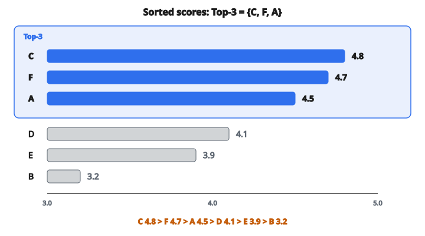

# Top-K Recommendations

## Top-K recommendations là gì

**Top-K recommendations** là $K$ item có điểm cao nhất được đưa cho user. Hệ thống tính một score cho mỗi item ứng viên, xếp hạng theo score, rồi trả về top $K$.

$$
R_K(u) = \operatorname{argmax}_{S \subset I,\, |S|=K} \sum_{i \in S} \operatorname{score}(u, i)
$$

Thực tế chỉ cần: sắp item theo score, lấy top $K$.

## Hàm scoring

Các thuật toán dùng hàm scoring khác nhau:

**Collaborative filtering:**

$$
\operatorname{score}(u, i) = \hat{r}_{ui} = \text{rating dự đoán}
$$

**Content-based:**

$$
\operatorname{score}(u, i) = \operatorname{sim}(\text{user profile},\, \text{item features})
$$

**Matrix factorization:**

$$
\operatorname{score}(u, i) = \mathbf{p}_u^{T} \mathbf{q}_i
$$

**Hybrid:**

$$
\operatorname{score}(u, i) = \alpha \cdot \text{CF score} + \beta \cdot \text{content score}
$$

## Quy trình chọn

**Bước 1:** Xác định item ứng viên

* Mọi item user chưa rating, hoặc
* Một tập đã lọc (item còn hàng, item trong vùng của user, v.v.)

**Bước 2:** Tính score cho ứng viên

**Bước 3:** Sắp theo score (giảm dần)

**Bước 4:** Chọn top $K$

**Bước 5:** Tùy chọn áp ràng buộc nghiệp vụ hoặc diversity

## Ví dụ số

**Các item ứng viên của user $U$ kèm score dự đoán:**

* Item A: 4.5
* Item B: 3.2
* Item C: 4.8
* Item D: 4.1
* Item E: 3.9
* Item F: 4.7

**Sắp theo score:**

C (4.8) $>$ F (4.7) $>$ A (4.5) $>$ D (4.1) $>$ E (3.9) $>$ B (3.2)

**Top-3 recommendations:**

$\{C, F, A\}$

::: {#fig-167-topk fig-cap="Score giảm dần $C\,4.8 > F\,4.7 > A\,4.5 > D\,4.1 > E\,3.9 > B\,3.2$; Top-3 là $\{C,F,A\}$." fig-alt="Hang score giam dan: C 4.8, F 4.7, A 4.5, D 4.1, E 3.9, B 3.2. Ba item dau C, F, A duoc danh dau Top-3."}
{fig-align="center"}
:::

## Lọc ứng viên

Không phải mọi item đều nên là ứng viên:

**Đã tiêu thụ:**

Loại item user đã rating / mua / xem.

**Tính khả dụng:**

Chỉ gồm item còn hàng, nội dung đang stream, v.v.

**Quy tắc nghiệp vụ:**

Loại item vi phạm chính sách, giới hạn độ tuổi, giấy phép theo vùng.

**Độ mới (recency):**

Chỉ gồm item trong $N$ ngày/tháng gần nhất.

## Chọn $K$

**$K$ phụ thuộc ngữ cảnh:**

* Thông báo mobile: $K = 1$–$3$
* Email digest: $K = 5$–$10$
* Trang chủ website: $K = 10$–$20$
* Trang “xem thêm”: $K = 50$–$100$

**Kỳ vọng của user:**

User muốn đủ lựa chọn nhưng không bị choáng.

**Diện tích màn hình:**

$K$ thường bị ràng bởi layout UI.

## Hòa điểm (tie)

Khi nhiều item cùng score:

**Bẻ hòa ngẫu nhiên:**

Chọn ngẫu nhiên trong các item hòa.

**Secondary sort:**

Bẻ hòa bằng popularity, recency, hoặc tiêu chí khác.

**Thứ tự ổn định:**

Dùng item ID để kết quả xác định (hữu ích khi debug).

## Hiệu quả tính toán

**Cách ngây thơ:** Chấm điểm mọi item, sort toàn bộ, lấy top $K$.

* Thời gian: $O(|I| \log |I|)$ cho bước sort

**Tối ưu:** Partial sort hoặc heap.

* Thời gian: $O(|I| + K \log K)$ với thuật toán selection

**Xấp xỉ:** Catalog rất lớn thì dùng approximate nearest neighbor (LSH, FAISS).

## Candidate generation + re-ranking

Hai tầng cho catalog lớn:

**Tầng 1: Candidate generation**

Nhanh chóng chọn khoảng 100–1000 item tiềm năng bằng mô hình đơn giản hoặc index.

**Tầng 2: Re-ranking**

Chấm điểm ứng viên bằng mô hình phức tạp hơn, chọn top $K$.

Cách này cân accuracy và efficiency.

## Diversity trong top-K

Top-K thuần theo score có thể thiếu diversity:

**Vấn đề:** Top-K có thể là 10 phim hành động nếu user thích hành động.

**Cách: Diversification**

Cân relevance với diversity:

$$
R_K = \operatorname{argmax}_{S:\, |S|=K} \sum_{i \in S} \operatorname{score}(i) + \lambda \cdot \operatorname{diversity}(S)
$$

**MMR (Maximal Marginal Relevance):**

Chọn lần lượt các item vừa relevant vừa khác các item đã chọn.

## Exploration vs exploitation

**Exploitation:**

Recommend các item có predicted score cao nhất.

**Exploration:**

Recommend một số item chưa chắc chắn để học thêm preference của user.

**Epsilon-greedy:**

Với xác suất $\epsilon$, recommend item ngẫu nhiên; còn lại, top-$K$ theo score.

**Thompson sampling:**

Sample từ phân phối posterior của score.

## Position bias

User tương tác nhiều hơn với item ở đầu danh sách.

**Hệ quả:**

Vị trí 1 nhận nhiều click hơn vị trí 10, bất kể relevance.

**Cần lưu ý:**

Khi đánh giá, position bias trong dữ liệu lịch sử có thể làm lệch kết quả.

**Giảm thiểu:**

Thỉnh thoảng xáo vị trí, hoặc dùng inverse propensity scoring.

## Đánh giá top-K

**Metric relevance:**

* Precision@$K$: Tỷ lệ top-$K$ là relevant
* Recall@$K$: Tỷ lệ item relevant nằm trong top-$K$
* NDCG@$K$: Relevance có discount theo vị trí

**Ngoài accuracy:**

* Diversity: Các item trong top-$K$ khác nhau đến mức nào?
* Novelty: Item bất ngờ đến mức nào?
* Coverage: Bao nhiêu phần catalog xuất hiện trong top-$K$ trên mọi user?

## Top-K so với dự đoán rating

**Bài toán dự đoán rating:**

Dự đoán đúng rating $\hat{r}_{ui}$.

**Bài toán top-K recommendation:**

Xếp hạng item đúng; score tuyệt đối không quan trọng.

Một thuật toán có thể RMSE kém nhưng ranking tốt (và ngược lại).

**Đánh giá phải khớp nhiệm vụ:**

Với top-K, dùng ranking metric (precision, recall, NDCG), không dùng RMSE.

## Chất lượng personalization

**Top-K phải được cá nhân hóa:**

User khác nhau phải nhận recommendation khác nhau theo preference.

**Kiểm tra sanity:**

Nếu mọi user nhận cùng top-K, hệ thống về bản chất không cá nhân hóa (theo popularity).

**Đo personalization:**

Tính overlap trung bình giữa các list top-K của user. Overlap thấp hơn = cá nhân hóa nhiều hơn.

## Top-K online vs offline

**Offline (batch):**

Tính sẵn top-K cho từng user theo chu kỳ.

* Serving nhanh
* Có thể lỗi thời

**Online (real-time):**

Tính top-K lúc request.

* Luôn mới
* Latency và chi phí tính toán cao hơn

**Hybrid:**

Tính sẵn ứng viên, re-rank online với context gần đây.

## Cold start trong top-K

**User mới:**

Chưa có score cá nhân hóa.

* Fallback popularity
* Content-based trên profile hạn chế
* Hỏi preference

**Item mới:**

Chưa có tín hiệu collaborative.

* Dùng content similarity
* Boost item mới để exploration

## Ràng buộc nghiệp vụ

Hệ thống thật có ràng buộc ngoài relevance thuần:

**Tồn kho:**

Không recommend item hết hàng.

**Freshness:**

Đẩy nội dung mới.

**Sponsored items:**

Chèn vị trí trả phí.

**Fairness:**

Đảm bảo các nhà sáng tạo đa dạng được phơi bày.

Việc chọn top-K phải cân relevance với các ràng buộc này.

## Code
```python
def top_k_recommendations(scores, rated_indices, k):
    """
    Return indices of top-k unrated items by predicted score.
    """
    unrated = [(scores[i], i) for i in range(len(scores)) if i not in rated_indices]
    unrated.sort(key=lambda x: -x[0])
    return [idx for _, idx in unrated[:k]]

```
