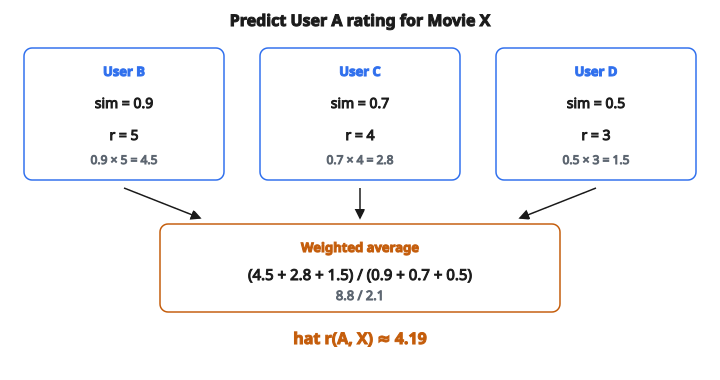

# User-Based CF Prediction

## User-based CF prediction là gì

**User-based collaborative filtering** dự đoán rating của một user cho một item dựa trên cách các user tương tự đã đánh giá item đó. Intuition: nếu user A và B có thị hiếu gần nhau, và B thích một item mà A chưa xem, A cũng có thể thích.

$$
\hat{r}_{ui} = \frac{\sum_{v \in N(u)} \operatorname{sim}(u, v) \cdot r_{vi}}{\sum_{v \in N(u)} \lvert \operatorname{sim}(u, v) \rvert}
$$

với $N(u)$ là neighborhood các user giống $u$ đã rating item $i$.

## Ý tưởng cốt lõi

**Để dự đoán rating của User A cho Item X:**

1. Tìm các user giống User A
2. Xem các user đó đã rating Item X thế nào
3. Kết hợp rating của họ, có trọng số theo similarity

Nếu các user tương tự thích X, User A cũng có thể thích. Nếu họ ghét, User A cũng có thể ghét.

## Công thức dự đoán cơ bản

$$
\hat{r}_{ui} = \frac{\sum_{v \in N(u)} \operatorname{sim}(u, v) \cdot r_{vi}}{\sum_{v \in N(u)} \lvert \operatorname{sim}(u, v) \rvert}
$$

**Các thành phần:**

* $\hat{r}_{ui}$: Rating dự đoán của user $u$ cho item $i$
* $N(u)$: Tập user tương tự đã rating item $i$
* $\operatorname{sim}(u, v)$: Similarity giữa user $u$ và $v$
* $r_{vi}$: Rating thật của user $v$ cho item $i$

## Ví dụ số

**Mục tiêu:** Dự đoán rating của User A cho Movie X

**Các user tương tự đã rating Movie X:**

* User B (similarity = 0.9): rating X = 5
* User C (similarity = 0.7): rating X = 4
* User D (similarity = 0.5): rating X = 3

**Dự đoán:**

$$
\hat{r}_{A,X} = \frac{0.9 \times 5 + 0.7 \times 4 + 0.5 \times 3}{0.9 + 0.7 + 0.5}
$$

$$
\begin{aligned}
\hat{r}_{A,X}
&= \frac{4.5 + 2.8 + 1.5}{2.1} \\
&= \frac{8.8}{2.1} \approx 4.19
\end{aligned}
$$

Rating dự đoán khoảng 4.2 sao.

::: {#fig-168-user-cf fig-cap="User-based CF: $(0.9\times 5 + 0.7\times 4 + 0.5\times 3)/2.1 = 8.8/2.1 \approx 4.19$." fig-alt="Ba neighbor B, C, D voi (sim, rating) = (0.9, 5), (0.7, 4), (0.5, 3). Tu so 0.9*5+0.7*4+0.5*3 = 8.8, mau 2.1, du doan 8.8/2.1 xap xi 4.19."}
{fig-align="center"}
:::

## Dự đoán mean-centered

Điều chỉnh thang rating khác nhau giữa các user:

$$
\hat{r}_{ui} = \bar{r}_u + \frac{\sum_{v \in N(u)} \operatorname{sim}(u, v) \cdot (r_{vi} - \bar{r}_v)}{\sum_{v \in N(u)} \lvert \operatorname{sim}(u, v) \rvert}
$$

**Diễn giải:**

Dự đoán mean của user $u$ cộng trung bình có trọng số mức neighbor lệch so với mean của họ.

## Ví dụ mean-centered

**Mean của từng user:**

* User A (target): mean = 3.5
* User B: mean = 4.2
* User C: mean = 3.0
* User D: mean = 2.5

**Rating cho Movie X:**

* User B: 5 (deviation: $5 - 4.2 = 0.8$)
* User C: 4 (deviation: $4 - 3.0 = 1.0$)
* User D: 3 (deviation: $3 - 2.5 = 0.5$)

**Similarity:** B = 0.9, C = 0.7, D = 0.5

**Dự đoán:**

$$
\hat{r}_{A,X} = 3.5 + \frac{0.9 \times 0.8 + 0.7 \times 1.0 + 0.5 \times 0.5}{0.9 + 0.7 + 0.5}
$$

$$
\begin{aligned}
\hat{r}_{A,X}
&= 3.5 + \frac{0.72 + 0.70 + 0.25}{2.1} \\
&= 3.5 + \frac{1.67}{2.1} \\
&= 3.5 + 0.80 \\
&= 4.3
\end{aligned}
$$

## Đo similarity giữa user

**Pearson correlation:**

$$
\operatorname{sim}(u, v) = \frac{\sum_{i \in I_{uv}} (r_{ui} - \bar{r}_u)(r_{vi} - \bar{r}_v)}{\sqrt{\sum_{i} (r_{ui} - \bar{r}_u)^2} \sqrt{\sum_{i} (r_{vi} - \bar{r}_v)^2}}
$$

Đo tương quan tuyến tính; xử lý được thang rating khác nhau.

**Cosine similarity:**

$$
\operatorname{sim}(u, v) = \frac{\sum_{i \in I_{uv}} r_{ui} \cdot r_{vi}}{\sqrt{\sum_{i} r_{ui}^2} \sqrt{\sum_{i} r_{vi}^2}}
$$

Coi rating như vector; góc giữa hai vector.

Pearson thường được ưa hơn vì đã center dữ liệu.

## Chọn neighborhood

**K-Nearest Neighbors (KNN):**

Dùng $K$ user giống nhất đã rating item $i$.

$K$ điển hình: 20 đến 100

**Theo ngưỡng:**

Dùng mọi user có similarity trên ngưỡng $\tau$.

**Mọi neighbor:**

Dùng mọi user đã rating item $i$ (có trọng số similarity).

KNN phổ biến nhất vì cân chất lượng và tính toán.

## Các bước thuật toán

**Offline (tính sẵn):**

1. Tính pairwise similarity giữa các user
2. Với mỗi user, lưu $K$ user giống nhất

**Online (lúc dự đoán):**

1. Cho user đích $u$ và item $i$
2. Tìm neighbor của $u$ đã rating $i$
3. Tính trung bình có trọng số các rating của họ
4. Trả về dự đoán

## Xử lý similarity âm

Khi $\operatorname{sim}(u, v) < 0$:

**Lựa chọn 1:** Loại user tương quan âm.

**Lựa chọn 2:** Giữ lại; họ đóng góp âm vào dự đoán.

$$
\text{nếu } \operatorname{sim} < 0:\ \text{neighbor dislike item} \Rightarrow \text{target có thể like}
$$

**Lựa chọn thường dùng:** Chỉ dùng similarity dương cho ổn định.

## Neighborhood thưa

**Vấn đề:** Ít user cùng rating các item cần để tính similarity.

**Cách xử lý:**

* Nới kích thước neighborhood
* Similarity mặc định cho cặp chưa thấy
* Fallback sang item-based CF hoặc popularity

Nếu không neighbor nào rating item $i$, dự đoán không xác định. Trả về mean toàn cục hoặc mean của user.

## User-based so với item-based CF

**User-based:**

* Tìm user tương tự
* Gộp rating của họ cho item đích
* Similarity giữa user có thể đổi khi user rating thêm

**Item-based:**

* Tìm item tương tự
* Gộp rating của user cho các item đó
* Similarity giữa item ổn định hơn

Item-based thường được ưa khi scale vì quan hệ giữa item ít đổi hơn.

## Thách thức scale

**Tính mọi pairwise similarity:**

$O(|U|^2 \cdot |I|)$ với $|U|$ user và $|I|$ item.

**Lúc dự đoán:**

Tìm neighbor là $O(|U|)$ nếu không tính sẵn.

**Cách xử lý:**

* Tính sẵn và lưu top-$K$ neighbor mỗi user
* Phương pháp xấp xỉ (LSH, clustering)
* Sample user khi tính similarity

## Vấn đề cold start

**User mới (chưa rating):**

Không tính được similarity với ai.

* Fallback popularity
* Content-based trên demographics
* Hỏi rating ban đầu

**Item mới:**

Có rating nhưng ảnh hưởng neighborhood của mọi user.

* Cập nhật similarity tăng dần
* Dùng content similarity cho item mới

## Significance weighting

User ít item chung có thể có similarity kém tin cậy.

**Similarity có trọng số:**

$$
\operatorname{sim}'(u, v) = \operatorname{sim}(u, v) \cdot \min\left(1, \frac{|I_{uv}|}{\tau}\right)
$$

với $|I_{uv}|$ là số item cả hai user đã rating và $\tau$ là ngưỡng (ví dụ 50).

Cách này giảm trọng số similarity dựa trên ít item.

## Case amplification

Nhấn mạnh các user rất giống:

$$
\operatorname{sim}'(u, v) = \operatorname{sim}(u, v)^{\rho}
$$

với $\rho > 1$ (ví dụ 2.5).

Similarity cao càng cao hơn, similarity thấp càng thấp hơn.

## Đánh giá

**Độ chính xác dự đoán rating:**

* RMSE: $\sqrt{\frac{1}{|T|} \sum (r - \hat{r})^2}$
* MAE: $\frac{1}{|T|} \sum |r - \hat{r}|$

**Chất lượng ranking:**

* Precision@$K$, Recall@$K$
* NDCG@$K$

Đánh giá trên các rating test để riêng.

## Cách tiếp cận memory-based

User-based CF là phương pháp memory-based (hay neighborhood-based):

* Lưu mọi rating trong memory
* Tính dự đoán từ rating đã lưu lúc query
* Không học tham số mô hình tường minh

Đối lập với phương pháp model-based (matrix factorization) học tham số rồi bỏ dữ liệu thô.

## Code
```python
def user_based_cf_prediction(similarities, ratings):
    """
    Predict a rating using user-based collaborative filtering.
    """
    num = 0.0
    den = 0.0
    for sim, rating in zip(similarities, ratings):
        if sim > 0:
            num += sim * rating
            den += sim
    if den == 0:
        return 0.0
    return num / den

```

<!-- auto-self-check -->

::: {.callout-note}
## Kiểm tra nhanh
<details>
<summary>Ý chính của bài «User-Based CF Prediction» là gì?</summary>
**User-based collaborative filtering** dự đoán rating của một user cho một item dựa trên cách các user tương tự đã đánh giá item đó.
</details>
<details>
<summary>Công thức / quan hệ cốt lõi trong bài là gì?</summary>
$$\hat{r}_{ui} = \frac{\sum_{v \in N(u)} \operatorname{sim}(u, v) \cdot r_{vi}}{\sum_{v \in N(u)} \lvert \operatorname{sim}(u, v) \rvert}$$
</details>
:::
