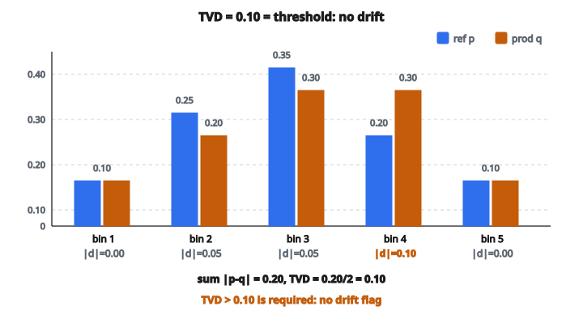

# Data Drift Detection

## Vấn đề: thế giới đổi, mô hình thì không

Mô hình machine learning được huấn luyện trên dữ liệu lịch sử. Chúng học pattern tồn tại tại một thời điểm cụ thể. Nhưng thế giới không đứng yên. Hành vi user tiến hóa, điều kiện thị trường dịch chuyển, pattern theo mùa xuất hiện, và phân phối dữ liệu nền thay đổi. Khi dữ liệu mô hình gặp trên production khác đáng kể so với dữ liệu huấn luyện, hiệu năng mô hình giảm. Hiện tượng này gọi là **data drift**.

Data drift nguy hiểm vì diễn ra âm thầm. Không giống crash hệ thống hay thông báo lỗi, drift làm dự đoán dần kém chính xác mà không có cảnh báo rõ. Đến lúc bạn nhận ra metric nghiệp vụ đã xấu, thiệt hại có thể đã lớn.

Vài ví dụ:

* Mô hình phát hiện gian lận được huấn luyện trước đại dịch có thể không nhận ra pattern gian lận mới xuất hiện khi kinh tế đảo lộn
* Mô hình dự báo nhu cầu của nhà bán lẻ có thể fail khi đối thủ mới vào thị trường
* Mô hình chấm điểm tín dụng có thể kém đi khi quy định cho vay đổi và population người xin vay dịch chuyển

Phát hiện drift chủ động cho phép team nhận ra thay đổi phân phối sớm và hành động sửa trước khi hiệu năng mô hình giảm nặng.

## Các loại drift

Trước khi đi vào phương pháp phát hiện, cần hiểu các loại drift khác nhau:

**Covariate drift (feature drift)**: Phân phối feature đầu vào đổi, nhưng quan hệ giữa feature và target vẫn như cũ. Ví dụ, nếu user base chuyển từ chủ yếu trẻ sang chủ yếu lớn tuổi, phân phối tuổi đổi, nhưng tuổi vẫn có thể dự đoán hành vi theo cùng cách.

**Prior probability drift (label drift)**: Phân phối biến target đổi. Ví dụ, nếu tỷ lệ gian lận tăng từ 1% lên 5%, mô hình huấn luyện trên base rate cũ có thể kém đi.

**Concept drift**: Quan hệ giữa feature và target đổi. Feature từng có sức dự đoán có thể kém đi, hoặc biên dự đoán có thể dịch. Đây là loại khó nhất vì dù phân phối trông giống nhau, pattern nền đã đổi.

Bài này tập trung phát hiện covariate drift bằng cách so sánh phân phối feature giữa dữ liệu reference (huấn luyện) và dữ liệu production.

## Đo drift bằng Total Variation Distance

Nhiều đại lượng thống kê có thể định lượng khác biệt phân phối. **Total Variation Distance (TVD)** là một trong những metric đơn giản và trực quan nhất.

TVD đo khác biệt lớn nhất giữa hai phân phối xác suất. Với phân phối rời rạc biểu diễn bằng histogram, nó cộng các hiệu tuyệt đối trên mọi bin rồi chia hai.

Hệ số $1/2$ chuẩn hóa metric sao cho TVD nằm trong $[0, 1]$:

* **TVD = 0**: Hai phân phối trùng nhau
* **TVD = 1**: Hai phân phối không chồng lấn chút nào

## Định nghĩa toán học

Cho hai phân phối xác suất $P$ (reference) và $Q$ (production), mỗi cái biểu diễn bằng histogram $n$ bin, Total Variation Distance là:

$$
\text{TVD}(P, Q) = \frac{1}{2} \sum_{i=1}^{n} |p_i - q_i|
$$

với $p_i$ là khối xác suất ở bin $i$ của $P$, và $q_i$ là khối xác suất ở bin $i$ của $Q$.

**Tính chất then chốt của TVD:**

* **Đối xứng**: $\text{TVD}(P, Q) = \text{TVD}(Q, P)$
* **Bị chặn**: $0 \leq \text{TVD} \leq 1$
* **Metric**: Thỏa bất đẳng thức tam giác và các tiên đề metric khác
* **Diễn giải được**: TVD là khối xác suất tối đa phải “chuyển” để biến phân phối này thành phân phối kia

## Từ count thô sang phân phối xác suất

Trong thực tế, bạn làm việc với count từng bin của histogram chứ không phải xác suất. Trước khi tính TVD, phải chuẩn hóa count thành phân phối xác suất.

Cho count reference $[c_1^{\text{ref}}, c_2^{\text{ref}}, \ldots, c_n^{\text{ref}}]$ và count production $[c_1^{\text{prod}}, c_2^{\text{prod}}, \ldots, c_n^{\text{prod}}]$:

**Bước 1: Tính tổng**

$$
N_{\text{ref}} = \sum_{i=1}^{n} c_i^{\text{ref}} \quad \text{và} \quad N_{\text{prod}} = \sum_{i=1}^{n} c_i^{\text{prod}}
$$

**Bước 2: Chuẩn hóa thành xác suất**

$$
p_i = \frac{c_i^{\text{ref}}}{N_{\text{ref}}} \quad \text{và} \quad q_i = \frac{c_i^{\text{prod}}}{N_{\text{prod}}}
$$

Chuẩn hóa này bảo đảm mỗi phân phối cộng bằng 1, bất kể mỗi dataset có bao nhiêu mẫu.

## Tính TVD từng bước

Cho histogram count reference và histogram count production:

**Bước 1**: Cộng mọi count reference để được tổng $N_{\text{ref}}$

**Bước 2**: Chia từng count reference cho tổng để được phân phối xác suất reference

**Bước 3**: Cộng mọi count production để được tổng $N_{\text{prod}}$

**Bước 4**: Chia từng count production cho tổng để được phân phối xác suất production

**Bước 5**: Với mỗi bin $i$, tính hiệu tuyệt đối $|p_i - q_i|$

**Bước 6**: Cộng mọi hiệu tuyệt đối

**Bước 7**: Chia 2 để ra điểm TVD cuối

**Bước 8**: So TVD với ngưỡng để quyết định đã có drift hay chưa

## Chọn ngưỡng drift

Việc chọn ngưỡng phụ thuộc ngữ cảnh và mức chịu đựng cảnh báo giả:

* **Ngưỡng = 0.05**: Rất nhạy, sẽ gắn cờ lệch phân phối nhỏ. Phù hợp mô hình then chốt mà ngay drift nhỏ cũng quan trọng.
* **Ngưỡng = 0.10**: Độ nhạy vừa, điểm bắt đầu thường dùng. Bắt lệch có ý nghĩa mà tránh quá nhiều alert.
* **Ngưỡng = 0.20**: Ít nhạy hơn, chỉ gắn cờ thay đổi phân phối lớn. Phù hợp khi muốn tránh cảnh báo giả.

Quyết định drift là:

$$
\text{drift\_detected} = (\text{TVD} > \text{threshold})
$$

Lưu ý bất đẳng thức nghiêm ngặt. TVD đúng bằng ngưỡng thì **không** được coi là drift.

## Ví dụ số

Giả sử bạn đang theo dõi feature `purchase_amount` đã rời rạc hóa thành 5 bin khoảng giá.

**Dữ liệu reference (giai đoạn huấn luyện):**

* Bin 1 (0–20): 1000 mẫu
* Bin 2 (20–50): 2500 mẫu
* Bin 3 (50–100): 3500 mẫu
* Bin 4 (100–200): 2000 mẫu
* Bin 5 (200+): 1000 mẫu

**Tổng mẫu reference**: 10,000

**Xác suất reference**:

* Bin 1: $1000/10000 = 0.10$
* Bin 2: $2500/10000 = 0.25$
* Bin 3: $3500/10000 = 0.35$
* Bin 4: $2000/10000 = 0.20$
* Bin 5: $1000/10000 = 0.10$

**Dữ liệu production (tuần gần đây):**

* Bin 1 (0–20): 800 mẫu
* Bin 2 (20–50): 1600 mẫu
* Bin 3 (50–100): 2400 mẫu
* Bin 4 (100–200): 2400 mẫu
* Bin 5 (200+): 800 mẫu

**Tổng mẫu production**: 8,000

**Xác suất production**:

* Bin 1: $800/8000 = 0.10$
* Bin 2: $1600/8000 = 0.20$
* Bin 3: $2400/8000 = 0.30$
* Bin 4: $2400/8000 = 0.30$
* Bin 5: $800/8000 = 0.10$

**Tính TVD:**

* Bin 1: $|0.10 - 0.10| = 0.00$
* Bin 2: $|0.25 - 0.20| = 0.05$
* Bin 3: $|0.35 - 0.30| = 0.05$
* Bin 4: $|0.20 - 0.30| = 0.10$
* Bin 5: $|0.10 - 0.10| = 0.00$

**Tổng hiệu tuyệt đối**: $0.00 + 0.05 + 0.05 + 0.10 + 0.00 = 0.20$

**TVD**: $0.20 / 2 =$ **0.10**

**Diễn giải**: Với ngưỡng 0.10, feature này đúng sát biên. Vì drift chỉ được gắn khi TVD **lớn nghiêm ngặt** hơn ngưỡng, trường hợp này **không** phát hiện drift. Tuy nhiên vẫn nên theo dõi sát vì feature đang cho thấy lệch vừa.

Nhìn dữ liệu, production đã dịch về khoản mua lớn hơn (bin 4 tăng từ 20% lên 30%), có thể báo hiệu thay đổi hành vi khách hàng hoặc mix sản phẩm.

::: {#fig-106-tvd-drift fig-cap="TVD = (0 + 0.05 + 0.05 + 0.10 + 0)/2 = 0.10, bằng ngưỡng 0.10; vì điều kiện là lớn nghiêm ngặt nên không gắn drift." fig-alt="Grouped bars of reference p=[0.10, 0.25, 0.35, 0.20, 0.10] versus production [0.10, 0.20, 0.30, 0.30, 0.10]; absolute gaps 0, 0.05, 0.05, 0.10, 0; TVD=0.10 equals the 0.10 threshold so no drift under strict greater-than."}
{fig-align="center"}
:::

## So sánh với các metric drift khác

TVD không phải cách duy nhất đo khác biệt phân phối. Một số lựa chọn khác:

**Kullback–Leibler (KL) divergence**: Đo mất thông tin khi xấp xỉ một phân phối bằng phân phối kia. Không đối xứng và có thể vô hạn nếu hai phân phối không chồng.

**Jensen–Shannon (JS) divergence**: Bản đối xứng của KL, bị chặn trong $[0, 1]$. Phổ biến trong ứng dụng ML.

**Population Stability Index (PSI)**: Phổ biến trong mô hình tài chính, cấu trúc gần KL nhưng đối xứng.

**Kiểm định Kolmogorov–Smirnov (KS)**: Đo hiệu lớn nhất giữa các hàm phân phối tích lũy. Cho ý nghĩa thống kê.

**Wasserstein distance (Earth Mover’s Distance)**: Đo “chi phí” biến một phân phối thành phân phối kia. Hữu ích khi thứ tự bin có ý nghĩa.

Ưu điểm của TVD là đơn giản, dễ diễn giải, và miền bị chặn. Hạn chế chính: nó đối xử mọi hiệu bin như nhau, bất kể bin nào đã dịch.

## Cân nhắc thực tế khi phát hiện drift

**Chọn bin**: Số lượng và biên histogram ảnh hưởng độ nhạy drift. Quá ít bin có thể bỏ lệch tinh; quá nhiều bin có thể tạo nhiễu. Cách phổ biến gồm bin độ rộng đều, bin tần suất đều, hoặc biên theo domain.

**Cỡ mẫu**: Phát hiện drift cần đủ mẫu ở cả reference lẫn production. Với mẫu nhỏ, biến thiên ngẫu nhiên có thể đội lốt drift.

**Khoảng reference**: Quyết định reference là snapshot lịch sử cố định hay cửa sổ trượt. Reference cố định bắt drift khỏi baseline; cửa sổ trượt bắt thay đổi gần đây.

**Nhiều feature**: Hệ thống thật theo dõi nhiều feature. Có thể cần hiệu chỉnh so sánh bội hoặc gộp điểm drift trên các feature.

**Chiến lược cảnh báo**: Quyết định alert ngay khi phát hiện drift, hay đợi drift kéo dài qua nhiều cửa sổ thời gian để giảm cảnh báo giả.

## Data drift detection xuất hiện ở đâu

**Theo dõi mô hình ML**: Nền tảng ML production liên tục so phân phối feature đầu vào với baseline. Alert drift kích hoạt điều tra và có thể retrain.

**Theo dõi chất lượng dữ liệu**: Team data engineering dùng phát hiện drift để bắt thay đổi phía trên trong pipeline dữ liệu trước khi lan sang consumer phía dưới.

**Kiểm tra A/B testing**: Trước khi phân tích kết quả thí nghiệm, team xác minh nhóm test và control có phân phối feature baseline tương tự.

**Tuân thủ quy định**: Tổ chức tài chính phải chứng minh mô hình vẫn hợp lệ trên population hiện tại, nên cần so sánh phân phối định kỳ.

**Bảo trì dự đoán**: Hệ thống sản xuất phát hiện khi đọc cảm biến drift khỏi dải vận hành bình thường, có thể báo hiệu thiết bị suy giảm.

## Code
```python
def detect_drift(reference_counts, production_counts, threshold):
    """
    Compare reference and production distributions to detect data drift.
    """
    ref_total = sum(reference_counts)
    prod_total = sum(production_counts)
    ref_probs = [c / ref_total for c in reference_counts]
    prod_probs = [c / prod_total for c in production_counts]
    score = 0.5 * sum(abs(r - p) for r, p in zip(ref_probs, prod_probs))
    return {"score": score, "drift_detected": score > threshold}

```

<!-- CROSSLINK_DRIFT -->

::: {.callout-tip}
## Học tiếp
Drift / skew trong production serving: [Lesson 8 — Safe Model Rollouts](../../ai-optimize/lesson-08-safe-model-rollouts.qmd). Cùng chủ đề ops: [Shadow Deployment](shadow-deployment-evaluation.qmd), [Train–Serving Skew](detect-train-serving-skew.qmd).
:::

<!-- SELFCHECK_DRIFT -->

::: {.callout-note}
## Kiểm tra nhanh
<details>
<summary>TVD $=0$ và TVD $=1$ nghĩa là gì?</summary>
$0$: hai phân phối trùng. $1$: không chồng lấn (khác hoàn toàn trên support đang xét).
</details>
<details>
<summary>Covariate drift khác concept drift ra sao?</summary>
Covariate: $P(X)$ đổi, $P(y\mid X)$ giữ. Concept: quan hệ $P(y\mid X)$ đổi.
</details>
:::
