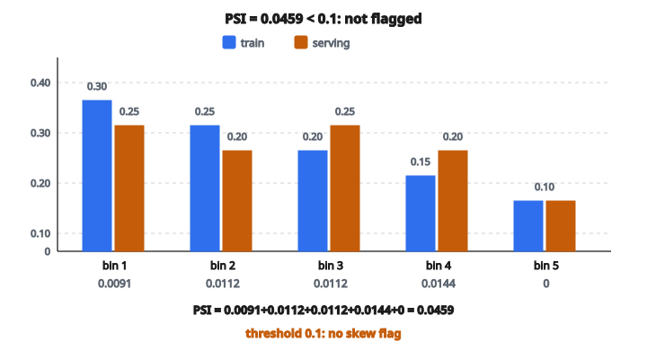

# Detect Train-Serving Skew

## Vấn đề: mô hình tốt offline nhưng kém trên production

Một trong những tình huống gây khó chịu nhất trong machine learning là khi mô hình chạy rất tốt lúc huấn luyện và validation, nhưng giảm chất lượng một cách khó hiểu sau khi đưa lên production. Thủ phạm thường là **train-serving skew**: lệch giữa phân phối dữ liệu mô hình được huấn luyện và dữ liệu nó gặp lúc serving.

Skew này có thể đến từ nhiều nguồn:

* **Khác biệt feature engineering**: Pipeline huấn luyện tính feature hơi khác pipeline serving
* **Độ tươi của dữ liệu**: Dữ liệu production phản ánh pattern mới hơn, không có trong dữ liệu huấn luyện lịch sử
* **Population shift**: User hoặc item trên production khác tập huấn luyện
* **Temporal drift**: Thay đổi theo mùa hoặc theo xu hướng làm phân phối đầu vào đổi theo thời gian

Phát hiện skew sớm là then chốt. Nếu để lâu, hiệu năng mô hình giảm âm thầm, dự đoán trở nên không đáng tin, và quyết định nghiệp vụ phía sau bị ảnh hưởng.

## Đo lệch phân phối bằng PSI

**Population Stability Index (PSI)** là metric chuẩn để định lượng phân phối đã đổi bao nhiêu. PSI vốn sinh ra trong mô hình rủi ro tín dụng, rồi trở thành công cụ theo dõi phân phối feature trong ML.

PSI so sánh hai phân phối xác suất (một từ huấn luyện làm reference, một từ production làm target) bằng cách đo độ phân kỳ từng bin.

## Định nghĩa toán học

Cho một feature được rời rạc hóa thành $n$ bin, gọi $P_i^{train}$ là tỷ lệ mẫu huấn luyện rơi vào bin $i$, và $P_i^{serving}$ là tỷ lệ mẫu production rơi vào bin $i$.

PSI được tính:

$$
PSI = \sum_{i=1}^{n} (P_i^{serving} - P_i^{train}) \times \ln\left(\frac{P_i^{serving}}{P_i^{train}}\right)
$$

Mỗi số hạng trong tổng bắt cả **độ lớn** của hiệu $(P_i^{serving} - P_i^{train})$ lẫn **thay đổi tương đối** $\ln(P_i^{serving} / P_i^{train})$. Nhờ đó PSI nhạy với lệch tuyệt đối và lệch tỷ lệ.

## Diễn giải giá trị PSI

Thực hành công nghiệp thường dùng các ngưỡng:

* **PSI < 0.1**: Không có lệch đáng kể
* **PSI từ 0.1 đến 0.25**: Lệch vừa, cần điều tra
* **PSI > 0.25**: Lệch mạnh, cần hành động

PSI vượt ngưỡng nghĩa là phân phối feature trên production đã drift có ý nghĩa so với lúc huấn luyện. Điều đó có thể báo hiệu:

* Pattern mô hình đã học có thể không còn áp dụng
* Code feature engineering có thể đã lệch giữa hai pipeline
* Đã xuất hiện sự cố chất lượng dữ liệu

## Xử lý trường hợp biên

**Bin xác suất bằng không**: Nếu một bin có xác suất 0 ở một trong hai phân phối, logarithm và phép chia trở nên không xác định. Cách sửa chuẩn là cộng một hằng số smoothing nhỏ $\epsilon$ (thường $10^{-10}$ đến $10^{-6}$) vào mọi tỷ lệ bin:

$$
P_i \leftarrow P_i + \epsilon
$$

Điều này đảm bảo ổn định số, đồng thời gần như không đổi PSI với các bin có count khác không.

## Tính từng bước

Cho tỷ lệ huấn luyện $[P_1^{train}, P_2^{train}, \ldots, P_n^{train}]$ và tỷ lệ serving $[P_1^{serving}, P_2^{serving}, \ldots, P_n^{serving}]$:

**Bước 1**: Cộng hằng số smoothing để tránh chia cho 0

$$
P_i \leftarrow P_i + \epsilon \quad \text{với mọi } i
$$

**Bước 2**: Với mỗi bin $i$, tính đóng góp:

$$
\text{term}_i = (P_i^{serving} - P_i^{train}) \times \ln\left(\frac{P_i^{serving}}{P_i^{train}}\right)
$$

**Bước 3**: Cộng mọi số hạng:

$$
PSI = \sum_{i=1}^{n} \text{term}_i
$$

**Bước 4**: So với ngưỡng để gắn cờ skew

## Ví dụ số

Giả sử một feature có 5 bin với các tỷ lệ:

* Bin 1: Training = 0.30, Serving = 0.25
* Bin 2: Training = 0.25, Serving = 0.20
* Bin 3: Training = 0.20, Serving = 0.25
* Bin 4: Training = 0.15, Serving = 0.20
* Bin 5: Training = 0.10, Serving = 0.10

Tính PSI:

* Bin 1: $(0.25 - 0.30) \times \ln(0.25/0.30) = -0.05 \times (-0.182) = 0.0091$
* Bin 2: $(0.20 - 0.25) \times \ln(0.20/0.25) = -0.05 \times (-0.223) = 0.0112$
* Bin 3: $(0.25 - 0.20) \times \ln(0.25/0.20) = 0.05 \times 0.223 = 0.0112$
* Bin 4: $(0.20 - 0.15) \times \ln(0.20/0.15) = 0.05 \times 0.288 = 0.0144$
* Bin 5: $(0.10 - 0.10) \times \ln(0.10/0.10) = 0 \times 0 = 0$

**Tổng PSI** = 0.0091 + 0.0112 + 0.0112 + 0.0144 + 0 = **0.0459**

Với ngưỡng 0.1, feature này **không** bị gắn cờ skewed.

::: {#fig-103-psi-skew fig-cap="Năm bin đóng góp 0.0091 + 0.0112 + 0.0112 + 0.0144 + 0 = PSI 0.0459, nhỏ hơn ngưỡng 0.1 nên không gắn cờ skew." fig-alt="Grouped bars of train vs serving proportions on 5 bins, plus per-bin PSI terms 0.0091, 0.0112, 0.0112, 0.0144, 0 summing to 0.0459 below the 0.1 threshold."}
{fig-align="center"}
:::

## Train-serving skew detection xuất hiện ở đâu

**Theo dõi mô hình ML**: Hệ thống ML production liên tục so phân phối feature đầu vào với baseline lúc huấn luyện để phát hiện drift trước khi ảnh hưởng dự đoán.

**A/B testing**: Trước khi rollout mô hình mới, PSI giúp kiểm tra nhóm test và control có phân phối feature tương tự, để so sánh hợp lệ.

**Pipeline chất lượng dữ liệu**: Hệ thống ETL dùng PSI để bắt thay đổi dữ liệu phía trên có thể lan lỗi xuống dưới.

**Tuân thủ quy định**: Trong tài chính và y tế, chứng minh dữ liệu production vẫn đại diện cho dữ liệu huấn luyện thường là yêu cầu pháp lý.

## Code
```python
import numpy as np
import math

def detect_skew(train_dist, serving_dist, threshold=0.2, eps=1e-10):
    """
    Detect train-serving skew using PSI.
    """
    results = {}
    for feature in sorted(train_dist.keys()):
        train = train_dist[feature]
        serve = serving_dist[feature]
        psi = 0.0
        for i in range(len(train)):
            t = train[i] + eps
            s = serve[i] + eps
            psi += (s - t) * math.log(s / t)
        psi = abs(psi)
        results[feature] = {"psi": psi, "skewed": psi >= threshold}
    return results

```
