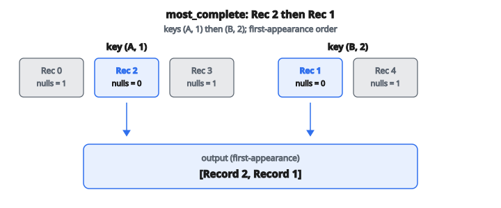

# ETL Deduplication

## Vấn đề: Cùng một dữ liệu xuất hiện nhiều lần

Record trùng là một trong những vấn đề data quality phổ biến và dai dẳng nhất trong data pipeline. Chúng phát sinh từ nhiều nguồn:

**At-least-once delivery**:
Hàng đợi message (Kafka, RabbitMQ, SQS) thường bảo đảm giao ít nhất một lần, nghĩa là cùng một message có thể được giao nhiều lần nếu acknowledgment thất bại.

**Retry API**:
Khi lời gọi API timeout, client thường retry. Nếu request gốc thực sự thành công, giờ bạn có cùng dữ liệu được gửi hai lần.

**Thao tác merge**:
Kết hợp dữ liệu từ nhiều nguồn (ví dụ sáp nhập công ty, gộp database theo vùng) thường đưa vào record chồng lấn.

**Thao tác backfill**: Xử lý lại dữ liệu lịch sử có thể load record đã tồn tại ở đích.

**Hành động người dùng**: Người dùng có thể bấm nút submit hai lần hoặc refresh trang làm gửi lại form.

Nếu duplicate không được xử lý, chúng gây vấn đề nghiêm trọng phía sau:

* Analytics đếm quá sự kiện, dẫn tới quyết định kinh doanh sai
* Mô hình ML train trên dữ liệu phình, làm lệch dự đoán
* Báo cáo tài chính hiện tổng sai
* Thông điệp tới khách hàng có thểถูก gửi nhiều lần

**Deduplication** là quá trình nhận diện và loại record trùng, chỉ giữ một record đại diện cho mỗi thực thể duy nhất.

## Định nghĩa tính duy nhất: key column

Để deduplicate, trước hết phải định nghĩa thế nào là hai record “giống nhau”. Việc này dùng **key column** (còn gọi là deduplication key hoặc natural key).

Hai record là duplicate nếu chúng có giá trị giống hệt nhau ở **tất cả** key column.

**Ví dụ với key đơn:**

* Key column: `order_id`
* Record cùng `order_id` là duplicate

**Ví dụ với composite key:**

* Key column: `(user_id, product_id, date)`
* Record cùng user, product, **VÀ** date là duplicate

Chọn đúng key column đòi hỏi kiến thức domain:

* Quá hẹp (ít cột): Record không liên quan có thể bị gắn nhầm là duplicate
* Quá rộng (nhiều cột): Duplicate thật có thể không bị bắt vì chúng khác ở field không liên quan

## Chiến lược deduplication

Khi tồn tại duplicate, phải chọn record nào giữ lại. Các chiến lược khác nhau phục vụ use case khác nhau:

### Chiến lược 1: `"first"`

Giữ lần xuất hiện đầu của mỗi key duy nhất (theo vị trí trong input).

**Use case**: Khi lần đến đầu đáng tin nhất, chẳng hạn:

* Sự kiện gốc trước mọi retry
* Nguồn authoritative khi merge nhiều feed
* Giữ trạng thái lịch sử khi record sau là hiệu chỉnh

**Thuật toán**:

* Với mỗi record, trích key
* Nếu key này chưa thấy, giữ record
* Nếu key này đã thấy, bỏ record

### Chiến lược 2: `"last"`

Giữ lần xuất hiện cuối của mỗi key duy nhất (theo vị trí trong input).

**Use case**: Khi lần đến gần nhất là mới nhất, chẳng hạn:

* Update thay thế giá trị trước
* Hiệu chỉnh sửa sai sót sớm hơn
* Semantics “upsert” trong đó dữ liệu sau là sự thật

**Thuật toán**:

* Với mỗi record, trích key
* Luôn lưu (hoặc thay) record cho key này
* Sau khi xử lý mọi record, xuất các record đã lưu

### Chiến lược 3: `"most_complete"`

Giữ record có ít giá trị null nhất trên **mọi** field (không chỉ key column).

**Use case**: Khi các bản duplicate có thể thiếu field khác nhau, chẳng hạn:

* Merge record từng phần từ nhiều nguồn
* Enrichment dữ liệu nơi một số duplicate có nhiều thông tin hơn
* Xử lý record có field tùy chọn có thể được điền hoặc không

**Thuật toán**:

* Với mỗi record, trích key
* Đếm null trong toàn bộ record (mọi cột)
* Giữ record có số null thấp nhất
* Hòa tie bằng cách giữ lần xuất hiện đầu

## Giữ thứ tự output

Bất kể chiến lược deduplication nào, output phải giữ **thứ tự lần xuất hiện đầu** của các unique key.

Nghĩa là:

* Nếu key A xuất hiện lần đầu ở input index 5
* Và key B xuất hiện lần đầu ở input index 2
* Thì trong output, record B xuất hiện trước record A

Yêu cầu này đảm bảo output deterministic, tái lập được, và giữ thứ tự trực quan phản ánh khi nào mỗi thực thể duy nhất được thấy lần đầu.

## Thuật toán deduplication

**Bước 1: Khởi tạo cấu trúc theo dõi**

* Một dictionary ánh xạ key tuple tới list record có key đó
* Một list theo dõi thứ tự key xuất hiện lần đầu

**Bước 2: Gom record theo key**

* Với mỗi record theo thứ tự input:
  + Trích key tuple từ key column
  + Nếu đây là key mới, thêm vào list thứ tự
  + Append record vào list của key này

**Bước 3: Chọn một record mỗi key**

* Với mỗi key (theo thứ tự lần xuất hiện đầu):
  + Áp chiến lược lên list record của nó
  + `"first"`: lấy record đầu trong list
  + `"last"`: lấy record cuối trong list
  + `"most_complete"`: tìm record có ít null nhất (lấy đầu nếu hòa)

**Bước 4: Dựng output**

* Thu record đã chọn theo thứ tự key lần xuất hiện đầu
* Trả list đã deduplicate

## Tính số null

Với chiến lược `"most_complete"`, cần đếm giá trị null:

$$
\text{null\_count}(record) = \sum_{field \in record} \mathbf{1}[\text{value is None}]
$$

Đếm null trên **mọi** field trong record, không chỉ key column. Nhờ đó chọn record giàu thông tin nhất overall.

Khi nhiều record có cùng số null, tie-breaker là vị trí: giữ record xuất hiện đầu trong input.

## Ví dụ số

**Record đầu vào:**

* Record 0: `{user_id: "A", product_id: 1, price: 10.0, notes: None}`
* Record 1: `{user_id: "B", product_id: 2, price: 20.0, notes: "rush"}`
* Record 2: `{user_id: "A", product_id: 1, price: 15.0, notes: "gift"}`
* Record 3: `{user_id: "A", product_id: 1, price: None, notes: "updated"}`
* Record 4: `{user_id: "B", product_id: 2, price: 25.0, notes: None}`

**Key column:** `[user_id, product_id]`

**Gom theo key:**

* Key `("A", 1)`: [Record 0, Record 2, Record 3]
* Key `("B", 2)`: [Record 1, Record 4]

**Thứ tự lần xuất hiện đầu:** `[("A", 1), ("B", 2)]`

**Chiến lược: `"first"`**

* Key `("A", 1)`: chọn Record 0
* Key `("B", 2)`: chọn Record 1
* Output: [Record 0, Record 1]

**Chiến lược: `"last"`**

* Key `("A", 1)`: chọn Record 3
* Key `("B", 2)`: chọn Record 4
* Output: [Record 3, Record 4]

**Chiến lược: `"most_complete"`**

* Key `("A", 1)`:
  + Record 0: nulls = 1 (`notes` is `None`)
  + Record 2: nulls = 0
  + Record 3: nulls = 1 (`price` is `None`)
  + Winner: Record 2 (0 nulls)
* Key `("B", 2)`:
  + Record 1: nulls = 0
  + Record 4: nulls = 1 (`notes` is `None`)
  + Winner: Record 1 (0 nulls)
* Output: [Record 2, Record 1]

Lưu ý: Thứ tự output theo lần xuất hiện đầu của key (`(A, 1)` trước `(B, 2)`), dù record được chọn có thể khác.

::: {#fig-111-dedup fig-cap="most_complete: key $(A,1)$ chọn Record 2 (0 null); key $(B,2)$ chọn Record 1 (0 null). Output theo first-appearance: [Record 2, Record 1]." fig-alt="Hai nhom key (A,1) va (B,2); most_complete chon Record 2 roi Record 1 theo thu tu lan xuat hien dau."}
{fig-align="center"}
:::

## Xử lý composite key

Khi nhiều cột tạo thành key, key là một tuple giá trị:

```
key = tuple(record[col] for col in key_columns)
```

**Ví dụ:**

* Key column: `["user_id", "date"]`
* Record: `{user_id: "alice", date: "2024-01-15", amount: 100}`
* Key tuple: `("alice", "2024-01-15")`

Hai record là duplicate nếu key tuple bằng nhau (so sánh từng phần tử).

**Quan trọng**:
Giá trị `None` trong key column hợp lệ và tham gia so sánh. Hai record cùng `user_id=None` được coi là duplicate nếu đó là key column duy nhất.

## Các trường hợp biên

**Không có duplicate**: Nếu mọi record có key duy nhất, mọi record được trả theo thứ tự gốc.

**Tất cả đều duplicate**: Nếu mọi record chia sẻ cùng key, đúng một record được trả (do chiến lược quyết định).

**Input rỗng**: Trả list rỗng.

**Một record**: Trả record đó.

**Null trong key column**: Giá trị null được so sánh bằng equality chuẩn. Hai null được coi bằng nhau.

## Độ phức tạp tính toán

Deduplication scale tuyến tính theo kích thước input:

$$
O(n \cdot k)
$$

với $n$ là số record và $k$ là số key column.

Với chiến lược `"most_complete"`, thêm $O(n \cdot c)$ với $c$ là tổng số cột (để đếm null).

Lookup key dựa trên hash đảm bảo phát hiện duplicate thời gian hằng số.

## Deduplication xuất hiện ở đâu

**Data warehousing**: ETL pipeline deduplicate trước khi load để giữ toàn vẹn dữ liệu trong fact và dimension table.

**Xử lý sự kiện**: Stream processor deduplicate sự kiện để hướng tới semantics exactly-once.

**Tích hợp dữ liệu**: Khi merge dữ liệu từ nhiều nguồn, deduplication giải record chồng lấn.

**Hệ thống CRM**: Record khách hàng từ các touchpoint khác nhau được deduplicate để tạo góc nhìn khách hàng thống nhất.

**Gom log**: Mục log trùng từ retry hoặc nhiều server được gộp để phân tích chính xác.

**Machine learning**: Dữ liệu train được deduplicate để mô hình không overfitting trên ví dụ lặp.

## Code
```python
def deduplicate(records, key_columns, strategy):
    """
    Deduplicate records by key columns using the given strategy.
    """
    groups = {}
    order = []
    for record in records:
        key = tuple(record[col] for col in key_columns)
        if key not in groups:
            groups[key] = []
            order.append(key)
        groups[key].append(record)
    result = []
    for key in order:
        group = groups[key]
        if strategy == "first":
            result.append(group[0])
        elif strategy == "last":
            result.append(group[-1])
        elif strategy == "most_complete":
            result.append(min(group, key=lambda r: sum(1 for v in r.values() if v is None)))
    return result

```
