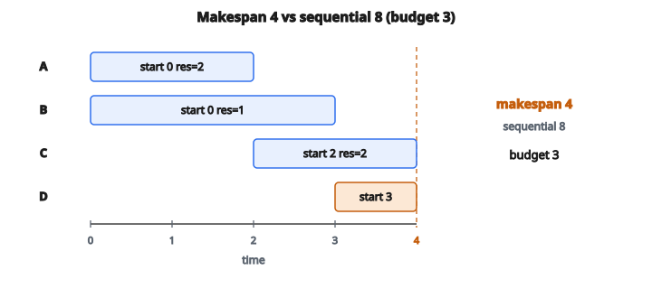

# ETL Dependency Orchestration

## Vấn đề: Task có dependency và tài nguyên hạn chế

Pipeline dữ liệu thực tế gồm nhiều task với phụ thuộc phức tạp. Task feature engineering không thể bắt đầu trước khi dữ liệu thô được load. Task train mô hình không thể bắt đầu trước khi feature được tính. Task báo cáo không thể bắt đầu trước khi mọi bảng upstream đã được điền.

Các dependency này tạo thành một **Directed Acyclic Graph (DAG)** trong đó:

* Node biểu diễn task
* Cạnh biểu diễn dependency (A $\to$ B nghĩa là “B phụ thuộc A”)
* Acyclic nghĩa là không có dependency vòng

Chỉ chạy task tuần tự là lãng phí. Nếu task A và B không phụ thuộc lẫn nhau, chúng có thể chạy song song, xong nhanh hơn overall.

Nhưng song song hóa bị ràng buộc bởi **tài nguyên**.
Mỗi task cần tài nguyên tính toán (CPU, bộ nhớ, worker). Hệ thống có ngân sách tài nguyên hạn chế. Không thể chạy nhiều task đồng thời hơn ngân sách cho phép.

Một **orchestrator** phải lập lịch task để:

1. Tôn trọng mọi ràng buộc dependency (không bao giờ bắt đầu task trước khi prerequisite hoàn thành)
2. Không vượt ngân sách tài nguyên tại bất kỳ thời điểm nào
3. Tối đa hóa song song hóa để giảm tổng thời gian chạy

## Biểu diễn DAG

Đồ thị task thường được biểu diễn như sau:

**Định nghĩa task:**

* `name`: Định danh duy nhất của task
* `duration`: Task chạy bao lâu (đơn vị thời gian)
* `resources`: Bao nhiêu đơn vị tài nguyên task cần trong lúc chạy
* `dependencies`: List tên task phải hoàn thành trước khi task này bắt đầu

**Ví dụ DAG:**

* Task `"load_data"`: duration=5, resources=2, không phụ thuộc gì
* Task `"clean_data"`: duration=3, resources=1, phụ thuộc `"load_data"`
* Task `"compute_features"`: duration=4, resources=2, phụ thuộc `"load_data"`
* Task `"train_model"`: duration=6, resources=3, phụ thuộc `"clean_data"` và `"compute_features"`

Cấu trúc này tạo dependency hình thoi, trong đó `"train_model"` không thể bắt đầu cho đến khi cả `"clean_data"` **VÀ** `"compute_features"` xong.

## Trạng thái task

Trong suốt quá trình chạy, mỗi task ở một trong bốn trạng thái:

**Waiting**: Task còn ít nhất một dependency chưa xong. Chưa thể bắt đầu.

**Ready**: Mọi dependency đã xong, nhưng task chưa bắt đầu (có thể vì ràng buộc tài nguyên hoặc tie-breaking).

**Running**: Task đang chạy. Nó chiếm tài nguyên và sẽ xong sau `duration`.

**Completed**: Task đã xong. Tài nguyên được giải phóng, và task phụ thuộc giờ có thể trở thành ready.

## Thuật toán lập lịch

Tại mỗi thời điểm, orchestrator làm theo quy trình sau:

**Bước 1: Hoàn thành task đã xong**

Kiểm tra mọi task đang chạy. Task nào đã tới thời điểm kết thúc được đánh dấu completed, và tài nguyên được giải phóng.

**Bước 2: Nhận diện task ready**

Một task ready nếu:

* Nó chưa bắt đầu (không running, không completed)
* **TẤT CẢ** dependency của nó đã completed

**Bước 3: Sắp task ready**

Sắp task ready theo alphabet của tên. Thứ tự deterministic này đảm bảo lịch tái lập được và hòa tie nhất quán.

**Bước 4: Gán task greedy**

Duyệt task ready đã sắp. Với mỗi task:

* Kiểm tra cộng yêu cầu tài nguyên có vượt ngân sách không
* Nếu vừa, bắt đầu task (gán start time = thời điểm hiện tại, thêm vào running)
* Nếu không vừa, bỏ qua (nhưng vẫn kiểm tra task sau trong list)

Đây là cách **greedy**:
task được gán theo thứ tự alphabet miễn là tài nguyên cho phép. Một task lớn không vừa không chặn task nhỏ hơn có thể vừa.

**Bước 5: Tiến thời gian**

Nếu không gán được task nào và vẫn còn task đang chạy, tiến thời gian tới sự kiện hoàn thành tiếp theo (end time sớm nhất trong các task running). Rồi lặp lại từ Bước 1.

**Bước 6: Kết thúc**

Khi mọi task completed, xuất lịch.

## Quản lý tài nguyên

Tài nguyên được quản lý như một ngân sách số:

$$
\text{current\_usage} = \sum_{t \in \text{running}} \text{resources}(t)
$$

Task $t$ có thể bắt đầu nếu:

$$
\text{current\_usage} + \text{resources}(t) \leq \text{budget}
$$

Khi task hoàn thành, tài nguyên được trả về pool:

$$
\text{current\_usage} \leftarrow \text{current\_usage} - \text{resources}(t)
$$

Đây là mô hình đơn giản hóa. Hệ thống thật có thể có nhiều chiều tài nguyên (CPU, bộ nhớ, mạng) và ràng buộc phức tạp hơn.

## Tiến thời gian

Thời gian không tiến từng đơn vị một. Thay vào đó, thuật toán nhảy thẳng tới sự kiện có nghĩa tiếp theo: khi một task đang chạy hoàn thành.

$$
\text{next\_time} = \min_{t \in \text{running}} \bigl(\text{start\_time}(t) + \text{duration}(t)\bigr)
$$

Cách event-driven này hiệu quả kể cả với task duration dài.

Nếu nhiều task hoàn thành cùng lúc, xử lý mọi hoàn thành trước khi cố bắt đầu task mới.

## Ví dụ số

**Định nghĩa task:**

* A: duration=2, resources=2, depends=[]
* B: duration=3, resources=1, depends=[]
* C: duration=2, resources=2, depends=[A]
* D: duration=1, resources=1, depends=[A, B]

**Ngân sách tài nguyên: 3**

**Time 0:**

* Completed: không
* Ready: A, B (không dependency)
* Sorted ready: [A, B]
* Current usage: 0
* Thử A: $0 + 2 = 2 \leq 3$, START A tại time 0
* Thử B: $2 + 1 = 3 \leq 3$, START B tại time 0
* Running: A (xong lúc 2), B (xong lúc 3)
* Usage: 3

**Time 2** (A hoàn thành):

* Complete A, giải phóng 2 tài nguyên, usage = 1
* Completed: $\{A\}$
* Kiểm tra ready: C phụ thuộc [A] đã xong, C ready. D phụ thuộc [A, B], B chưa xong, D chưa ready.
* Sorted ready: [C]
* Thử C: $1 + 2 = 3 \leq 3$, START C tại time 2
* Running: B (xong lúc 3), C (xong lúc 4)
* Usage: 3

**Time 3** (B hoàn thành):

* Complete B, giải phóng 1 tài nguyên, usage = 2
* Completed: $\{A, B\}$
* Kiểm tra ready: D phụ thuộc [A, B], cả hai xong, D ready.
* Sorted ready: [D]
* Thử D: $2 + 1 = 3 \leq 3$, START D tại time 3
* Running: C (xong lúc 4), D (xong lúc 4)
* Usage: 3

**Time 4** (C và D hoàn thành):

* Complete C và D
* Mọi task xong

**Lịch cuối (sắp theo start_time, rồi name):**

* $(A, 0)$
* $(B, 0)$
* $(C, 2)$
* $(D, 3)$

**Tổng makespan:** 4 đơn vị thời gian

Nếu chạy mọi thứ tuần tự: $2+3+2+1 = 8$ đơn vị thời gian. Song song hóa tiết kiệm 50% thời gian.

::: {#fig-112-etl-dag fig-cap="A và B start 0, C start 2, D start 3. Makespan = 4 (tuần tự = 8) với resource budget 3." fig-alt="Gantt: A start 0, B start 0, C start 2, D start 3; makespan 4 so voi sequential 8; ngan sach 3."}
{fig-align="center"}
:::

## Xử lý ràng buộc tài nguyên

Xét kịch bản tài nguyên hạn chế song song:

**Task:**

* X: duration=1, resources=3
* Y: duration=1, resources=3
* Z: duration=1, resources=1

**Budget: 4**

**Time 0:**

* Ready: X, Y, Z (sắp alphabet)
* Thử X: $0 + 3 \leq 4$, START X
* Thử Y: $3 + 3 = 6 > 4$, SKIP Y
* Thử Z: $3 + 1 = 4 \leq 4$, START Z
* Running: X, Z

Dù Y đứng trước Z theo alphabet theo một nghĩa nào đó, ta duyệt theo thứ tự X, Y, Z. X vừa, Y không, nhưng ta tiếp tục và Z vừa.

**Time 1:**

* Complete X và Z
* Ready: Y
* START Y

**Lịch:**

* $(X, 0)$
* $(Z, 0)$
* $(Y, 1)$

## Vì sao thứ tự alphabet?

Dùng thứ tự alphabet để hòa tie đảm bảo:

**Determinism**: Cùng input luôn sinh cùng lịch, thiết yếu cho debug và tái lập.

**Đơn giản**: Không cần scheme ưu tiên phức tạp hay heuristic.

**Nhất quán**: Dễ dự đoán và kiểm chứng hành vi.

Trong thực tế, scheduler production có thể dùng scheme ưu tiên tinh vi hơn (shortest job first, critical path, v.v.), nhưng thứ tự alphabet cho một baseline rõ.

## Phân tích độ phức tạp

Gọi $n$ là số task và $m$ là tổng số cạnh dependency.

**Dựng đồ thị**: $O(n + m)$

**Xử lý sự kiện**: Nhiều nhất $n$ sự kiện hoàn thành, mỗi lần gồm sắp task ready ($O(n \log n)$) và kiểm tra ràng buộc tài nguyên ($O(n)$).

**Overall**: $O(n^2 \log n)$ trong trường hợp xấu nhất, dù thực tế thường nhanh hơn nhiều với dependency thưa.

## Định dạng output

Lịch được trả về như list các tuple:

$$
[(\text{task\_name}, \text{start\_time}), \ldots]
$$

Sắp trước theo `start_time` (tăng dần), rồi theo `task_name` (alphabet) khi hòa.

Định dạng này cho phép kiểm chứng dễ dàng rằng:

* Mọi task được lập lịch đúng một lần
* Dependency được tôn trọng (task phụ thuộc bắt đầu sau)
* Lịch là deterministic

## Orchestration task xuất hiện ở đâu

**Apache Airflow**: Orchestrator workflow open-source phổ biến nhất, dùng DAG để định nghĩa ETL pipeline.

**Prefect**: Orchestration workflow Python-native hiện đại với đồ thị task động.

**Luigi**: Framework pipeline của Spotify với phân giải dependency tự động.

**dbt**: Công cụ transform dữ liệu dựng DAG từ dependency SQL.

**Kubernetes Jobs**: Orchestration container với lập lịch job theo dependency.

**Pipeline CI/CD**: Hệ thống build (Jenkins, GitHub Actions, GitLab CI) lập lịch job có dependency.

**MapReduce/Spark**: Framework big data quản lý dependency task trong đồ thị tính toán.

Hiểu orchestration task là nền tảng để dựng data pipeline tin cậy, hiệu quả ở quy mô lớn.

## Code
```python
def schedule_pipeline(tasks, resource_budget):
    """
    Schedule ETL tasks respecting dependencies and resource limits.
    """
    task_map = {t["name"]: t for t in tasks}
    running = {}
    completed = set()
    schedule = []
    t = 0
    while len(completed) < len(tasks):
        for name in [n for n, end in running.items() if end <= t]:
            completed.add(name)
            del running[name]
        cur_res = sum(task_map[n]["resources"] for n in running)
        ready = sorted(
            [tk for tk in tasks if tk["name"] not in completed
             and tk["name"] not in running
             and all(d in completed for d in tk["depends_on"])],
            key=lambda x: x["name"]
        )
        for tk in ready:
            if cur_res + tk["resources"] <= resource_budget:
                running[tk["name"]] = t + tk["duration"]
                schedule.append((tk["name"], t))
                cur_res += tk["resources"]
        if running:
            t = min(running.values())
        else:
            break
    return sorted(schedule, key=lambda x: (x[1], x[0]))

```
