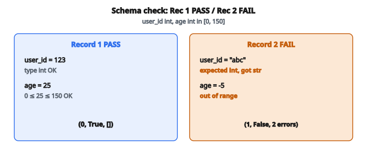

# ETL Schema Validation

## Vấn đề: Dữ liệu xấu âm thầm làm hỏng mọi thứ phía sau

Trong data pipeline, dữ liệu thô đến từ nhiều nguồn: sự kiện người dùng, phản hồi API, feed bên thứ ba, cảm biến IoT, và upload thủ công. Dữ liệu này thường lộn xộn, không nhất quán, hoặc sai hoàn toàn. Nếu load trực tiếp vào data warehouse mà không validate, vấn đề lan tới mọi consumer phía sau: dashboard hiện số sai, mô hình ML train trên feature hỏng, và quyết định kinh doanh dựa trên thông tin lỗi.

Khía cạnh nguy hiểm của vấn đề data quality là chúng thường không bị phát hiện trong thời gian dài. Một field thiếu mặc định thành null, một kiểu sai bị coerce, một giá trị ngoài khoảng trông hợp lý thoạt nhìn. Khi ai đó nhận ra vấn đề, hàng tháng dữ liệu có thể đã hỏng, và lần ra nguyên nhân trở thành ác mộng.

**Schema validation** là tuyến phòng thủ đầu tiên. Trước khi load bất kỳ record nào vào warehouse, validate nó đối với schema định nghĩa cột nào phải tồn tại, kiểu nào chúng phải có, null có được phép, và khoảng giá trị nào chấp nhận được. Record không hợp lệ được gắn cờ và chuyển tới dead-letter queue để điều tra, trong khi record hợp lệ đi tiếp vào warehouse.

## Schema là gì?

Một **schema** định nghĩa cấu trúc kỳ vọng và ràng buộc của dữ liệu. Với dữ liệu dạng bảng, schema chỉ định cho mỗi cột:

**Tên cột**: Định danh của field này

**Kiểu dữ liệu**: Loại giá trị kỳ vọng (integer, float, string, v.v.)

**Nullable**: Field có thể vắng hoặc chứa null hay không

**Ràng buộc khoảng**: Với field số, giá trị tối thiểu và tối đa chấp nhận được

Schema được thiết kế tốt đóng vai trò hợp đồng giữa producer và consumer. Producer cam kết gửi dữ liệu khớp schema; consumer có thể dựa vào dữ liệu thỏa những bảo đảm đó.

## Các loại lỗi validation

Schema validation bắt được vài nhóm vấn đề:

### Cột bị thiếu

Một cột định nghĩa trong schema không tồn tại trong record. Điều này có thể xảy ra khi:

* Hệ thống upstream ngừng gửi một field
* Một cột required mới được thêm vào schema nhưng chưa backfill
* Vấn đề serialization làm rơi field

**Định dạng lỗi**: `"{column}: missing"`

### Giá trị null ở cột không nullable

Cột tồn tại nhưng chứa null khi schema nói null không được phép. Điều này có thể xảy ra khi:

* Hệ thống upstream gửi null thay vì giá trị hợp lệ
* Parse dữ liệu thất bại và mặc định thành null
* Field bắt buộc bị để trống khi submit form

**Định dạng lỗi**: `"{column}: null"`

### Sai kiểu

Giá trị tồn tại nhưng sai kiểu. Ví dụ, chuỗi `"abc"` ở cột kỳ vọng integer, hoặc boolean nơi kỳ vọng float. Điều này có thể xảy ra khi:

* Vấn đề serialization chuyển kiểu
* Input người dùng không được validate đúng phía upstream
* Các hệ thống dùng quy ước kiểu khác nhau

**Định dạng lỗi**: `"{column}: expected {type}, got {actual_type}"`

### Giá trị ngoài khoảng

Giá trị đúng kiểu nhưng nằm ngoài biên chấp nhận được. Ví dụ, tuổi âm hoặc phần trăm trên 100. Điều này có thể xảy ra khi:

* Lỗi nhập liệu
* Nhầm chuyển đơn vị
* Cảm biến hỏng tạo reading không thể xảy ra

**Định dạng lỗi**: `"{column}: out of range"`

## Thứ tự validation và short-circuit

Các kiểm tra validation được thực hiện theo thứ tự cố định cho mỗi cột:

**Bước 1: Kiểm tra cột có tồn tại**
Nếu cột thiếu trong record, báo lỗi `"missing"` và bỏ mọi kiểm tra tiếp theo cho cột này.

**Bước 2: Kiểm tra null (nếu cột không nullable)**
Nếu giá trị là null và cột không cho phép null, báo lỗi `"null"` và bỏ kiểm tra tiếp.

**Bước 3: Kiểm tra kiểu**
Nếu kiểu giá trị không khớp kiểu kỳ vọng, báo lỗi `"type"` và bỏ kiểm tra khoảng.

**Bước 4: Kiểm tra khoảng (nếu có biên)**
Nếu giá trị nằm ngoài $[\text{min}, \text{max}]$, báo lỗi `"out of range"`.

Cách short-circuit này đảm bảo:

* Thông báo lỗi cụ thể và actionable
* Không bị lỗi dây chuyền (ví dụ “type error” rồi “range error” cho một giá trị null)
* Xử lý hiệu quả (bỏ kiểm tra chắc chắn không thể pass)

## Chi tiết kiểm tra kiểu

Validation kiểu có vài sắc thái:

**Kiểu integer (`"int"`)**:
Chấp nhận giá trị `int` của Python. KHÔNG chấp nhận float (kể cả `1.0`) hay boolean (dù `bool` là subclass của `int` trong Python). Dùng `type(value) == int` thay vì `isinstance(value, int)` để loại boolean.

**Kiểu float (`"float"`)**: Chấp nhận cả `float` và `int` của Python. Vì integer có thể được coi an toàn như float về mặt toán học. Dùng `type(value) in (int, float)`.

**Kiểu string (`"str"`)**: Chỉ chấp nhận giá trị `str` của Python.

Khác biệt giữa `type()` và `isinstance()` quan trọng vì trong Python, `bool` là subclass của `int`. `isinstance(True, int)` trả `True`, nên sẽ chấp nhận nhầm boolean ở cột integer.

## Xử lý cột nullable

Khi cột được đánh dấu nullable:

* Nếu giá trị là `None`, record pass validation cho cột đó (bỏ kiểm tra kiểu và khoảng)
* Nếu giá trị không phải `None`, tiếp tục kiểm tra kiểu và khoảng như bình thường

Điều này cho phép field tùy chọn, nơi dữ liệu thiếu chấp nhận được và không phải lỗi.

## Kiểm tra khoảng

Kiểm tra khoảng chỉ áp dụng cho cột số có biên đã định nghĩa:

$$
\text{valid} = (\text{min} \leq \text{value} \leq \text{max})
$$

Cả hai biên đều inclusive. Giá trị đúng bằng min hoặc max pass kiểm tra.

Kiểm tra khoảng chỉ thực hiện nếu:

1. Cột tồn tại
2. Giá trị không null
3. Giá trị đúng kiểu
4. Schema định nghĩa min và/hoặc max cho cột này

Nếu chỉ định nghĩa min, kiểm tra $\text{value} \geq \text{min}$. Nếu chỉ định nghĩa max, kiểm tra $\text{value} \leq \text{max}$.

## Xử lý nhiều cột

Với mỗi record, cột được validate theo thứ tự schema (thứ tự cột xuất hiện trong định nghĩa schema). Thứ tự deterministic này đảm bảo báo lỗi nhất quán.

Một record đơn có thể có lỗi ở nhiều cột. Mọi cột đều được kiểm tra (với short-circuit trong từng cột), và mọi lỗi được thu thập.

Record hợp lệ chỉ khi mọi cột pass mọi kiểm tra áp dụng được.

## Ví dụ số

**Schema:**

* Cột `"user_id"`: type=`"int"`, nullable=false
* Cột `"age"`: type=`"int"`, nullable=false, min=0, max=150
* Cột `"score"`: type=`"float"`, nullable=true, min=0.0, max=100.0
* Cột `"name"`: type=`"str"`, nullable=false

**Record 1:** `{"user_id": 123, "age": 25, "score": 85.5, "name": "Alice"}`

Validation:

* user_id: tồn tại, không null, `type(123)==int` (có), không có khoảng. PASS
* age: tồn tại, không null, `type(25)==int` (có), $0 \leq 25 \leq 150$ (có). PASS
* score: tồn tại, không null (được phép), `type(85.5)==float` (có), $0 \leq 85.5 \leq 100$ (có). PASS
* name: tồn tại, không null, `type("Alice")==str` (có). PASS

Kết quả: `(0, True, [])`

**Record 2:** `{"user_id": "abc", "age": -5, "score": None, "name": "Bob"}`

Validation:

* user_id: tồn tại, không null, `type("abc")==int`? Không, kiểu là str. ERROR: `"user_id: expected int, got str"`
* age: tồn tại, không null, `type(-5)==int` (có), $0 \leq -5$? Không. ERROR: `"age: out of range"`
* score: tồn tại, giá trị là `None`, cột nullable. PASS (bỏ kiểm tra kiểu và khoảng)
* name: tồn tại, không null, `type("Bob")==str` (có). PASS

Kết quả: `(1, False, ["user_id: expected int, got str", "age: out of range"])`

::: {#fig-110-schema fig-cap="Record 1 PASS. Record 2 FAIL vì user_id sai kiểu (expected int, got str) và age = -5 ngoài $[0, 150]$." fig-alt="Doi chieu Record 1 PASS (user_id 123, age 25) voi Record 2 FAIL: user_id kieu str thay vi int, age -5 ngoai [0, 150]."}
{fig-align="center"}
:::

**Record 3:** `{"user_id": 456, "score": 75.0, "name": "Carol"}`

Validation:

* user_id: tồn tại, không null, kiểu OK. PASS
* age: THIẾU. ERROR: `"age: missing"`
* score: tồn tại, không null, `type(75.0)==float` (có), khoảng OK. PASS
* name: tồn tại, không null, kiểu OK. PASS

Kết quả: `(2, False, ["age: missing"])`

**Record 4:** `{"user_id": 789, "age": None, "score": 50, "name": ""}`

Validation:

* user_id: PASS
* age: tồn tại, giá trị là `None`, cột KHÔNG nullable. ERROR: `"age: null"`
* score: tồn tại, value=50, `type(50)==float`? Cần kiểm tra int luôn. `type(50)==int`, và float chấp nhận int. PASS. $0 \leq 50 \leq 100$. PASS
* name: tồn tại, value=`""`, không null (chuỗi rỗng không phải null), `type("")==str` (có). PASS

Kết quả: `(3, False, ["age: null"])`

## Định dạng output

Hàm validation trả về list các tuple, một tuple mỗi record:

$$
(\text{record\_index}, \text{is\_valid}, \text{errors})
$$

* **record_index**: Vị trí 0-based của record trong list đầu vào
* **is_valid**: Boolean cho biết record pass mọi kiểm tra
* **errors**: List chuỗi thông báo lỗi (rỗng nếu hợp lệ)

Định dạng này cho phép code phía sau dễ dàng:

* Lọc record hợp lệ để load
* Chuyển record không hợp lệ tới dead-letter queue
* Sinh báo cáo lỗi chi tiết cho monitoring data quality

## Vì sao schema validation quan trọng

**Phát hiện sớm**: Bắt vấn đề lúc ingestion ngăn chúng lan khắp hệ sinh thái dữ liệu.

**Hợp đồng rõ**: Schema làm kỳ vọng dữ liệu tường minh, giảm nhầm lẫn giữa các team.

**Hỗ trợ debug**: Thông báo lỗi cụ thể chỉ đúng chỗ sai, tăng tốc phân tích nguyên nhân gốc.

**Metric data quality**: Theo dõi tỷ lệ pass validation theo thời gian lộ xu hướng chất lượng dữ liệu upstream.

**Tuân thủ**: Nhiều quy định yêu cầu chứng minh tính toàn vẹn dữ liệu, schema validation hỗ trợ điều đó.

## Schema validation xuất hiện ở đâu

**ETL pipeline**: Mọi framework ETL lớn (Apache Spark, Apache Beam, dbt, Airflow) hỗ trợ schema validation như tính năng lõi.

**API gateway**: Request API đến được validate đối với schema OpenAPI/Swagger trước khi xử lý.

**Data warehouse**: Warehouse hiện đại (Snowflake, BigQuery, Redshift) có thể ép ràng buộc schema lúc load.

**Event streaming**: Kafka Schema Registry đảm bảo producer và consumer sự kiện thống nhất định dạng dữ liệu.

**Pipeline machine learning**: Code feature engineering validate đầu vào trước khi tính feature để tránh garbage-in-garbage-out.

## Code
```python
def validate_records(records, schema):
    """
    Validate records against a schema definition.
    """
    TYPE_CHECK = {
        "int": lambda v: type(v) == int,
        "float": lambda v: type(v) in (int, float),
        "str": lambda v: type(v) == str,
    }
    results = []
    for idx, record in enumerate(records):
        errors = []
        for col_def in schema:
            col = col_def["column"]
            if col not in record:
                errors.append(f"{col}: missing")
                continue
            value = record[col]
            if value is None:
                if not col_def["nullable"]:
                    errors.append(f"{col}: null")
                continue
            if not TYPE_CHECK[col_def["type"]](value):
                errors.append(f"{col}: expected {col_def['type']}, got {type(value).__name__}")
                continue
            if "min" in col_def and value < col_def["min"]:
                errors.append(f"{col}: out of range")
            elif "max" in col_def and value > col_def["max"]:
                errors.append(f"{col}: out of range")
        results.append((idx, len(errors) == 0, errors))
    return results

```

<!-- auto-self-check -->

::: {.callout-note}
## Kiểm tra nhanh
<details>
<summary>Ý chính của bài «ETL Schema Validation» là gì?</summary>
Một **schema** định nghĩa cấu trúc kỳ vọng và ràng buộc của dữ liệu.
</details>
<details>
<summary>Công thức / quan hệ cốt lõi trong bài là gì?</summary>
$$\text{valid} = (\text{min} \leq \text{value} \leq \text{max})$$
</details>
:::
