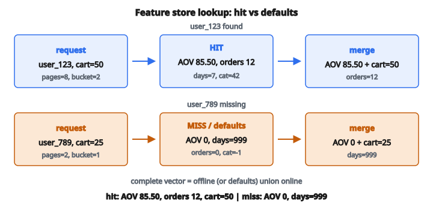

# Feature Store Lookup

## Vấn đề: nối thế giới offline và online

Khi mô hình machine learning dự đoán trên production, nó cần truy cập feature. Các feature này đến từ hai nguồn khác nhau về bản chất, mỗi nguồn có đặc trưng và ràng buộc riêng.

**Online feature** được tính thời gian thực từ request hoặc session hiện tại. Ví dụ: số item trong giỏ hàng, giờ trong ngày hiện tại, vị trí hiện tại của user, hoặc văn bản truy vấn tìm kiếm. Các feature này bắt ngữ cảnh tức thì nhưng bị giới hạn bởi những gì có thể tính trong vài millisecond.

**Offline feature** được tính trước theo batch rồi lưu để truy hồi sau. Ví dụ: tổng chi tiêu suốt đời của user, tần suất đặt hàng trung bình trong năm qua, các nhóm sản phẩm ưa thích dựa trên hành vi lịch sử, hoặc điểm rủi ro tính từ job batch ban đêm. Các feature này giàu và phức tạp hơn, nhưng có thể cũ vài giờ thậm chí vài ngày.

Thách thức trong hệ thống ML production là ghép hai nguồn này lúc inference, bảo đảm mô hình nhận được feature vector đầy đủ gồm cả ngữ cảnh thời gian thực và thông tin lịch sử.

## Feature store là gì

**Feature store** là thành phần hạ tầng dữ liệu chuyên biệt, dùng để quản lý và phục vụ feature cho hệ thống machine learning. Nó đóng vai trò cầu nối giữa data engineering (tính feature) và machine learning (dùng feature).

Một feature store thường cung cấp:

**Storage**: Cơ sở dữ liệu latency thấp tối ưu cho lookup key-value. Cho entity key (như user ID hoặc item ID), nó trả mọi feature đã tính sẵn của entity đó trong vài millisecond.

**Dual serving**: Hầu hết feature store giữ hai bản sao feature. Offline store (data lake hoặc warehouse) phục vụ truy vấn batch để sinh dữ liệu huấn luyện. Online store (Redis hoặc DynamoDB) phục vụ lookup latency thấp cho inference.

**Feature registry**: Catalog các feature sẵn có kèm metadata: mô tả, kiểu dữ liệu, người phụ trách, và tần suất cập nhật. Catalog giúp team phát hiện và tái sử dụng feature đã có.

**Point-in-time correctness**: Khi sinh dữ liệu huấn luyện, feature store có thể dựng lại feature tại bất kỳ timestamp lịch sử nào, tránh data leakage.

**Monitoring**: Theo dõi phân phối feature, độ tươi, và latency serving để bắt sự cố trước khi chúng ảnh hưởng hiệu năng mô hình.

Các triển khai phổ biến gồm Feast (open source), Tecton (managed service), AWS SageMaker Feature Store, Google Vertex AI Feature Store, và Databricks Feature Store.

## Luồng lookup chi tiết

Khi request dự đoán tới, pipeline inference phải lắp một feature vector đầy đủ. Quy trình chi tiết:

**Bước 1: Parse request**

Trích mọi online feature có sẵn trực tiếp trong payload. Đồng thời trích entity identifier (user_id, item_id, v.v.) cần cho lookup offline feature.

**Bước 2: Query feature store**

Dùng entity identifier làm khóa, lấy offline feature đã tính sẵn. Thường đây là một lookup key-value với latency dưới millisecond trên store được tối ưu tốt.

**Bước 3: Xử lý entity thiếu**

Nếu entity không tồn tại trong feature store (user mới, item mới, v.v.), lookup không trả gì. Khi đó fallback về tập giá trị mặc định đã định nghĩa trước. Default bảo đảm mô hình luôn nhận feature vector đầy đủ.

**Bước 4: Kiểm tra độ tươi feature (tùy chọn)**

Một số hệ thống kiểm tra feature lấy ra có quá cũ không. Nếu timestamp cập nhật cuối vượt ngưỡng, chúng có thể cảnh báo hoặc dùng default thay thế.

**Bước 5: Merge các tập feature**

Ghép offline feature với online feature thành một dictionary hoặc vector. Vì offline và online thường khác tên, đây thường là phép hợp đơn giản.

**Bước 6: Đổi kiểu và định dạng**

Bảo đảm mọi feature đúng format mô hình kỳ vọng. Đổi chuỗi sang số khi cần, áp dụng phép biến đổi cuối, và xếp feature theo thứ tự mong đợi.

## Entity thiếu và giá trị mặc định

Không phải mọi entity gặp trên production đều có trong feature store. Điều này xảy ra trong vài tình huống:

**User mới**: User vừa đăng ký chưa có hành vi lịch sử. user_id của họ sẽ không xuất hiện trong bảng offline feature cho tới khi job batch kế tiếp chạy.

**Cold start item**: Sản phẩm mới niêm yết chưa có thống kê tương tác, review, hay lịch sử bán.

**Xử lý trễ**: Ngay cả entity đã tồn tại, vẫn có thể có độ trễ giữa lúc sự kiện xảy ra và lúc feature được cập nhật.

**Sự cố chất lượng dữ liệu**: Đôi khi bản ghi fail validation và bị loại khỏi bảng feature.

Giải pháp chuẩn là cung cấp **giá trị feature mặc định** cho từng offline feature. Default cần chọn thận trọng:

* **Feature đếm** (như purchase_count): Default = 0, nghĩa là không có lịch sử
* **Feature trung bình** (như avg_order_value): Default = 0 hoặc trung bình toàn population
* **Feature tỷ lệ** (như conversion_rate): Default = 0 hoặc giá trị trung tính như 0.5
* **Feature phân loại** (như user_segment): Default = category "unknown" mà mô hình đã được huấn luyện để xử lý

Nguyên tắc then chốt: default không được làm lệch dự đoán một cách không thích hợp. User mới với toàn feature bằng 0 nên nhận dự đoán hợp lý, không phải dự đoán cực đoan.

## Toán lắp feature vector

Gọi $F_{\text{offline}}$ là tập tên offline feature và $F_{\text{online}}$ là tập tên online feature. Thông thường chúng rời nhau:

$$
F_{\text{offline}} \cap F_{\text{online}} = \emptyset
$$

Tập feature đầy đủ là hợp:

$$
F_{\text{complete}} = F_{\text{offline}} \cup F_{\text{online}}
$$

Với một request có entity key $k$:

$$
\text{features}(k) = \begin{cases}
\text{lookup}(k) \cup \text{online}(\text{request}) & \text{nếu } k \in \text{store} \\
\text{defaults} \cup \text{online}(\text{request}) & \text{nếu không}
\end{cases}
$$

Trong Python, phép merge dictionary được viết gọn bằng unpacking:

```
offline = feature_store.get(user_id, default_features)
combined = {**offline, **online_features}
```

Thứ tự unpacking có ý nghĩa nếu trùng khóa (giá trị sau ghi đè giá trị trước), nhưng với tập feature rời nhau thì không thành vấn đề.

## Ví dụ số

Xét hệ thống gợi ý e-commerce với các feature sau:

**Offline feature (từ feature store):**

* avg_order_value: Giá trị giao dịch trung bình của user này
* total_orders: Số đơn suốt đời
* days_since_last_order: Độ recency của lần mua gần nhất
* favorite_category_id: Category được mua nhiều nhất

**Online feature (từ request):**

* current_cart_value: Tổng item trong giỏ hiện tại
* session_page_views: Số trang xem trong session này
* time_of_day_bucket: Sáng / chiều / tối

**Offline feature mặc định:**

* avg_order_value: 0.0
* total_orders: 0
* days_since_last_order: 999 (không có đơn trước đó)
* favorite_category_id: -1 (không xác định)

**Nội dung feature store:**

* user_123: {avg_order_value: 85.50, total_orders: 12, days_since_last_order: 7, favorite_category_id: 42}
* user_456: {avg_order_value: 220.00, total_orders: 3, days_since_last_order: 45, favorite_category_id: 17}

**Kịch bản 1: User đã biết**

Request tới cho user_123 với cart_value=50.0, page_views=8, time_bucket=2

1. Lookup user_123: Tìm thấy, lấy {avg_order_value: 85.50, total_orders: 12, days_since_last_order: 7, favorite_category_id: 42}
2. Trích online feature: {current_cart_value: 50.0, session_page_views: 8, time_of_day_bucket: 2}
3. Merge: {avg_order_value: 85.50, total_orders: 12, days_since_last_order: 7, favorite_category_id: 42, current_cart_value: 50.0, session_page_views: 8, time_of_day_bucket: 2}

**Kịch bản 2: User chưa biết**

Request tới cho user_789 (user mới) với cart_value=25.0, page_views=2, time_bucket=1

1. Lookup user_789: Không tìm thấy
2. Dùng default: {avg_order_value: 0.0, total_orders: 0, days_since_last_order: 999, favorite_category_id: -1}
3. Trích online feature: {current_cart_value: 25.0, session_page_views: 2, time_of_day_bucket: 1}
4. Merge: {avg_order_value: 0.0, total_orders: 0, days_since_last_order: 999, favorite_category_id: -1, current_cart_value: 25.0, session_page_views: 2, time_of_day_bucket: 1}

Mô hình giờ có thể dự đoán cho cả hai user, dù một người không có lịch sử.

::: {#fig-105-feature-store fig-cap="user_123 tìm thấy AOV 85.50 và 12 đơn, merge với cart = 50; user_789 miss nên dùng default AOV = 0 và days_since_last_order = 999." fig-alt="Two lookup rows: user_123 hits store with AOV 85.50 and 12 orders then merges cart=50; user_789 misses and uses defaults AOV 0 and days=999."}
{fig-align="center"}
:::

## Vì sao kiến trúc này?

**Yêu cầu latency**: Hệ thống dự đoán thời gian thực thường có ngân sách latency chặt (50–100ms tổng). Tính aggregation phức tạp lúc request sẽ phá ngân sách. Tính trước chuyển phần nặng sang batch.

**Nhất quán training–serving**: Một trong những nguồn bug lớn nhất trong hệ thống ML là tính feature khác nhau lúc huấn luyện và lúc serving. Feature store bảo đảm cả hai pipeline dùng cùng định nghĩa feature.

**Tái sử dụng feature**: Nếu năm mô hình khác nhau cần `user_average_order_value`, tính một lần rồi lưu hiệu quả hơn nhiều so với mỗi mô hình tự tính.

**Tách trách nhiệm**: Data engineer tập trung xây và duy trì pipeline feature. ML engineer tập trung phát triển mô hình. Feature store là giao diện giữa hai team.

**Hiệu quả chi phí**: Aggregate toàn bộ lịch sử mua của user trên mọi request đòi hỏi scan database đắt. Làm một lần mỗi ngày theo batch rồi phục vụ từ key-value store nhanh thì rẻ hơn nhiều bậc.

## Feature store lookup xuất hiện ở đâu

**Hệ thống gợi ý**: Netflix, Spotify và Amazon đều ghép preference dài hạn của user (offline) với hành vi session hiện tại (online) để sinh recommendation cá nhân hóa theo thời gian thực.

**Phát hiện gian lận**: Tổ chức tài chính ghép lịch sử tài khoản và điểm rủi ro (offline) với chi tiết giao dịch và device fingerprint (online) để duyệt hoặc từ chối giao dịch trong vài millisecond.

**Ranking tìm kiếm**: Google và Bing ghép tín hiệu chất lượng tài liệu và đồ thị liên kết (offline) với hiểu truy vấn và ngữ cảnh user (online) để xếp hàng tỷ trang web.

**Định giá động**: Uber và các hãng hàng không ghép pattern nhu cầu lịch sử và mô hình độ co giãn giá (offline) với cung hiện tại, thời điểm, và yếu tố cạnh tranh (online) để đặt giá thời gian thực.

**Kiểm duyệt nội dung**: Nền tảng xã hội ghép điểm uy tín user và pattern vi phạm lịch sử (offline) với tín hiệu nội dung và ngữ cảnh (online) để ưu tiên nội dung cho review của người.

## Code
```python
def feature_store_lookup(feature_store, requests, defaults):
    """
    Join offline user features with online request-time features.
    """
    results = []
    for req in requests:
        user_id = req["user_id"]
        offline = feature_store.get(user_id, defaults)
        combined = {}
        combined.update(offline)
        combined.update(req["online_features"])
        results.append(combined)
    return results

```
