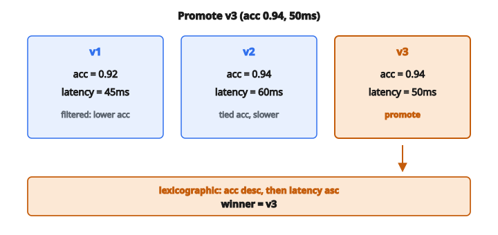

# Model Versioning

## Vấn đề: phiên bản nào lên production?

Trong mọi hệ thống ML nghiêm túc, bạn sẽ có nhiều phiên bản mô hình. Mỗi lần retrain, thử feature mới, hoặc tune hyperparameter, bạn tạo thêm một ứng viên. Nhưng chỉ một mô hình được phục vụ traffic production tại một thời điểm. Làm sao chọn phiên bản nào để promote?

Đó là thách thức cốt lõi của **model versioning**: theo dõi artifact mô hình, metric hiệu năng của chúng, và ra quyết định promote có nguyên tắc.

## Model registry là gì

**Model registry** là kho tập trung lưu:

* Artifact mô hình (trọng số đã huấn luyện, tham số, hoặc object đã serialize)
* Metadata (ngày huấn luyện, hyperparameter, phiên bản dataset)
* Metric hiệu năng (accuracy, latency, mức dùng tài nguyên)
* Lineage (code và dữ liệu nào sinh ra mô hình này)

Các công cụ phổ biến như MLflow, Weights & Biases, và giải pháp cloud-native (AWS SageMaker, Azure ML, Vertex AI) đều cung cấp chức năng model registry.

Registry cho phép team:

* Tái tạo bất kỳ mô hình quá khứ
* So sánh ứng viên một cách khách quan
* Rollback về phiên bản trước nếu có sự cố
* Audit quá trình phát triển mô hình

## Quyết định promote

Khi chọn mô hình để promote, ta thường xét nhiều yếu tố theo thứ tự ưu tiên:

**1. Metric chính (accuracy)**: Đo hiệu năng cốt lõi của mô hình. Accuracy cao hơn nghĩa là dự đoán tốt hơn. Đây gần như luôn là bộ lọc đầu tiên.

**2. Metric phụ (latency)**: Mô hình trả lời nhanh chậm thế nào. Trong hệ thống thời gian thực, một mô hình hơi kém accuracy nhưng đáp trong 10ms có thể tốt hơn mô hình chính xác hơn mà mất 500ms.

**3. Độ mới (timestamp)**: Nếu mọi thứ khác ngang nhau, mô hình mới hơn được ưu tiên. Chúng được huấn luyện trên dữ liệu gần hơn và phản ánh cải tiến code mới nhất.

## So sánh đa tiêu chí

Khi so sánh mô hình, ta tạo **ranking** dựa trên nhiều tiêu chí. Điểm then chốt là các tiêu chí có thứ tự ưu tiên:

$$
\text{Best Model} = \arg\max_m \left( \text{accuracy}(m), -\text{latency}(m), \text{timestamp}(m) \right)
$$

Dấu âm trên latency biến “thấp hơn thì tốt hơn” thành “cao hơn thì tốt hơn” để so sánh thống nhất.

Đây là **thứ tự từ điển (lexicographic ordering)**: sắp xếp trước theo accuracy (giảm dần), rồi theo latency (tăng dần), rồi theo timestamp (giảm dần). Mô hình đứng đầu danh sách đã sắp là người thắng.

## Quy trình chọn từng bước

Cho danh sách phiên bản mô hình, mỗi cái có (name, accuracy, latency, timestamp):

**Bước 1**: Sắp tất cả mô hình theo accuracy giảm dần (cao nhất trước)

**Bước 2**: Trong các mô hình cùng accuracy, sắp theo latency tăng dần (thấp nhất trước)

**Bước 3**: Trong các mô hình cùng accuracy **và** latency, sắp theo timestamp giảm dần (mới nhất trước)

**Bước 4**: Mô hình đầu tiên trong danh sách đã sắp được promote lên production

## Ví dụ số

Xét ba phiên bản mô hình:

* v1: accuracy = 0.92, latency = 45ms, timestamp = 2024-01-15
* v2: accuracy = 0.94, latency = 60ms, timestamp = 2024-01-20
* v3: accuracy = 0.94, latency = 50ms, timestamp = 2024-01-18

**Bước 1**: Sắp theo accuracy giảm dần

* v2 (0.94), v3 (0.94), v1 (0.92)

**Bước 2**: v2 và v3 hòa accuracy. Sắp chúng theo latency tăng dần:

* v3 (50ms), v2 (60ms), rồi v1 (0.92)

**Kết quả**: **v3** được promote. Nó có accuracy cao nhất **và** latency thấp nhất trong nhóm accuracy đỉnh.

::: {#fig-104-model-version fig-cap="Sau khi xếp accuracy giảm dần rồi latency tăng dần, v3 (0.94, 50ms) thắng v2 (0.94, 60ms) và v1 (0.92, 45ms)." fig-alt="Three model cards: v1 accuracy 0.92 latency 45ms, v2 0.94 / 60ms, v3 0.94 / 50ms highlighted as promoted after lexicographic sort."}
{fig-align="center"}
:::

## Vì sao không chỉ dùng accuracy?

Nếu accuracy là metric duy nhất, bạn có thể deploy mô hình mất 30 giây mỗi lần dự đoán. Trên production, điều đó gây:

* Trải nghiệm người dùng kém
* Lỗi timeout
* Chi phí hạ tầng cao
* Hàng đợi bị tồn

Tương tự, nếu chỉ tối ưu latency, bạn có thể deploy mô hình tầm thường luôn dự đoán lớp đa số.

Cách đa tiêu chí cân các đánh đổi này một cách có hệ thống.

## Model versioning xuất hiện ở đâu

**Pipeline huấn luyện liên tục**: Hệ thống tự động retrain mô hình hàng ngày hoặc hàng tuần cần logic promote tự động để quyết định khi nào mô hình mới sẵn sàng.

**A/B testing**: Trước khi promote đầy đủ, một phiên bản mới có thể được deploy cho một phần nhỏ traffic. Registry theo dõi phiên bản nào đang ở giai đoạn nào.

**Rollback**: Khi phát hiện sự cố production, registry cung cấp phiên bản ổn định trước đó để rollback ngay.

**Tuân thủ và audit**: Các ngành được quản lý yêu cầu tài liệu về phiên bản nào đã ra dự đoán nào, và vì sao nó được chọn thay vì các phương án khác.

## Code
```python
def promote_model(models):
    """
    Decide which model version to promote to production.
    """
    best = None
    for m in models:
        if best is None:
            best = m
            continue
        if m["accuracy"] > best["accuracy"]:
            best = m
        elif m["accuracy"] == best["accuracy"]:
            if m["latency"] < best["latency"]:
                best = m
            elif m["latency"] == best["latency"]:
                if m["timestamp"] > best["timestamp"]:
                    best = m
    return best["name"]

```

<!-- auto-self-check -->

::: {.callout-note}
## Kiểm tra nhanh
<details>
<summary>Ý chính của bài «Model Versioning» là gì?</summary>
**Model registry** là kho tập trung lưu: * Artifact mô hình (trọng số đã huấn luyện, tham số, hoặc object đã serialize) * Metadata (ngày huấn luyện, hyperparameter, phiên bản dataset) * Metric hiệu năng (accuracy, latency, mức dùng tài nguyên) * Lineage…
</details>
<details>
<summary>Công thức / quan hệ cốt lõi trong bài là gì?</summary>
$$\text{Best Model} = \arg\max_m \left( \text{accuracy}(m), -\text{latency}(m), \text{timestamp}(m) \right)$$
</details>
:::
