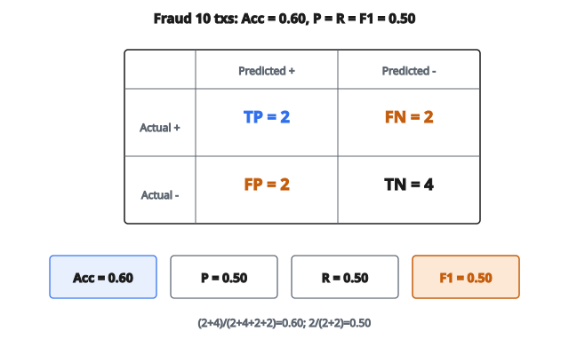

# Monitoring Metrics Selection

## Vấn đề: một metric không đủ cho mọi hệ thống

Khi theo dõi hệ thống ML đã deploy, cám dỗ là chỉ track một metric như accuracy rồi coi như xong. Cách đó thiếu nguy hiểm. Các loại hệ thống ML khác nhau cần metric khác nhau, và ngay trong một hệ thống vẫn cần nhiều metric để hiểu hiệu năng thật.

Hãy xét hệ thống phát hiện gian lận với accuracy 99%. Nghe tuyệt? Nhưng nếu chỉ 1% giao dịch là gian lận, mô hình luôn dự đoán “không gian lận” cũng đạt accuracy 99% mà không bắt được giao dịch gian lận nào. Điều này cho thấy accuracy một mình không đủ cho phân loại mất cân bằng.

Tương tự, với mô hình hồi quy dự đoán giá nhà, biết sai số trung bình kể một câu chuyện. Nhưng biết root mean squared error (phạt lỗi lớn nặng hơn) cho biết mô hình có thỉnh thoảng dự đoán thảm họa hay không.

Với hệ thống ranking như tìm kiếm hoặc gợi ý, metric phân loại lẫn hồi quy đều không áp dụng. Điều quan trọng là item relevant có xuất hiện gần đầu danh sách hay không.

Theo dõi ML hiệu quả đòi hỏi chọn đúng metric cho loại hệ thống của bạn.

## Metric phân loại

Phân loại nhị phân dự đoán một trong hai lớp, thường gắn nhãn 0 (âm) và 1 (dương). Khối xây dựng nền cho metric phân loại là bốn ô của confusion matrix:

**True Positives (TP)**: Mô hình dự đoán dương, thực tế dương. Đây là dự đoán dương đúng.

**True Negatives (TN)**: Mô hình dự đoán âm, thực tế âm. Đây là dự đoán âm đúng.

**False Positives (FP)**: Mô hình dự đoán dương, thực tế âm. Đây là cảnh báo giả, còn gọi là sai lầm loại I.

**False Negatives (FN)**: Mô hình dự đoán âm, thực tế dương. Đây là phát hiện bị bỏ sót, còn gọi là sai lầm loại II.

Từ bốn đại lượng này ta suy ra các metric phân loại chuẩn:

### Accuracy

Accuracy đo tỷ lệ dự đoán đúng trên toàn bộ:

$$
\text{accuracy} = \frac{TP + TN}{TP + TN + FP + FN} = \frac{\text{dự đoán đúng}}{\text{tổng số dự đoán}}
$$

**Khi accuracy hữu ích**: Khi các lớp cân bằng (số dương và âm xấp xỉ bằng nhau) và hai loại lỗi có chi phí ngang nhau.

**Khi accuracy gây hiểu nhầm**: Với dữ liệu mất cân bằng. Nếu 99% mẫu là âm, luôn dự đoán âm cho accuracy 99% mà vô dụng.

### Precision

Precision đo chất lượng dự đoán dương: trong mọi mẫu mô hình gắn nhãn dương, bao nhiêu thực sự dương?

$$
\text{precision} = \frac{TP}{TP + FP}
$$

**Khi precision quan trọng**: Khi false positive đắt. Với bộ lọc spam, precision thấp nghĩa là email hợp lệ vào spam. Với chẩn đoán y khoa, precision thấp nghĩa là điều trị không cần thiết.

**Trường hợp biên**: Nếu mô hình không bao giờ dự đoán dương ($TP = 0$, $FP = 0$), precision không xác định ($0/0$). Theo quy ước, trả về $0.0$.

### Recall (sensitivity)

Recall đo độ bao phủ của các dương thật: trong mọi mẫu thực sự dương, mô hình bắt được bao nhiêu?

$$
\text{recall} = \frac{TP}{TP + FN}
$$

**Khi recall quan trọng**: Khi false negative đắt. Với phát hiện gian lận, recall thấp nghĩa là giao dịch gian lận lọt. Với sàng lọc bệnh, recall thấp nghĩa là bỏ sót bệnh nhân.

**Trường hợp biên**: Nếu không có dương thật nào ($TP = 0$, $FN = 0$), recall không xác định. Theo quy ước, trả về $0.0$.

### F1 Score

F1 là trung bình điều hòa của precision và recall, cho một metric cân cả hai:

$$
\begin{aligned}
\text{F1} &= \frac{2 \times \text{precision} \times \text{recall}}{\text{precision} + \text{recall}} \\
          &= \frac{2 \cdot TP}{2 \cdot TP + FP + FN}
\end{aligned}
$$

Trung bình điều hòa (thay vì trung bình cộng) được dùng vì nó phạt mất cân bằng cực. Nếu precision hoặc recall rất thấp, F1 sẽ thấp.

**Khi F1 quan trọng**: Khi bạn cần một số phản ánh cả precision lẫn recall, và bạn quan tâm cả false positive lẫn false negative.

**Trường hợp biên**: Nếu cả precision và recall bằng 0, F1 không xác định ($0/0$). Trả về $0.0$.

## Metric hồi quy

Mô hình hồi quy dự đoán giá trị liên tục. Câu hỏi then chốt: dự đoán lệch thực tế bao xa?

### Mean Absolute Error (MAE)

MAE là trung bình các hiệu tuyệt đối giữa dự đoán và giá trị thật:

$$
\text{MAE} = \frac{1}{n} \sum_{i=1}^{n} |y_i - \hat{y}_i|
$$

với $y_i$ là giá trị thật và $\hat{y}_i$ là giá trị dự đoán.

**Tính chất của MAE**:

* Cùng đơn vị với biến target (nếu dự đoán đô la, MAE tính bằng đô la)
* Đối xử mọi lỗi như nhau bất kể độ lớn
* Bền hơn RMSE trước outlier
* Diễn giải trực quan: “trung bình, dự đoán lệch X”

### Root Mean Squared Error (RMSE)

RMSE là căn bậc hai của trung bình các hiệu bình phương:

$$
\text{RMSE} = \sqrt{\frac{1}{n} \sum_{i=1}^{n} (y_i - \hat{y}_i)^2}
$$

**Tính chất của RMSE**:

* Cùng đơn vị với biến target
* Phạt lỗi lớn nặng hơn lỗi nhỏ (do bình phương)
* Nhạy với outlier
* Nếu bạn muốn tránh sai lớn, RMSE phù hợp hơn MAE

**Quan hệ MAE và RMSE**: RMSE luôn lớn hơn hoặc bằng MAE. Khoảng cách cho biết mức biến thiên trong độ lớn lỗi. Nếu RMSE lớn hơn MAE nhiều, có một số dự đoán lỗi rất lớn.

## Metric ranking

Hệ thống ranking sinh danh sách item đã sắp. Mục tiêu là đặt item relevant (những thứ user muốn) gần đầu. Metric phân loại truyền thống không áp dụng vì ta quan tâm vị trí, không chỉ đúng/sai nhị phân.

### Precision at K

Precision at K đo tỷ lệ item relevant trong K vị trí đầu:

$$
\text{precision@K} = \frac{\text{item relevant trong top K}}{K}
$$

Ví dụ, nếu bạn hiện 3 kết quả tìm kiếm và 2 cái relevant, $\text{precision@3} = 2/3 = 0.667$.

**Khi precision@K quan trọng**: Khi diện tích màn hình hoặc sự chú ý bị hạn chế. User thường chỉ nhìn vài kết quả đầu, nên làm đúng những vị trí đó là then chốt.

### Recall at K

Recall at K đo tỷ lệ mọi item relevant xuất hiện trong K vị trí đầu:

$$
\text{recall@K} = \frac{\text{item relevant trong top K}}{\text{tổng số item relevant}}
$$

**Khi recall@K quan trọng**: Khi bạn muốn bảo đảm user tìm được phần lớn thứ họ cần trong các kết quả đầu.

**Quan hệ với precision@K**: Có căng thẳng tự nhiên. Tăng $K$ thường tăng recall (nhiều cơ hội hơn để đưa item relevant vào) nhưng có thể giảm precision (nhiều item không relevant len vào).

**Trường hợp biên**: Nếu không có item relevant nào (tổng relevant = 0), recall@K không xác định. Theo quy ước, trả về $0.0$.

## Tính ranking metric

Để tính precision@K và recall@K:

**Bước 1**: Ghép mỗi điểm dự đoán với nhãn relevance tương ứng (thường 0 = không relevant, 1 = relevant).

**Bước 2**: Sắp mọi cặp theo điểm dự đoán giảm dần (điểm cao trước).

**Bước 3**: Lấy K item đầu sau khi sắp.

**Bước 4**: Đếm bao nhiêu trong K item đó có relevance = 1.

**Bước 5**: Chia cho $K$ để được precision@K.

**Bước 6**: Chia cho tổng số item relevant để được recall@K.

## Ví dụ số

**Hệ thống phân loại (phát hiện gian lận)**

Cho dự đoán và nhãn thật của 10 giao dịch:

* Predictions: [1, 1, 0, 1, 0, 0, 1, 0, 0, 0]
* Actuals: [1, 0, 0, 1, 1, 0, 0, 0, 1, 0]

Tính confusion matrix:

* Vị trí 1: pred=1, actual=1 → TP
* Vị trí 2: pred=1, actual=0 → FP
* Vị trí 3: pred=0, actual=0 → TN
* Vị trí 4: pred=1, actual=1 → TP
* Vị trí 5: pred=0, actual=1 → FN
* Vị trí 6: pred=0, actual=0 → TN
* Vị trí 7: pred=1, actual=0 → FP
* Vị trí 8: pred=0, actual=0 → TN
* Vị trí 9: pred=0, actual=1 → FN
* Vị trí 10: pred=0, actual=0 → TN

Tổng: TP=2, TN=4, FP=2, FN=2

Metric:

* Accuracy = $(2+4)/(2+4+2+2) = 6/10 = 0.60$
* Precision = $2/(2+2) = 0.50$
* Recall = $2/(2+2) = 0.50$
* F1 = $2 \times 0.50 \times 0.50 / (0.50 + 0.50) = 0.50$

::: {#fig-107-metrics fig-cap="Fraud: TP=2, TN=4, FP=2, FN=2 cho accuracy = 0.60 và precision = recall = F1 = 0.50." fig-alt="Confusion matrix for 10 fraud transactions: TP=2, FN=2, FP=2, TN=4, yielding accuracy 0.60 and precision = recall = F1 = 0.50."}
{fig-align="center"}
:::

**Hệ thống hồi quy (dự đoán giá)**

Cho dự đoán và giá trị thật của 5 căn nhà (đơn vị nghìn):

* Predictions: [250, 300, 180, 420, 350]
* Actuals: [260, 290, 200, 400, 355]

Hiệu:

* Nhà 1: $|250-260| = 10$, $(250-260)^2 = 100$
* Nhà 2: $|300-290| = 10$, $(300-290)^2 = 100$
* Nhà 3: $|180-200| = 20$, $(180-200)^2 = 400$
* Nhà 4: $|420-400| = 20$, $(420-400)^2 = 400$
* Nhà 5: $|350-355| = 5$, $(350-355)^2 = 25$

MAE = $(10+10+20+20+5)/5 = 65/5 = 13.0$ (nghìn đô)
RMSE = $\sqrt{(100+100+400+400+25)/5} = \sqrt{1025/5} = \sqrt{205} = 14.32$ (nghìn đô)

**Hệ thống ranking (kết quả tìm kiếm)**

Cho 8 item với điểm relevance dự đoán và relevance thật:

* Scores: [0.9, 0.8, 0.7, 0.6, 0.5, 0.4, 0.3, 0.2]
* Relevance: [1, 0, 1, 0, 1, 0, 0, 1]

Top 3 item (theo score): vị trí 1, 2, 3 với relevance [1, 0, 1]

Tổng item relevant: 4 (vị trí 1, 3, 5, 8)

Precision@3 = $2/3 = 0.667$ (2 relevant trong top 3)
Recall@3 = $2/4 = 0.50$ (2 trên 4 item relevant nằm trong top 3)

## Xử lý chia cho không

Trong mọi metric có phép chia, trường hợp biên có thể cho $0/0$:

* **Precision**: Nếu $TP + FP = 0$ (không có dự đoán dương), trả về $0.0$
* **Recall**: Nếu $TP + FN = 0$ (không có dương thật), trả về $0.0$
* **F1**: Nếu precision + recall = 0, trả về $0.0$
* **Recall@K**: Nếu tổng relevant = 0, trả về $0.0$

Quy ước trả về $0.0$ (thay vì raise lỗi) bảo đảm pipeline theo dõi vẫn chạy được kể cả khi dữ liệu rơi vào biên.

## Chọn metric xuất hiện ở đâu

**Phát triển mô hình**: Data scientist chọn metric đánh giá theo mục tiêu nghiệp vụ và cân bằng lớp lúc huấn luyện.

**Theo dõi production**: Team MLOps cấu hình dashboard với metric phù hợp từng loại mô hình đã deploy.

**A/B testing**: Nền tảng thí nghiệm theo dõi nhiều metric để hiểu tác động đầy đủ của thay đổi mô hình.

**Định nghĩa SLA**: Bên nghiệp vụ định nghĩa ngưỡng hiệu năng chấp nhận được theo từng metric cụ thể.

**Cảnh báo**: Hệ thống monitoring kích hoạt alert khi metric xuống dưới ngưỡng, dùng đúng metric cho từng loại mô hình.

## Code
```python
def compute_monitoring_metrics(system_type, y_true, y_pred):
    """
    Compute the appropriate monitoring metrics for the given system type.
    """
    if system_type == "classification":
        tp = sum(1 for t, p in zip(y_true, y_pred) if t == 1 and p == 1)
        fp = sum(1 for t, p in zip(y_true, y_pred) if t == 0 and p == 1)
        fn = sum(1 for t, p in zip(y_true, y_pred) if t == 1 and p == 0)
        tn = sum(1 for t, p in zip(y_true, y_pred) if t == 0 and p == 0)
        accuracy = (tp + tn) / len(y_true)
        precision = tp / (tp + fp) if (tp + fp) > 0 else 0.0
        recall = tp / (tp + fn) if (tp + fn) > 0 else 0.0
        f1 = 2 * precision * recall / (precision + recall) if (precision + recall) > 0 else 0.0
        return sorted([("accuracy", accuracy), ("f1", f1), ("precision", precision), ("recall", recall)])
    elif system_type == "regression":
        n = len(y_true)
        mae = sum(abs(t - p) for t, p in zip(y_true, y_pred)) / n
        rmse = (sum((t - p) ** 2 for t, p in zip(y_true, y_pred)) / n) ** 0.5
        return sorted([("mae", mae), ("rmse", rmse)])
    elif system_type == "ranking":
        paired = sorted(zip(y_pred, y_true), reverse=True)
        top_3 = paired[:3]
        relevant_in_top = sum(1 for _, rel in top_3 if rel == 1)
        total_relevant = sum(1 for t in y_true if t == 1)
        p_at_3 = relevant_in_top / 3
        r_at_3 = relevant_in_top / total_relevant if total_relevant > 0 else 0.0
        return sorted([("precision_at_3", p_at_3), ("recall_at_3", r_at_3)])

```
