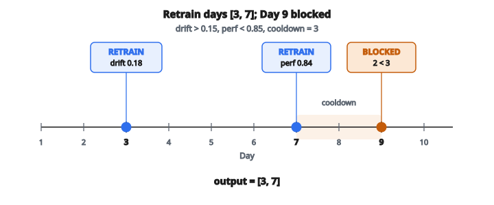

# Retraining Trigger Design

## Vấn đề: Khi nào nên retrain mô hình?

Mô hình machine learning không tĩnh. Chúng được train trên dữ liệu lịch sử, nhưng thế giới thay đổi. Sở thích người dùng dịch chuyển, điều kiện thị trường đổi, sản phẩm mới ra mắt, và pattern theo mùa xuất hiện. Theo thời gian, các pattern mô hình đã học trở nên kém đại diện cho thực tế hiện tại, và performance giảm.

Retrain là giải pháp, nhưng đi kèm chi phí:

* **Chi phí compute**: Train mô hình ML, đặc biệt mô hình lớn, đòi hỏi tài nguyên tính toán đáng kể
* **Thời gian engineering**: Pipeline retrain cần monitoring, validation, và effort triển khai
* **Rủi ro**: Mô hình mới có thể có regression chỉ lộ ra khi production
* **Chi phí cơ hội**: Tài nguyên dành cho retrain không dùng được chỗ khác

Thách thức là tìm cân bằng đúng: retrain đủ thường xuyên để giữ performance, nhưng không thường đến mức lãng phí tài nguyên hoặc đưa vào rủi ro không cần thiết.

**Retraining trigger policy** mã hóa các quy tắc khi nào retrain. Thay vì lịch tùy tiện (“retrain mỗi thứ Hai”) hoặc chữa cháy phản ứng (“retrain khi khách hàng phàn nàn”), một trigger policy dùng tín hiệu dựa trên dữ liệu để quyết định có nguyên tắc.

## Các loại retraining trigger

Có ba nhóm tín hiệu chính có thể kích hoạt retrain:

**Drift-based trigger**:
Phát hiện khi phân phối dữ liệu đầu vào đã đổi đáng kể so với dữ liệu train. Nếu dữ liệu trông khác, mô hình có thể không còn phù hợp.

**Performance-based trigger**:
Phát hiện khi performance của mô hình (accuracy, precision, F1, v.v.) đã rơi dưới mức chấp nhận được. Đây là tín hiệu trực tiếp nhất rằng có gì đó không ổn.

**Time-based trigger (staleness)**:
Đảm bảo mô hình không chạy quá lâu mà không cập nhật, kể cả khi metric drift và performance vẫn ổn. Đây là lưới an toàn trước suy giảm tinh vi mà metric có thể bỏ sót.

Một policy vững dùng nhiều trigger kết hợp, retrain khi **bất kỳ** trigger nào kích hoạt.

## Drift trigger chi tiết

Data drift xảy ra khi thuộc tính thống kê của feature đầu vào thay đổi theo thời gian. Drift score định lượng thay đổi này, thường dùng metric như Population Stability Index (PSI), Total Variation Distance (TVD), hoặc thống kê Kolmogorov–Smirnov.

Drift trigger kích hoạt khi:

$$
\text{drift\_score} > \text{drift\_threshold}
$$

Lưu ý bất đẳng thức nghiêm ngặt. Drift score đúng bằng ngưỡng **không** đủ để kích hoạt retrain.

**Vì sao dùng drift làm trigger?**

* Drift có thể được phát hiện trước khi performance giảm
* Cung cấp cảnh báo sớm về distribution shift
* Không cần nhãn ground truth (có thể bị trễ)

**Hạn chế:**

* Không phải mọi drift đều ảnh hưởng performance mô hình
* Ngưỡng phải được calibrate để tránh báo động giả

## Performance trigger chi tiết

Monitoring performance so sánh dự đoán của mô hình với outcome thật (khi có). Nếu accuracy hoặc metric khác rơi dưới kỳ vọng, có gì đó không ổn.

Performance trigger kích hoạt khi:

$$
\text{current\_performance} < \text{performance\_threshold}
$$

Lại là bất đẳng thức nghiêm ngặt. Performance đúng bằng ngưỡng vẫn chấp nhận được.

**Vì sao dùng performance làm trigger?**

* Đo trực tiếp điều quan trọng: chất lượng mô hình
* Bắt được vấn đề mà drift detection có thể bỏ sót
* Cung cấp bằng chứng cụ thể về suy giảm

**Hạn chế:**

* Cần nhãn ground truth, có thể bị trễ
* Khi performance đã rơi, thiệt hại có thể đã xảy ra
* Có thể nhiễu khi cỡ mẫu nhỏ

## Staleness trigger chi tiết

Dù drift và performance trông ổn, mô hình không nên chạy vô hạn mà không cập nhật. Suy giảm tinh vi có thể tích lũy, và retrain định kỳ đảm bảo mô hình hấp thụ dữ liệu gần đây.

Staleness trigger kích hoạt khi:

$$
\text{days\_since\_retrain} \geq \text{max\_staleness}
$$

Lưu ý so sánh “lớn hơn hoặc bằng”. Khi mô hình đạt tuổi tối đa, phải retrain.

**Vì sao dùng staleness làm trigger?**

* Bảo đảm mô hình được làm mới định kỳ
* Bắt suy giảm mà metric khác bỏ sót
* Cho lịch retrain dự đoán được để lập kế hoạch capacity

**Hạn chế:**

* Có thể kích hoạt retrain không cần thiết nếu mô hình vẫn tốt
* Việc chọn ngưỡng staleness mang tính tùy ý

## Ràng buộc vận hành

Trigger nói khi nào retrain **nên** xảy ra. Nhưng ràng buộc vận hành quyết định khi nào retrain **có thể** xảy ra.

**Cooldown period**:
Sau khi retrain, nên quan sát mô hình mới trên production trước khi cân nhắc retrain lần nữa. Việc này ngăn chu kỳ nhanh và cho thời gian validate performance.

$$
\text{days\_since\_last\_retrain} \geq \text{cooldown}
$$

**Budget constraint**: Retrain tốn tiền. Có thể có ngân sách giới hạn cho kỳ. Mỗi lần retrain phải nằm trong ngân sách còn lại.

$$
\text{remaining\_budget} \geq \text{retrain\_cost}
$$

Một trigger chỉ dẫn tới retrain thật sự khi **cả hai** ràng buộc đều thỏa.

## Logic quyết định đầy đủ

Mỗi ngày, hệ thống đánh giá có retrain hay không theo thuật toán sau:

**Bước 1: Kiểm tra có trigger nào kích hoạt**

* Drift có vượt ngưỡng?
* Performance có rơi dưới ngưỡng?
* Max staleness đã đạt chưa?

Nếu không trigger nào kích hoạt, không retrain.

**Bước 2: Kiểm tra ràng buộc có cho phép retrain**

* Cooldown đã hết kể từ lần retrain trước?
* Ngân sách còn đủ?

Nếu một trong hai ràng buộc không thỏa, không retrain (dù trigger đã kích hoạt).

**Bước 3: Nếu trigger kích hoạt VÀ ràng buộc thỏa, retrain**

* Reset `days_since_retrain` về 0
* Trừ cost khỏi budget
* Ghi nhận sự kiện retrain

**Bước 4: Cập nhật state cho ngày tiếp theo**

* Tăng `days_since_retrain`
* Tiến tới ngày kế

## Quản lý trạng thái

Policy duy trì state xuyên các ngày:

**days_since_retrain**: Bắt đầu ở 0 (giả sử vừa train xong trước kỳ monitoring). Tăng 1 mỗi ngày. Reset về 0 sau mỗi lần retrain.

**remaining_budget**: Bắt đầu bằng budget ban đầu. Giảm `retrain_cost` sau mỗi lần retrain. Không bao giờ tăng.

**last_retrain_day**: Theo dõi lần retrain gần nhất để tính cooldown. Khởi tạo sao cho cooldown đã thỏa vào day 1.

State ban đầu giả sử mô hình vừa được train trước khi kỳ monitoring bắt đầu, nên:

* Staleness bắt đầu ở 0 (sẽ tăng thành 1 vào day 1)
* Cooldown đã thỏa (có thể retrain vào day 1 nếu cần)

## Ví dụ số

**Cấu hình:**

* `drift_threshold`: 0.15
* `performance_threshold`: 0.85
* `max_staleness`: 7 ngày
* `cooldown`: 3 ngày
* `retrain_cost`: 100
* `initial_budget`: 250

**Thống kê hàng ngày (10 ngày):**

* Day 1: drift=0.10, performance=0.90
* Day 2: drift=0.12, performance=0.88
* Day 3: drift=0.18, performance=0.86
* Day 4: drift=0.08, performance=0.89
* Day 5: drift=0.11, performance=0.87
* Day 6: drift=0.09, performance=0.88
* Day 7: drift=0.10, performance=0.84
* Day 8: drift=0.14, performance=0.86
* Day 9: drift=0.20, performance=0.82
* Day 10: drift=0.07, performance=0.91

**Phân tích từng ngày:**

**Day 1**:

* Trigger: drift=$0.10 < 0.15$ (không), perf=$0.90 > 0.85$ (không), staleness=$1 < 7$ (không)
* Không trigger nào kích hoạt. Không retrain.
* State: days_since=1, budget=250

**Day 2**:

* Trigger: drift=$0.12 < 0.15$ (không), perf=$0.88 > 0.85$ (không), staleness=$2 < 7$ (không)
* Không trigger nào kích hoạt. Không retrain.
* State: days_since=2, budget=250

**Day 3**:

* Trigger: drift=$0.18 > 0.15$ (CÓ), perf=$0.86 > 0.85$ (không), staleness=$3 < 7$ (không)
* Drift trigger kích hoạt!
* Ràng buộc: cooldown thỏa (chưa có retrain trước), budget=$250 \geq 100$ (có)
* **RETRAIN vào Day 3**
* State: days_since=0, budget=150

**Day 4**:

* Trigger: drift=$0.08 < 0.15$ (không), perf=$0.89 > 0.85$ (không), staleness=$1 < 7$ (không)
* Không trigger nào kích hoạt. Không retrain.
* State: days_since=1, budget=150

**Day 5**:

* Không trigger nào kích hoạt. Không retrain.
* State: days_since=2, budget=150

**Day 6**:

* Không trigger nào kích hoạt. Không retrain.
* State: days_since=3, budget=150

**Day 7**:

* Trigger: drift=$0.10 < 0.15$ (không), perf=$0.84 < 0.85$ (CÓ), staleness=$4 < 7$ (không)
* Performance trigger kích hoạt!
* Ràng buộc: cooldown=3, days since retrain=4, $4 \geq 3$ (có), budget=$150 \geq 100$ (có)
* **RETRAIN vào Day 7**
* State: days_since=0, budget=50

**Day 8**:

* Không trigger nào kích hoạt. Không retrain.
* State: days_since=1, budget=50

**Day 9**:

* Trigger: drift=$0.20 > 0.15$ (CÓ), perf=$0.82 < 0.85$ (CÓ), staleness=$2 < 7$ (không)
* Cả drift và performance đều kích hoạt!
* Ràng buộc: cooldown=3, days since retrain=2, $2 < 3$ (KHÔNG — chưa hết cooldown)
* Không retrain được vì cooldown.
* State: days_since=2, budget=50

**Day 10**:

* Trigger: drift=$0.07 < 0.15$ (không), perf=$0.91 > 0.85$ (không), staleness=$3 < 7$ (không)
* Không trigger nào kích hoạt. Không retrain.
* State: days_since=3, budget=50

**Kết quả**: Retrain xảy ra vào Day 3 và Day 7. Output: $[3, 7]$

::: {#fig-108-retrain-trigger fig-cap="Retrain ở Day 3 (drift 0.18 &gt; 0.15) và Day 7 (perf 0.84 &lt; 0.85). Day 9 có cả hai trigger nhưng bị chặn vì cooldown: days_since = 2 &lt; 3. Output $[3, 7]$." fig-alt="Timeline 10 ngay: retrain Day 3 (drift 0.18), retrain Day 7 (perf 0.84), Day 9 bi chan cooldown; output [3, 7]."}
{fig-align="center"}
:::

## Đánh đổi khi thiết kế policy

**Trigger aggressive so với conservative**:
Ngưỡng thấp kích hoạt nhiều lần retrain hơn, mô hình tươi hơn nhưng tốn budget hơn. Ngưỡng cao tiết kiệm tài nguyên nhưng rủi ro performance suy giảm kéo dài.

**Độ dài cooldown**:
Cooldown dài ngăn thrashing nhưng có thể trì hoãn lần retrain cần thiết. Cooldown ngắn đáp ứng nhanh hơn nhưng có thể retrain quá mức trong kỳ biến động.

**Phân bổ budget**: Budget hạn chế buộc ưu tiên. Policy có thể bỏ lỡ trigger cuối kỳ nếu budget đã cạn sớm.

**Nhiều trigger**: Dùng cả ba loại trigger cho defense in depth nhưng có thể retrain nhiều hơn mức thực sự cần.

## Retraining trigger xuất hiện ở đâu

**Hệ thống continuous training**:
Các nền tảng ML lớn (Google, Meta, Amazon) chạy pipeline tự động monitor drift và performance, kích hoạt retrain không cần can thiệp thủ công.

**Hệ thống recommendation**: Nền tảng thương mại điện tử và nội dung retrain mô hình thường xuyên để đưa item mới và sở thích người dùng đang đổi.

**Phát hiện gian lận**: Tổ chức tài chính cân tần suất retrain với yêu cầu validation và ràng buộc pháp lý.

**Dự báo nhu cầu**: Hệ thống bán lẻ và logistics retrain mô hình để bắt pattern theo mùa và thay đổi thị trường.

**Healthcare AI**: Hệ thống ML y tế cần policy retrain cẩn thận, cân độ tươi của mô hình với yêu cầu validation lâm sàng.

## Code
```python
def retraining_policy(daily_stats, config):
    """
    Decide which days to trigger model retraining.
    """
    retrain_days = []
    budget_remaining = config["budget"]
    last_retrain_day = -config["cooldown"]
    days_since_retrain = 0
    for stat in daily_stats:
        day = stat["day"]
        days_since_retrain += 1
        drift_triggered = stat["drift_score"] > config["drift_threshold"]
        perf_triggered = stat["performance"] < config["performance_threshold"]
        stale_triggered = days_since_retrain >= config["max_staleness"]
        should_retrain = drift_triggered or perf_triggered or stale_triggered
        cooldown_ok = (day - last_retrain_day) >= config["cooldown"]
        budget_ok = budget_remaining >= config["retrain_cost"]
        if should_retrain and cooldown_ok and budget_ok:
            retrain_days.append(day)
            budget_remaining -= config["retrain_cost"]
            last_retrain_day = day
            days_since_retrain = 0
    return retrain_days

```
