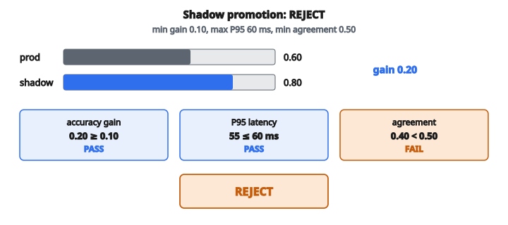

# Shadow Deployment Evaluation

## Vấn đề: Làm sao kiểm tra mô hình trên traffic thật mà không rủi ro?

Đưa một mô hình machine learning mới lên production là rủi ro. Đánh giá offline (trên tập test hold-out) không bao giờ dự đoán hoàn hảo performance thực tế. Mô hình có thể gặp pattern dữ liệu không có trong train, đặc trưng latency có thể khác dưới tải, và edge case chỉ lộ ra với traffic production đa dạng.

Cách truyền thống là thay trực tiếp mô hình production và hy vọng tốt nhất. Nếu sự cố xuất hiện, rollback. Nhưng đó là phản ứng, và có thể làm hỏng trải nghiệm người dùng, doanh thu, hoặc niềm tin trong khoảng thời gian có vấn đề.

**Shadow deployment** (còn gọi là “dark launching”) là lựa chọn an toàn hơn. Mô hình candidate mới chạy cạnh mô hình production trên cùng đầu vào, nhưng chỉ dự đoán của mô hình production được phục vụ người dùng. Dự đoán của mô hình shadow được ghi log để phân tích offline. Nhờ đó đánh giá candidate trên traffic thật mà không có rủi ro hướng tới người dùng.

## Shadow deployment hoạt động như thế nào

Trong setup shadow deployment:

**Bước 1: Mô hình production phục vụ người dùng**
Mọi request đến đi tới mô hình production. Dự đoán của nó được trả cho người dùng và điều khiển outcome nghiệp vụ.

**Bước 2: Mô hình shadow nhận cùng request**
Mỗi request cũng được gửi tới mô hình shadow (candidate). Nó đưa ra dự đoán, nhưng các dự đoán này không bao giờ hiện cho người dùng.

**Bước 3: Cả hai dự đoán được ghi log**
Hệ thống logging ghi, cho mỗi request:

* Các feature đầu vào
* Dự đoán của mô hình production
* Dự đoán của mô hình shadow
* Outcome thật (khi có)
* Đo latency cho cả hai mô hình

**Bước 4: Phân tích offline**
Sau khi thu đủ dữ liệu, phân tích log để so sánh hai mô hình trên nhiều chiều.

Kiến trúc này đảm bảo người dùng luôn thấy dự đoán của mô hình production trong khi bạn thu thập dữ liệu toàn diện về candidate.

## Metric then chốt cho đánh giá shadow

Để quyết định mô hình shadow có nên thay production, đánh giá nhiều metric:

### So sánh accuracy

Metric quan trọng nhất: mô hình shadow có dự đoán tốt hơn không?

$$
\text{accuracy} = \frac{\text{số dự đoán đúng}}{\text{tổng số dự đoán}}
$$

Tính accuracy cho cả mô hình production và shadow, rồi so sánh:

$$
\text{accuracy\_gain} = \text{shadow\_accuracy} - \text{production\_accuracy}
$$

Gain dương nghĩa là mô hình shadow chính xác hơn. Cần một ngưỡng gain tối thiểu để biện minh cho rủi ro và effort khi chuyển mô hình.

### Đánh giá latency

Dù mô hình chính xác hơn, không thể triển khai nếu quá chậm. Latency ảnh hưởng trực tiếp trải nghiệm người dùng và chi phí hạ tầng.

**P95 latency** (percentile thứ 95) thường được dùng vì bắt hành vi xấu nhất mà vẫn loại outlier cực đoan:

* 95% request hoàn thành nhanh hơn P95
* Phản ánh trải nghiệm của đa số người dùng
* Ổn định hơn P99 trong khi vẫn bắt được đuôi phân phối

Để tính P95 theo phương pháp nearest-rank:

**Bước 1**: Sắp xếp mọi đo latency tăng dần

**Bước 2**: Tính rank: $\text{rank} = \lceil 0.95 \times n \rceil$

**Bước 3**: Giá trị P95 là phần tử ở index $(\text{rank} - 1)$ trong mảng đã sắp (0-indexed)

P95 latency của mô hình shadow phải nhỏ hơn hoặc bằng ngưỡng tối đa chấp nhận được.

### Agreement rate

Agreement rate đo tần suất hai mô hình đưa cùng một dự đoán, không xét đúng/sai:

$$
\text{agreement\_rate} = \frac{\text{số request mà dự đoán production = dự đoán shadow}}{\text{tổng số request}}
$$

Metric này phục vụ nhiều mục đích:

**Đánh giá độ lớn thay đổi**:
Agreement cao (ví dụ 95%) nghĩa là hai mô hình hành xử giống nhau. Việc chuyển sẽ có tác động tối thiểu. Agreement thấp (ví dụ 60%) nghĩa là khác biệt hành vi đáng kể.

**Đánh giá rủi ro**: Mô hình agreement thấp có thể gây thay đổi hướng tới người dùng, cần truyền thông cẩn thận hoặc rollout dần.

**Hỗ trợ debug**: Khi mô hình bất đồng, xem các case đó cho biết chúng khác ở đâu và vì sao.

Một ngưỡng agreement tối thiểu đảm bảo mô hình mới không đổi hành vi hệ thống một cách đột ngột.

## Quyết định promotion

Mô hình shadow được promote lên production chỉ khi **tất cả** tiêu chí thỏa đồng thời:

**Tiêu chí 1: Cải thiện accuracy**

$$
\text{accuracy\_gain} \geq \text{min\_accuracy\_gain}
$$

Điều này đảm bảo mô hình mới thực sự tốt hơn (hoặc ít nhất không tệ hơn, nếu `min_gain` bằng 0 hoặc âm).

**Tiêu chí 2: Latency chấp nhận được**

$$
\text{shadow\_p95\_latency} \leq \text{max\_latency\_p95}
$$

Điều này đảm bảo mô hình mới đủ nhanh cho yêu cầu production.

**Tiêu chí 3: Tương tự hành vi**

$$
\text{agreement\_rate} \geq \text{min\_agreement\_rate}
$$

Điều này đảm bảo mô hình mới không hành xử quá khác production.

Nếu một tiêu chí thất bại, promotion bị từ chối. Mô hình shadow cần tinh chỉnh thêm, hoặc tiêu chí cần điều chỉnh.

## Tính các metric: từng bước

Cho production log và shadow log của $n$ request:

**Bước 1: Tính production accuracy**

* Đếm request mà `production_prediction` bằng `actual_value`
* Chia cho $n$

**Bước 2: Tính shadow accuracy**

* Đếm request mà `shadow_prediction` bằng `actual_value`
* Chia cho $n$

**Bước 3: Tính accuracy gain**

* Trừ production accuracy khỏi shadow accuracy

**Bước 4: Tính shadow P95 latency**

* Lấy mọi giá trị latency shadow
* Sắp tăng dần
* Tính $\text{rank} = \lceil 0.95 \times n \rceil$
* Trả phần tử ở index $(\text{rank} - 1)$

**Bước 5: Tính agreement rate**

* Đếm request mà `production_prediction` bằng `shadow_prediction`
* Chia cho $n$

**Bước 6: Đánh giá tiêu chí promotion**

* Kiểm tra $\text{accuracy\_gain} \geq \text{min\_accuracy\_gain}$
* Kiểm tra $\text{shadow\_p95} \leq \text{max\_latency\_p95}$
* Kiểm tra $\text{agreement\_rate} \geq \text{min\_agreement\_rate}$
* Promote chỉ khi **cả ba** đúng

## Ví dụ số

**Production log (5 request):**

* Request 1: prediction=1, actual=1, latency=45ms
* Request 2: prediction=0, actual=0, latency=52ms
* Request 3: prediction=1, actual=0, latency=48ms
* Request 4: prediction=0, actual=1, latency=51ms
* Request 5: prediction=1, actual=1, latency=49ms

**Shadow log (5 request):**

* Request 1: prediction=1, actual=1, latency=42ms
* Request 2: prediction=1, actual=0, latency=55ms
* Request 3: prediction=0, actual=0, latency=47ms
* Request 4: prediction=1, actual=1, latency=53ms
* Request 5: prediction=1, actual=1, latency=44ms

**Tính production accuracy:**

* Request 1: prod=1, actual=1, đúng
* Request 2: prod=0, actual=0, đúng
* Request 3: prod=1, actual=0, sai
* Request 4: prod=0, actual=1, sai
* Request 5: prod=1, actual=1, đúng
* Đúng: 3 trên 5
* Production accuracy = $3/5 = 0.60$

**Tính shadow accuracy:**

* Request 1: shadow=1, actual=1, đúng
* Request 2: shadow=1, actual=0, sai
* Request 3: shadow=0, actual=0, đúng
* Request 4: shadow=1, actual=1, đúng
* Request 5: shadow=1, actual=1, đúng
* Đúng: 4 trên 5
* Shadow accuracy = $4/5 = 0.80$

**Accuracy gain:** $0.80 - 0.60 = 0.20$ (cải thiện 20%)

**Shadow P95 latency:**

* Latency shadow: $[42, 55, 47, 53, 44]$
* Đã sắp: $[42, 44, 47, 53, 55]$
* $\text{rank} = \lceil 0.95 \times 5 \rceil = \lceil 4.75 \rceil = 5$
* Index = $5 - 1 = 4$
* P95 = $55\,\text{ms}$

**Agreement rate:**

* Request 1: prod=1, shadow=1, đồng ý
* Request 2: prod=0, shadow=1, bất đồng
* Request 3: prod=1, shadow=0, bất đồng
* Request 4: prod=0, shadow=1, bất đồng
* Request 5: prod=1, shadow=1, đồng ý
* Đồng ý: 2 trên 5
* Agreement rate = $2/5 = 0.40$

**Quyết định promotion (ngưỡng: $\text{min\_accuracy\_gain}=0.10$, $\text{max\_latency\_p95}=60$, $\text{min\_agreement\_rate}=0.50$):**

* Accuracy gain: $0.20 \geq 0.10$? CÓ
* P95 latency: $55 \leq 60$? CÓ
* Agreement rate: $0.40 \geq 0.50$? KHÔNG

**Kết quả:** Promotion **REJECTED** vì agreement rate thấp.

Dù mô hình shadow chính xác hơn và đạt yêu cầu latency, agreement rate thấp cho thấy khác biệt hành vi đáng kể, cần điều tra trước khi triển khai.

::: {#fig-109-shadow fig-cap="Gain 0.20 và P95 = 55 ms đều đạt ngưỡng, nhưng agreement 0.40 &lt; 0.50 nên promotion bị REJECT." fig-alt="So sanh accuracy production 0.60 va shadow 0.80, gain 0.20; P95 = 55 ms dat; agreement 0.40 < 0.50, quyet dinh REJECT."}
{fig-align="center"}
:::

## Diễn giải agreement rate

Metric agreement cần diễn giải cẩn thận:

**Agreement cao (>90%) kèm accuracy gain**: Hai mô hình tương tự, nhưng shadow hơi tốt hơn. Promotion rủi ro thấp.

**Agreement cao mà không có accuracy gain**: Hai mô hình gần như giống hệt. Có thể không có lý do để chuyển.

**Agreement thấp (<70%) kèm accuracy gain**:
Mô hình shadow đưa ra dự đoán rất khác. Dù chính xác hơn overall, độ lớn thay đổi có thể làm người dùng bất ngờ. Cân nhắc rollout dần.

**Agreement thấp kèm accuracy giảm**: Mô hình shadow vừa khác vừa tệ hơn. Không promote.

## Ưu điểm của shadow deployment

**Rủi ro người dùng bằng không**: Người dùng chỉ thấy dự đoán production trong lúc đánh giá. Mô hình shadow kém không ảnh hưởng ai.

**Đánh giá trên traffic thật**: Kiểm tra trên pattern dữ liệu production thực, không phải tập test tổng hợp.

**So sánh toàn diện**: Có thể tính bất kỳ metric nào sau thực tế vì mọi dự đoán đã được ghi log.

**Đo latency dưới tải**: Latency mô hình shadow phản ánh điều kiện production thật, không phải benchmark cô lập.

## Hạn chế và lưu ý

**Chi phí hạ tầng**: Chạy hai mô hình song song nhân đôi nhu cầu compute trong kỳ shadow.

**Khối lượng log**: Lưu dự đoán và latency cho mọi request có thể đắt ở quy mô lớn.

**Nhãn trễ**: Outcome thật có thể không có ngay, làm chậm phân tích.

**Đầu vào không deterministic**:
Nếu đầu vào đổi giữa lời gọi production và shadow (ví dụ feature phụ thuộc thời gian), dự đoán có thể không so sánh trực tiếp được.

## Shadow deployment xuất hiện ở đâu

**Search engine**: Thuật toán ranking mới được shadow-deploy để so sánh relevance mà không ảnh hưởng tìm kiếm của người dùng.

**Hệ thống recommendation**: Mô hình recommendation candidate chạy shadow để đánh giá dự đoán engagement trước khi triển khai.

**Ad tech**: Mô hình ranking quảng cáo mới được thử shadow để xác minh dự đoán tác động doanh thu.

**Phát hiện gian lận**: Mô hình fraud mới chạy shadow để đo tỷ lệ phát hiện mà không rủi ro false positive trên giao dịch thật.

**Healthcare AI**: Mô hình dự đoán lâm sàng trải qua kiểm thử shadow rộng trước khi được phê duyệt production.

## Code
```python
import math

def evaluate_shadow(production_log, shadow_log, criteria):
    """
    Evaluate whether a shadow model is ready for promotion.
    """
    n = len(production_log)
    prod_correct = sum(1 for p in production_log if p["prediction"] == p["actual"])
    shadow_correct = sum(1 for s in shadow_log if s["prediction"] == s["actual"])
    prod_accuracy = prod_correct / n
    shadow_accuracy = shadow_correct / n
    accuracy_gain = shadow_accuracy - prod_accuracy
    sorted_latencies = sorted(s["latency_ms"] for s in shadow_log)
    p95_index = math.ceil(0.95 * n) - 1
    shadow_p95 = sorted_latencies[p95_index]
    agreements = sum(1 for p, s in zip(production_log, shadow_log) if p["prediction"] == s["prediction"])
    agreement_rate = agreements / n
    promote = (
        accuracy_gain >= criteria["min_accuracy_gain"]
        and shadow_p95 <= criteria["max_latency_p95"]
        and agreement_rate >= criteria["min_agreement_rate"]
    )
    return {
        "promote": promote,
        "metrics": {
            "shadow_accuracy": shadow_accuracy,
            "production_accuracy": prod_accuracy,
            "accuracy_gain": accuracy_gain,
            "shadow_latency_p95": shadow_p95,
            "agreement_rate": agreement_rate,
        }
    }

```

<!-- CROSSLINK_SHADOW -->

::: {.callout-tip}
## Học tiếp
Canary / shadow / rollback trong inference ops: [Lesson 8 — Safe Model Rollouts](../../ai-optimize/lesson-08-safe-model-rollouts.qmd).
:::
