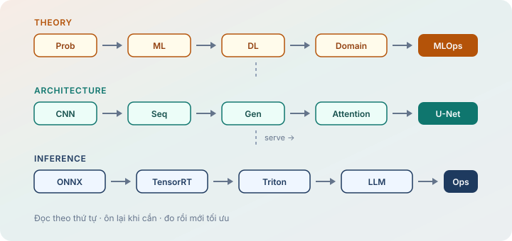

:::: {.home-hero}
::: {.home-hero-copy}

dythanh22

# Chuỗi bài học · toán nền, lý thuyết, kiến trúc và tối ưu inference

Chọn một lộ trình, đi hết pipeline, rồi quay lại khi cần ôn. Không phải blog rời — mỗi chuỗi là một đường đọc có thứ tự. **Bắt đầu từ Math Base.**

[Bắt đầu Math Base](bai-hoc/math-base/index.qmd){.btn .btn-primary .btn-lg .home-cta-primary role="button"}
[Theory AI](bai-hoc/theory-ai/index.qmd){.btn .btn-outline-secondary .btn-lg role="button"}
:::

::: {.home-hero-visual}
{fig-alt="Sơ đồ học: Math (Prob→LA→Calc→…); Theory; CNN→Seq→Gen→Attention→U-Net; ONNX→TensorRT→Triton→LLM→Ops."}
:::
::::

::: {#home-continue .home-continue aria-live="polite"}
:::

## Cách đọc

Một **chuỗi** = một lộ trình. Homepage không trộn từng chương. Vào chuỗi để có mục lục, sidebar và nút bài trước / bài sau — rồi đọc theo `order`.

## Bốn chuỗi

:::: {.series-grid}
::: {.series-card .series-card--math}

Nền tảng toán · ưu tiên đọc trước · 7 chapter · 67 bài

### [Math Base](bai-hoc/math-base/index.qmd)

Probability → statistics → linear algebra → calculus → optimization → information theory → graph theory.

Đọc kỹ · chiều sâu toán · trước Theory AI

[Mở Math Base →](bai-hoc/math-base/index.qmd)
:::

::: {.series-card .series-card--theory}

Ôn nhanh · 15 chapter · 187 bài

### [Theory AI](bai-hoc/theory-ai/index.qmd)

Probability → statistics → linear algebra → features / classical ML → activations, optimizers, DL primitives → CV, NLP, RL, time series, recommender → MLOps.

Công thức + ví dụ số + Python ngắn

[Mở Theory AI →](bai-hoc/theory-ai/index.qmd)
:::

::: {.series-card .series-card--arch}

Kiến trúc · 15 model

### [Architecture Models](bai-hoc/architecture-models/index.qmd)

CNN → sequence → generative (VAE / GAN / DDPM) → embeddings → attention → U-Net. Mỗi model tách thành các chương theo khối xây dựng.

~70 chương · công thức + sơ đồ SVG

[Mở Architecture Models →](bai-hoc/architecture-models/index.qmd)
:::

::: {.series-card .series-card--opt}

Serving · GPU · 10 bài

### [AI Optimization](bai-hoc/ai-optimize/index.qmd)

Từ model artifact đến production: ONNX, TensorRT, Triton, profiling, rollout an toàn và LLM serving.

Lesson 1 → 10 · labs + checklist

[Mở AI Optimization →](bai-hoc/ai-optimize/index.qmd)
:::
::::
